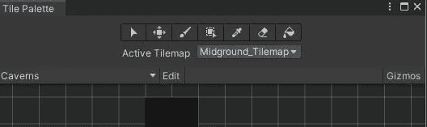
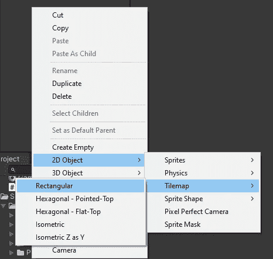
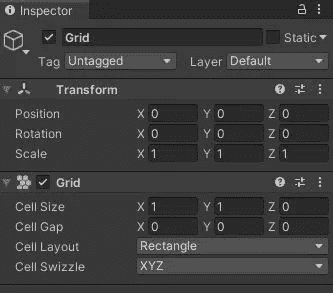
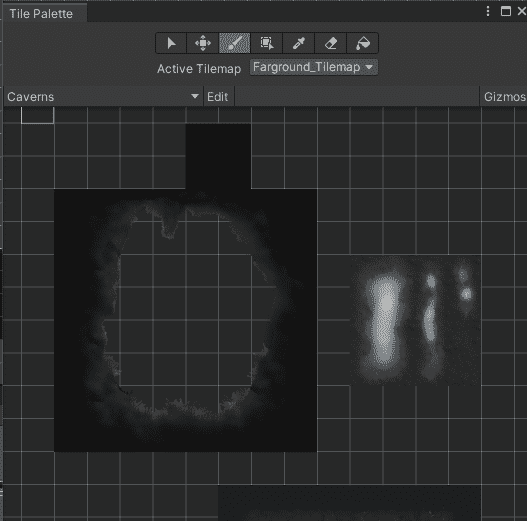
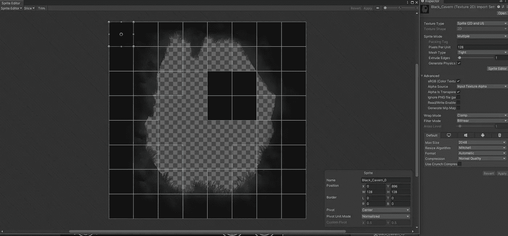
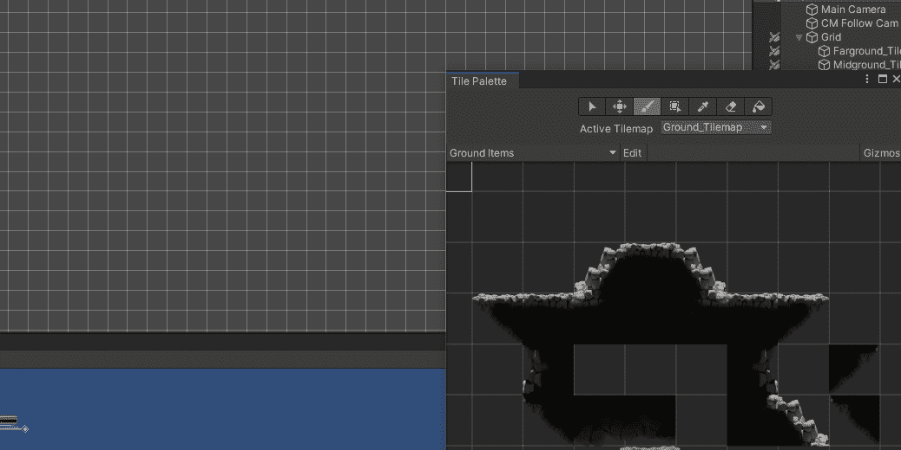
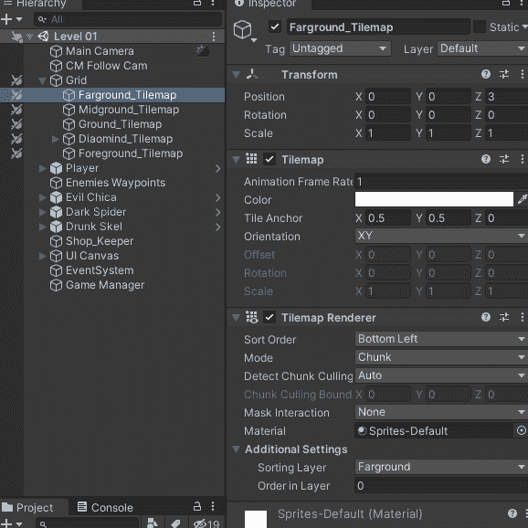
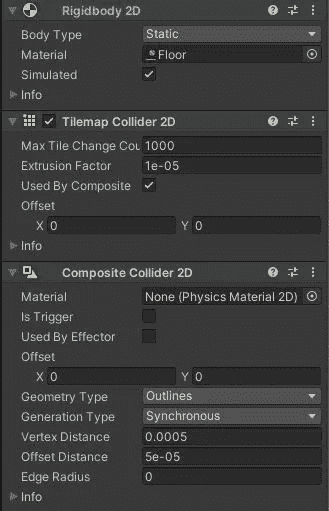

# 日积月累:平铺地图

> 原文：<https://medium.com/nerd-for-tech/tip-of-the-day-tile-maps-101-unity2d-c59aadc999e4?source=collection_archive---------15----------------------->

一旦你把激情和热情投入到你的项目中，制作 2D 游戏总是很有趣的。Unity 中的 2D 游戏可以通过预设的游戏对象来完成，但也可以通过平铺地图来制作。

Tilemaps 几乎就像一张真实的地图，你可以用它来绘制你的世界和关卡。

Tilemap 示例

根据[Unity Docs](https://docs.unity3d.com/Manual/class-Tilemap.html),**tile map**组件是一个存储和处理用于创建 2D 关卡的磁贴资产的系统。它将所需的信息从放置在其上的瓷砖传输到其他相关组件。”

## 目标:如何设置 Tilemaps？

首先，你必须创建一个 2D 项目，因为这将允许 Unity 自动安装大多数 2D 软件包，包括 Tilemaps。

首先，打开瓷砖托盘窗口:窗口> 2D >瓷砖托盘

瓷砖托盘窗口

平铺托盘绘制在平铺地图游戏对象上，它基本上是你用来绘制的网格。

创建> 2D 对象>平铺地图>矩形(最常见的)

这将创建一个网格父游戏对象，作为一个孩子，它将创建一个 Tilemap 布局。

格子

让我们创建一个 Tilemap 托盘，我们将使用它在网格上绘图。

在您的瓷砖托盘窗口，“创建”一个新的托盘，命名，选择网格类型和网格大小。要填充这个托盘，您将需要一个 Tilemap 资产，它基本上是 sprites。

正如你所看到的，精灵模式必须设置为多个，你需要将精灵切割成单独的切片，我们将使用这些切片来填充瓷砖托盘。现在拖动你的切片精灵到上面你创建的 Tilemap 中。

开始画你的水平。

1.  打开瓷砖托盘窗口
2.  选择要绘制的单幅图块
3.  选择活动平铺地图(您创建的格网)
4.  您可以绘制单个单元格，选择一组单元格，甚至可以填充一个区域

> 关于 tilemaps 需要了解的事情

A.您可以创建多个网格 Tilemap，例如一个用于地面，一个用于背景，另一个用于前景。

为了更改它们的可见性，您可以更改每个切片地图的布局。您可以通过更改每个切片地图的排序图层来实现这一点。这将向前或向后移动每个 Tilemap。

B.你可以在平铺地图上添加碰撞器，这允许你的角色行走并与平铺地图互动。

选择一个网格作为你的地面。

然后向其中添加以下组件:

A.一个**静态**刚体 2D。

B.Tilemap 碰撞器 2D，这里选择“被复合使用”。

C.复合碰撞器 2D，这将合并 Tilemap 碰撞器的单个单元，并允许在您的网格上进行更平滑的碰撞检测。

这些是 Unity2D 中 Tilemaps 的基础，从这里开始你的想象力就是你的极限。

在结束之前的最后一个提示，你可以使用“Tilemaps Extra Package”，你可以在 Unity 上的预览包中找到它。这将增加很多笔刷和额外的东西来使用 Tilemaps。