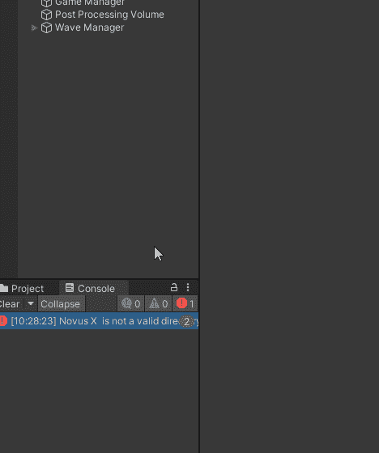
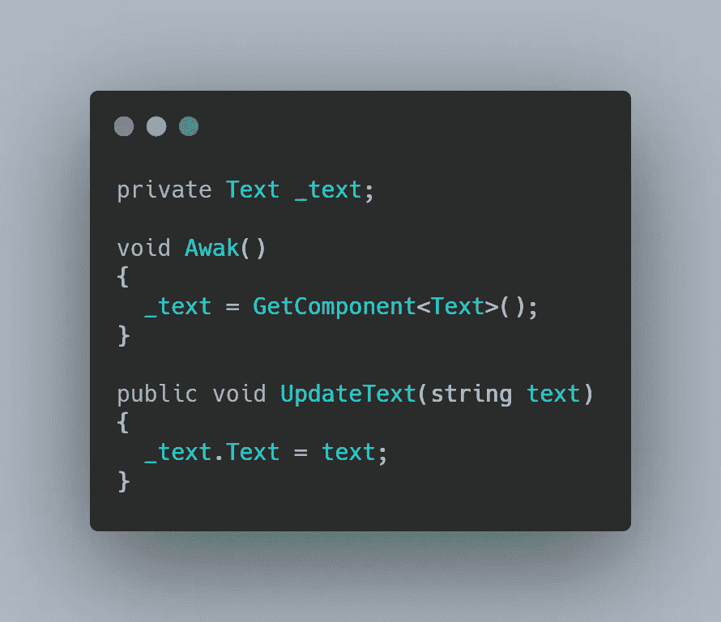
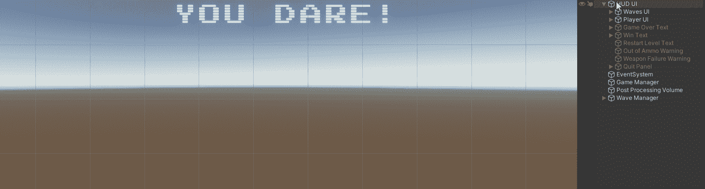
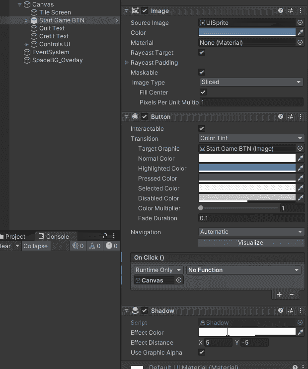

# 日积月累:Unity 中的用户界面 101

> 原文：<https://medium.com/nerd-for-tech/tip-of-the-day-user-interface-101-in-unity-b152753b1b95?source=collection_archive---------16----------------------->

Unity 是在考虑易用性的情况下创建的；在你想要创建的任何视频游戏中，最重要的部分之一就是用户界面(UI)。

创建 UI 就像点击两次一样简单。在层级中右键单击，悬停到 UI，选择“*画布*”。这将创建一个包含所有 UI 元素的 Canvas gameObject 和一个帮助向 UI 元素发送事件(用户输入)的*事件系统*。

## 基本用户界面元素

> A.文字或文字网亲

这些允许您将文本添加到您的 UI 中，您可以通过引用 UI 中的文本组件来控制这些文本。

TextMeshPro 让您可以更好地控制文本的外观。你可以个性化它。

> B.形象

基本上，这允许你添加一个图像到你的用户界面。

## C.小跟班

你会在主菜单中经常用到它们，比如暂停菜单。按钮的好处是它们有一个内置的 Unity 事件管理器，允许你附加一个脚本并调用一个当你按下按钮时触发的方法。

其他 UI 元素是开关(类似于按钮)、滑块和面板。面板对于组织你的用户界面非常有用。例如，您为暂停时出现的暂停菜单创建一个面板，并创建另一个选项菜单，当您按下选项按钮时出现。

这些只是 UI 的基础，你能用它做什么，受限于你的想象力。