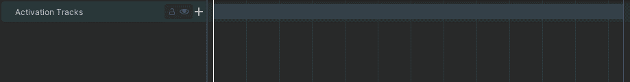
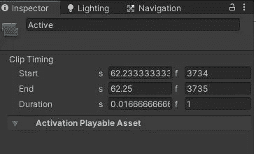
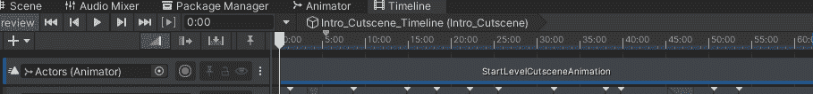
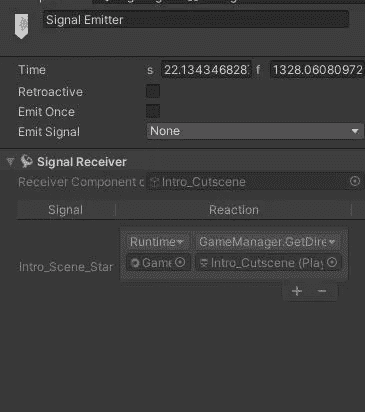
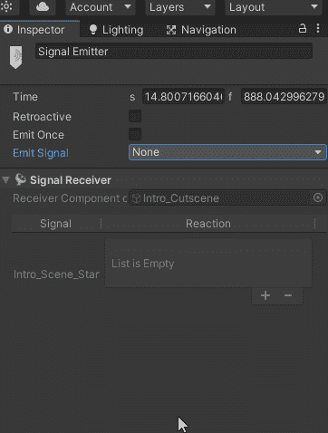
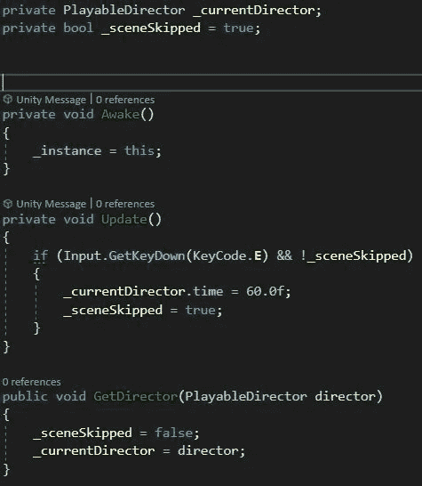
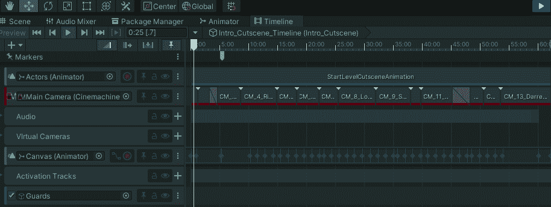

# 日积月累:使用时间轴信号跳过 Unity 中的任何过场动画

> 原文：<https://medium.com/nerd-for-tech/tip-of-the-day-using-timeline-signals-to-skip-any-cutscene-in-unity-f72ca3658dce?source=collection_archive---------2----------------------->

如果你在 Unity 中使用过场动画，那么你可能在过场动画期间停用了一些可播放的资产，并在过场动画结束之前再次激活它们。但是突然跳过它可能不会重新激活你的可玩资产。可以使用一个游戏管理器来跳过过场动画，该游戏管理器可以保存特定过场动画的可播放导演，这不是非常模块化，并且不能用于许多过场动画。

> 如何才能解决这两个问题？

## 停用和重新激活可玩资产

最简单的方法是直接通过时间线。只需添加一个激活轨迹，添加可播放资产，然后调整*活动*轨迹，使其仅在时间轴的最后一帧活动。



您可以将活动轨迹的持续时间设置为一帧，并将其调整为在过场动画的最后一帧中活动。

## 跳过过场动画和重新激活可玩资产的模块化方式

我们将使用两件东西:

1.  一个游戏管理器，用来控制过场动画中玩家的输入以跳过它。因此，创建一个*游戏管理器*脚本，并将其附加到游戏管理器游戏对象上。
2.  时间线信号发射器:这些非常有趣，它们基本上是一个需要发射器、资产和接收器的事件。

在 *GameManager* 脚本中，我们想要一个 PlayableDirector 来跟踪当前正在播放的时间线，并想要一个 bool 来知道 bool 是否已经被跳过，以防止玩家一直按着跳过。另外，让我们创建一个浮动来决定我们什么时候需要跳过场景。(跟着做就行了)

```
private PlayableDirector _currentDirector;
private bool _sceneSkipped = true;
private float _timeToSkipTo;
```

现在我们创建一个公共方法，我们将使用信号发射器(event)来获取我们需要跳过的时间轴，并将 _sceneSkipped bool 设置为 false，以便允许播放器跳过场景。还要创建另一个公共方法来分配我们上面创建的跳过时间浮动。

```
public void GetDirector(PlayableDirector director)
    {
        _sceneSkipped = false;
        _currentDirector = director;
    }
public void GetSkipTime(float skipTime)
    {
        _timeToSkipTo = skipTime;
    }
```

现在让我们在时间线中设置信号发射器。



正如你在上面看到的，在时间线上，右键点击**标记**标签，右键点击，并添加一个信号发射器。设置您希望发出信号的时间。



选择创建的信号，并在发射信号中，您可以创建一个新的信号资产，这将允许您设置一个信号接收器。

创建资产后，就像任何其他 unity 事件一样，将 GameManager 游戏对象拖动到发射器，并为参数选择过场动画。在脚本中，这将帮助我们设置需要跳过的场景，同时指定要跳过的时间。



现在在游戏管理器脚本的更新中，检查玩家的输入，然后将时间线的时间改为激活可玩资产之前的时间。

这是最终代码和时间线跳转的样子。



跳过任何场景，并防止玩家不断按下跳过按钮



信号发出后，玩家按下跳过按钮，时间线跳到指定的时间。

使用这种方法将允许你添加一个信号发射器到任何你想跳过的场景，并给你的时间线一点时间来反应你的游戏资产。