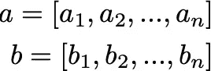
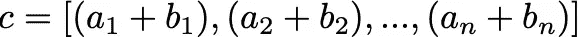

# Python 列表的提示和技巧

> 原文：<https://medium.com/nerd-for-tech/tips-and-tricks-for-python-lists-ee096eb39a1c?source=collection_archive---------6----------------------->


Python 列表是用于存储和更改项目的数据结构。如果你刚刚开始学习 Python 或者想学习一些使用列表的技巧，这篇文章是为你准备的！关于 python 列表的文档可以在[这里](https://docs.python.org/3/tutorial/datastructures.html#more-on-lists)找到。

# **1。两个列表的逐元素添加**



LaTeXiT

在 Python 中，如果我们将两个列表加在一起，我们得到的列表将两个列表中的元素合并成一个列表。

```
a = [a1,a2,a3]
b = [b1,b2,b3]
c = a + b
print('a + b = ', c)
```

a + b = [a1，a2，a3，b1，b2，b3]

为了按元素添加列表，我们需要遍历两个列表。for 循环是遍历列表的好方法。但是，如果我们创建两个 for 循环来尝试遍历两个列表，我们会得到以下结果:

```
for x in a:
    for y in b:
        z = x + y
        print(z) 
```

❗️:这将返回 x + y 的所有可能组合，并将**而不是**提供我们需要的解决方案。

相反，我们需要使用 [**zip**](https://docs.python.org/3.3/library/functions.html#zip) 函数，它聚集了我们正在迭代的列表的元素。

```
for x, y in zip(a, b):
    z = x + y
    print(z)
```

为了存储元素相加的结果，我们可以使用方法。append()将结果添加到新列表中。

```
results = []
for x, y in zip(a, b):
    z = x + y
    results.append(z)
```

看看下面的解决方案。⬇️

```
def add(list_1, list_2, solution):
    for x, y in zip(list_1, list_2):
        z = x + y
        solution.append(z) return solution a = [1,2,3,4,5]
b = [6,7,8,9,10]
c = []add(a, b, c)
```

[7, 9, 11, 13, 15]

# 2.从两个列表中创建字典

[字典](https://docs.python.org/3/tutorial/datastructures.html#dictionaries)由关键字索引，可以使用两个列表创建:一个关键字列表和一个值列表。

```
def zip_dict(keys, values, new_dict):
    for key, value in zip(keys, values):
        new_dict[key] = value return new_dict keys = ['key_1', 'key_2', 'key_3']
values = [1, 2, 3]
new_dict = {}zip_dict(keys, values, new_dict)
```

{ '密钥 1': 1，'密钥 2': 2，'密钥 3': 3}

# 3.将一个列表分割成一个列表列表

我们可以通过将列表划分为 n 个元素的列表来将列表分成组。给定一个列表和一个用来分组的数字，我们可以使用 range 函数来划分列表。然后，我们可以从列表中为每 n 个条目追加条目。

```
def partition(list_1, new_list, n):
    for i in range(0, len(list_1), n):
        group = list_1[i:i+n]
        new_list.append(group) return new_list list_1 = [1, 2, 3, 4, 5, 6, 7]
new_list = []
n = 2partition(list_1, new_list, n)
```

[[1, 2], [3, 4], [5, 6], [7]]

# 4.将列表分割成元组列表

[元组](https://docs.python.org/3/tutorial/datastructures.html#tuples-and-sequences)是 Python 中的另一种数据结构，是不可变的，不能改变。正如我们可以将一个列表分割成一个列表列表一样，我们也可以将一个列表分割成一个元组列表。

```
def tup_partition(list_1, new_list, n):
    for i in range(0, len(list_1), n):
        group = list_1[i:i+n]
        tup_group = tuple(group)
        new_list.append(tup_group) return new_list list_2 = [1,3,2,4,6,5]
new_list = []
n = 2tup_partition(list_2, new_list, n)
```

[(1, 3), (2, 4), (6, 5)]

# 5.将一系列列表合并成一个列表

在 Python 中，我们可以获取一个列表列表，并将其展平为一个包含所有元素的列表。我们可以创建一个函数，它接受一个列表列表和一个新的空列表，并通过将每一项附加到新列表来输出列表列表。

```
def flatten(lists, new_list):
    for list in lists:
        for item in list:
            new_list.append(item)

    return new_list lists = [[1, 2], [3, 4], [5, 6], [7]]
new_list = []flatten(lists, new_list)
```

[1, 2, 3, 4, 5, 6, 7]

# 6.复制列表并进行更改

在 Python 中，如果我们设置一个列表等于另一个列表，例如 a = b，并对 a 进行更改，这些更改也将应用于 b。为了复制一个列表，并且只修改一个列表而不是两个都修改，我们需要使用。copy()方法。

```
a = [1,2,3]b = a.copy()
c = b.copy()

a.remove(2)    # Use .remove() to delete a specific element
b.pop(0)       # Use .pop() to delete an element at a specific index print('a = ', a)
print('b = ', b)
print('c = ', c)
```

a = [1，3]

b = [2，3]

c = [1，2，3]

# 7.清除列表

我们可以使用。clear()方法从列表中移除所有项目。

```
a = [1, 3]
b = [2, 3]a.clear()
b.clear()b.append('done')print(a)
print(b)
```

[]

['完成']