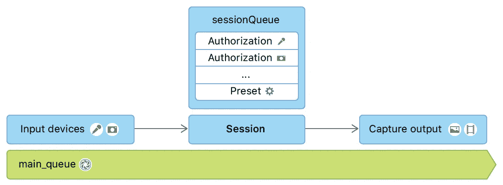
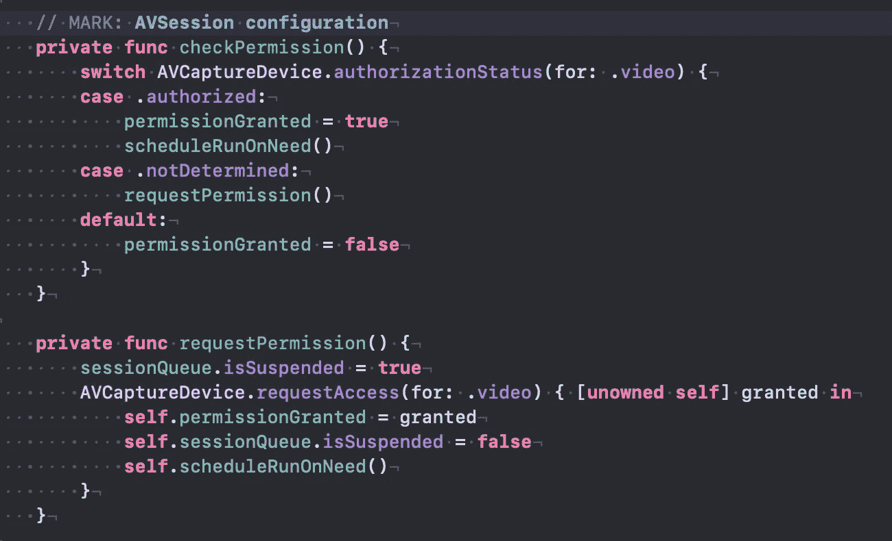
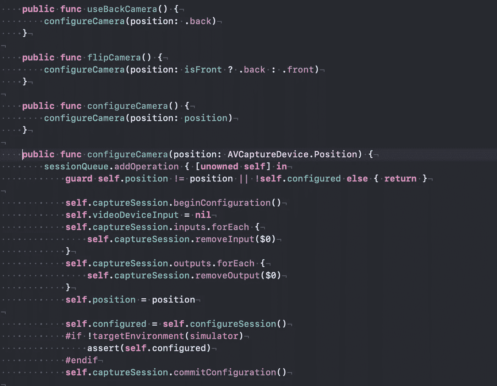
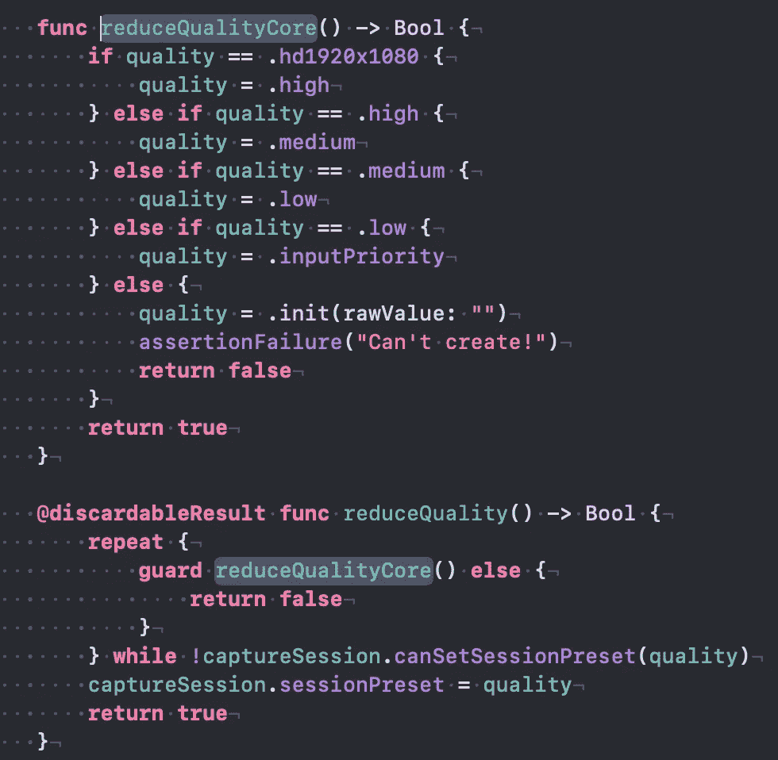
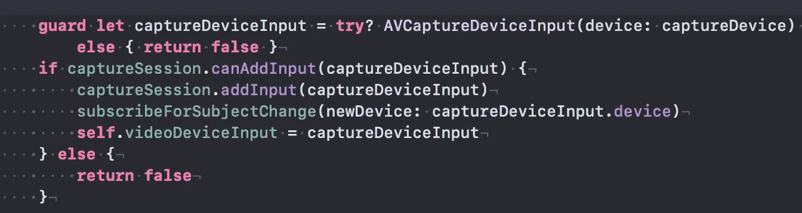
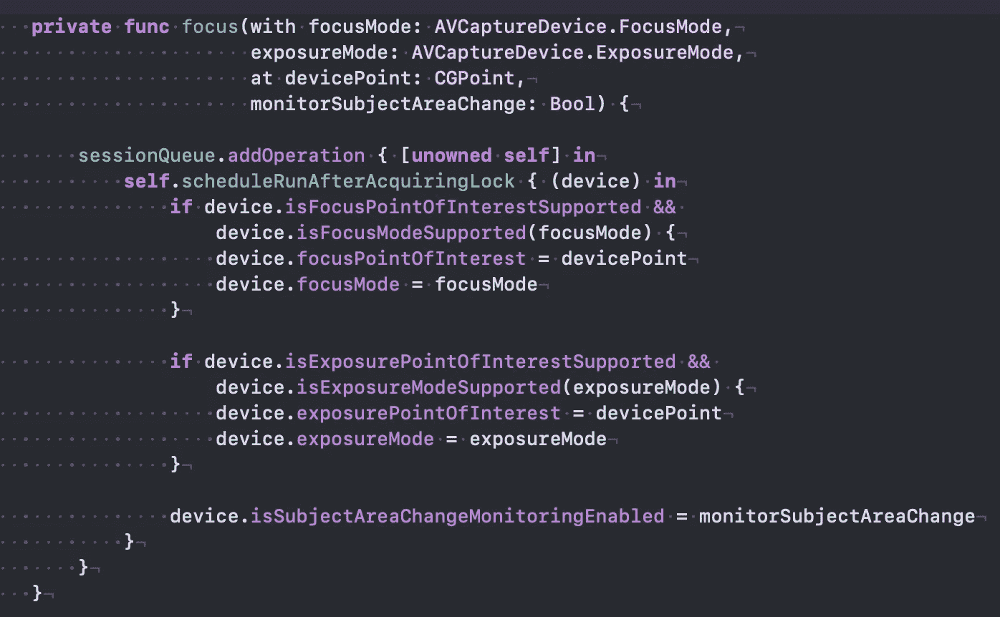
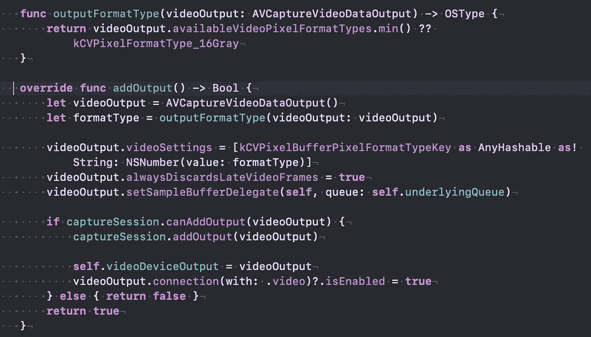
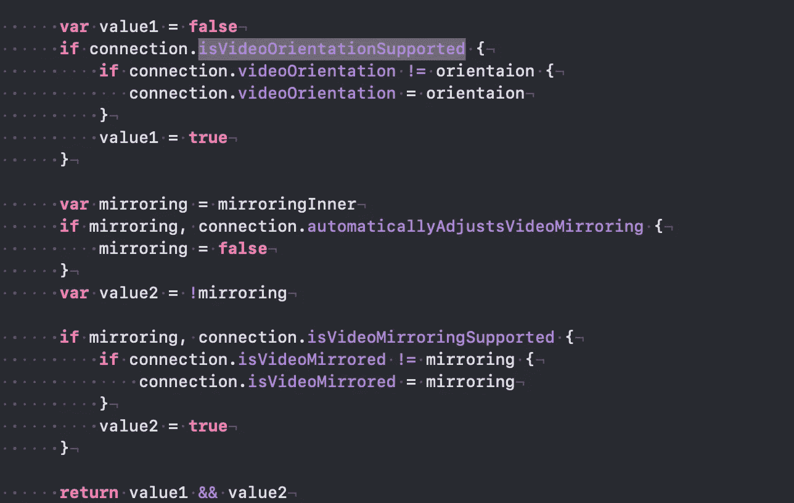
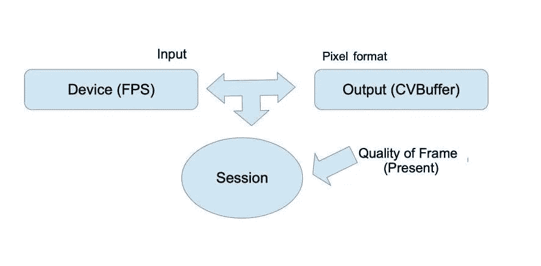
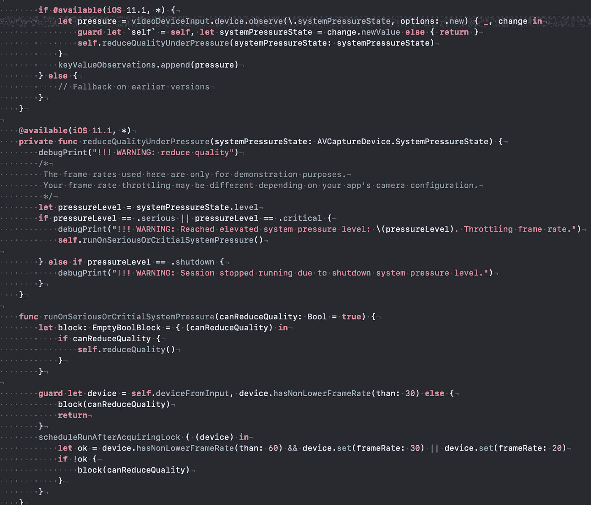

# 提示:使用 AVCaptureSession 从相机中提取帧

> 原文：<https://medium.com/nerd-for-tech/tips-extracting-frames-from-camera-using-avcapturesession-9d8a3a5c0a5c?source=collection_archive---------5----------------------->

在本文中，我将强调官方文档中过多描述的使用 AVCaptureSession 的一些要点。



图像来自 AVCam 示例。(苹果)

老实说，很难给 AVCaptureSession 的描述添加任何东西。官方网站上有很多样品: [AVCam](https://developer.apple.com/documentation/avfoundation/cameras_and_media_capture/avcam_building_a_camera_app) 相当棒。在一个应用程序中，我必须在不同的屏幕上对帧进行不同的处理，还有一些中间步骤，因此我没有使用同一个会话。

综上所述，一切从权限到摄像头访问开始..

**权限**:



请求和检查权限

从构造函数中直接调用 CheckPermission 。配置成功后执行&运行。会话主要在单独的队列中处理:( **sessionQueue)**

**配置**:



检查支持的预设

会话获取输入并将结果存储到输出，很容易对:)。

在*开始配置&提交配置*中，我们定义了“预设”(未来帧的质量)。

基于初始状态，在循环中检查一些值。可能使用其他东西…

那么应该选择设备

**选择装置**:

```
**if** **self**.position == .back {
  **return** AVCaptureDevice.default(for: .video)
}**let** session: DiscoverySession = AVCaptureDevice.DiscoverySession(deviceTypes: deviceTypes,
                                 mediaType: .video,
                                 position: position)**if** **let** device = session.devices.first {
  **return** device
}
```

> *AVCaptureMultiCamSession*，*来自 iOS 13，允许同时从几个设备导入帧*

然后作为“输入”添加到会话设备。

**输入:**



> 如果设备有**issuebjectachangemonitoringeenabled**我们可以处理**AVCaptureDeviceSubjectAreaDidChange**，关注点。



试着专注于特定的点

**输出**:

在我的例子中，我需要处理帧，因此我的输出是一个像素缓冲区:



添加视频数据输出

在官方样本中使用了 420 ypcbcr 8 biplanarfullrange 像素格式类型。

输入和输出对通过“连接”匹配。输入有几个获取数据的端口，输出接受来自数据源的数据。当您添加输入时，会话会形成适当的输出连接。

当相机旋转时，我们通常需要调整视频方向(这应该由*isvideoorientiationsupported 支持，*镜像也是如此)。别忘了获取“锁”。



视频定向和镜像

可视会话配置和启动可通过以下方案进行演示(具有授予的权限):



AVCaptureSession 配置

**处理事件&观察值**

有趣的点大多与处理事件或观察对象中的键值有关。(例如处理系统压力&由于改变**系统压力状态**而降低质量)



如果是关键会话，降低帧速率

不要忘记关键通知:

```
**AVCaptureSessionRuntimeError**
**AVCaptureSessionWasInterrupted**use **AVCaptureSessionInterruptionReasonKey** key in dictionary, and cast it to **AVCaptureSession.InterruptionReason to find reason of interruption**AVCaptureSessionDidStopRunning - could be used for notifications...
AVCaptureSessionDidStartRunning
```