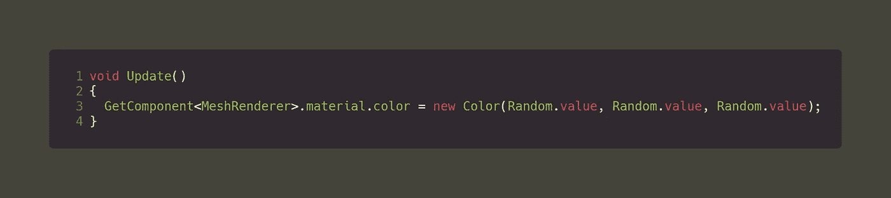
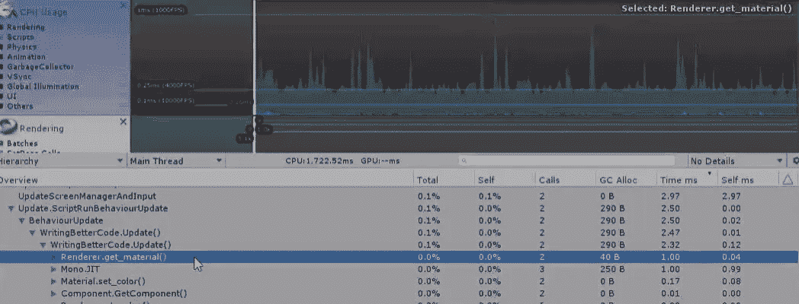
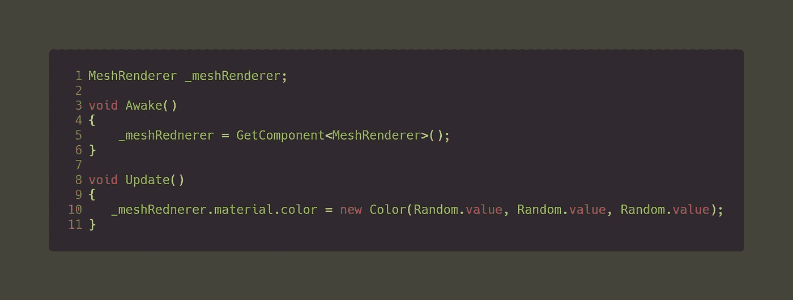
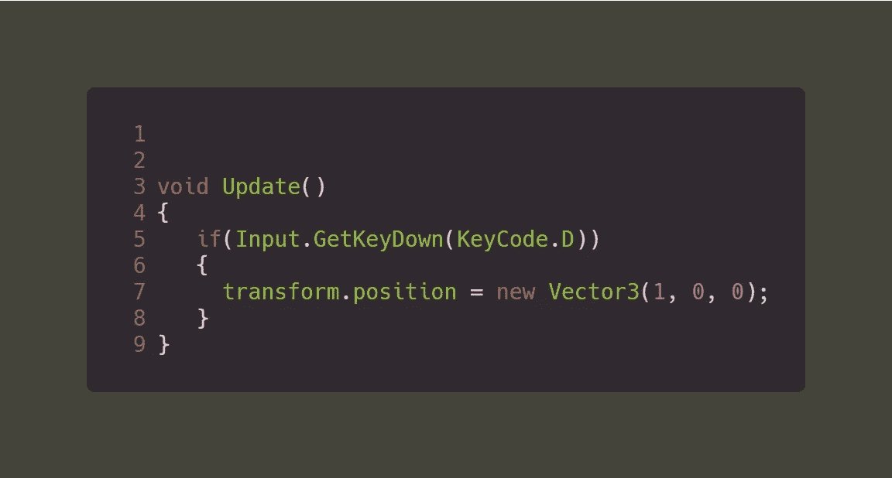
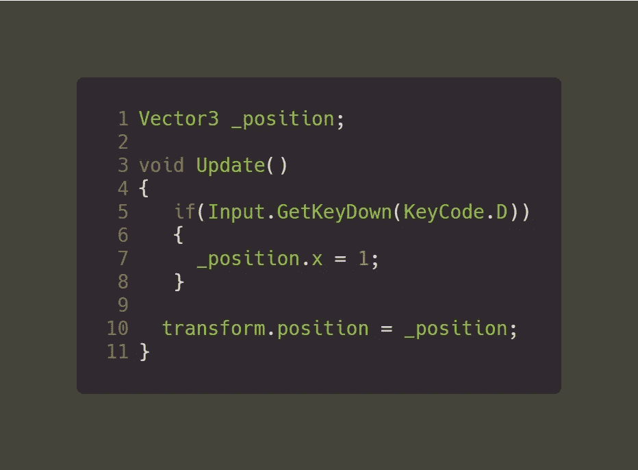
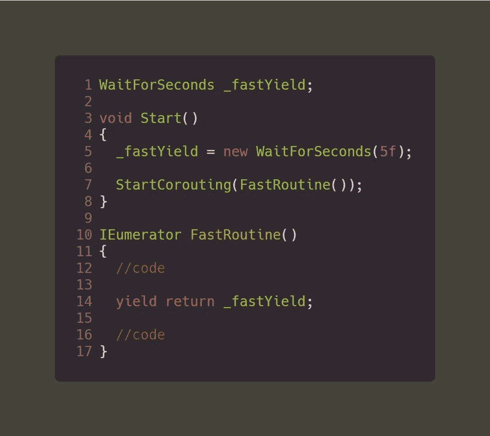

# Unity 中的代码优化技巧

> 原文：<https://medium.com/nerd-for-tech/tips-for-code-optimization-in-unity-947b1fd9b6a9?source=collection_archive---------5----------------------->

在上一篇文章中，我们解释了 Unity 提供的最好的工具之一是 Unity Profiler([Unity Profiler 101](/nerd-for-tech/unity-profiler-101-fcfa4ea7ee2))。分析器可以帮助您识别代码的哪个部分实际上导致了一些性能问题。我们开始吧。

> 获取组件

获得任何对象的组件都是 unity 开发的重要部分，通常我们通过 GetComponent 获得脚本或刚体或对象的材质。

有时你得到组件而没有先缓存它。例如，假设您想要更改立方体的颜色。您可以在更新中执行以下操作:

这将得到对象的每一个单独的帧的组件来改变对象的颜色。如果您使用 profiler 来检查这一点，您会发现从长远来看，这将导致一些垃圾收集和性能问题。一个代码可能没什么坏处，但是想象一下做不止一次。

Profiler:上述代码导致了性能问题

为了帮助改进这一点，您必须总是缓存您的组件，然后在 Awake 或 Start 中找到它，然后对该组件做您想做的任何事情。

组件的这种缓存也应该对变量进行，总是缓存以提高性能。

> 新关键字

“New”关键字就像获取组件一样，用于创建新的变量或向量。如果不明智地经常使用，可能会导致性能问题。

假设您想要使用用户输入来改变对象的位置。您可以在更新中使用以下内容:

这将在用户每次按下 D 键时创建一个新的向量。更好的方法是缓存一个位置向量 3，然后重用同一个向量，就像这样:

缓存变量并重用它们而不是 NEW 关键字

> 收益回报新

就像变量的新关键字一样，IEnumerators 要求您让步，以便执行其中的代码。

yield return 每次运行时都需要创建一个“新”变量(例如 WaitForSeconds())。当你有很多协程时，这肯定会导致垃圾收集和性能问题。不要每次都创建一个新的 WaitForSeconds，而是缓存它并像变量一样重用它。以下是方法:

高效协同程序

通过缓存 WaitForSeconds，而不是在 IEnumerator 中创建一个新的 WaitForSeconds，您几乎可以消除由这个协程创建的垃圾收集，从长远来看，可以提高应用程序的性能。