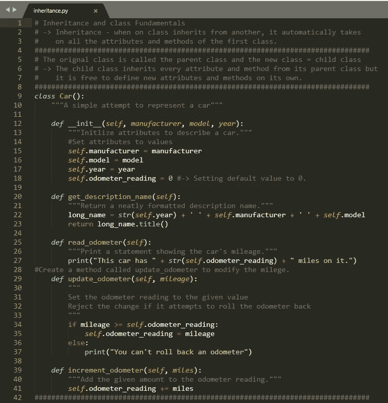

# 学习 Python 的技巧

> 原文：<https://medium.com/nerd-for-tech/tips-for-learning-python-ea9eb25fc03d?source=collection_archive---------8----------------------->

坦纳·琼斯[@技术专家](/@all-tech-guy)

图片:【arstechina.com 

我知道…我知道。这可能是关于如何学习 Python 的第一百万篇文章，但是，如果你正在阅读这篇文章，我想你还在寻找一些建议来加速你的 Python 学习。如果你的“第一百万个”读到这篇文章，我希望你找到你正在寻找的东西。我鼓励任何想学习编程语言的人学习 Python。

以下是我决定学习 Python 的 3 个主要原因:

1.  很直观。(易于阅读、书写和学习)
2.  它用途广泛，用途极其广泛，需求量很大。
3.  它被一个庞大的支持社区所包围。

我花了大量的时间试图学习 Python，但我离专业人士还差得远。我是一个自学成才的程序员，每天都在学习新的东西。为了给你一点我学习 Python 过程的预览，让我带你回到大约 1 年前。我花了大量的时间观看 Udemy 课程，阅读书籍，以及观看没完没了的 YouTube 教程。即使经历了这一切，我发现自己还是不理解编程的基础。我心中有我想要创建的程序，但是不知道从哪里开始。我很沮丧，不觉得自己有什么进步。如果你有过这样的感觉，你并不孤单！我认为值得一提的是，学习一门编程语言可以根据你偏好的学习风格而有所不同。通过学习 Python 的过程，我意识到当我采用基于项目的学习方法时，我能够更容易地掌握概念。我用的那本书叫做 *Python 速成班。*这里是[链接](http://bedford-computing.co.uk/learning/wp-content/uploads/2015/10/No.Starch.Python.Oct_.2015.ISBN_.1593276036.pdf)到一个免费的 PDF，或者你可以在这里购买一个实体副本[。](https://www.amazon.com/Python-Crash-Course-2nd-Edition/dp/1593279280/ref=sr_1_9?dchild=1&keywords=No+Starch+Press&qid=1613580729&sr=8-9)

[获取您的免费 PDF 文件](http://bedford-computing.co.uk/learning/wp-content/uploads/2015/10/No.Starch.Python.Oct_.2015.ISBN_.1593276036.pdf)

我发现这本书对我的学习过程非常有帮助，因为它都是基于真实世界的项目(而且是免费的)！这本书从零开始，从如何安装 Python 开始，让你马上开始写代码。根据我的经验，我发现进行所有的“自己尝试”练习是很好的练习。你知道该怎么做。熟能生巧。嗯，学习 Python 也不例外。至关重要的是，你每天至少花 30 分钟编码。最好的学习方法是通过编写代码来实践每个概念。当你在写代码的时候，想到一个问题，在继续下一步之前花时间研究一下。研究并找到问题的答案将更好地巩固您对概念的理解，此外，它还会让您习惯于研究概念并将其应用到您自己的代码和想法中。当你阅读这本书时，为每一章创建一个文件夹，并保存该章中每个概念的代码。在单个文件中，记下**笔记**，以便您可以像这样在以后引用该主题:

做笔记以巩固重要的概念和以后的参考。

该书涵盖了以下概念:

1.  列表
2.  If 语句
3.  字典
4.  用户输入和 while 循环
5.  功能
6.  班级
7.  文件和例外
8.  项目

一旦你掌握了基础知识，有 3 个项目可以让你应用你所学的概念。这些项目包括开发一款名为“太空入侵”的游戏、数据可视化以及用 Django 开发一个网络应用。这些项目可以以任何顺序完成，所以选择一个你感兴趣的，并得到编码！我最喜欢的项目是 Django web 应用程序。一旦我完成了，我想学习更多。这里有一个很棒的 [YouTube 频道](https://www.youtube.com/playlist?list=PL-osiE80TeTtoQCKZ03TU5fNfx2UY6U4p)，可以帮助你将 Django 技能提升到一个新的水平。

**底线**

拿到书，通过书工作，每天写代码**，创建项目，不要放弃学习 Python。**

**更多免费资源:**

** [## Python 教程-真正的 Python

### 在本教程中，您将学习如何使用 Brython 在浏览器中运行 Python 代码。虽然大多数前端 web…

realpython.com](https://realpython.com/)  [## 卡勒·哈尔登

### 嗨，我已经 300 岁了。我用月亮来计算一切，这让人们很困惑。我喜欢用代码构建东西…

www.youtube.com](https://www.youtube.com/channel/UCWr0mx597DnSGLFk1WfvSkQ)**