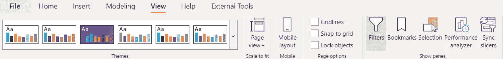
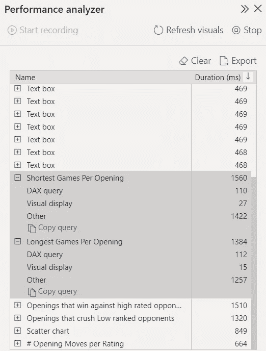

# 提高电源 BI 报告性能的技巧

> 原文：<https://medium.com/nerd-for-tech/tips-to-increase-the-performance-of-your-power-bi-reports-566004c35e9b?source=collection_archive---------0----------------------->

提高报告的性能对于使用 Power BI 时的用户体验非常重要。在本文中，我将介绍如何在数据源、数据模型、可视化和其他方面提高报表的性能。

Marc Sendra Martorell 在 [Unsplash](https://unsplash.com/s/photos/speed?utm_source=unsplash&utm_medium=referral&utm_content=creditCopyText) 上拍摄的照片

你也可以在我的网页【eliasnordlinder.com上找到这篇文章，以及其他 Power BI 方面的内容，比如参考资料、DAX 片段等等。

# 介绍

使用 Power BI 越多，性能问题就越受关注。

当您刚刚开始使用 Power BI 时，有很多东西需要学习。

您将探索不同类型的视觉效果，学习如何编写不同的 DAX 度量，如何在 Power Query 中转换数据，如何建立关系和模型，以及在 Power BI 中可以做的所有其他事情。

性能经常被放在后排，尽管它不应该。

当你对这个工具越来越有经验的时候，你就会明白绩效实际上在你的报告对组织内部的影响中起着巨大的作用。

您还了解到，绩效并没有一种“放之四海而皆准的方法”，但是有许多不同的方法可以解决报告中的绩效问题。

## 一般性能问题

*   在本文的第一部分，我将介绍一些在使用 Power BI 时经常想到的常见性能问题:

## 提高性能的性能分析器

*   在第二部分，我将介绍一个工具，它有助于调查并指出不同视觉效果影响表演的一些具体方式:

## 提高性能的外部工具

*   在本文的第三部分，我将介绍一些外部工具，它们在帮助您解决第一部分中提到的各种性能问题方面发挥了重要作用，有时还会借助性能分析器:

# 一般性能问题

在第一部分中，我将介绍一些您可以在报告中看到的一般性能问题，以及如何处理这些问题。

## 报表页面上的视觉效果过多

当人们刚开始使用可视化工具时，最常见的问题之一是他们想立刻可视化所有的东西。

首先，当你看仪表板时，很难理解你应该注意什么。东西看起来很狭窄，太多的东西一下子突出来了。

从性能的角度来看，这也是一种不好的做法，因为你拥有的视觉效果越多，你的报告呈现(加载)就越慢。

你可以做一些事情来减少视觉效果的数量:

[只保留必要的视觉效果](https://lytix.be/performancetipspowerbi/)

*   仔细考虑你真正想展示什么，只保留必要的视觉效果

使用格式技巧来展示相同的内容，但减少视觉效果

*   您可以使用一些格式技巧来减少视觉效果的数量，同时仍然在报表中显示相同的内容。
*   其中一个著名的方法是将多个测量卡转换成一个表格，请看来自[的视频《立方体中的家伙》](Guy in a Cube),了解如何实现这一点

## 列的基数太高

许多人在性能方面遇到的另一个常见问题是列中的基数太高，参见这里的 [Guy in a Cube。](https://www.youtube.com/watch?v=D9dm0-cp1_s)

*   列的高基数意味着在特定的列中有许多不同的唯一值。
*   当我使用 Vertipaq 分析器时，我会详细介绍这一点，这是研究模型中哪些列具有高基数的好方法。
*   处理高基数的方法有:
*   如果模型中没有使用柱，请将其删除
*   禁用自动日期/时间，并使用单独的日历表
*   更改数据类型，最佳数据类型可以增加基数并提高模型的性能

## 对错误模型使用直接查询

*   如果没有针对源中已经存在的 Power BI 进行优化建模，直接查询通常会很慢。
*   如果您的模型非常慢，您使用的是直接查询，并且在此基础上运行性能分析器，您将会看到大部分渲染时间来自直接查询。
*   我们可以通过以下方式处理直接查询性能问题:
*   [优化模型设计](https://docs.microsoft.com/en-us/power-bi/guidance/directquery-model-guidance)
*   不再需要超级查询查询来应用转换
*   如果需要，将计算列移动到源中的已添加列
*   仅使用简单的措施
*   避免使用双向过滤器
*   关闭视觉效果之间的交互

## 未优化的 DAX 代码

*   认为 DAX 是一种简单语言的常见误解经常会导致非优化的 DAX 代码
*   你经常可以用很多不同的方法来编写 DAX 代码，这将导致相同的结果，但是有些方法实际上比其他方法更能优化引擎在 Power BI 中的运行。
*   当我谈到 VertiPaq 分析器和 DAX 查询持续时间时，我将更多地讨论这一点，但请尝试理解 DAX 的实际工作方式，而不是仅仅搜索度量，您将了解如何优化 DAX 代码以获得更好的性能。

# 提高性能的性能分析器

性能分析器是一个工具，内置于 Power BI，它可以帮助您找到使您的报告运行缓慢的不同方面。

下面是两张使用性能分析器时的图片。SQL BI 的性能分析器的精彩视频也可以在[这里](https://www.youtube.com/watch?v=1lfeW9283vA)找到。

# 如何从性能分析器中获得结果？

要从性能分析器获得上述结果，请使用以下步骤:

1.  创建一个新的空白页面(在运行该工具时，这需要没有任何缓存)
2.  转到视图->性能分析器并开始记录(在报告选项卡内)
3.  转到您想要查看其性能的特定页面
4.  等到性能分析器完成后，您将获得上面右图中看到的信息。
5.  (可选)，如果要使用性能分析器中的数据，请按“导出”将其导出到外部程序。我将在接下来的章节中更深入地探讨外部工具。

# 你如何解释性能分析器的结果？

让我们再次回到上面的图片，但现在我们试图解释我们看到的结果。

# 性能分析器的不同部分

对于每个视频，我们可以看到三个标题以及旁边的一个数字:

*   DAX 查询
*   直观显示
*   其他的

持续时间

**持续时间(ms)** 是上面的特定方面渲染所需要的时间。需要注意的是，它是以毫秒为单位的，1384 毫秒意味着 1.38 秒。

## DAX 查询

*   DAX 查询是当特定对象/视觉从原始源收集数据时自动生成的。根据 DAX 查询的所有视觉效果都可以被视为表格，不管它们是什么视觉效果。

**真实世界示例:**

*   你在餐厅，在一家高级餐厅点餐。
*   有些标准程序几乎总是由餐馆来完成
*   带你去一个地方坐下
*   浏览菜单决定吃什么
*   告诉服务员你想要什么
*   厨师从女服务员那里得到信息后开始准备食物
*   总的来说，**程序并不复杂**，这四个相同的方面在所有不同的餐馆都在进行。
*   但不同的餐馆在完成这些任务时更有经验，更以顾客为中心，这带来了更好的用户体验。
*   在 Power BI 中，通常会有一些最终结果和标准化流程。
*   你有一些你想执行的措施，在开始的时候，你只是写下这些措施，这样你就能得到正确的结果，就像没有经验的餐馆一样。
*   当您越来越习惯 DAX 时，您会明白可以用许多不同的方式编写 DAX 查询，有些方式会使报告运行得更快(更加以客户为中心)。

**如何限制运行 DAX 查询所需的时间**

*   更改 DAX 度量，以最佳方式使用公式引擎和存储引擎
*   DAX studio 是分析如何最小化 DAX 查询时间的最佳方式，[看这个视频，Marco Russo](https://www.youtube.com/watch?v=C5HBhlLUFsE) 正在讲述他通常如何优化 DAX 查询。您可以看到公式引擎和存储引擎分别运行特定查询所花费的时间。
*   我还建议多读一些公式引擎和存储引擎的内容-->这里有一个由 Curbal 制作的[视频，是关于这个主题的，以及如何优化你的 DAX 度量来限制 DAX 查询时间。](https://www.youtube.com/watch?index=4&list=PLDz00l_jz6zwxDvgXveSotxiYKhEsTNty&v=wvbzMwtZSKM)

## 直观显示

*   另一方面，可视化查询关心的是报表中的可视化内容是如何包含的以及包含了什么。
*   报告中的可视点越多，可视查询的级别就越高。

**真实世界示例:**

*   你已经点了上面例子中的食物，现在正在等待厨师完成这道菜。
*   你旁边的桌子点了一道简单的开胃菜，10 分钟后上桌。
*   另一方面，你决定点菜单上最复杂的一道菜，却要等 40 分钟才能吃完。
*   你已经决定，主要是凭你自己的力量，在你关心结果会比开胃菜更高级之前，吃一种需要更长时间烹饪的食物。
*   在 Power BI Performance 语言中，这可以称为可视化查询

**限制运行可视化查询所需的时间**

*   另一方面，可视化查询关心您正在创建哪种类型的可视化。
*   视您决定创建的高级视觉效果而定，视觉查询需要的时间越长。
*   如果您的最终目标是获得出色的性能，您不应该追求太高级的视觉效果，也不应该追求未经认证的自定义视觉效果，因为这些视觉效果可能会持续更长时间。

## 其他的

*   “其他”关心你在报告上有什么其他的视觉效果，你在一页上有越多的视觉效果,“其他”就越长/特定视觉效果加载的时间就越长。

**真实世界示例:**

*   你们 10 个人同时点了菜。
*   桌子上除了你只有一个人坐着点菜。
*   你旁边桌子上的人在点菜后 15 分钟就能拿到他们的食物。
*   另一方面，你的餐桌需要 40 分钟，即使你和旁边的人点了完全一样的食物。
*   这样做的原因是，你还必须等待所有其他人在你的食物准备好他们的食物，其中一些人点的食物需要更长的时间。
*   在这种特定的情况下，你能最大限度地减少准备食物的时间的唯一方法，就是限制和你一起去餐馆的人数。
*   权力 BI 表现语言中的“他人”称为“他者”。

**限制运行“其他”查询所需的时间**

*   限制运行“其他”查询的主要方法是尽量减少报表中的视觉效果。
*   如果你需要在报告中使用所有的视觉效果，那就好好想想，如果你需要，看看你是否能做一些格式化的提示，用更少的视觉效果来展示同样的东西。

# 降低性能的外部工具

您可以在 Power BI Tips [这里](https://powerbi.tips/product/business-ops/)下载多个外部工具作为业务运营包。
在本节中，我将介绍两个与绩效相关的外部工具:

*   达克斯工作室
*   报告分析器

# 达克斯工作室

DAX studio 是一个非常不受欢迎的工具，很多人可能会使用它来评估不同的 DAX 度量，尤其是那些更复杂或返回表的度量-->[关于为什么应该在 Power BI 上使用 DAX Studio 的精彩视频](https://www.youtube.com/watch?v=fV2ZK4q3FBQ)

但是 DAX studio 在更具体的性能方面也可以用很多，如下图。

## 减少 DAX 查询时间

*   您可以通过减少查询时间来利用 DAX Studio，这一点我前面已经提到过。
*   SQLBI 的这个视频非常适合这个主题，其中 Marco 在 DAX Studio 中分析了一个慢速报告。
*   **服务器计时**精确地告诉公式引擎和服务器引擎需要多长时间。
*   存储引擎比公式引擎快得多，但可以处理复杂得多的公式。
*   通过重写不同的 DAX 度量，并在 DAX studio 中测试这些度量，您可以改变度量的复杂性，将它们从公式引擎移动到存储引擎，并使模型的性能更好。

## 使用 VertiPaq analyzer 降低模型大小和列粒度

*   VertiPaq Analyzer 是 DAX Studio 的另一个重要部分
*   您可以看到每列的粒度以及每列的大小

您可以通过多种方式利用 VertiPaq 分析器中的信息，例如:

*   如果模型中没有使用柱，请将其删除
*   禁用自动日期/时间，并使用单独的日历表
*   更改数据类型，最佳数据类型可以增加基数并提高模型的性能

# 报告分析器

找到报表分析器的创建者[优雅毕](https://www.elegantbi.com/post/reportanalyzer)的博文。

如果我要用六个词来描述 report analyzer，我会将其描述为:

*   **性能分析器的可视化表示**

换句话说，它是一个比 performance analyzer 更容易理解和使用的 GUI，并且可以轻松地将其导出到其他工具，如 DAX Studio。

我是一个喜欢直观地看待事物的人，我认为许多从事商业智能工作的人也是这样，因此这个工具是一个很好的工具，可以让您直观地探索这些性能方面！

## 如何使用报表分析器？

由于报告分析器部分基于性能分析器，您必须从性能分析器下载日志文件才能使用它:

*   为您想要分析的报告中的所有页面运行性能分析器(参见上一节中我对性能分析器的描述)
*   对每个页面按 Export，将数据导出到 JSON 文件。
*   将所有 JSON 文件以及 Power BI 桌面文件保存到特定的文件夹中
*   启动电源 BI 报告分析器
*   在 Report Analyzer 中打开包含所有 JSON 文件和 Power BI 文件的文件夹。

## 我欣赏的报表分析器功能

**直观布局**，它基于您在 Power BI 的报告页面中使用的视觉效果布局，但是覆盖了来自性能分析器的信息，例如:

*   视觉类型
*   DAX 查询时间(毫秒)
*   渲染时间(毫秒)
*   行数

**在报告分析器的页面**顶部带有过滤器的可视化 GUI，允许您选择不同的方面，例如:

*   报告名称(选择并仅显示报告页面中所有内容)
*   视觉类型:切片器、卡片、图表、条形图、矩阵等(突出显示视觉类型)
*   视觉 ID
*   DAX 查询时间(秒)
*   通过**设置以秒为单位的 DAX 查询时间的阈值**，可以获得视觉提示，视觉填充红色。
*   **只需点击报告分析器报告页面上的可视化表示，即可将信息直接复制到 DAX Studio** 。

查看关于如何提高性能的建议，例如:

*   减少视觉效果
*   减少自定义视觉效果的数量
*   减少“显示没有数据的项目”
*   通过垂直滚动减少长页面
*   减少 TopN 过滤的使用
*   减少衡量标准中过滤器的使用

我建议也看看 Guy 在 Cubes 中关于报告分析器的视频，名为[“另一个强大的 BI 优化工具—报告分析器”](https://www.youtube.com/watch?v=MttvudnaBD0)。

# 结论

在本文中，我介绍了为什么 Power BI 模型的性能可能很差，如何使用 performance analyzer 进行调查，以及如何使用不同的外部工具来帮助提高模型的性能。

## 一般性能问题包括:

**报告页面上的视觉效果太多**

*   尽量只保留必要的视觉效果，如果可能的话，格式化视觉效果以减少数量

**高基数的列导致了大的模型尺寸**

*   使用 VertiPaq Analyzer 分析不同的色谱柱
*   删除列，更改数据类型，并创建数据表以减小模型大小

**对不良模型使用直接查询**

*   在源数据中构建更好的模型，这些模型针对功率 BI 进行了优化
*   减少对超级查询的需求，并将这些转换转移到源

**未优化的 DAX 代码**

*   “DAX 很简单，但并不容易”——马可·鲁索
*   理解 DAX 真正的工作原理，你将学会优化你的 DAX 代码的性能。

## 使用性能分析器，您可以查看以下方面的性能:

**DAX 查询**

*   根据从数据源收集数据的方式，渲染一个可视化对象需要多长时间。
*   借助 VertiPaq Analyzer，通过编写更好的 DAX 代码进行优化。

**视觉显示**

*   根据视觉效果的复杂程度，渲染视觉效果需要多长时间。
*   通过使用更标准化的可视化和更少的数据进行优化。

**其他**

*   根据报表页面上的视觉效果数量，加载视觉效果需要多长时间。
*   通过不在一个报告页面上包含太多视觉效果来进行优化。

## 有几个外部工具可以帮助您提高性能，例如:

**DAX 工作室**

*   使用 DAX Studio 进行试验，并减少 DAX 查询时间。
*   使用 DAX Studio 中的 VertiPaq Analyzer 来降低列的粒度。

**报告分析器**

*   获得性能分析器的可视化表示。
*   轻松地将 DAX 查询从 visual 移动到 DAX Studio。

# 问题或询问

如果您有任何问题或建议，请联系我

**领英:**[www.linkedin.com/in/elias-nordlinder](http://www.linkedin.com/in/elias-nordlinder)
**邮箱:**Elias.Nordlinder@gmail.com
**网页:**[eliasnordlinder.com](https://www.eliasnordlinder.com/blog/tips-to-increase-the-performance-of-power-bi-reports)

祝大家这周过得愉快