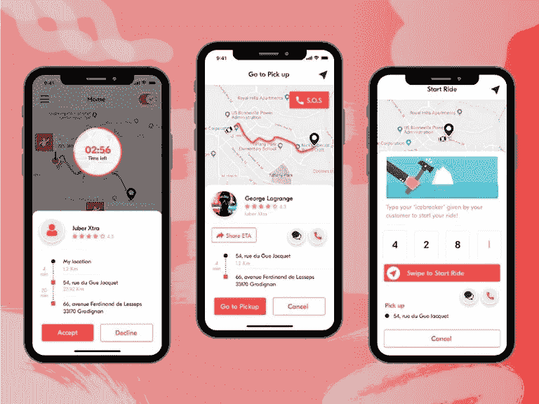
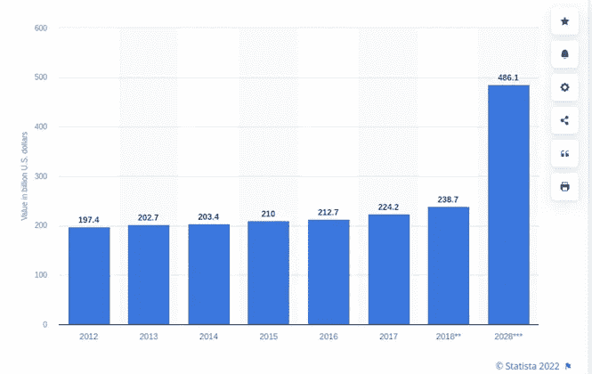
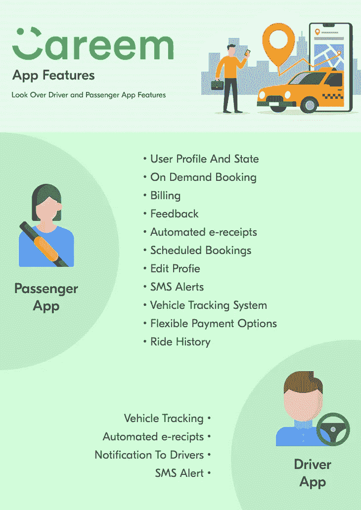

# 作为专业人士在迪拜推出 Careem LikeTaxi 应用程序的技巧

> 原文：<https://medium.com/nerd-for-tech/tips-to-launch-a-careem-liketaxi-app-in-dubai-7326ce78d611?source=collection_archive---------5----------------------->

Careem 应用程序

曾经有一段时间，像美国这样的西方国家以引进技术创新而闻名。然而，随着时间的推移，中东和亚洲等地占据了这一位置。今天，许多新的创新解决方案都出现在亚洲和中东的重要地区，特别是像迪拜这样的地方。迪拜，一个过去的石油出口国，今天是一个创新中心。其中最突出的是出租车预订解决方案。这些大量的解决方案使该地区成为一个主要的创新中心和新出租车业务开始运营的推荐地点。

因此，当我们讨论出租车业务及其在迪拜受欢迎的本质时，我们不能阻止自己提到 Careem。

Careem 于 2012 年在迪拜推出，是一款出租车预订应用程序，如今它在中东、非洲和南亚的 12 个国家的 100 多个城市提供打车服务。

它以价格合理的乘车服务而闻名，是出租车预订服务的市场领导者，给优步这样的公司带来了竞争。这使得它成为那些想创造奇迹的人的灵感来源，他们分享了一个类似的解决方案。当你阅读这篇文章的时候，你会了解到如果在迪拜建立一家出租车公司，你需要遵循的步骤，以确保从中获得最大的成功，除了相当大比例的收入。

因此，没有进一步的告别，让我们开始吧。然而，在此之前，你需要了解为什么出租车预订应用程序在该地区越来越受欢迎。

# 拼车应用在迪拜越来越受欢迎

请看下图:

图片来源:statista.com

上图描绘了旅行和旅游业对中东地区 GDP 增长的总体贡献，预计到 2028 年将会有所增长。预计到 2010 年，这一数字将达到 4861 亿美元。

这是由于下面列举的原因。

> **技术中心的存在**

逛迪拜，会遇到很多技术中心和枢纽。这最终导致了许多新机会的出现，尤其是对那些有出租车生意的人来说。像 Careem 这样的应用程序在 14 个国家的 100 多个城市提供服务，出租车行业已经成为一个蓬勃发展的行业。

因此，看看这个因素，它变得很明显——拥有一个像 Careem 这样的[出租车预订应用程序将有助于拼车业务首次在迪拜建立基础，会做得很好。](https://www.peppyocean.com/taxi-booking-app-development/)

这里需要注意的是:在建立像 Careem 这样的打车应用程序之前，需要记住它的显著特征。

因此，请让我们在下面的文字中了解一下该解决方案的独特之处。

> **Careem 的独特之处**

在上图中，你可以看到职业生涯的三个部分——司机、骑手和出租车公司老板。每一个都有不同的功能。司机的应用程序允许司机获得出租车预订，并从中赚取可观的金钱。这是他们在应用程序上注册之后。乘客应用程序用于预订方便、实惠、安全的出租车。最后，出租车企业所有者的管理仪表板无缝管理拼车业务、司机、出租车等。

这是一种按需模式，允许企业从客户的出租车预订服务中获得相当大比例的收入。它还有助于客户节省时间和精力。因此，这是 Careem 如此受欢迎的主要原因之一。

> **创收流**

Careem 有三种不同的方法来预订乘车——现在、以后、重复和付款。这包括-现金、卡、钱包等。

当骑手通过应用程序支付骑行费用时，司机会在他们的应用程序中收到付款。接下来，司机可以灵活地观察门户中的支付情况。司机与企业分享其中的一定比例。这使得企业可以通过在上面预定的行程来获利。

> **垂直扩张**

Careem 提供食物、公共汽车服务、送货服务和商务旅行。这有助于减少人们在日常生活中面临的障碍。换句话说，因为它提供了其他服务，如送货上门，所以最大限度地方便了顾客。

所有这些原因都足以说明为什么你需要在迪拜建立一个像 Careem 这样的打车应用程序。它将帮助你创建一个独特的企业，只需点击应用程序上的几个按钮，就能让客户得到他们想要的东西，并让你建立一个从第一天起就获得最大收入的企业。

# 如何像 Careem 一样开发一个成功的出租车预订应用程序？要遵循的步骤

## **1。了解技术堆栈**

对于像 Careem 这样的出租车预订应用程序，使用了大量的技术堆栈。对于管理员，Laravel 框架，PHP，HTML5 和 CSS3，而对于用户，我们有 Java 和 Swift。对服务器的要求是操作系统使用 Linux，Web 服务器使用 Apache，等等。所以，在你创建应用程序之前，先对这个方面(技术栈)有个概念。使用不适当的技术堆栈可能会导致应用程序运行不良。这将最终导致你失去你的客户。

因此，一定要了解构建像 Careem 这样的出租车预订应用程序所需要的技术。

## 2.拥有 USP

目前市场上有很多打车应用。因此，你的应用程序有一个 USP 是至关重要的。这意味着乘客和司机不应该觉得他们只是在使用另一个出租车预订应用程序。因此，当你着手在迪拜开发一款打车应用时，要尽可能让它独一无二。考虑将乘坐体验游戏化，增加像 SOS，地理围栏等功能。所有这些因素将确保安全元素保持完整，你的应用程序在司机和车手中很受欢迎。

除了所有这些步骤之外，其他也将使像迪拜 Careem 这样的应用程序的开发非常简化的步骤是-

*   建立独特的收入模式，通过应用程序上的乘车服务赚取利润
*   联系一家出租车预订应用程序开发公司，让您的想法开花结果。换句话说，通过创建的技术文档，他们将强调开发应用程序所需的技术规格等。这样才能保证 app 结构是这样的；拼车是无缝的。

除了所有这些方面，当你开发一个应用程序时，你也应该能够节省时间和金钱。最好的方法是通过现成的解决方案。因此，如果你正在迪拜开展出租车业务，Careem clone 应用程序是你应该选择的。

以下是您应该了解的关于这一现成解决方案的所有信息。

 [## 建立一个像优步一样的出租车预订应用程序——它能帮助你的出租车事业吗？

### 我相信您和我一样，也在思考越来越多的用户使用按需出租车预订的原因…

smitheliza175.medium.com](https://smitheliza175.medium.com/build-a-taxi-booking-app-like-uber-will-it-help-your-taxi-venture-526441e45f83) 

# 什么是 Careem Clone 应用？

Careem clone 应用程序具有可定制且随时可用的 Careem clone 脚本，可帮助出租车初创公司根据业务需求对最终应用程序进行更改，并为乘客提供无缝的乘车预订服务。为司机、乘客和出租车公司提供应用程序和网络面板——这三者都可以无缝地运行应用程序。

除了所有这些独特的方面之外，该解决方案还配备了最好的技术堆栈，以确保顺利运营。
由于具备了所有这些要素，一个新的出租车业务设置可以节省成本，更好地为乘客和司机服务。所有这些将使他们从第一天起就获得可观的收入。

# 结尾词

通过上面阅读的文章，你可以洞察到 Careem 成立后迪拜拼车业务的盈利性质。这最终导致新的企业也开始着手构建类似的解决方案。它需要保持对技术堆栈的了解，并利用可以增强应用程序并使其易于导航的 UI/UX 元素。最后，建议与出租车预订 app 开发公司合作。通过与创业公司的合作，他们将创建一个独特的解决方案，通过它使乘车服务无缝。

因此，如果你也是想在打车领域大展拳脚的人之一，今天就下载 Careem clone 应用吧。这种可定制且随时可用的解决方案由 Careem clone 脚本构建，将帮助您在短时间内进入公众视野，提供独特的游乐设备服务，节省成本，并从第一天起就获得最大的投资回报！