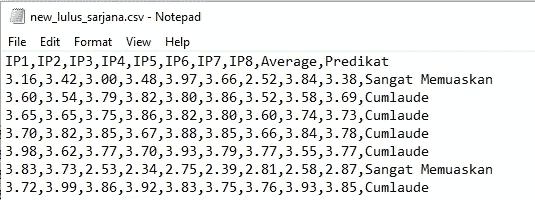
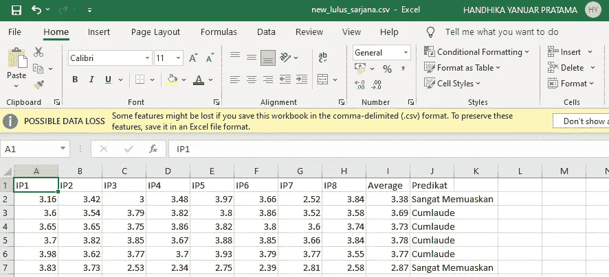
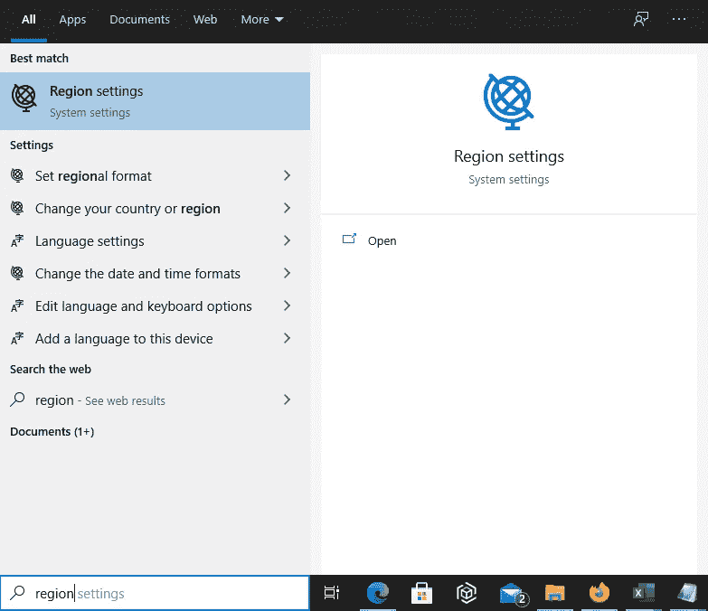
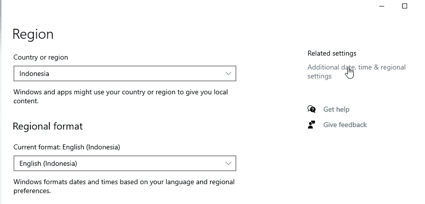
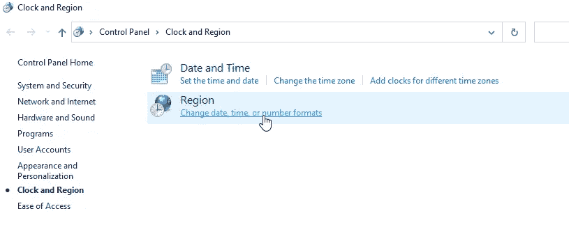
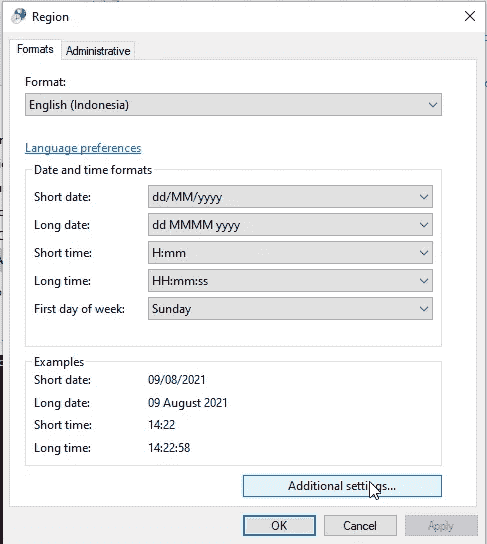
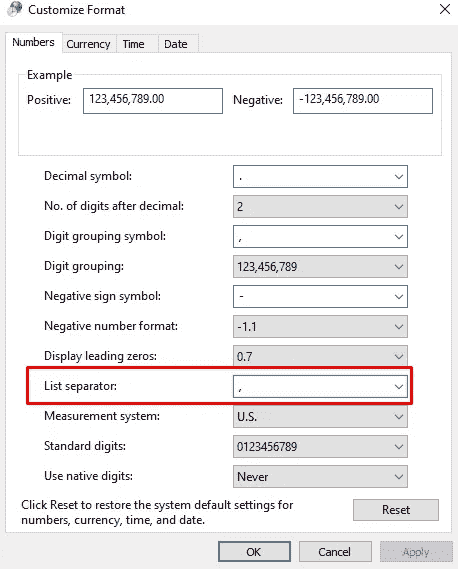

# 让您的 Excel 读取 CSV 文件的提示

> 原文：<https://medium.com/nerd-for-tech/tips-to-make-your-excel-read-a-csv-file-b3ac577a8ab1?source=collection_archive---------10----------------------->

米卡·鲍梅斯特在 [Unsplash](https://unsplash.com/s/photos/excel?utm_source=unsplash&utm_medium=referral&utm_content=creditCopyText) 上的照片

作为一名数据工程师，CSV(逗号分隔值)是我们工作中的一个重要方面。这种格式变得非常有用，尤其是当它与 XLSX 文件比较时。CSV 占用的内存更少，因为它向我们展示了这样的东西。

所有值有时用逗号(，)，点(。)，分号(；)、选项卡等。通过制作这样的格式，文件的大小变得比 XLSX 格式小。你知道吗，实际上 Excel 应用程序也支持打开 CSV 文件，比如打开 XLSX 格式，就像这样。

如果你看到不同的格式，显示在屏幕上是好的。在这篇文章中，我想分享一下如何让你的 CSV 文件可以像 XLSX 一样用 Excel 打开。

# 介绍

首先，这个想法来自于我想在 Excel 中编写函数的时候，在我跟随的教程中，它说我必须使用逗号(，)作为条件之间的分隔符。但是，在我的例子中我需要把分号(；)太烂了。然后，我有了一个想法，找到如何在 Excel 应用程序中使用逗号而不是分号。是的，我在这里找到了。但是，我得到的实际上不仅仅是编写函数的方法，它还使我的 Excel 应用程序可以读取 CSV 文件。这就是我写这篇文章的方式。

# 主要的

好了，我们开始练习吧

1.  窗口的打开区域设置 10

2.前往“相关设置”以打开其他日期、时间和区域设置

3.点击“更改日期、时间或数字格式”

4.点击“附加设置…”

5.下一步，按照这张图片，使你的电脑使用美国格式，或者如果你不想要它，只是改变'列表分隔符'从分号到逗号

6.单击应用，然后单击确定，然后重启电脑进行更改。最后，您可以使用 Excel 打开 CSV 文件

# 结论

在这篇短文中，我分享了如何让你的 Excel 能够读取 CSV 的信息。从这件事，我了解到，其实为什么我们的 Excel 不显示 CSV，因为区域格式。我现在居住的国家使用分号作为分隔符格式。我相信每个国家都有自己的规则。

最后，感谢阅读到此结束。希望你喜欢这篇文章，不要忘记“有一个好的代码”