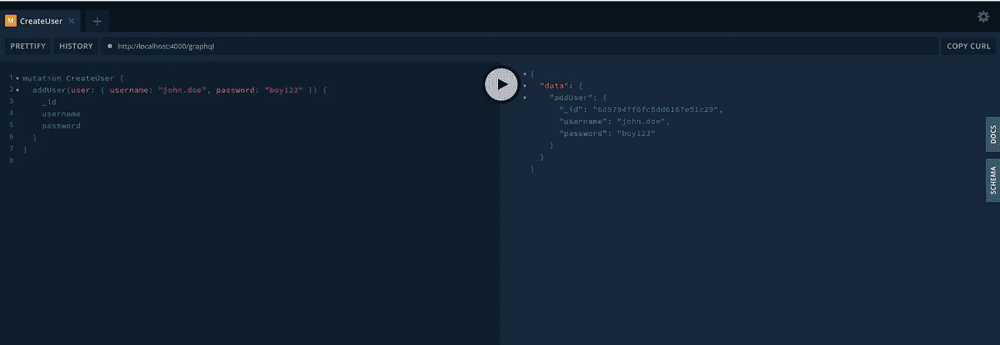
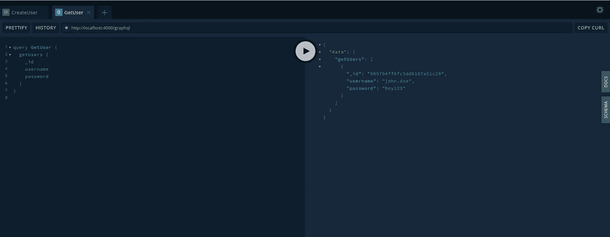
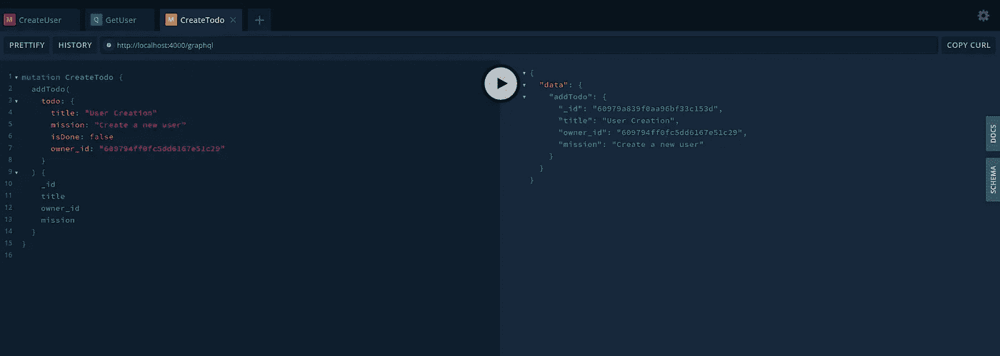
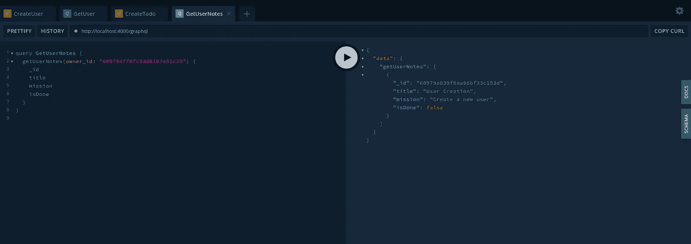
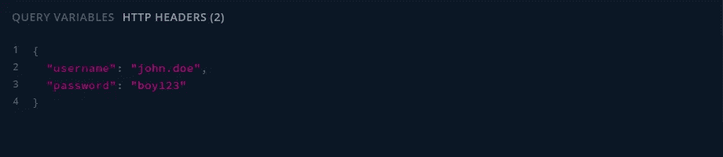
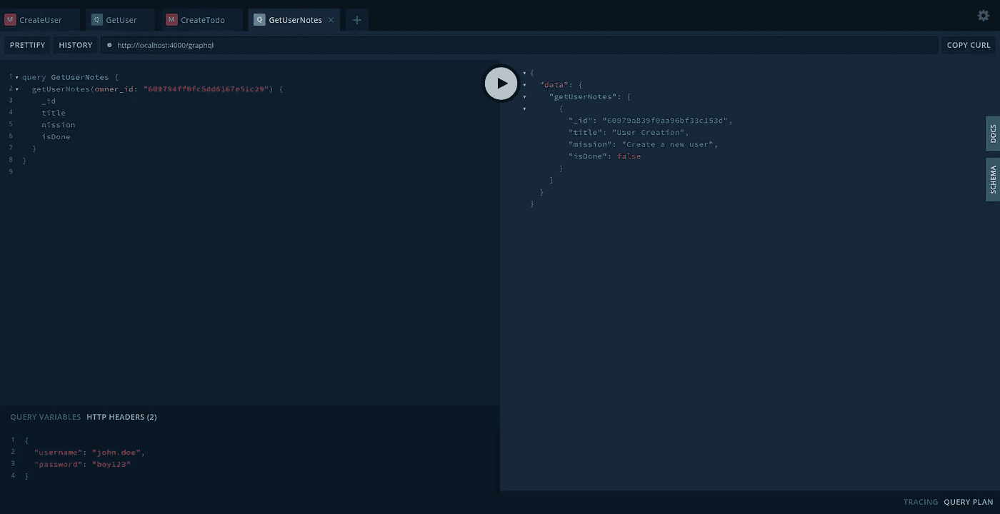

# 使用 GraphQL、Express.js 和 React 的 Todo 应用程序—第 2 集

> 原文：<https://medium.com/nerd-for-tech/todo-app-with-graphql-express-js-react-episode-2-b56167d8c19e?source=collection_archive---------13----------------------->


欢迎光临。在这一集里，我们将为我们的应用添加用户认证和授权功能。这两个概念经常被混淆或互换使用。事实上，认证意味着“识别用户是谁”，而授权意味着“确定用户可以做什么和不可以做什么。”

目前，我们的待办事项列表对每个人都是可用的。为了安全起见，我们希望限制访问，所以任何人都不能向我们的列表添加新任务，也不能更改或删除现有的任务。为了实现这一点，我们将进行一些后端配置，幸运的是，Apollo-server 有一些内置的助手来帮助我们进行用户验证和授权。

好吧，我们摇滚吧！

**用户的模式配置**

我们需要在 GraphQL 模式中进行一些配置，以处理用户操作。为此，我们将创建一个类型、一个输入、一个查询和一个变异定义，以及一个查询函数和一个变异解析器函数。因此，打开 **schmea/typeDefs/index.js** 文件，将这一行写在**查询**类型定义的上方

```
type User {_id: IDusername: Stringpassword: String}input UserInput {username: Stringpassword: String}
```

这种类型的定义将用于用户操作。现在，让我们添加一个查询定义。让我们将下面一行写入**查询**类型:

```
getUsers: [User]
```

并将下面几行添加到**突变:**

```
addUser(user: UserInput): User
```

让我们打开 **resolvers/index.js** 文件，并将这一行写入**查询**对象:

```
getUsers: async (parent, args, context) => await context.models.Todo.queries.getUsers(),
```

然后将这一行添加到**突变**对象:

```
addUser: async (parent, args, context) => await context.models.Todo.mutations.addUser( JSON.parse(JSON.stringify(args.user)) ),
```

现在，打开 **models/index.js** 文件。首先导入我们将在下一部分创建的**用户**模型:

```
import User from "../../db/models/UserModel";
```

并在**中写出这几行查询**对象:

```
getUsers: () => new Promise( async (resolve, reject) => await User.find({}, (err, users) => err ? reject(err) : resolve(users) ) ),
```

并将这些行写入**突变**对象:

```
addUser: (user) => new Promise((resolve, reject) => new User(user).save((err, user) => (err ? reject(err) : resolve(user))) ),
```

嗯，就是这样。我们的模式已经准备好处理基本的用户操作。现在，让我们在数据库中创建一个用户模型。

**用户的数据库配置**

为了理解我们的 GraphQL 配置，我们必须创建一个解析器和类型定义指向的模型。为了实现这些，在 **db/models** 目录下创建一个名为 **UserModel.js** 的文件，并在其中写入以下内容:

```
import mongoose from "mongoose";const userSchema = new mongoose.Schema({ username: { type: String, unique: true }, password: String,},{ timestamps: true });const User = mongoose.model("User", userSchema);export default User;
```

现在，是检验的时候了。打开[HTTP://localhost:4000/graph QL](http://HTTP://localhost:4000/graphql)，这样添加一个用户:



让我们查询我们的第一个用户。就像这样:



在我们确保一切正常后，我们可以用创建者用户的 id 签署 todo 项。

**签署待办事项**

要将用户 id 添加到待办事项中，打开**模式/类型定义**并添加**待办事项**的变更类型和输入定义，如下所示:

```
type Todo {_id: IDtitle: Stringmission: StringcreatedAt: StringupdatedAt: StringisDone: Booleanowner_id: ID}input TodoInput {title: Stringmission: StringisDone: Booleanowner_id: ID!}
```

然后打开 **db/models/TodoModel.js** ，像这样更改模式:

```
const todoSchema = new mongoose.Schema({title: String,mission: String,isDone: Boolean,owner_id: { type: mongoose.SchemaTypes.ObjectId, required: true },},{ timestamps: true });
```

就是这样！当添加待办事项时，我们会添加所需的配置以对其进行签名。我们来测试一下。复制我们的第一个用户的 id 并运行这个突变:



在您的情况下，您很可能需要更改 owner_id。

就是这样。我们刚刚添加了一个新的待办事项，并用我们的用户 id 进行了签名。让我们改变我们的突变，所以根据给定的用户名和密码返回待办事项。为了实现这一点，让我们打开 **schema/models/index.js** 并将该函数添加到**查询**对象，如下所示:

```
getUserNotes: (id) => new Promise( async (resolve, reject) => await Todo.find({ owner_id: id }, (err, notes) => err ? reject(err) : resolve(notes) ) ),
```

并将这些行添加到**schema/resolvers/index . js**文件中的**查询**对象中:

```
getUserNotes: async (parent, args, context) => await context.models.Todo.queries.getUserNotes( JSON.parse(JSON.stringify(args.owner_id)) ),
```

并将这些行添加到**schema/typeDefs/index . js**中的**查询**类型定义中:

```
getUserNotes(owner_id: ID!): [Todo]
```

并运行测试查询:



如果一切正常，让我们进入下一章:要求登录认证。

## 在 Apollo 服务器中要求登录验证

要进行登录验证，打开 **server.js** 并更改**上下文**对象，如下所示:

```
context: ({ req }) => { const username = req?.headers?.username; const password = req?.headers?.password; const user = await validateUser({ username, password }) .then((result) => result) .catch((err) => console.log(err)); return { user, models: {
      user, Todo: generateTodoModel(user), }, };},
```

创建一个名为 **controllers** 的目录，并在其中创建一个名为 **validateUser.js** 的文件。打开 **validateUser.js** 并将这些行写入其中:

```
import User from "../db/models/UserModel";const validateUser = (user) => new Promise( async (resolve, reject) => await User.findOne({ ...user }, (err, user) => err ? reject(err) : user === null ? reject(new Error("User not found")) : resolve(user) ) );export default validateUser;
```

现在，打开**schema/resolvers/index . js**并将 **getUserNotes** 函数更改如下:

```
getUserNotes: async (parent, args, context) => await context.models.Todo.queries.getUserNotes()
```

然后打开 **schema/models/index.js** 文件，给 **generateTodoModel** 函数添加一个**用户**参数:

```
const generateTodoModel = ({user}) => ({
...
```

并更改**查询**对象中的 **getUserNotes** ，就像这样:

```
getUserNotes: () => !user ? null : new Promise( async (resolve, reject) => await Todo.find({ owner_id: user._id }, (err, notes) => err ? reject(err) : resolve(notes) ) ),
```

打开**schema/typeDefs/index . js**并更改 **getUserNotes** 查询定义，如下所示:

```
getUserNotes: [Todo]
```

我们打开[http://localhost:4000/graph QL](http://localhost:4000/graphql)。单击 **GetUserNotes** 查询所在的选项卡，然后单击页面下方的 **HTTP HEADERS** 选项卡，并编写以下几行:



然后运行查询！如果您的屏幕是这样的，那么恭喜您，您已经添加了用户验证和授权:



要使用当前登录用户的 id 自动签署新添加的待办事项，请更改 **addUser** 变体，如下所示。在 **schema/models/index.js** 中这样修改它:

```
addTodo: (todo) => !user ? null : new Promise((resolve, reject) => new Todo( Object.assign({}, { ...todo }, { owner_id: user._id }) ).save((err, todo) => (err ? reject(err) : resolve(todo))) ),
```

…并在**schema/resolvers/index . js**中进行如下更改:

```
addUser: async (parent, args, context) => await context.models.Todo.mutations.addUser( JSON.parse(JSON.stringify(args.user)) ),
```

最后，在**模式/typeDefs/index.js** 中修改输入定义，如下所示:

```
input TodoInput { title: String mission: String isDone: Boolean}
```

# **结论**

用户认证和授权几乎是每个应用程序的核心概念。我试图解释这些概念是如何隐含在阿波罗服务器中的。为了检查其他进一步的配置，您可以克隆 [**repo**](https://github.com/ardaorkin/todo-app-server) **。**

我们将在下一集创建一个带有 React 的 Apollo 客户端。

感谢您的关注。