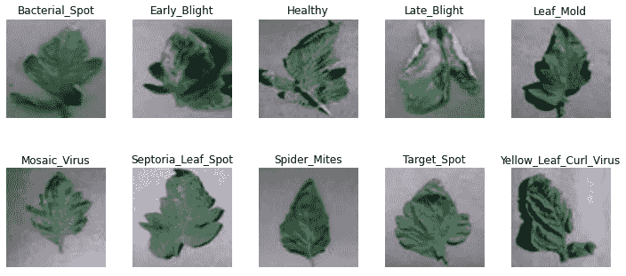
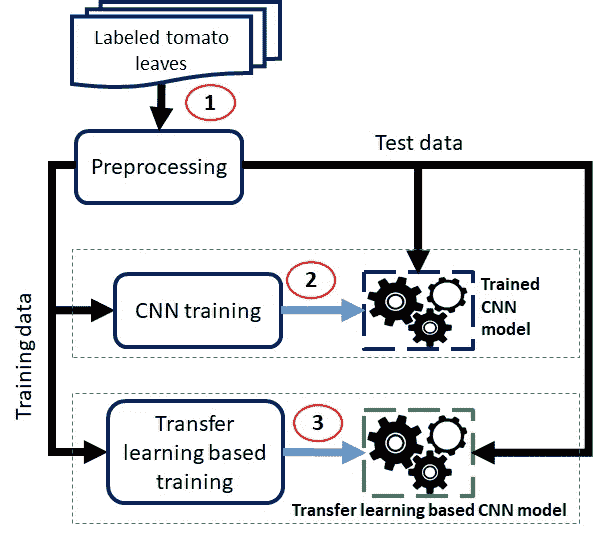
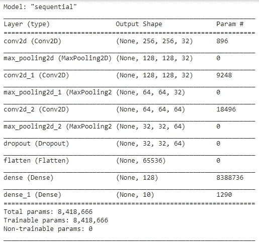
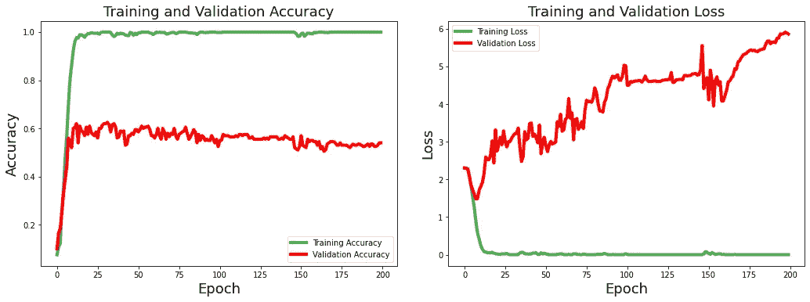
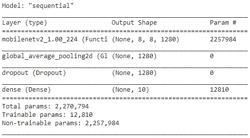
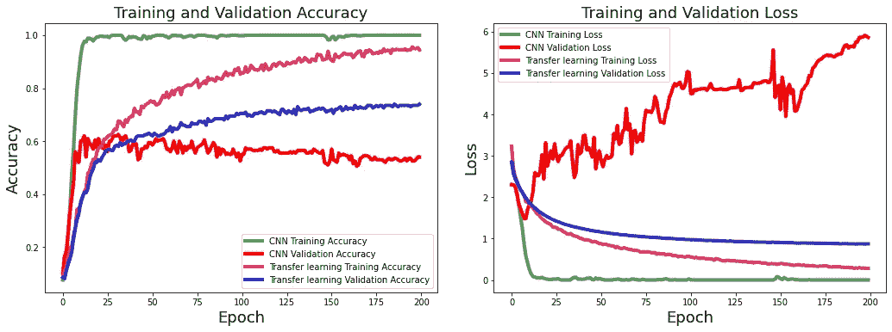
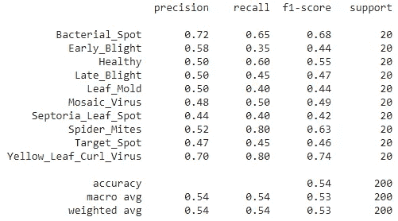
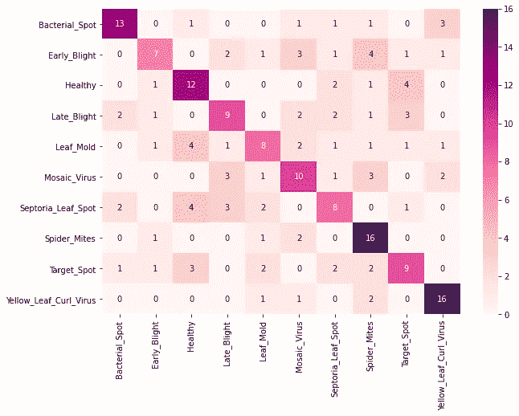
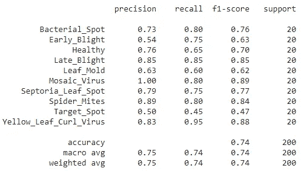
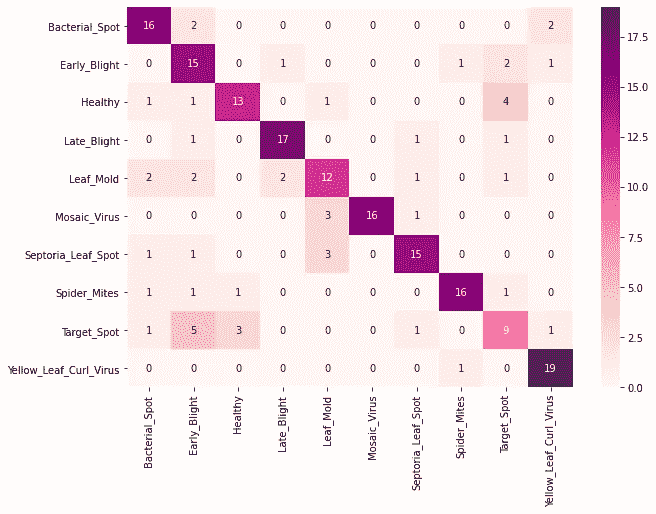

# 基于 CNN 的番茄叶部病害检测

> 原文：<https://medium.com/nerd-for-tech/tomato-plant-leaf-disease-detection-using-cnn-2ee2dd8ab77a?source=collection_archive---------0----------------------->

由 [Kalyani Akella](https://unsplash.com/@mekalluakella?utm_source=medium&utm_medium=referral) 在 [Unsplash](https://unsplash.com?utm_source=medium&utm_medium=referral) 上拍摄的照片

**简介:**在本帖中，我们将讨论番茄植株叶片中的病害检测。通常，植物叶子会遭受各种类型的疾病。在深度学习技术的帮助下，我们可以提供一个检测模型来检测特定的疾病，并采取进一步的行动。我们将应用深度学习算法来创建模型，这些模型可以检测番茄植物叶子中的疾病。在训练模型之后，我们还将分析我们训练的模型的性能。我们还分析了迁移学习对疾病检测的影响。

**数据集:**我们将使用一个公开可用的数据集[番茄植株叶片](https://www.kaggle.com/kaustubhb999/tomatoleaf)，其中包含 10000 个文件。数据集有 10 种均匀分布的疾病。数据集包含以下病害:细菌性斑点病、健康病、早疫病、叶霉病、晚疫病、葡萄斑病、花叶病毒、叶螨、目标斑病、黄化卷叶病毒。我们只使用每一类疾病的 100 份档案。您可以使用完整大小的数据集进行实验。

图 01 树叶示例

**流程图:**图 02 显示了我们的休假疾病检测任务方法的概述。我们将详细讨论每个阶段。我们训练两种类型的深度学习模型，从数据中探索和获得洞察力。

图 02 工艺流程

1.  **预处理:**我们应用一般的图像预处理步骤来生成训练和测试数据。每个图像的大小为(256，256，3)。
2.  **基本 CNN 模型训练:**在对数据进行预处理后，我们创建了我们的第一个深度学习模型。我们构建了一个具有所需输入和输出单元的卷积神经网络模型。我们的 CNN 模型的最终架构如图 3 所示。

图 03 模型架构

我们用 Adam optimizer 以 0.0001 的学习率训练我们的 CNN 模型 500 个时期。我们使用分类交叉熵作为损失函数。图 04 显示了精度方面的训练和验证损失以及模型性能。

图 04 培训和验证性能

**3。基于迁移学习的模型训练:**我们每种体裁只有 80 个样本进行训练。在这种情况下，迁移学习可能是一个有用的选择，以提高我们的 CNN 模型的性能。现在，我们使用预先训练好的 mobilenet 模型来训练 CNN 模型。原理图见图 05。基于迁移学习的模型使用与先前模型中使用的相同设置进行训练。

图 05。迁移学习模型架构

图 06 显示了两种模型的损耗和性能对比分析。如果我们分析模型的训练行为，我们发现基本 CNN 模型在训练和测试数据的损失值和性能分数方面有很大的波动。基于迁移学习的模型表现出较小的性能差异。与基本 CNN 模型相比，迁移学习模型的性能逐渐提高。验证损失值在 20 个时期后突然上升。另一方面，另一种迁移学习模式的验证损失不断减少。

图 06 培训和验证性能比较

**测试模型**

在训练我们的模型之后，我们在 20%的测试数据上测试每个模型。我们计算每种疾病(类别)的精确度、召回率和 F 分数。我们的数据集是平衡的；因此，精度、召回率和 F 值的宏观平均值和加权平均值是相同的。

**基本 CNN 模型:**图 07 展示了我们的 CNN 模型对测试数据的结果。CNN 模型能够以最高的 F1 值对“黄化曲叶病毒”病害进行分类。CNN 对“Septoria_Leaf_Spot”和“Leaf_Mold”疾病的表现最差。图 08 显示了 CNN 模型对测试数据的混淆矩阵。

图 07 基本 CNN 模型在测试数据上的表现

图 08 基本 CNN 模型的混淆矩阵

**基于迁移学习的模型:**我们使用迁移学习技术来改善疾病的表现。图 09 展示了基于迁移学习模型的测试数据的结果。由于迁移学习,“黑斑病”和“叶霉病”疾病的 F1 分数增加。如果我们从整体结果来看，我们在应用迁移学习后取得了很大的进步。F-1 平均得分增加了 20%。图 10 显示了测试数据上迁移学习模型的混淆矩阵。

图 09。测试数据上的迁移学习模型性能

图 10 迁移学习模型的混淆矩阵

在这篇文章中，我们使用深度学习技术进行了番茄叶病检测。基于迁移学习的模型表现最好。我们使用 Keras 框架在 google Collaboratory 平台上实现。源代码可从以下 GitHub 链接获得:[https://GitHub . com/sawan 16/Tomato-Plant-leaf-Disease-detection](https://github.com/sawan16/Tomato-Plant-Leave-Disease-detection)

谢谢你。