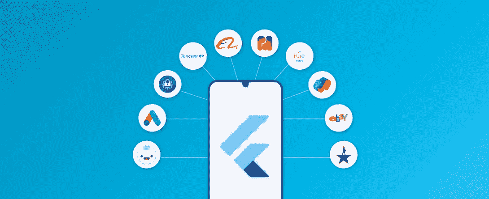
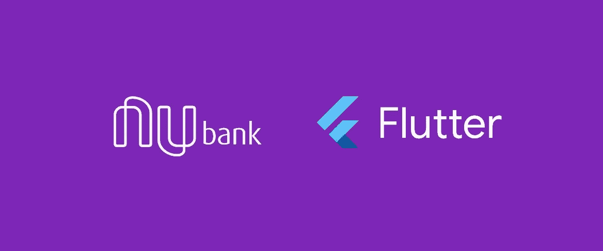
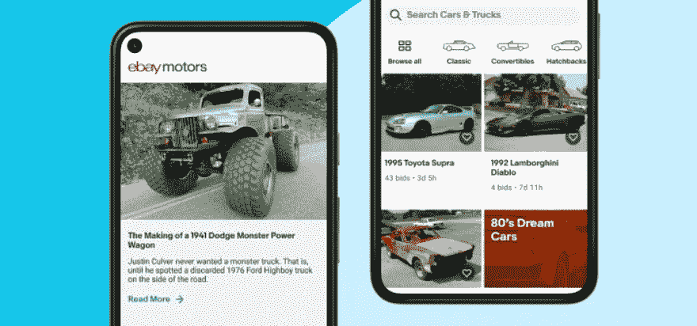
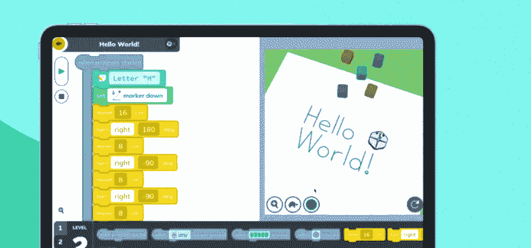
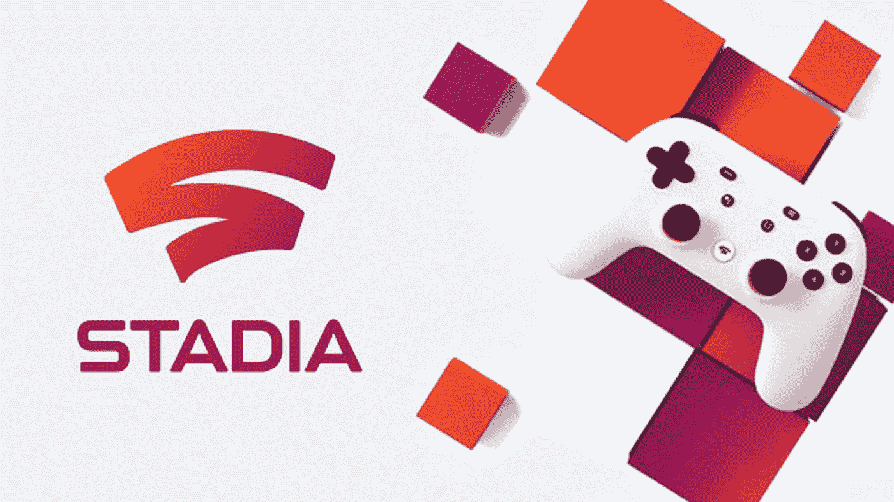

# 由 Flutter 开发的十大应用

> 原文：<https://medium.com/nerd-for-tech/top-10-applications-made-by-flutter-81ec4ecfba05?source=collection_archive---------0----------------------->

## 这里我们讨论一些由 Flutter 开发的应用程序

当 Flutter 应用程序开发在 2015 年 Dart 开发者峰会上首次亮相时，没有人能够想象它会随着时间的推移而获得巨大的人气。

它是一个开源的 UI 软件开发包，由 Google 创建，由社区维护。作为一个跨平台的应用程序，它可以为各种平台开发，包括 Web、Android、iOS、Linux、Windows、Mac 和 Google Fuchsia(Google 开发的操作系统)。

在推出的前三年内，它已经实现了许多里程碑，并被世界知名公司采用，如

# 我的宝马

**我的宝马**(使用 Flutter 扩展宝马以客户为中心的产品开发)

宝马正在开发和推出我的宝马应用程序。2020 年 7 月，智能手机和车辆之间的这一关键接口亮相。目前已在 30 个欧洲市场、中国和韩国上市，还将在日本、澳大利亚和其他 10 个国家上市。从 4 月中旬开始,“我的宝马”应用程序也将在美国和加拿大推出。一个可扩展的通用软件架构推动了 My BMW 应用程序内容的快速扩展和快速推广。

这是宝马使用 Flutter 在内部完全开发的，Flutter 是谷歌为 Dart 编程语言开发的开源 UI 开发包。宝马集团的 Flutter/Dart 开发团队是继谷歌之后世界上最大的团队之一，共有 300 名员工。

**结果:-** 它还改善了用户反馈，特别是对于历史上服务不足的 Android 应用程序，所有宝马和 MINI 客户现在在所有平台上都有单一的体验。通过切换到 Flutter，团队能够更快地行动，保持一致性，并取悦用户。

> **“新的应用平台建立在三个支柱之上:用户友好性、安全性和可靠性。它根据反馈和客户的使用行为，为所有品牌提供了一套设计一致的功能。”**
> 
> 宝马集团非车载平台副总裁尼古拉·克雷默博士

# **Google Pay**

**Google Pay** (Flutter 将随着 Google Pay **走向全球)**

在印度，谷歌支付(Google Pay)于三年前推出，当地语言称之为 Tez。在印度，成千上万的企业和用户使用它作为最受欢迎的支付服务之一。

根据[谷歌官方博客](https://developers.googleblog.com/2020/09/google-pay-picks-flutter-to-drive-its.html)的说法，他们选择了 Flutter，理由是这三件大事:

*   在 Dart 中编写一次，并在 iOS 和 Android 上部署，以获得统一的一流体验
*   具有热重新加载特性的实时编译器，可提高开发人员的效率并加快用户界面的更改
*   提前编译确保了高性能部署

该公司选择 Flutter 是因为其跨平台能力和统一的体验。Flutter 应用程序是用 Dart 编写的，利用该语言的最佳特性使应用程序开发更容易、更快、更高效。当你在 Android 和 iOS 上使用提前编译功能时，进行在线支付变得非常容易，因为它会生成针对机器优化的代码。除了性能优势之外，提前编译还简化了部署，因为它生成了机器优化的代码。

**结果:-** Flutter 将帮助谷歌支付 3.0 跨 iOS 和 Android 快速高效地扩展。这将使 Google Pay 今年在美国的大规模重启成为可能。这项技术的基础为该团队提供了一个平台，以便在 2021 年将 Google Pay 3.0 扩展到全球。

> **“每个人都喜欢 Flutter——当人们谈论构建用户界面有多快时，你可以看到他们脸上的兴奋。”**
> 
> Google Pay 工程总监 David Ko

# **努班克**

**Nubank** (使用 Flutter 来缩放具有完整性的 Nubank)

它是亚洲以外最大的独立数字银行，为超过 4800 万人提供了一种安全、易用的理财方式。他们的目标是通过使用云技术和简化的用户界面来简化普通人的银行业务。

根据这五个因素，团队根据一组明确定义的优先级对选项进行了评估:

1.开发人员体验:它能让开发人员交付价值并更有效率吗？

2.长期生存能力:从长远来看，平台会得到其创造者的支持吗？

3.没有平台专门化:代码在 Android 和 iOS 上的外观和行为是否相同，特定于操作系统的问题发生率是否很低？

4.增量抽象成本:扩展平台和添加新组件有多难？

5.非线性抽象风险:他们需要对整个代码库进行重要的修改来支持新的组件吗？

**结果:-** Flutter 已经成为 Nubank 的[游戏规则改变者，允许他们继续扩大规模而不牺牲质量。除了提高开发人员的工作效率，许多工程师已经过渡到全栈开发。由于 Flutter 入职流程的简单性，新工程师在入职后几天内就可以开始工作。非移动工程师只需几周时间就能变得高效。](https://building.nubank.com.br/scaling-with-flutter/)

> ***“将 Flutter 作为我们的主要技术极大地降低了障碍，让新工程师能够在入职后几天内为我们的应用做出贡献。”***
> 
> - Noe Branagan，Nubank 工程经理

# **易贝**

**易贝**(让易贝的工程师对颤振感到高兴)

根据易贝汽车公司网站
的消息，2018 年 12 月，我们的团队被要求开发一种新的 Android 和 iOS 体验，用于在易贝上买卖车辆，以满足汽车爱好者的需求。我们被赋予了研究、设计和开发易贝汽车应用程序的自主权。然而，我们需要在不到一年的时间里从概念到两个应用商店，它必须包括现有易贝用户已经开始期待的功能集。这个机会让我们既兴奋又有点害怕，我们希望超越预期。

Flutter 使我们能够比预期更快地解决有趣的问题。为 iOS 和 Android 开发要容易得多，我们能够创造一致的用户体验。为了制造高质量的产品，我们知道自动化测试是至关重要的。在我们见过的最好的测试故事中， **Flutter** 是最好的之一。达到我们目标的最快方法是使用 Flutter，因为我们已经用它工作了几个星期。

**结果:-** 为了按时完成生产计划，易贝汽车团队大幅缩短了开发时间。在最初的请求三个月后，发布了一个测试版本，随后是一个完整的生产版本。

此外，新的易贝汽车应用程序从用户那里获得了巨大的反馈，开发者也很喜欢它。根据一项调查，在易贝汽车公司的开发者中，100%的人说 Flutter 的开发速度“至少是 iOS 和 Android 的两倍”。
根据易贝汽车公司工程团队的说法，Flutter 所做的不仅仅是改进其工作流程。结果，由于这种变化，团队不仅更有效率，而且对他们所做的工作更开心、更有热情。

> ***“Flutter 不仅满足了我们的期望，还大大超出了我们的期望。”***
> 
> -易贝 iOS 高级工程师 Corey Sprague

# 金托安达尔

**QuintoAndar** (在有颤动的 QuintoAndar 上实现特征对等)

QuintoAndar 最近决定使用 **Flutter** 作为它的标准移动开发框架！在内部使用这项技术，我们将从市场上雇佣具有这些技能的人，使用这项技术推出越来越多的功能，并重写其他功能，以便我们可以维护更易于维护的移动代码库。
最初，他们在 Flutter 中开发了一个具有本机外观和感觉的 Android 应用程序。一个 appbot 工具被用来监控与原始 TWA 版本相比的新颤振版本的分阶段推出的结果。在他们向 50%的用户群发布了 Flutter 版本后，结果很明显——Flutter 版本的评分和评论明显比以前更积极，这让 QuintoAndar 有信心向他们的整个用户群推出新应用。

在他们发布了 Flutter 版本后，QuintoAndar 的收视率飙升。在过去的五个月里，他们的应用程序的评分从 3.8 增加到 4.5，这已经有一段时间了。

**结果:-** 与此同时，QuintoAndar 在 Flutter 上全力以赴，投资培训了超过 35 名新的 Flutter 开发人员，创建了一个内部培训课程，甚至推出了一个导师计划。在更有经验的 Flutter 开发人员的监督下，新开发人员将获得实践学习机会，为公司提供真正的价值。Flutter 让 QuintoAndar 的所有开发人员有机会采取主动，为他们的客户解决问题，不管他们可能在什么平台上。

> ***“Flutter 让我们保持自主团队的文化，在整个产品开发过程中拥有他们提供的功能，同时为我们的移动用户提供出色的体验。”***
> 
> - Augusto Souza，QuintoAndar 高级软件工程经理

# iRobot

iRobot (iRobot 使用 Flutter 来扩展对编码的访问)

从单一代码库，开发人员可以用 Flutter 创建漂亮的移动、web 和桌面应用程序。Flutter 的多功能性和强大功能在 iRobot 创造的创新教育体验中显而易见”，Flutter 和 Dart 产品经理 Tim Sneath 说道。由于他们流行的教育编码环境的新扩展，我们很高兴看到它扩展到包括 Chromebooks 等网络设备，为全球新一代开发人员提供访问权限。

**成绩:-** iRobot 编码 App 与 Flutter 一起在 170 个国家和三大平台上线，月活跃用户数翻了两番。由于该应用程序更容易维护，该团队目前正专注于在三个平台上推出新功能，包括 3D 模拟器环境。iRobot 教育工程团队现在包括 2 名全职 Flutter 开发人员，帮助他们维护和开发未来的新功能。

> ***“有了 Flutter，我们可以用一两个开发人员完成其他团队需要 10 到 20 个人才能完成的事情！”***
> 
> -Julián da Silva Gillig，iRobot 教育公司首席软件开发员

# 丰田汽车

**丰田**(通过 Flutter，丰田改进了其信息娱乐系统)

丰田目前正在使用 [Flutter 的嵌入式 API](https://flutter.dev/embedded) 来开发其基于 Linux 的信息娱乐系统。由于颤振引擎是交叉编译和封装在一个嵌入器中，它可以很容易地嵌入到任何需要的地方。

使用 Dart 和 Flutter SDK 软件设计，丰田已经创建了几个内部工具来改进其开发过程。Flutter 的声明式 UI 和“代码即配置”允许团队创建设计工具，生成代码来立即运行和验证软件，而不会混淆中间层。

**结果:-** Flutter 的开源原则和开发者社区对丰田的成功至关重要。该团队归功于 Flutter 庞大而开放的生态系统帮助他们实现了目标，他们期待在未来的丰田汽车中推出他们的新信息娱乐系统。

> ***“Flutter 的开源原则和高速发展的开发者社区对我们的成功至关重要。”***
> 
> -丹尼尔·霍尔，丰田汽车北美公司首席工程师

# **超新星**

**supernova** (开发者和设计师使用 Flutter 构建 supernova，一个设计系统平台)

Flutter 早期采用者计划于 2019 年宣布，面向准备利用 Flutter 的网络支持进行建设的公司。Supernova 是早期采用者之一，它对将 Flutter 用于基于 web 的协作设计系统很感兴趣。
Supernova 最初的 MacOS 版本被创建，但用户对基于 web 的版本感兴趣。由于该工具计算量非常大，并且比大多数网站有更苛刻的性能要求，因此 Flutter 对团队很有吸引力，因为它允许他们在其他平台上用单一代码库推出他们的工具。

该工具还使用了许多不常见的可视化操作，他们喜欢 Flutter 为他们提供了一种访问低层渲染引擎的方法，这样他们就可以用自己的方式构建它，而不是使用 WebGL 从头开始构建。

该团队发现，将特定于 web 的库与 Dart 结合使用可以为他们节省大量时间。少数时候，他们需要一个缺乏网络支持的插件，比如他们的代码预览窗口小部件，他们将其嵌入为 HTML，并使用 JavaScript 库来突出显示语法。

**结果:-** 加入早期接入计划两年后，Supernova 推出了其创新设计系统平台 Flutter。任何人现在都可以将他们的 Figma 设计引入 Supernova，并立即开始为 Flutter(或任何其他框架)导出代码。Supernova 的文档编辑器允许您基于您的设计系统创建文档，并包括一个自动化引擎，当设计发生变化时，它会自动更新您的文档和代码。

> “我们对在网络上使用 Flutter 的决定充满信心。”
> 
> supernova 首席执行官 Jiří Třečák 或首席技术官阿尔特姆·乌菲姆采夫

# 视距

**Stadia** (在 Stadia with Flutter 设计无缝用户体验)

有了 Stadia，任何人都可以使用他们已经拥有的硬件轻松进入游戏。Stadia 还提供了一种可定制的控制器，可在笔记本电脑、台式机、平板电脑、手机和电视上为想要更高级游戏体验的游戏玩家工作。

使用 **Flutter** 来改进 Stadia 的控制器设置是显而易见的，因为 Stadia 已经用它编写了他们的智能手机应用程序。

通过 Flutter，他们已经成为一个更高效的团队，开发和迭代更快，并且更加关注用户体验。除了简化移动开发之外，Flutter 还能够增加子团队之间的交流，并减少发布前的个人请求。此外，他们能够为 iOS 和 Android 提供 50 万行代码的 Stadia。

**结果:-** 尽管是 Stadia 应用程序中极其复杂的一部分，但 Flutter 允许 Stadia 只用一个小团队编写和维护 Stadia 控制器设置流程。使用 Flutter 使开发人员的工作效率提高了 2 倍，并且由于热重装，开发周期大大加快。

Stadia 改进了设置流程，大多数人不到一分钟就能设置好控制器。

在建立了移动应用程序和 Stadia 控制器之后，该团队现在正在考虑用 Flutter 开发桌面、电视和网络体验。

> -尼克·斯帕克斯，Stadia 公司的软件工程师

# 字节跳动

**字节跳动**(通过颤振将字节跳动的生产率提高了 33%)

字节跳动的团队不得不在 2019 年创建许多跨多个平台的应用程序。一个更有效的工具包将简化他们的方法，并节省他们现有解决方案的时间，现有解决方案涉及大量重复工作。

字节跳动定制了 Flutter 的开源框架来满足他们的需求——Flutter 团队受益于他们的优化。由于他们的贡献，Flutter 通过创建应用程序框架、容器化、提高性能和支持附加应用程序，为所有用户带来了改进。

在字节跳动的第一次真实世界测试中实现了笔画跟踪功能，以提高使用 Flutter 学习汉字的能力。为了表示笔画，他们使用了基于一些开源项目的 SVG 路径。一系列平台现在都支持这一功能，该功能是用 Flutter 构建的，支持超过 9000 个汉字。

**结果:-** 在字节跳动，Flutter 现在是开发多平台应用的首选框架。由于 Flutter，一个工作效率提高了 33%的用户团队一直在开发旗舰应用程序，如幸福里、纪可、大数据、小河、火山和西瓜视频。截至今天，在字节跳动，有超过 700 名颤振开发者，而积极参与其中的颤振开发者人数超过 200 人。除了移动应用，该团队还使用 Flutter 来优化网站、桌面和嵌入式平台的应用。

> ***“字节跳动一直希望成为推动行业发展的一份子，而 Flutter 很可能就是其中之一。”***

除了这些，还有很多其他可以用 Flutter 制作的 app。许多专家认为，Flutter 掌握着移动应用程序开发的命运，因为它有潜力创建尖端应用程序。
除了提供一致的性能，它还降低了向市场交付项目的成本。

有许多行业喜欢 Flutter，因为它能够在不同的平台上运行，并且不同的平台都兼容它。这些行业包括时尚、娱乐、健康和健身等。开发 Flutter 应用程序的好处是无限的。

虽然 Flutter 仍然是一个相对较新的应用程序开发框架，但该框架正在许多应用程序中使用。Flutter 已经在 Android 和 iOS 应用程序开发中成功实现，适用于小型项目、初创公司和大品牌。

这就是著名的 Flutter 应用程序的所有信息，我想简单描述一下。如果你发现任何错误的信息或错误的更正，请在下面指出或评论。

如果你做错了什么？请在评论中提及。我很想进步。
我是**希尔什·舒克拉**。创意开发人员和技术爱好者。你可以在上找到我

**YouTube:**[https://3c5.com/3gbzm](https://www.youtube.com/channel/UCbBdLnqrcnTU4IN3QmkDdIw)

**推特:**[https://mobile.twitter.com/shirsh94?s=09](https://mobile.twitter.com/shirsh94?s=09)

**领英:**[https://www.linkedin.com/in/shirsh-shukla-95b85786](https://www.linkedin.com/in/shirsh-shukla-95b85786)

**斯塔克韦尔弗洛:**[https://stackoverflow.com/users/13098417/shirsh-shukla](https://stackoverflow.com/users/13098417/shirsh-shukla)

**投资组合:**【https://shirsh94.github.io/shirsh-portfolio.github.io/】T2

了解更多详情。

祝您愉快！🙂