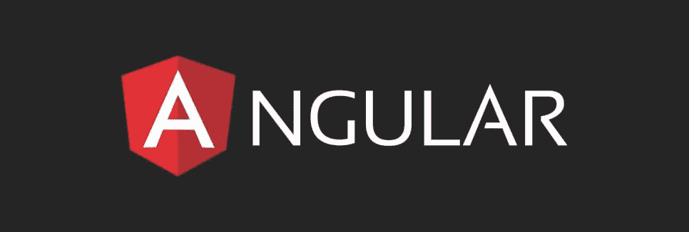
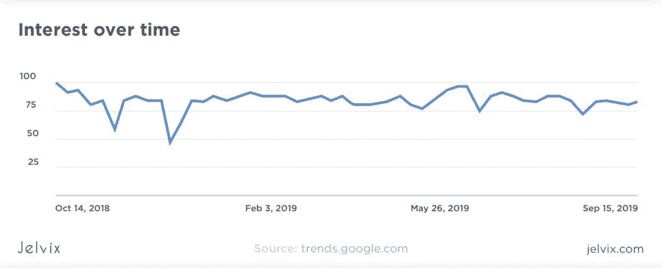
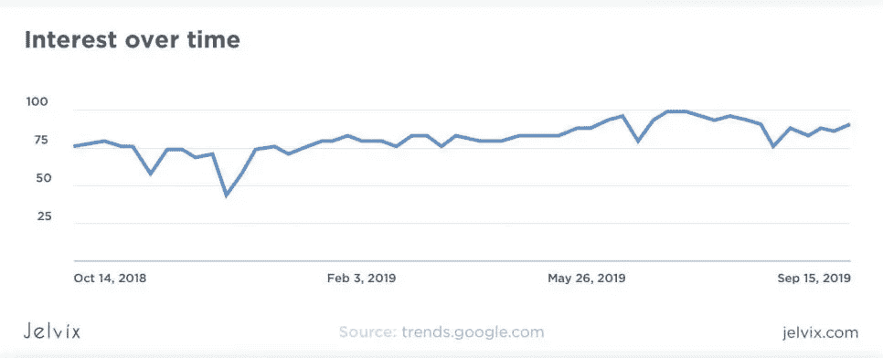
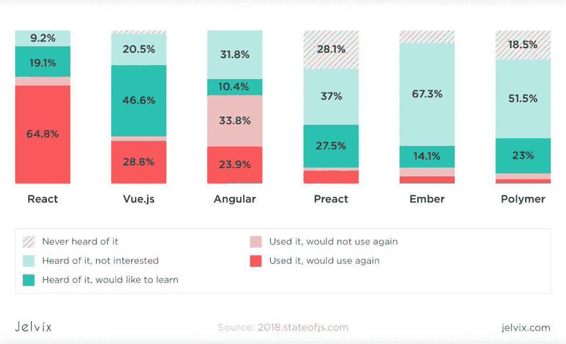
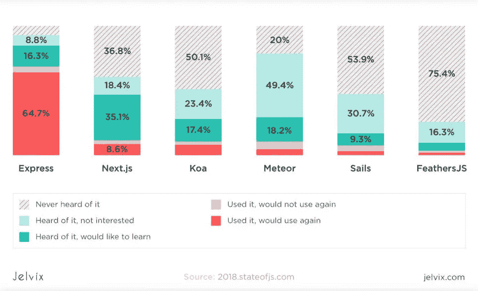
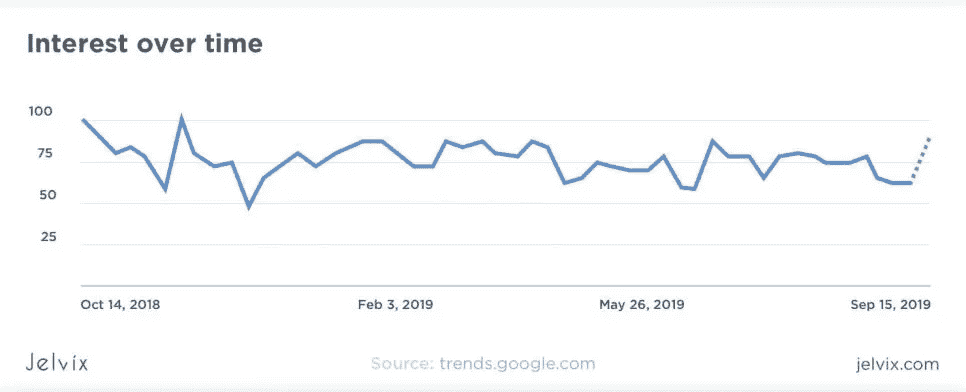
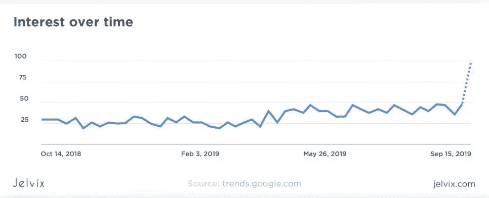
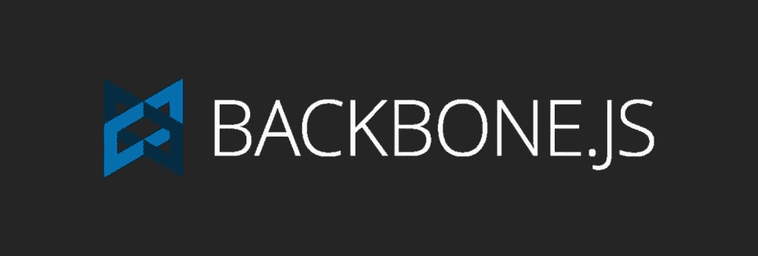
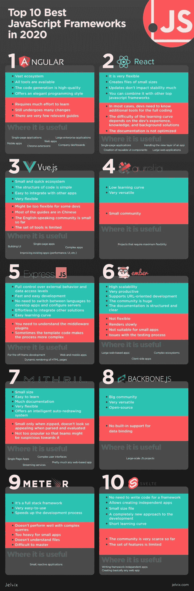

# 十大最佳 JavaScript 框架

> 原文：<https://medium.com/nerd-for-tech/top-10-best-javascript-frameworks-6ba6f84873a0?source=collection_archive---------2----------------------->

许多开发人员声称，在未来，与框架无关的组件将统治世界。这种倾向很容易理解。即使是最好的 JavaScript 框架也迫使开发者服从特定的标准。没有人喜欢被限制，尽管有时候限制会非常有用。这些组件将开发过程从 JavaScript web 框架导致的疲劳中解放出来。所以，开发者为他们加油是可以预见的。

然而，我们现在仍然处于现在，这些组件远不是开发过程中最重要的部分。因此，JS 框架将会伴随我们很长一段时间。今天有一百多种，但只有 10 种值得关注。因此，看看目前的情况，并尝试预测哪些 [JavaScript 框架](https://jelvix.com/blog/most-used-javascript-frameworks)将在 2021 年受到开发者的青睐，将会很有帮助。

在我们深入 2021 年最佳 JavaScript 框架列表之前，让我们先搞清楚一件事。我们不打算在这里决定谁是赢家，也不打算比较各种技术，试图了解哪一种更好，为什么。我们将后退一步，看看更大的图景。你可能会问为什么？因为技术是最适合特定任务的解决方案。如果我们声称有最好的 JS 框架，那将是相当大胆的。

看不断变化的市场份额和趋势更符合逻辑。这就是我们根据技术的使用和流行程度创建 JS 框架评级的原因。当然，我们将突出它们各自的利弊。此外，我们还将强调诸如易于采用、使用案例、灵活性和性能等特性。然后，您就可以毫不费力地确定哪一个最流行的 JavaScript 框架适合您当前的项目。

我们无法判断五年后哪种技术将统治软件开发行业。但是根据目前的趋势，我们可以假设哪些将继续成为 2021 年的顶级 JavaScript 框架。

# 1.有角的

最新版本 Angular 8 于 2019 年 5 月在[与世界见面。它被认为是开发单页面应用程序的顶级 JavaScript 框架。](https://angular.io/guide/releases) [Angular](https://angular.io/) 提供了所有必要的功能，由于谷歌是其背后的支持者，因此很容易信任这项技术。

今天，了解 Angular 的开发人员找工作不成问题。他们每小时的平均报酬是 59.22 美元。因此，如果我们不答应你不要在这里挑选获胜者，我们可以将 Angular.js 命名为 2021 年最佳 js 框架。

然而，它也有不利的一面。学习起来相当有挑战性。虽然您不需要掌握任何额外的 JavaScript 库，但学习曲线相当长。自从谷歌推出第一个版本以来，Angular 发生了很大的变化。你可以在网上找到的大多数教程和案例都是关于早期版本的。你将无法将这些知识应用到最新版本中。

一些开发者声称 Angular 正在消亡，因为许多专家最近对它抱怨很多。但是可以肯定的是，至少在几年内，它仍将是最好的 JavaScript 框架之一。新的改进使它变得更好！

也就是说，Angular 9 预计将于 2019 年底到来。据说新版本改进了捆绑包的大小，这是以前版本影响下载时间的常见问题。

**优点:**

*   巨大的生态系统
*   所有工具都可用
*   代码生成是高质量的
*   提供优雅的编程风格

**缺点:**

*   需要很大的努力去学习
*   仍然经历许多变化

**角度有用的地方:**

*   单页应用程序
*   移动应用
*   网络应用
*   Chrome 扩展
*   大型企业应用程序
*   公司仪表板

# 2.反应

这是另一个科技巨头的顶级 JS 框架。脸书在六年前发布了 [React](https://reactjs.org/) ，而最新版本才刚刚推出几个月。它与 Angular 非常相似，但是最近，它几乎在所有方面都超过了 Google 框架。它更灵活，需要的资源更少，更新不会使它太不稳定。如果需要，您可以将 React 与其他库结合使用。

现在，大多数开发公司希望他们的开发人员知道 React。这里的专家平均每小时工资要高一点。因此，很明显，它在 2021 年仍将是最受欢迎的 JavaScript 框架之一。

当然，它之所以被广泛使用，部分是因为 Airbnb 和 Twitter 的核心都有它。但是，如果您记得脸书管理这些服务的功能和稳定性，这将会有所帮助。那么为什么这家公司要使用别人发布的框架呢？

**优点:**

*   它非常灵活
*   创建小文件
*   更新对稳定性影响不大
*   您可以将它与其他顶级 JavaScript 框架结合使用

**缺点:**

*   在大多数情况下，开发人员需要知道完整编码的附加工具
*   学习曲线的难度取决于开发人员的经验、知识和背景解决方案
*   文档没有优化

【React 有用的地方:

*   单页应用程序
*   处理应用程序的视图层
*   创建可重用的 UI 组件
*   大型 web 应用程序

# 3.某视频剪辑软件

这个框架早在 2014 年就出现在开发行业，但出于某种原因，它现在才流行起来。大概是因为它的中国血统，以前没那么出名吧。在中国，许多开发者使用它，而西方开发者才刚刚开始掌握这项技术。

这是毫不费力的，并创建小文件。它的架构很容易应用，一步一步的实现使得开发过程更加容易。最棒的是，你可以将一款基于 Vue 的应用与另一款解决方案相结合，创造出新产品。此外，它还提供了实现的虚拟 DOM。

[Vue](https://vuejs.org/) 几乎吸取了 JS 框架的精华，并将其混合在一种技术中。虽然它比其他的更灵活，但它也是一个缺点。当没有任何结构或限制时，不是每个开发人员都能感到舒适。我们最近也比较了 [Vue 和其他 JS 框架](https://jelvix.com/blog/vue-vs-ember-how-to-choose-the-most-suitable-framework)。

Vue 开发者每小时可以得到的平均报酬。这比反应开发者得到的要低一点，但是仍然很好。西方世界对 Vue 专家的需求也在增长。

**优点:**

*   小型快速生态系统
*   代码的结构很简单
*   易于与其他应用程序集成
*   非常灵活

**缺点:**

*   对某些开发者来说可能太灵活了
*   大多数指南都是中文的
*   到目前为止，说英语的社区还很小
*   这套工具是有限的

**Vue 有用的地方:**

*   构建用户界面
*   单页应用程序
*   改进现有应用(性能、用户界面等。)
*   复杂的应用

# 4.快递. js

Javascript State 进行的研究表明，大多数尝试过使用 [Express.js](https://expressjs.com/) 的受访者会再次使用它。他们喜欢这项技术的易用性和灵活性。此外，它还提供了高性能。

虽然这个框架仍然相当简单，但它提供了开发人员创建 web 和移动应用程序所需的所有工具。特别是对于基于节点的 web 应用，Express.js 保证了快速开发。此外，使用它，开发人员可以设置中间件来响应 HTTP 请求并动态呈现 HTML 页面。

Express.js 开发人员和其他专家挣得一样多——平均每小时 58.97 美元。所以这是一个非常有用的框架。快递专业人员在不久的将来不会缺少工作，因为对他们技能的需求很高。

**优点:**

*   完全控制外部行为和数据访问级别
*   快速简单的开发
*   无需在语言之间切换来开发应用程序和配置服务器
*   轻松集成其他解决方案
*   简单学习曲线

**缺点:**

*   您需要理解中间件插件
*   有时模板代码会使过程变得更加复杂

**express . js 有用的地方:**

*   对于框架外开发
*   Web 应用程序，REST API
*   HTML 页面的动态呈现

# 5.Ember.js

这是最古老的框架之一，将在 2021 年继续流行，因为许多开发者仍然习惯于它。Ember 非常适合开发复杂的应用程序，部分原因是它组织严密。在大型应用程序上工作很容易出错——太多的变量和代码会造成混乱。但是 Ember 会阻止这一切发生。

这个框架允许处理大型生态系统，并在不损害其余数据的情况下更改其中的一部分。Ember 非常稳定，启动迅速。但是它没有那么灵活。而且不是很容易掌握。然而，大社区是有帮助的。

即使 Ember 已经相当老了，但是对了解这个框架的开发者的要求还是相当高的。对它的兴趣不会很快消失。平均来说，一个能与 Ember 一起工作的开发人员每小时将获得 58.97 美元。

**优点:**

*   高可扩展性
*   非常多产
*   支持面向 URL 的开发
*   这个社区很大
*   文档结构清晰

**缺点:**

*   不灵活
*   渲染缓慢
*   不适合小型应用
*   测试过程中的问题

**ember . js 有用的地方:**

*   基于网络的大型应用
*   复杂的生态系统
*   客户端应用程序

# 6.秘银

这个客户端框架小巧而快速。它提供开箱即用的路由和 XHR 实用程序，非常适合开发 spa。另外，它不依赖于其他库。Mithril 拥有大量手工制作的文档，其中充满了有价值的代码示例。它不会将开发人员锁定在严格的模式中。相反，它提供了开发人员可以遵循的惯用模式，以及在需要时可以帮助他们的工具。

随着 2021 年的临近，对 Mithril devs 的需求似乎在增长。因此，尽管它可能不像列表中的其他框架那样受欢迎，但我们预计它将在明年被广泛使用。

**优点:**

*   小尺寸
*   简单易学
*   很多文件
*   非常灵活
*   提供智能自动重绘系统

**缺点:**

*   只有压缩时才小，解析和评估时看起来不那么吸引人
*   不太受欢迎，因此团队可能会对此产生怀疑

**秘银在哪里有用:**

*   单页应用程序
*   复杂的用户界面
*   流媒体服务
*   几乎任何基于网络的应用程序

# 7.苗条的

这是一项将在 2021 年成为顶级 JavaScript 框架的技术。现在还不太出名，但是很有前途。它的想法是[苗条的](https://svelte.dev/)将是开发者创建代码所需的唯一工具。而一旦 app 准备好了，就可以脱离 Svelte 独立存在了。如果开发人员需要进行编辑，他们可以应用这个框架。

因此，开发人员可以花费更少的时间和精力来创建一个应用程序。例如，React 需要你为应用程序和框架本身编写代码，而 Svelte 给了你自由。使用这种技术，你只需要为一个应用程序编写代码。因此，代码更短，文件更小。

这种独特的方法让这个框架有机会成为 2021 年最常用的技术之一。专家建议开发人员开始研究苗条身材，以便在下一年，他们成为这项技术的先驱。

**优点:**

*   无需为框架编写代码
*   允许创建独立的应用程序
*   小文件
*   一种全新的发展方式
*   短学习曲线

**缺点:**

*   到目前为止，社区非常稀少
*   功能集是有限的

**哪里苗条有用:**

*   编写独立于框架的应用程序
*   创建基本上任何网络应用

# 8.蛹

Aurelia 是那种建立在更小模块上的 JavaScript 框架。这种设计方式为开发人员提供了选择他们需要的模块或者利用整个框架的可能性。

奥雷利亚是伟大的有很多原因。它以其模块化系统和选择性方法反映了软件开发的最新趋势。同时，人们可以相对快速地学习它，同时它对各种 ECMAScript 版本的支持允许更大的应用领域。

总而言之，它被誉为极其有用和方便的顶级 JS 框架。

**优点:**

*   低学习曲线
*   非常通用

**缺点:**

*   小社区

奥雷利亚在哪里有用:

*   需要最大灵活性的项目

# 9.骨干网. js

Backbone.js 是另一个很棒的库，它允许很大程度的灵活性，这使它成为结构化代码的完美解决方案。它主要作为 JS 密集型应用程序的供应元素。人们可以使用 Backbone 通过 REST 接口将定制的事件和集合集成到现有的应用程序中。

从概念的角度来看，Backbone 显然是试图创建不同模型、集合、视图和 URL 的最小集合，这在构建大规模 JavaScript 应用程序时非常有用。然而，为了有效地利用 Backbone，您的 web 应用程序需要重新组织，以很好地适应框架中包含的许多库的默认行为。

它目前托管在 GitHub 上，可以通过标准的 MIT 许可证使用。在撰写本文时，它拥有来自 GitHub 社区的 27.6 颗星和 5.6 个叉。

当它被压缩用于生产时，其大小仅为 7.6 KB。

**优点:**

*   大社区
*   非常通用
*   开源

**缺点:**

*   没有对数据绑定的内置支持

**主干在哪里有用:**

*   大型 JS 项目

# 10.流星

最后但同样重要的是，我们的列表继续使用另一个著名的 Node.js 框架，通常被标记为“全栈”。使用 [Meteor](https://www.meteor.com/) 是加速你的 web、iOS 或 Android 开发过程的好方法。

由于 Meteor 的性质，它是反应性的，因为它在浏览器中刷新数据的方式。为此，它复制了一个数据库样本(自然是 MongoDB ),并将其本地存储在浏览器中。这意味着应用程序中的所有更改都会自动更新——Meteor 可以做到这一点，而无需将数据发送回服务器。

**优点:**

*   这是一个全栈框架
*   非常易于使用
*   加速开发过程

**缺点:**

*   文档本来可以做得更好
*   不如其他一些 Node.js 框架灵活

**流星哪里有用:**

*   小型反应式应用

# 底线

不可能挑出一个特定的框架或库。每一种都有其优点和缺陷。但是我们可以根据趋势预测哪些工具将在 2021 年可用，这个列表展示了我们认为将被广泛使用的候选工具。

当然，为特定项目选择一个框架或库并不容易。您需要了解特定技术的需求和能力。然后，您可以确信您的仪器将引领您走向一个伟大的应用。

当然，你需要相当多的应用程序开发经验和专业知识来为你的项目选择正确的解决方案。这就是为什么我们总是乐意提供帮助。我们已经并将继续开发具有不同目的和需求的不同应用。这就是为什么在 Jelvix，我们可以快速确定哪个框架最适合一个项目。所以不要犹豫联系我们。我们总是很高兴来救援。

让我们一起努力！

*最初发表于*[*【https://jelvix.com】*](https://jelvix.com/blog/top-10-best-javascript-frameworks-list-in-2017)*。*