# 学习 Java 的十大书籍

> 原文：<https://medium.com/nerd-for-tech/top-10-books-to-learn-java-e6aa9c68164?source=collection_archive---------3----------------------->

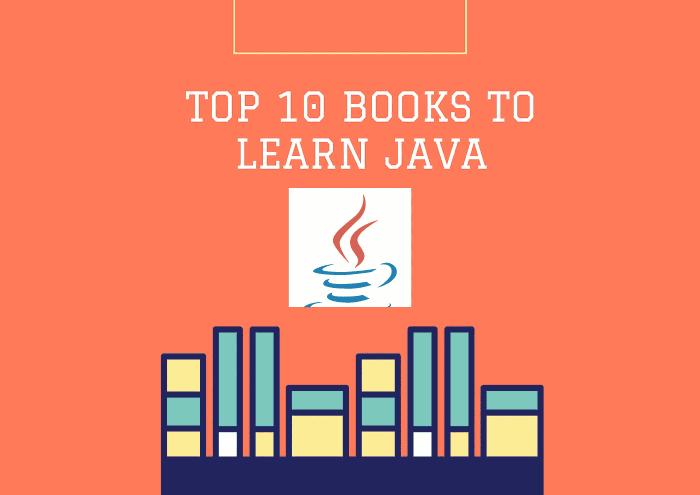

学习 Java 的十大书籍

大家好！！！

在当今世界，大多数人花大量时间在屏幕上学习、练习和观看。但是，有些人喜欢读很多书(像我一样)，他们不想从屏幕上学习，而是从书上学习。

在这本书里，我带来了帮助你掌握 Java 编程语言的前 10 本书。我还提供了这些书的特色，以便你对这本书有所了解。

我把这篇文章分成了两个部分。

一个是初级水平，另一个是高级水平。如果你认为你有很强的 java 核心概念的基础，你可以直接从高级书籍开始阅读。

***入门书籍:***

1.  **头头 Java :**

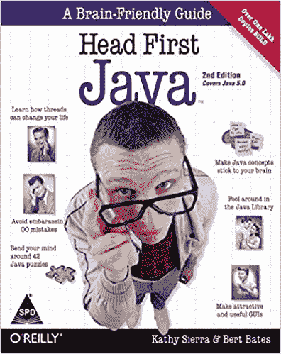

头先 Java

*功能:*

*   用通俗的语言解释概念。
*   将 java 编程概念与现实生活中的例子联系起来。
*   非常详细地涵盖了所有的 OOPS 概念。
*   涵盖了使用 RMI 和网络套接字和线程的分布式编程。
*   此外，这本书涵盖了 42 个令人兴奋的难题。
*   可以从这个[链接](https://www.amazon.in/Head-First-Java-Brain-Friendly-Guide/dp/8173666024/ref=sr_1_1?dchild=1&keywords=head+first+java&qid=1634229238&qsid=258-7521919-7957108&smid=A3SI5I1JWQ14PC&sr=8-1&sres=8173666024%2C1435291794%2C9352132777%2CB01EOJ23FC%2C144934013X%2C8184044976%2CB074B2XT87%2C1491910771%2CB009Z45JAI%2C9352134826%2CB07NPZ21QP%2C0596102143%2C9385889753%2CB086VLLTGK%2C9352136063%2CB07Q7MX7Z8&srpt=ABIS_BOOK)购买这本书。

**2。干净代码:**

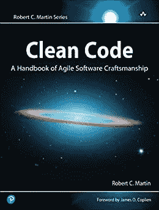

干净的代码

*功能:*

*   主要围绕 OOPs 原则。
*   这本书根据复杂程度分为三个部分，每个部分包含:模式、实践和原则，广泛的案例研究，在管理案例研究时收集的技术列表。
*   这本[书](https://www.amazon.in/Clean-Code-Handbook-Software-Craftsmanship-ebook/dp/B001GSTOAM/ref=sr_1_1_sspa?dchild=1&keywords=clean+code&qid=1634231102&s=books&sr=1-1-spons&psc=1&spLa=ZW5jcnlwdGVkUXVhbGlmaWVyPUEyVVlYSTNFRzhXN1JIJmVuY3J5cHRlZElkPUEwMDA5NTk3M0ZOVkQyM1RGRVBGRyZlbmNyeXB0ZWRBZElkPUEwOTI0NjI2MUc4TU1LQkFTUkdWTCZ3aWRnZXROYW1lPXNwX2F0ZiZhY3Rpb249Y2xpY2tSZWRpcmVjdCZkb05vdExvZ0NsaWNrPXRydWU=)会给你很强的 Java 知识，教你各种编程技术和实践，对你作为程序员的日常生活有所帮助。

**3。Java 完整参考第十一版:**

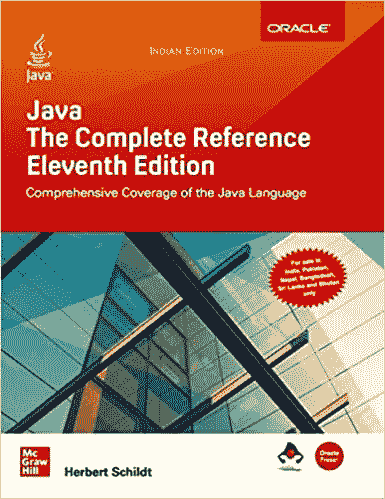

Java 完整参考

*功能:*

*   这是一本非常方便和全面的参考书。
*   结构良好、功能全面的 Java 编程源代码，带有真实的例子。
*   学习 java 的完美书籍，因为它涵盖了基本的 java 概念，如 Java 8 APIs。
*   还涵盖了广泛的主题，如 JavaBeans、servlets、applets 和 swing。

因此，如果你正踏上掌握 Java 的旅程，这本书是你的最佳选择。

**4。实践中的 Java 并发:**

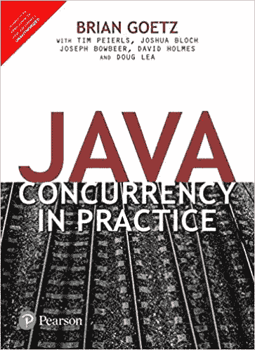

实践中的 Java 并发

*功能:*

*   最适合学习 java 高级概念，如并发和多线程。
*   大多数热心的 Java 开发人员都喜欢它。

你可以通过这个[链接得到这本书。](https://www.amazon.in/dp/9332576521/ref=redir_mobile_desktop?_encoding=UTF8&aaxitk=b93ae01479afcdfa859557c504a1b697&hsa_cr_id=7898993480202&pd_rd_plhdr=t&pd_rd_r=82ef3b22-c732-490d-84d3-d75a0419aa9e&pd_rd_w=19fIp&pd_rd_wg=g05bX&ref_=sbx_be_s_sparkle_mcd_asin_1_img)

**5。有效 Java :**

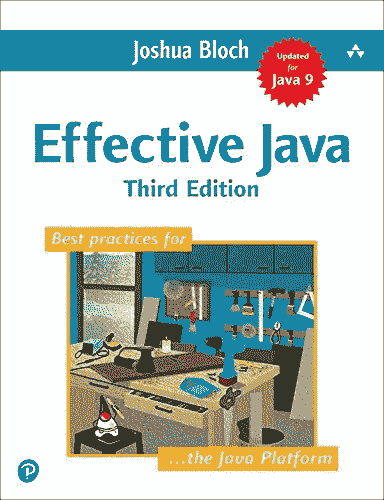

有效的 Java

*功能:*

*   每个 Java 程序员都必须有一本书。
*   这本书包含了 78 个帮助程序员有效编码的最佳实践。
*   本书中的所有最佳实践被分成 11 个不同的部分，如并发性、泛型和方法。
*   这本书的最新版本是围绕 Java 7、8 和 9 构建的。

你可以从[链接](https://www.amazon.in/Effective-Java-Joshua-Bloch-ebook/dp/B078H61SCH/ref=sr_1_1?dchild=1&keywords=effective+java&qid=1634230792&qsid=258-7521919-7957108&s=books&sr=1-1&sres=B078H61SCH%2C933257653X%2CB07VCF7Q7V%2C0201310058%2CB09FPW9WGT%2C172068202X%2C020179120X%2CB07VCF7Q77%2C0321130006%2C1565927192%2CB07VDF8DCM%2C0201360659%2CB09FPY4PXM%2C9332580995%2C1935182579%2C1839212063&srpt=ABIS_EBOOKS)买到这本书。

***高级水平书籍:***

**6。Java:初学者指南**

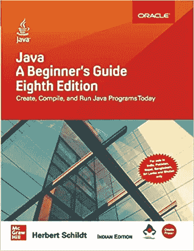

Java:初学者指南

*功能:*

*   这本书对新手和经验丰富的 Java 程序员都很有用。
*   这是市场上最全面、最完整的学习 java 的书籍之一。
*   附带广泛的动手练习以及每章末尾的测验部分。
*   它包括复杂的概念，如 lambda 表达式和函数接口。

**7。Java 性能:明确指南**

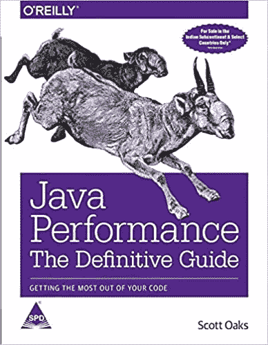

Java 性能

*功能:*

*   这本书包含了垃圾收集、JVM nad 性能调优等高级概念。
*   以简单而有效的方式介绍了高级 Java 概念。
*   这本书将教你如何最大化 Java 线程和同步性能特性，提高 Java 驱动的数据库应用程序性能，解决 Java EE 和 Java SE APIs 中的性能问题，等等。

**8。春天在行动:**

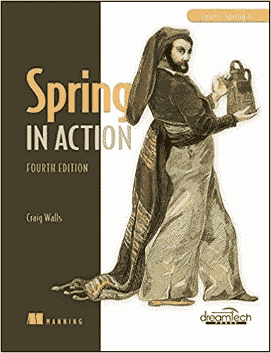

爪哇的春天

*功能:*

*   它涵盖了 Java 框架，即 Spring。
*   这本书涵盖了 Spring，它是 web 应用程序开发中最常用的 Java 框架之一。
*   这本书涵盖了更深层次的概念，如 JDBC 发现 JDK 的看不见的缺点等。
*   这本书还将告诉你 Spring 框架是如何帮助填补这些小而重要的空白的。

**9。测试驱动:**

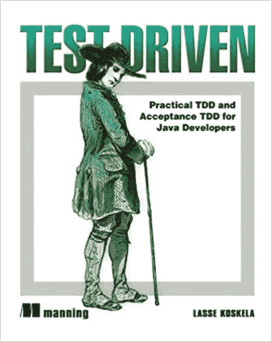

测试驱动

*功能:*

*   学习如何建立独特的汽车测试程序的优秀书籍。
*   本书提供了基于行业的例子来测试 Java 代码。
*   它还涵盖了验收测试驱动开发、Fit 框架和测试 Java EE 组件(JSP、Servlets 和 Spring 控制器)等主题。

**10。掌握 Java 机器学习:**

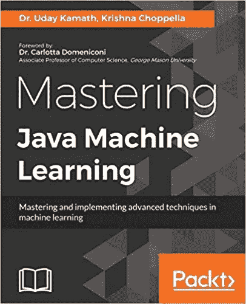

掌握 Java 机器学习

*功能:*

*   这本书提供了线性代数、概率和统计的全面知识。
*   这本书还教授标准问题，如文本挖掘、分类、聚类、大数据和机器学习。
*   这本书载有 10 个现实生活中的案例研究，每一个都突出了机器学习的各种技术。

感谢阅读！！！

祝你愉快。

保持微笑！！！！