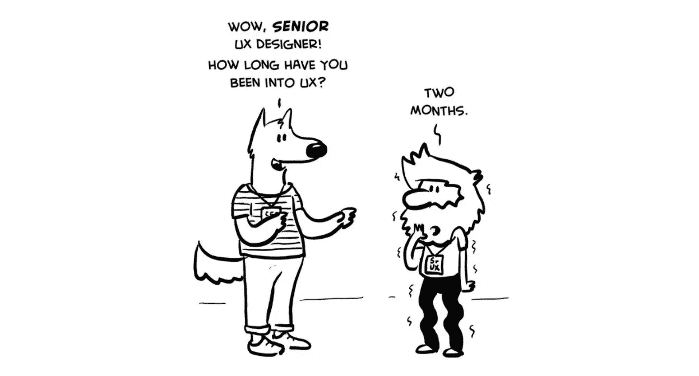

# 新人必须知道的 10 条 UX 设计原则

> 原文：<https://medium.com/nerd-for-tech/top-10-important-ux-design-principles-for-beginners-da4834f946fb?source=collection_archive---------7----------------------->

只要应用程序/网站设计到位，每个 UX 设计师都不能搞砸用户体验。当设计一个应用程序/网站时，你的目标是吸引客户/流量到你的网站。无论网站打算提供什么，记住还有很多其他同类产品。因此，毫无疑问，你最不想做的事情不是通过你提供的产品或服务来吸引用户，而是通过访问者/客户对你的设计的评价。这解释了为什么过多的公司在用户体验设计上投入了大量资金。用户体验定义了网站/应用用户如何与你的产品互动。它包括导航的便利性和用户是否得到满意的服务。用户体验是至关重要的，因为它试图通过给用户一个好的平台来满足他们的需求，让他们对你的产品保持忠诚。此外，用户体验构建了你的产品的客户之旅，这本身就是商业成功的一个重要因素。

# 十大重要的 UX 设计原则

对于每一个 UX 设计的成功，某些原则应该是 UX 设计过程的支柱和基础。如果不遵循这些原则，你的网站/应用必然会失败。Wondershare Mockitt 将为每位 UX 设计初学者展示 10 大最重要的 UX 设计原则。

## 1.满足用户需求

每个设计的首要目标是满足用户的需求。没有这个，用户就没有理由去访问你的网站/app。更多的时候，设计者犯了一个为用户着想的错误，最终犯了代价高昂的错误。首先，记住你不是用户。记住这一点，在继续之前，您需要知道用户需要什么。幸运的是，有很多用户需要不需要你花很多钱的测试方法。进行这些测试，并将用户需求融入到您的设计中。例如，你可以选择使用滑动按钮，而用户更喜欢点击按钮来使他们的导航更流畅。这样，用户会感到厌烦，并转向其他类似用途的应用程序/网站。一个设计可能看起来吸引眼球，但如果用户的需求没有得到满足，那么它就不会吸引用户。

## 2.一致性

一致性是你在设计中不能忽视的最重要的原则之一。这里的一致性指的是字体、颜色、图像尺寸的选择，以及设计的总体流程。你不能随便选择一种颜色或形状/图像大小，然后把它们放到你的设计中。各种不相关的颜色和形状可以创建一个混乱的界面，在一眨眼的时间内追逐游客。此外，你的物品安排应该是一致的。不要让用户费力地在你的界面上定位东西。以表单填写页面为例。不同的字段说明和按钮至少应具有不同的相关颜色和字体大小。这样用户就能清楚的看到自己哪里填了，哪里没填。

## 3.清楚

用户在你的应用上最不想经历的事情就是因为不清楚的过程而卡住。这变得更糟，尤其是在涉及敏感交易的情况下。用户希望获得关于点击某个按钮或填写某个信息时会发生什么动作的明确信息。此外，他们还想了解自己所处的位置，以及正在进行的交易中还有哪些内容。举个例子，你在网上购买产品。该页面应设计成你可以看到产品页，账单页，确认页等。通过这种方式，用户可以准确地了解他们在交易过程中的位置。与需要向下滚动以找到更多交易部分的大页面相比，这要好得多。

## 4.有等级制度

等级制度可能被低估，但它也可能打破或创造一个既定的设计。用户不会在难以导航的设计上浪费时间。他们转向其他相同用途的应用程序/网站，轻松导航。这种困难通常是由页面或部分的不流畅造成的。层次结构可以通过内容或信息在设计中的组织方式来描述。同样，视觉层次是设计层次的一个重要元素。最重要的信息通常采用不同的字体、颜色和位置。以亚马逊网站为例。主窗口顶部有一个主菜单，如今日交易、客户服务和销售等。当你点击一个单独的选项时，它会把你带到它的二级菜单等等。此外，滑动信息非常重要，因为它向用户简要介绍了新的到达和价格变化。您可以看到它被赋予了不同的背景颜色，这很容易引起用户的注意。

## 5.反馈

反馈是从设计到用户的直接交流。它告诉用户他们是否在做正确的事情。有了这些信息，用户就知道他们是否已经或正在做正确的事情。以一份工作申请表为例。当你完成填写并点击“提交”按钮。一个设计良好的平台应该会给你反馈，告诉你申请是否发送成功，或者在提交过程中出现了错误。也许它还应该告诉你哪里出错了。

## 6.简单

什么的并发症？你的目标是帮助用户找到他们想要的东西，而不是炫耀你的设计能力。更常见的是，设计师试图添加许多复杂/独特的功能，以使他们的设计脱颖而出。虽然这并不坏，但请记住，整个设计都是关于用户的，而不是作为设计师的你。避免杂乱或过度装饰，使用少中有多的方法。不要把所有的东西都放在同一页上。如果是 PDF 解决方案网站，放几个图标代表上传，转换，编辑，也许保护你的 PDF。诸如裁剪、排列、添加页码和注释等其他内容可以作为编辑的二级菜单。这样，主界面看起来简单整洁。

## 7.遵循标准

发明新东西是可以的，但是你知道用户的反应吗？虽然你可能会认为一种新的做事方式可以让用户兴奋，但如果发生了完全相反的情况，不要感到惊讶。记住用户已经习惯了可识别的图标。例如，主页图标通常类似于一所房子，邮件图标类似于一个信封，问号类似于求助图标。因此，如果你创建新图标，用户会感到困惑，没有时间去思考它们的真正含义。

## 8.保持用户自由和控制

在做设计的时候，一件非常重要的事情是记住用户需要自由和控制他们正在进行的任何事务。用户不应该感到被强迫/被迫确认交易。他们应该决定是否继续，回去，或完全终止。用户不应该感到受约束或限制。这可以从上下文和许可的角度来处理。对于上下文来说，应该方便地放置与用户可能做的事情相关的图标。例如，如果用户正在购买产品的最后一个过程中，应该在那里提供像取消、提交或以后继续这样的按钮。用户不应该费力寻找“取消”或“以后继续”按钮。此外，UX 的设计应该给用户恢复他们所采取的行动的自由。例如，您可以添加“重做”和“撤消”按钮。

## 9.可用性

虽然吸引人的设计很重要，但没有什么能打败可用性。设计师应该确保设计中的每一个图标/按钮/片段都有一个目的。拥有突出的按钮并保持极简设计比拥有包含许多不必要元素的混乱设计要好。如果你有实现功能和吸引用户的必要条件，你就走在了正确的 UX 设计道路上。你可以进行一些可用性测试来评估你的设计可用性。

## 10.提交前确认

用户不可能是完美的。他们也是人，也会犯错。更常见的是，他们点击了错误的按钮，触发了错误的命令，这可能会让他们付出代价。举个例子，一个孩子在没有父母同意的情况下意外地授权并购买了一个产品。家长将不得不经历退款过程，这可能会被证明是令人厌倦的，因此使家长讨厌的应用程序/网站。这可以通过在授权敏感交易之前添加确认对话框来避免。例如，如果你想购买一个产品，会弹出一个窗口，要求你确认是否要购买所选产品。另一个例子是，如果你想删除一个文件或网站/应用程序上的任何重要内容。在这里，您应该会收到一个弹出窗口，要求您确认是否确实要继续擦除。如果第一个过程是一个意外，那么可能不会发生确认，因此可以在 UX 设计的帮助下避免一个代价高昂的错误。

# 结论

虽然上述 UX 设计原则不是唯一合理的原则，但它们代表了优秀 UX 设计的顶级原则。如果你是 UX 设计初学者，只要将这些原则融入你的设计中，确保你的产品不会在市场上遇到阻碍。

感谢您花时间阅读这篇文章。[了解更多关于 Mockitt 的信息](https://bit.ly/3ewCXuz)

我们为 UX 初学者创建了一个[终极指南](https://bit.ly/2OLPPlW)，它收集了来自多个 UXers 的知识、经验和建议。

订阅我们的 [YouTube](https://www.youtube.com/channel/UCESxamaRS8nOGpWYvP1VSqA) [脸书](https://www.facebook.com/mockitt) [Instagram](https://www.instagram.com/wondershare.mockitt/)

*原载于*[*https://mockitt.wondershare.com*](https://mockitt.wondershare.com/ui-ux-design/design-principle.html)*。*