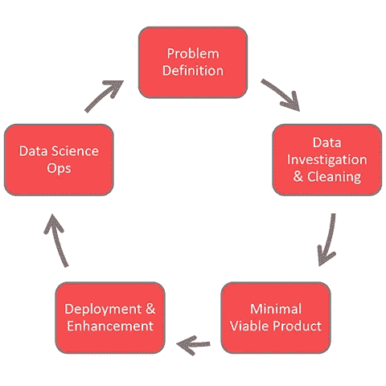
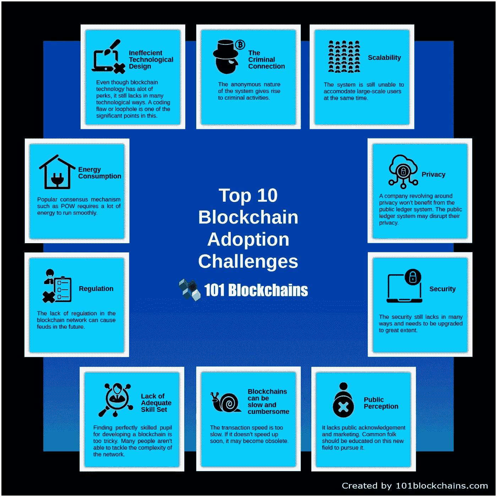
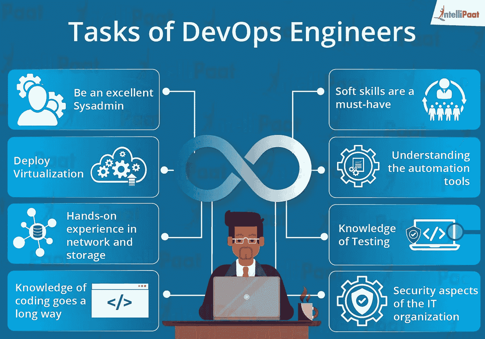
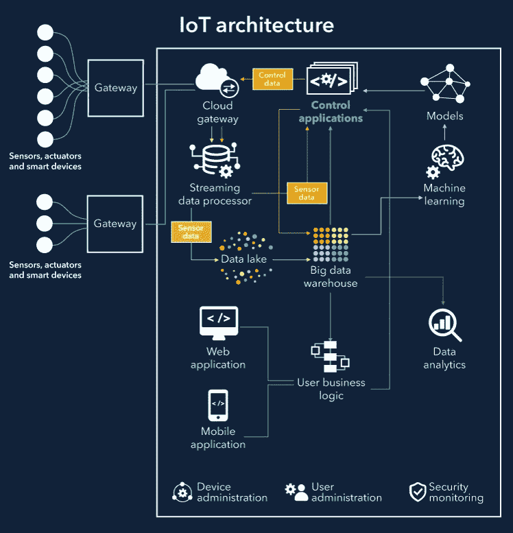
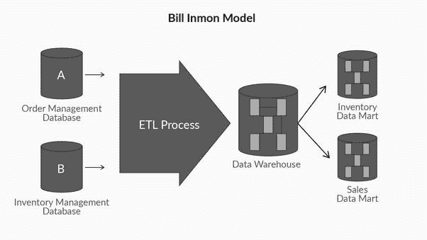
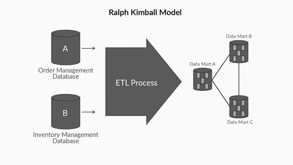
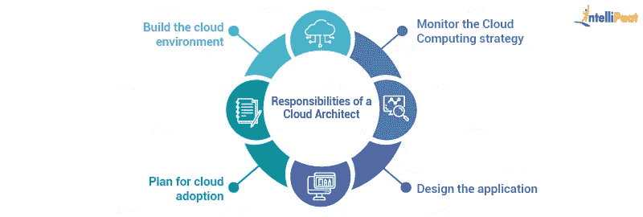
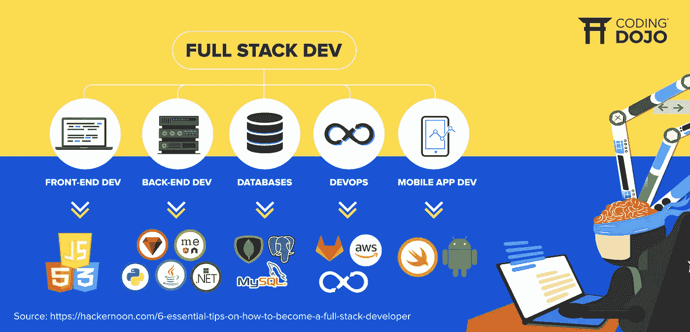
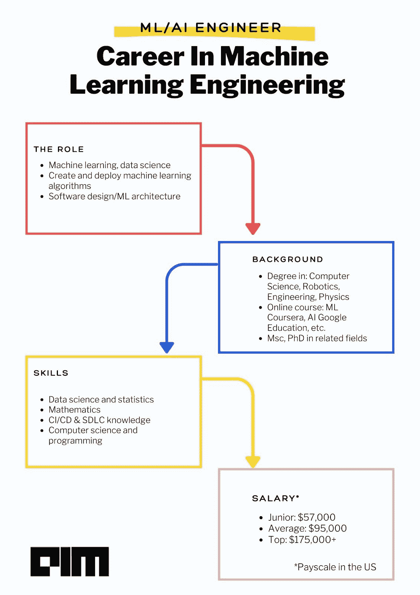
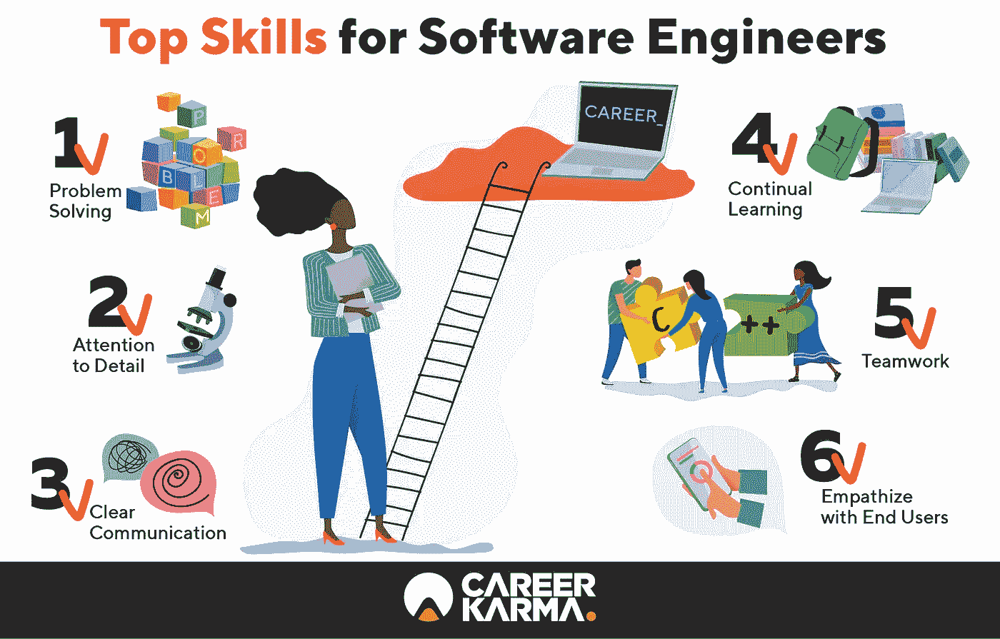

# 十大高薪和高需求 IT 职业(即不断发展)

> 原文：<https://medium.com/nerd-for-tech/top-10-it-careers-with-high-salary-demand-i-e-evolving-6a11894c2512?source=collection_archive---------13----------------------->

来源:Unsplash 博客指南

# 1.数据科学家

《哈佛商业评论》的一篇文章甚至称之为“21 世纪最性感的工作”。数据科学是一个跨学科领域，它使用科学方法、流程、算法和系统从结构化和非结构化数据中提取知识和见解，并在广泛的应用领域中应用数据中的知识和可行见解。

数据科学生命周期(资料来源:science-pm.com 数据)

数据科学家的平均基本工资是**每年 147，000 美元**。

# 2.区块链工程师

区块链工程师专门利用一种独特的技术为组织创建和实施数字解决方案。区块链开发人员是为区块链创建应用程序的程序员，他们的信息不存储在一个中心位置。

【101blockchains.com】来源:T4

区块链工程师的平均年薪是 13 万美元。

# 3.DevOps 工程师

DevOps 是一套结合了软件开发和 IT 运营的实践。它旨在缩短系统开发生命周期，并提供高质量的连续交付。DevOps 是敏捷软件开发的补充；几个 DevOps 方面来自敏捷方法。

[资料来源:intellipat.com](https://intellipaat.com/blog/what-does-a-devops-engineer-do/)

DevOps 工程师的平均年薪为 12.3 万美元。

# 4.物联网解决方案架构师

物联网和人工智能是现代最大的技术趋势。物联网可以通过互联网连接各种设备，最终实现智能家居、智能城市等。物联网解决方案架构师负责整个物联网生态系统的开发。

[资料来源:scnsoft.com](https://www.scnsoft.com/blog/iot-architecture-in-a-nutshell-and-how-it-works)

物联网解决方案架构师的平均年薪为 13.3 万美元。

# 5.数据仓库架构师

毫无疑问，大数据是 It 行业的新崛起，它也需要仔细存储，以挖掘可操作的见解。一个**数据仓库**是一个企业各种业务系统的所有数据的联合存储库。收藏。

数据仓库架构师的平均年薪是 116，000 美元。

**比尔·恩门模式**

**拉尔夫·金博尔模型**

# 6.云架构师

云架构师是负责监督公司云计算战略的 IT 专业人员。这包括云采用计划、云应用程序设计以及云管理和监控。

[资料来源:intellipaat](https://intellipaat.com/blog/how-to-become-cloud-architect/)

云架构师的平均年薪是**119，000 美元**。

# 7.全栈开发者

简单来说，全能开发者就是全栈开发者。这意味着全栈开发人员有能力处理所有意义上的应用程序开发，因此需要前端和后端开发以及数据库、网络、系统基础设施等方面的知识。

[来源:编码道场](https://www.codingdojo.com/blog/10-useful-facts-about-full-stack-development)

全栈开发人员的平均年薪为**11 万美元**。

# 8.机器学习工程师

ML 工程师是 IT 领域的一个人，他专注于研究、构建和设计自动运行的人工智能系统，以自动化预测模型。一名人工智能工程师构建了人工智能系统，该系统利用巨大的数据集来生成和开发能够通过实例学习并最终做出预测的算法。

[资料来源:analyticsindiamag.com](https://analyticsindiamag.com/how-to-become-a-machine-learning-engineer/)

ML 工程师的平均年薪是 129，268 美元。

# 9.软件工程师

软件工程是工业周期的一个重要组成部分，尤其是在当前软件创新处于高峰期的时候。这就是软件工程师如此重要的原因。研究软件工程原理，设计、开发、维护、测试和评估计算机软件的专业人员。

[来源:事业因缘](https://careerkarma.com/careers/software-engineer/)

软件工程师的平均年薪是 13 万美元。

# 10.网络安全经理/管理员

网络安全经理密切关注信息进出组织信息网络的渠道。他们负责对网络上发生的所有操作进行仔细检查，并管理促进这些操作的基础设施。

> **科技职业在等待！**

网络安全经理的平均年薪是 10.6 万美元(T21)。

作者:[哈里·波德尔](https://www.linkedin.com/in/hari8848/)