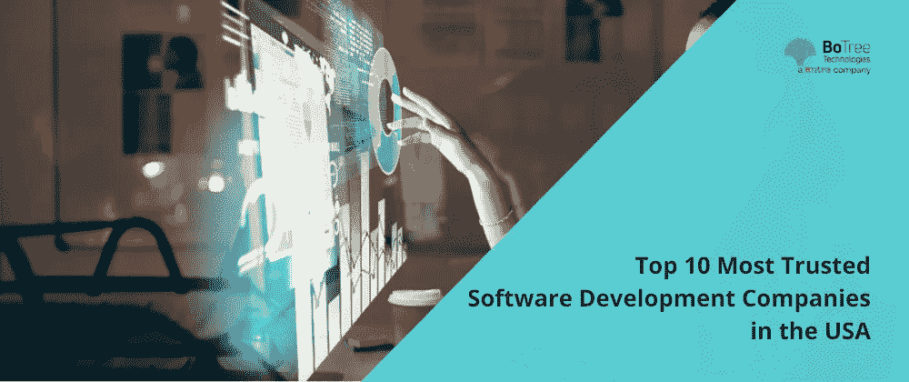

# 美国十大最值得信赖的软件开发公司

> 原文：<https://medium.com/nerd-for-tech/top-10-most-trusted-software-development-companies-in-the-usa-865441e50ccc?source=collection_archive---------2----------------------->

随着公司走向数字化，软件正成为企业的基本需求。他们中的大多数都在考虑定制软件开发，以更好地管理他们的操作和简化他们的工作流程。

事实上，预计企业软件收入的年增长率[(CAGR 2022–2026)为 8.59%](https://www.statista.com/outlook/tmo/software/enterprise-software/worldwide) ，到 2026 年市场规模将达到 3480 亿美元。虽然公司几乎已经从基于纸张的业务转向数字化企业，但他们现在希望超越并实现数字化转型，为此企业软件成为首要必需品。

> *阅读更多:* [*定制软件:什么东西、类型、实例*](https://www.botreetechnologies.com/blog/customized-software-what-is-it-types-and-examples/)

# 企业如何构建软件？

嗯，有三种不同的方式来构建软件。第一种方法是为软件开发项目建立一个内部团队，可以创建企业或以客户为中心的软件。

第二种方法是雇佣能为你的项目工作的自由职业者。与建立内部团队相比，它们的成本相对较低。

第三种，也是最可靠的一种方式是与软件开发公司合作。企业和初创公司可以将他们的企业软件开发需求外包给这些公司，这些公司利用他们的专业知识、技能和经验来构建高质量的软件。(2021 年，全球三大 IT 公司——埃森哲、高知和印孚瑟斯——的外包总收入为 55.21 美元)

本文将重点介绍美国十大最值得信赖的[定制软件开发公司](https://www.botreetechnologies.com/blog/cost-of-custom-software-development-us/)，企业和初创公司可以雇佣这些公司来建立软件开发团队并获得高性能的软件解决方案。

# 美国 10 大定制软件开发公司

有数百家软件公司提供[定制企业软件](https://www.botreetechnologies.com/blog/reasons-custom-software-is-great-for-the-fintech-industry/)解决方案。找到最好的取决于很多因素——经验、投资组合、人才可用性、预算、方法、技术等等。

我们将重点介绍 10 家定制软件公司，它们在各个领域都与世界领先企业(包括财富 500 强企业)合作过。

以下是美国 10 家顶级定制软件开发公司的名单

1.  **博特里科技**

*   [BoTree Technologies](https://www.botreetechnologies.com/) 是美国领先的定制软件开发公司。它提供 web 开发、移动开发、企业应用、UI/UX 开发、软件集成和维护支持服务。该公司拥有 90 多名软件开发人员和领域专家，他们已经成功地向 10 多个国家的客户交付了 200 多个项目。如今，该公司提供金融科技、健康科技、供应链、新经济、物联网、电子商务和其他几个领域的专业知识。

**2。印度 NIC**

*   作为美国最值得信赖的软件开发公司之一，印度 NIC 以其 100%的项目交付成功率而闻名。自 1998 年成立以来，该公司拥有以设计为中心的方法和透明的项目执行流程。该公司非常专注于物联网和移动应用程序开发。这是一家全球性的定制软件开发公司，在世界上所有主要国家都有客户。

**3。Sumatosoft**

*   Sumatosoft 拥有 10 多年的经验，是一家为不同领域的企业量身定制软件开发服务的提供商。该公司有一个 70 多名开发人员的团队，他们创造了一些市场上最好的产品。众所周知，Sumatosoft 会在 2-3 周内交付原型，并遵循快速入职流程。

**4。统一信息技术**

*   Unified Infotech 是一家屡获殊荣的[软件开发](https://www.botreetechnologies.com/blog/what-to-know-about-custom-software-development/)公司，与世界各地的企业、中小型企业和开创性的初创企业合作，作为他们的自始至终服务合作伙伴，提供特别定制的软件解决方案、web 和移动应用程序。通过精明的准备、计划思维方法和最新技术的结合，该公司帮助其客户提高业务熟练程度。它拥有超过 12 年的经验和超过 120 名软件开发人员的团队。

**5。Maxiom 技术**

*   Maxiom Technology 提供广泛的编程和软件解决方案。它还提供围绕构建出色的 Web、云、移动和企业应用程序的咨询服务，坚定不移地致力于全球定制软件开发的质量。Maxiom 的顶尖编程工程师利用 agile 等久经考验的技术，为世界各地的组织和协会组装创造性的定制软件。

**6。Iflexion**

*   大约从 1999 年开始，Iflexion 一直在帮助不同行业的组织通过定制软件解决方案推进他们的业务流程。Iflexion 拥有一支由 850 多名 IT 专家组成的精心策划的团队，无论客户的活动空间、地理区域和需求如何，Iflexion 都能为他们提供全面的服务。Iflexion 作为合作伙伴，致力于满足组织的 IT 需求，为 web、移动、云、物联网等领域提供外包软件开发服务。

**7。甲骨文**

*   一个由创新专家和手工艺人组成的团队，他们制作定制的软件解决方案来增强您的流程、授权团队并帮助实现您的愿景。专家团队拥抱创新，但是基于他们与超过 750 个客户一起工作的经验深度，以顺利完成任务，联系客户，并提供投资回报。他们以一种完全开放和直接的交互方式合作，来满足以消费者为中心的[企业软件开发](https://www.botreetechnologies.com/blog/python-for-enterprise-app-development/)的特殊需求。

**8。OpenXcell**

*   OpenXcell 成立于 2009 年，定居于美国，是一家主要的资源雇佣公司，也是最大的定制软件开发公司之一，以提供 IT 行业 1%的顶尖人才而闻名，拥有 10 年以上的工作经验。其独一无二的人才招聘实践保证了最佳的资源选择和尖端且易于使用的创造性解决方案的进步。该公司发展成为一家提供全程业务和技术咨询的一站式公司。

**9。创新集团**

*   Innowise Group 是一家全球全周期定制开发公司，其主要交付合作伙伴位于东欧，工作场所遍布全球。该集团拥有超过 800 名一流的 IT 专家，利用他们的编程能力，使客户的组织更具想象力和富有成效。该公司拥有 450 多名开发人员和领域专家，组成了一个强大的软件开发团队，提供全面的软件开发服务。

**10。10 云**

*   10Clouds 是一个由 200 多名经验丰富的工程师和原创者组成的团队，他们准备通过最好的软件开发工具和技术，将想法转化为令人惊叹的、不断发展的产品。它提供与软件解决方案相关的广泛服务，包括区块链服务。在其日常流程中，该公司使用 ReactJS、Flutter、Python 和 Django、机器学习、DevOps 来满足业务需求，并制作最高端的软件解决方案。

> *阅读更多:* [*每个公司都应该避免的 7 个定制软件开发错误*](https://www.botreetechnologies.com/blog/custom-software-development-mistakes/)

# 结论

以上是一些全世界都知道的最值得信赖的定制软件开发公司。决定选择哪一个可能是一个挑战，但是，考虑成本、投资组合、经验和技能等因素可以帮助企业和公司做出更好的决策。

*原载于 2022 年 3 月 22 日*[*https://dev . to*](https://dev.to/botreetechnologies/top-10-most-trusted-software-development-companies-in-the-usa-10ih)*。*