# 2021 年十大必读 UX 杂志

> 原文：<https://medium.com/nerd-for-tech/top-10-must-read-ux-magazines-in-2021-4779f749ddb9?source=collection_archive---------20----------------------->

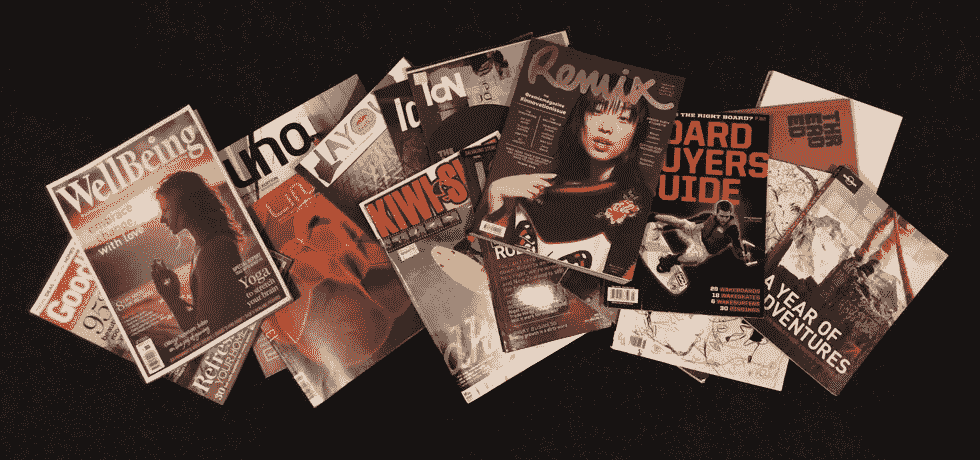

如果你是一个日常手机用户，你一定用过很多应用程序。如果有人问你，你最喜欢的购物 app 是哪个？你的答案可能是亚马逊。如果你问一个流媒体应用程序，它会是网飞或亚马逊 Prime。

现在，也可能有其他答案，但亚马逊和网飞的频率最高。那么，为什么只有这些在上面呢？

这个问题的简单答案是用户体验。只要一个应用程序能提供流畅的用户体验和可用性，几乎每个用户都会首选它。想想雅虎；这是一个伟大的搜索引擎，但无法生存的技术战争。原因是可怜的 UX。

如果你是一名设计师，UX 是需要仔细分析的关键因素之一。统计数据显示，未来十年，UX 的设计师职位将以 22%的[速度增长。因此，你需要更新用户体验的所有概念。](https://money.cnn.com/pf/best-jobs/2012/snapshots/43.html)

[UX 杂志](https://bit.ly/3cggRd4)是了解所有最新潮流和新闻的主要途径之一。如果你也是一个 UX 爱好者，并且每天都想了解 UX，那么一定要看看这些由 Wondershare Mockitt 列出的最好的 UX 杂志。

# 1.粉碎杂志

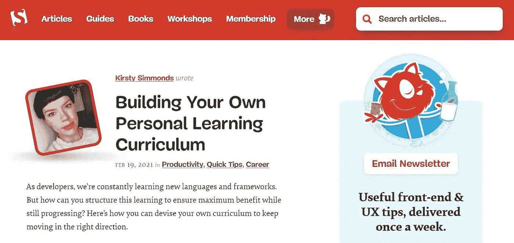

*来源:* [*砸弹匣*](https://www.smashingmagazine.com/)

请看排行榜上的第一本杂志！就像它独特的名字一样，它是为全球一些独特的、有创造力的开发者和设计师设计的。该杂志的制作者确保除了发布关于它的文章之外，它还提供高级 UX。

在线杂志确保你能很容易地找到你正在寻找的东西。这就是为什么他们在右上角增加了一个搜索栏。此外，在线杂志还有一些其他标签，如指南和书籍，您可以在其中探索与 CSS、UX、Javascript、Figma 等相关的其他材料。

为了让自己保持在循环中，你可以订阅他们的电子邮件简讯！

# 2.UX 很重要

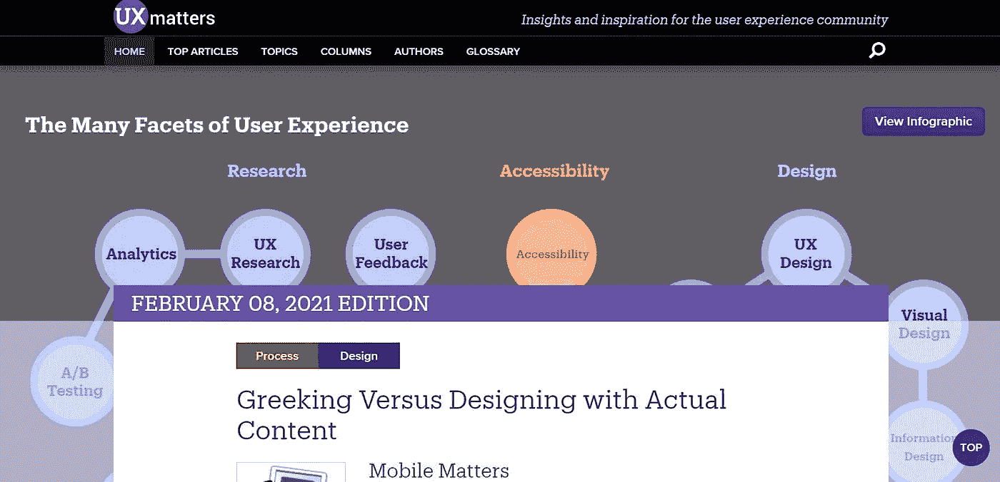

*来源:* [*UX 事项*](https://www.uxmatters.com/)

虽然名单上的杂志都是最好的，但这本杂志有点独特。怎么会？除了专业的 UI，杂志还有从业者发布的内容。所以，无论你是专业人士还是新手，你都可以阅读这本杂志，增加你对 UX 的了解。

该杂志为您提供了使用搜索栏搜索您最喜欢的主题的选择。除此之外，还有像主题、作者和热门文章这样的标签，使得过滤和学习更加容易。

在这本杂志上发表博客的频率很低，但当它们被发表时，它们会以多个数字出现，并提供真实的信息。

# 3.UX 杂志

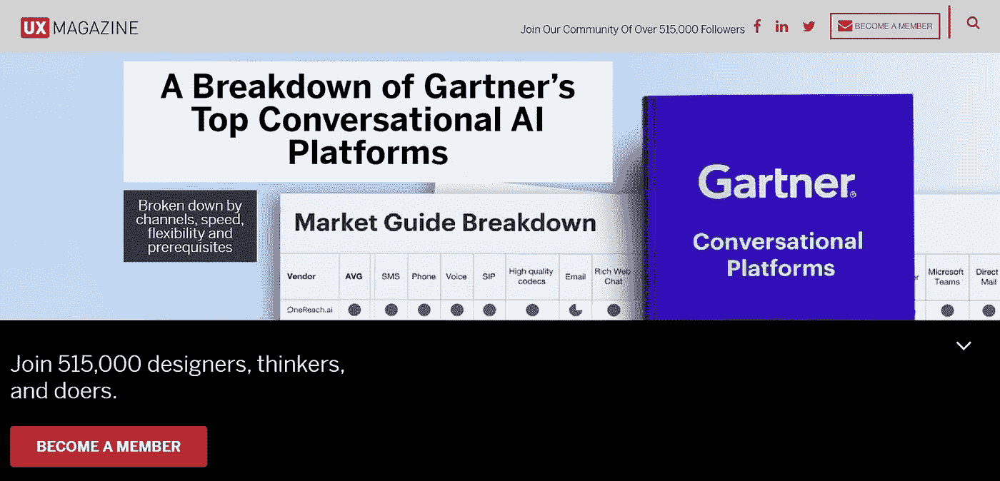

*来源:* [*UX 杂志*](https://uxmag.com/)

当你访问他们的网站时，你一定会对这本杂志感到惊讶。它有一个超过 51.5 万名追随者的社区。是的，你没听错。如此大受欢迎背后的明显原因是它为读者提供的内容的多样性。

虽然它主要关注 UX，但它也有关于数据可视化、可访问性、人工智能、对话设计等的文章和博客。因此，使其成为用户的最佳选择。

最重要的是，网站上有 UX 工作和一个你可以找到工作机会的活动板块。此外，您还可以获得基于位置的会议、聚会和研讨会列表。

# 4.UXPA 杂志

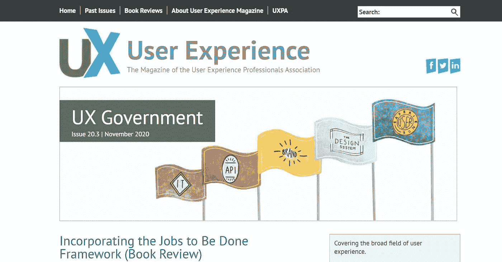

*来源:* [*UXPA*](https://uxpamagazine.org/)

UXPA 更像是一本专业杂志，一年只出版五期。你们中的一些人可能认为这对于收集知识来说太低了。但是，实际上，UI UX 杂志发表的文章是基于一个广泛的主题。

这使得它的所有问题都变得至关重要，你会惊讶地发现你可以对此有所贡献。如果你是一名专业的 UX 设计师，并且知道如何通过文字表达你的理解，你可以向他们的杂志投稿。

他们的下一期预计在 5 月/7 月，发布的主题是人工智能和 UX。

# 5.方框和箭头

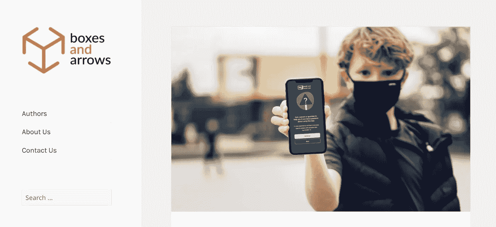

*来源:* [*方框和箭头*](https://boxesandarrows.com/)

如果你是一个入门级的 UX 设计师，那么盒子和箭头是一个理想的博客给你。它有一个简洁明了的界面，上面有大量关于多个主题的内容文章，比如设计原则、图形设计、研究和测试。

你可以在侧边标签上轻松查看他们的档案和热门文章。此外，类别下拉菜单可以更顺畅地筛选出您想要阅读的内容。

最后，这些文章并不是每天都在杂志上发表，但它们肯定会有知识性的内容。

# 6.网页设计师新闻

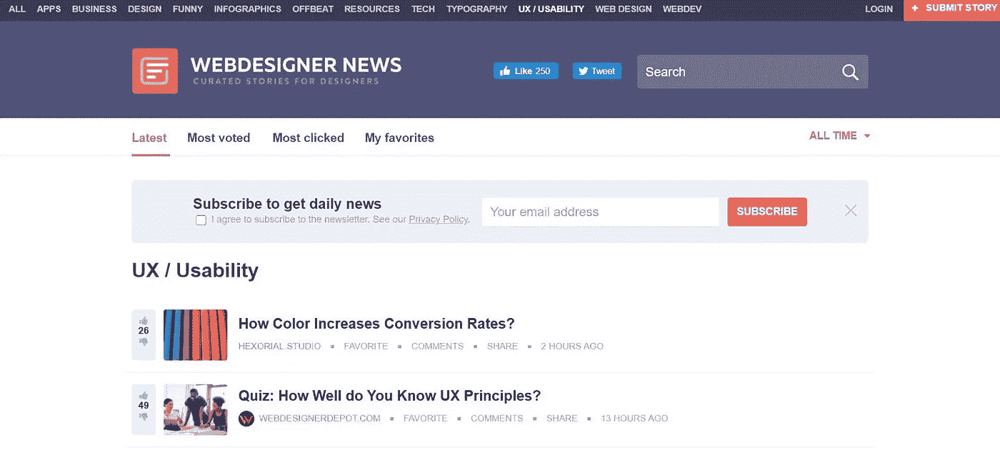

*来源:* [*网页设计师新闻*](https://www.webdesignernews.com/category/ux-usability)

在上述所有网站中，网页设计师新闻有点另类。该杂志提供了各种主题的一些最佳和最新文章的综合列表；虽然 UI UX 是主要的。

用户界面有点酷，可以显示文章获得的用户评分。该杂志的一些关键类别是商业、设计、信息图表、UX、可用性等等。

文章以列表格式排列，可以根据受欢迎程度、最多投票、最多点击和用户的收藏夹进行过滤。为了让你及时了解最新的内容，该杂志为你提供免费订阅。你也可以投稿给杂志。

# 7.一线之外

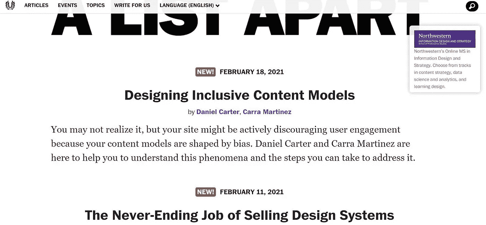

*来源:* [*一单相隔*](https://alistapart.com/)

这里还有一个给你。这本杂志的独特之处在于你必须等待文章的时间。他们在全面和严格的审查过程后发表文章，这就是为什么这些文章是一流的，而且是在很长时间后发表的。然而，他们在最近十天发表了他们最近的两篇文章。

他们的杂志充满了与 UX、设计、代码、内容、过程以及基本上与设计和开发相关的一切相关的文章。所以，如果你想阅读这本杂志，准备好大吃一惊吧。

也可以参加他们组织的活动。另外，如果你喜欢写作，你也可以把你的作品寄给他们！

# 8.UX·布斯

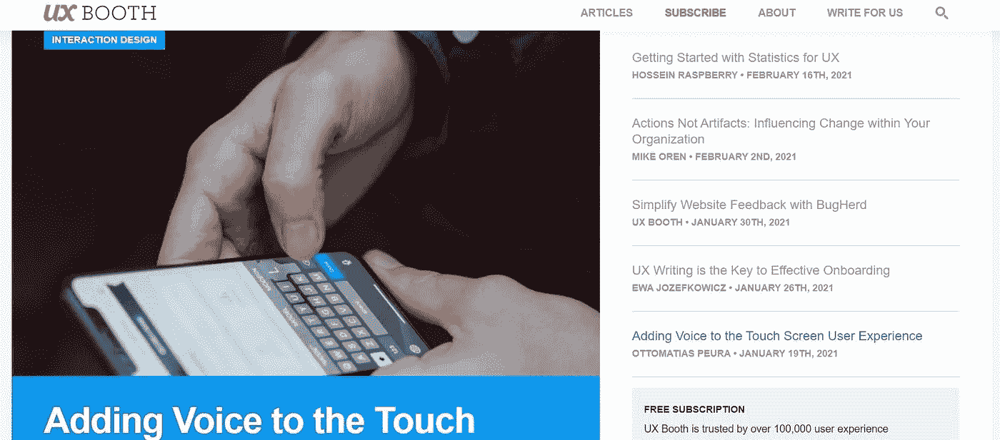

*来源:* [*UX 展台*](https://www.uxbooth.com/)

UX 展台以其丰富多彩和引人入胜的界面而闻名，是设计师们别出心裁的在线目的地。在线门户为您提供一些最佳用户体验内容，您可以根据分析、内容策略、视觉设计、可访问性、业务策略等类别进行筛选。

他们不定期发布内容，但他们的内容值得一读。他们的文章内容质量是超过 100，000 名用户体验专家信任它的原因。如果你有在 UX 成为最优秀的火花，那么这本杂志是你的最佳选择。

你也可以为杂志写稿来投稿！

# 9.可用性极客

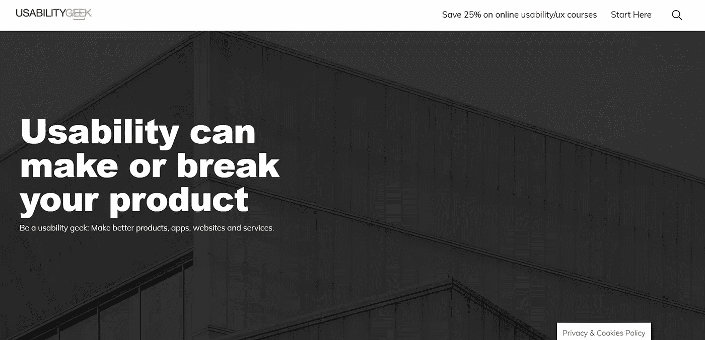

*来源:* [*可用性极客*](https://usabilitygeek.com/)

可用性决定了应用的用户体验。这本杂志的名字就是受此启发。与榜单上的其他杂志不同，这份杂志有一个有点不寻常的用户界面，这清楚地表明该网站是由 UX 极客创建的。

有大量关于 UX 和其他各种主题的文章，值得一读。此外，如果你有兴趣更多地了解 UX，除了阅读之外，你还可以参加与它相关的课程。

该杂志的一些热门话题是可用性测试、可用性指南、用户体验等。您可以使用顶部的搜索栏来加快搜索速度。

# 10.UX 运动

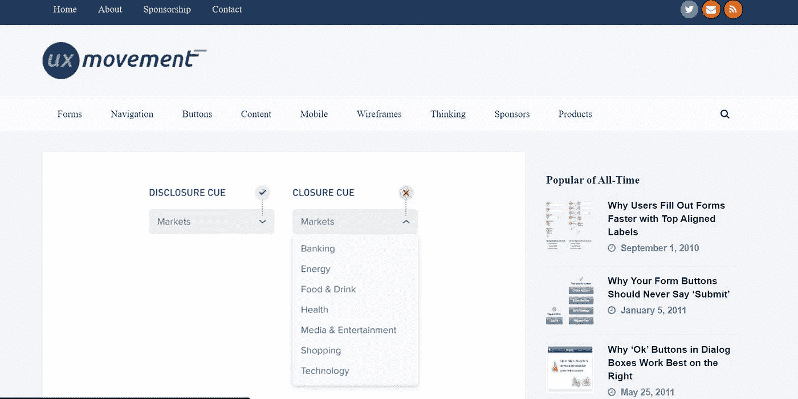

*来源:* [*UX 运动*](https://uxmovement.com/)

列表中的最后一项也有点特殊。怎么会？嗯，UX 运动是一本在线用户体验杂志，在更深层次上关注 UX 话题。杂志上发表的大部分文章都是基于 UX 元素和方面，比如表单、导航、按钮、内容等等。

你还可以了解 UX 和 Figma 等设计工具。这本杂志最大的优点是它每隔一段时间就会推出新的文章，这样你就可以每隔一周甚至一天读到一些新鲜的东西。

# 结论

作为一名设计师或开发商，你有必要了解 UX 世界的最新趋势和新闻。由于技术进步正处于顶峰，最好让自己订阅一份 UI 和 UX 设计杂志。正如我们已经强调了一些最好的上面，这将是你在公园散步入围一个。

这些不仅能让你了解所有最新的事情，还能帮助你与时俱进。他们中的一些也提供课程。如果你想了解更多，你可以选择他们。如果你是一名作家，你也可以让你的作品在这些杂志上发表，并创建一个作品集。

感谢您花时间阅读这篇文章。了解更多关于 Mockitt 的信息

我们为 UX 初学者创建了一个[终极指南](https://bit.ly/2OLPPlW)，它收集了来自多个 UXers 的知识、经验和建议。

订阅我们的[YouTube](https://www.youtube.com/channel/UCESxamaRS8nOGpWYvP1VSqA)脸书 insta gram

*原载于***。**