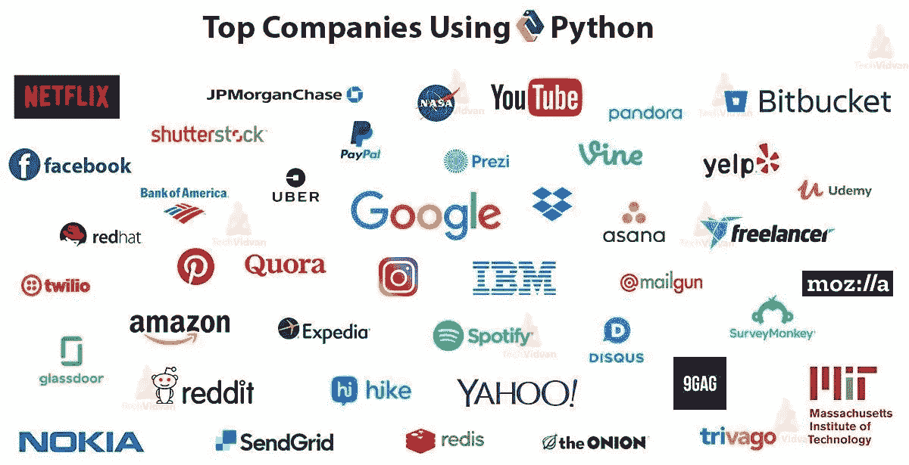

# 十大 Python 开发公司招聘名单

> 原文：<https://medium.com/nerd-for-tech/top-10-python-development-company-to-hire-d83507a33755?source=collection_archive---------13----------------------->

[**Python**](https://www.techmagazines.net/top-50-python-interview-questions-and-answers-for-freshers-in-2021/) 发展的影响力与日俱增。越来越多的公司使用 Python 开发他们的应用程序和门户。Python 因其通用性和高效性而广受欢迎。我们日常使用的许多应用程序都是由 Python 驱动的，比如脸书、Spotify、Instagram、网飞和许多其他应用程序。

使用 Python 作为开发平台的公司:

*   脸谱网
*   照片墙
*   网飞
*   谷歌
*   Quora
*   Reddit
*   亚马孙

还有更多！

图片来源:TechVidvan.com

如果你是一个企业主，拥有一个网站已经成为一种基本的需要。这就是为什么企业要么雇佣一个应用程序开发机构，要么雇佣一个开发团队来为他们的企业开发网站。一些企业更愿意将他们的网络或应用程序开发项目外包给印度。如果你是外包新手，你应该看看一些最好的外包技巧，这将有助于你找到合适的外包合作伙伴。

外包可以帮助你节省开发成本，但是对于那些不认为预算是个大问题的人来说，从世界任何地方雇佣开发人员，无论是在国内、近岸还是离岸。最受欢迎的服务是 Python 开发，企业经常搜索[最佳 Python 开发公司](https://www.inexture.com/services/python-development-company-usa/)，这就是为什么我们编制了一份最佳 Python 开发公司名单。

# 十大 Python 开发公司

如果你对 Python 开发的效率印象深刻，你应该看看所有能够为你提供优秀的 Python 开发服务并让你的业务领先一步的 Python 开发公司！

排名第一的 LLP 创新解决方案

2 号卖家

排名第三的网络专家

#4 BoTree 技术

#5 姜戈之星

#6 STX 下一个

#7 软牛皮纸

#8 Iflexion

#9 Clavax

第 10 名 Steelkiwi

了解了前 10 大 Python 开发公司之后，让我们来看看这些公司为什么能进入我们的前 10 名名单，以及这些公司有什么好处。

# 排名第一的 LLP 创新解决方案

in execute Solutions LLP 公司在我们的十大 Python 开发公司名单中名列第一，其中一个原因是他们的专业 Python 开发人员。INEXTURE 团队由经验丰富的 Python 开发人员组成，他们也有跳出框框的思维。因此，你将得到高性能的应用程序开发与触摸的创造力。听起来是不是很棒？很多企业 [**从 INEXTURE 雇佣 Python 开发者**](https://www.inexture.com/hire-python-app-developers/) 。你也应该试试！

**以下是选择 in execute 进行 Python 开发的理由:**

*   专家和创意开发人员
*   超值优惠
*   良好的发布后支持
*   令人印象深刻的投资组合
*   周转时间更快
*   保证准时交货

质量:5/5

部署时间:5 月 5 日

开发成本:5/5

参考率:95%

# 2 号卖家

Selleo 是另一家出色的 Python 开发公司，拥有令人惊叹的投资组合。他们参与了一些非常酷的 Python 项目，这让我们把他们排在了第二位。Selleo 还提供有利可图的定价，因此人们无法拒绝他们提供的 Python 开发服务。

以下是 Selleo 入选我们十大榜单的原因。

*   令人印象深刻的投资组合
*   发展的丰厚折扣
*   随时支持
*   经验丰富的开发人员

质量:5/5

部署时间:4.5/5

开发成本:4.5/5

参考率:90%

# 排名第三的网络专家

Netguru 是一家相当受欢迎的 Python 开发公司，每当你在谷歌搜索中搜索任何 Python 开发人员时，它总是会弹出来。Netguru 的大多数客户都是知名企业，这就是为什么他们的收费可能会比上述两家高一点，但你会从他们那里获得优质服务。如果预算不是太大的问题，你可以从 Netguru 雇佣 Python 开发者，他们不会让你失望的！

**以下是你应该选择它们的理由！**

*   他们有大客户
*   惊人的开发服务
*   超棒的作品集
*   大力支持

质量:5/5

部署时间:4.5/5

开发成本:4/5

参考率:90%

# #4 BoTree 技术

BoTree Technologies 是另一家 Python 开发公司，拥有相当不错的作品组合和令人印象深刻的网站。他们的专长是 Ruby on Rails 和 Python。所以，如果你的项目是基于 Ruby on Rails 或者 Python，你可以选择 BoTree 技术。这个机构也位于印度，所以他们的收费会比 Netguru 低，当你雇佣他们的时候，你可能最终会节省你的开发预算。

**我们喜欢波特里的原因:**

*   多种技术专业知识
*   印象深刻的网站(是的！)
*   广泛的投资组合

质量:4.5/5

部署时间:4/5

开发成本:4.5/5

参考率:90%

# #5 姜戈之星

这里有一个在 Django 发展方面有专长的机构。所以，如果你想开发一个 web 应用程序或者类似的东西，你可以联系 Django Stars，和他们一起工作你会得到一个惊人的体验。他们将致力于定制 Python 开发和 Django。Django Stars 的成本会比其他 Python 开发公司高一点。所以如果你想节省开发成本，这个机构显然不适合你！

**知道我们为什么推荐 Django Stars:**

*   Django 专家
*   多重利基体验
*   令人印象深刻的产量
*   适合美国的工作时间

质量:4.5/5

部署时间:4.5/5

开发成本:4/5

参考率:85%

# #6 STX 下一个

STX Next 是另一家著名的 Python 开发公司，在开发 Python 应用程序和其他商业解决方案方面有着丰富的经验。我们选择 STX Next 的原因是它在 clutch.co 的评级，它有一些非常令人印象深刻的评论，所以我们无法阻止自己将这家公司列入前 10 名。

**接下来是什么让我们对 STX 感兴趣:**

*   坚实的审查基础上 clutch.co
*   超棒的作品集
*   大型 Python 开发人员

质量:4.5/5

开发时间:4.5/5

开发成本:4/5

参考率:90%

# #7 软牛皮纸

SoftKraft 是一家位于波兰的定制软件开发公司，也提供 Python 开发服务。他们还提供一种独特的服务，称为“CTO-as-a-service”，让您通过他们经验丰富的技术人员来管理您的产品。如果你不是一个技术人员，你可以为你的产品雇佣一个 CTO 来处理你的产品的所有技术问题。

**我们为什么喜欢 SoftKraft:**

*   比美国低
*   信誉卓著的机构
*   良好的开发经验

质量:4.5/5

部署时间:4.5/5

开发成本:4/5

参考率:85%

# #8 Iflexion

Iflexion 也是一家定制软件开发公司，通过软件提供定制业务解决方案。此外，他们拥有构建定制软件的经验，可以最大限度地简化业务。他们的工作组合也令人印象深刻，因此他们进入了 Python 开发公司的前十名名单。

**为什么 Iflexion 可能成为您的下一个 Python 开发合作伙伴:**

*   广泛的投资组合
*   受到很多公司的信任
*   中等利率

质量:4/5

部署时间:4.5/5

开发成本:4/5

参考率:85%

# #9 Clavax

Clavax 是一家专注于定制软件开发的小型企业，也从事 Python 开发。Clavax 的工作费用比大多数美国软件开发机构要低，这也是它出现在我们名单上的原因。它收集了不少关于 clutch.co 的好评。Clavax 的总部设在加利福尼亚州圣何塞，他们为真正有竞争力的利率工作。这就是它入选我们的 10 大 Python 开发公司名单的原因。

**选择 Clavax 的主要理由:**

*   支撑的绝佳选择
*   有竞争力的价格
*   令人印象深刻的投资组合

质量:4/5

部署时间:4/5

开发成本:4.5/5

参考率:85%

# 第 10 名 Steelkiwi

Steelkiwi 是一家著名的定制应用程序开发公司，也提供 Python 开发服务。Steelkiwi 参与了一些非常激动人心的项目，这是一项伟大的成就。因此，我们将 SteelKiwi 列入了我们的十大 Python 开发公司名单。他们已经完成了 50 多个令人兴奋的项目，这是一件非常酷的事情！

**为什么选择 SteelKiwi？**

*   经验丰富的专业人士
*   令人印象深刻的投资组合
*   值得信赖的组织

质量:4.5/5

部署时间:4.5/5

开发成本:4/5

参考率:85%

所以，这些是前 10 大 Python 开发公司，它们可以为你提供优秀的 Python 开发服务，将你的业务提升到一个全新的水平。你可以从上面列出的任何一家公司雇佣 Python 开发人员，他们将帮助你创建一个商业应用程序，用 Python 简化你的业务。祝你好运，选择正确的公司，让你的事业蒸蒸日上！

原文来源:[https://www . tech magazines . net/top-10-python-development-company-to-hire/](https://www.techmagazines.net/top-10-python-development-company-to-hire/)