# 让数据分析变得简单的 10 大 python 技巧

> 原文：<https://medium.com/nerd-for-tech/top-10-python-tips-to-make-our-life-easy-in-data-analysis-1cdf62d58efd?source=collection_archive---------3----------------------->

## 用于数据分析的快速汇总和样式化数据的技巧


斯蒂芬·道森在 [Unsplash](https://unsplash.com?utm_source=medium&utm_medium=referral) 上拍摄的照片

好看的东西总是价格最高，因为内容占 80% +外观占 20%。技巧和提示总是最好的收集，使工作更有效和容易。小捷径可以作为你工作的助推器。下面的代码和例子展示了一些已知的和未知的技巧

# 数据

```
# Importing librariesimport pandas as pd
import numpy as np# Dataset# Dataset
df = pd.DataFrame({
  'Subject':['S1', 'F1', 'A1', 'S1', 'S1','M1','F1'],
  'Marks1':[10, 20,10, 40, 20, 60, 20],
  'Marks2':[20, 40, 20, 30, 10, 80, 39],
  'Review': ['Good can do better. Better luck next time', 'Happy', 'Good', 'Best', 'Good! satisfy with the result', 'Better', 'Best'],
  'Code':[1,6,2,6,7,6,1]
               })
df.head(3)
```

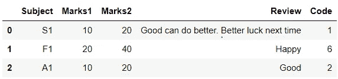

# 1.交叉表

> 计算两个(或更多)因素的简单交叉列表。默认情况下，计算因子的频率表，除非传递了值数组和聚合函数。*我个人觉得交叉表功能更有用。*

```
# Data set
dff = pd.DataFrame({
'Name':['Alisa','Bobby','Cathrine', 'Alisa','Bobby','Cathrine',
'Alisa','Bobby'],
'Subject':['Mathematics','Mathematics','Mathematics','Science','Science','Science',
'History','History'],
'Score':[62,47,55, 74,31,77, 100,63],
'Group_rank': [1.0,3.0,2.0,2.0,3.0,1.0,1.0,2.0]})
dff
```

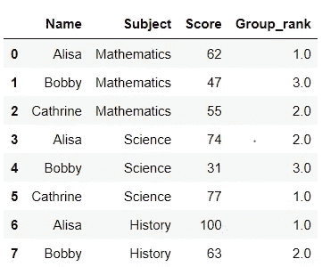

多个索引和一个列的交叉表。它通过设置 *margin=True* 来显示每行和每列的总数，我们也可以通过 *margin_name* 来更改列名

```
pd.crosstab([dff.Name, dff.Group_rank], [dff.Subject, dff.Score], margins=True, margins_name="Total")
```

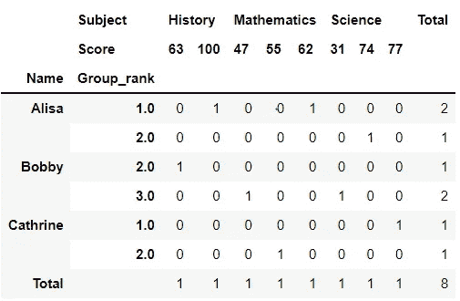

交叉表提供了 3 个数值的*值*参数进行聚合。通过将 nan 值替换为 0 &来设置一些附加功能，将该值四舍五入到 2 位小数。

```
pd.crosstab(df.Subject, df.Code, values=df.Marks1, aggfunc='mean', margins=True, margins_name="Total").round(2).replace(np.nan, 0)
```

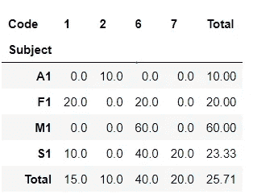

最流行的参数是接受这些选项的 *normalize* 。

a)如果通过 *normalize = True 或 all，*将对每个值进行标准化。

b)如果通过了 *normalize = index(rows)，*将对每一行进行规范化。

c)如果通过了 *normalize = columns，*将对每一列进行归一化。

```
pd.crosstab(df.Subject, df.Marks1, normalize=True)
```

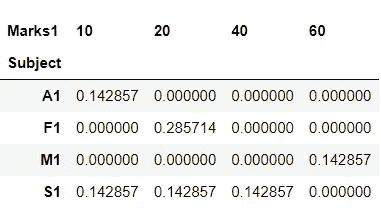

# 2.式样

## a)表格

你有没有想过，仅仅看着表格，它很简单，很好，但并不伟大，我们只需要增加一些趣味&我们的救世主是 CSS。更多例子请看附加链接。

 [## pandas . io . formats . style . styler . set _ table _ styles-pandas 1 . 2 . 4 文档

### 如果提供一个列表，每个单独的 table_style 应该是一个带有和键的字典。应该是一个 CSS 选择器…

pandas.pydata.org](https://pandas.pydata.org/pandas-docs/stable/reference/api/pandas.io.formats.style.Styler.set_table_styles.html) 

```
# Styling the data framedf.style.set_table_styles(
[{'selector': 'tr:nth-of-type(odd)',
  'props': [('background', '#eee')]},
 {'selector': 'tr:nth-of-type(even)',
  'props': [('background', 'white')]},
 {'selector': 'th',
  'props': [('background', '#000'),
            ('color', 'white'),
            ('font-family', "'Lato', sans-serif")]},
 {'selector': 'td',
  'props': [('font-family', 'verdana')]},
]).hide_index()
```

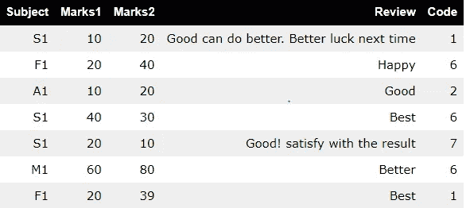

如果你想让桌子互动，那么切换到[](https://plotly.com/python/table/)****(库)**是一个很好的选择。**

## **降价**

**降价使 jupyter 笔记本有趣。**

```
<div class="alert alert-vlock alert-danger">
It is a danger box. </div>
```

**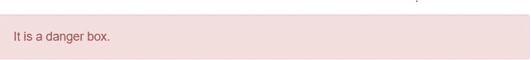**

```
<div class="alert alert-vlock alert-info">
It is a info box. </div>
```

****

```
<div class="alert alert-vlock alert-warning">
It is warning box. </div>
```

**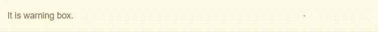**

```
<div class="alert alert-vlock alert-success">
It is a success box. </div>
```

**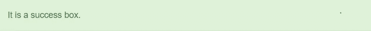**

## **3.使用文本数据**

## **a)摘录**

**当我们需要从文本中提取单词或数字时，使用提取功能。**

```
pd.Series(["a1", "b2", "c3"], dtype="string").str.extract(r"([abc])(\d)", expand=False)
```

**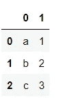**

## **b)下部()，上部()**

**pandas 提供了 lower 和 upper 函数，因此我们可以直接将文本数据同时转换成小写和大写。**

```
df['upper'] = df['Review'].str.upper()
df['lower'] = df['Review'].str.lower()
df[:5]
```

**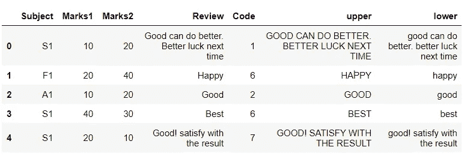**

## **4.内存使用**

**内存使用情况用于检查数据框中的列使用了多少内存。当我们需要训练模型时，使用深度学习和机器学习算法是最有用的。**

```
df.memory_usage()
```

**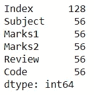**

## **5.[计]选项**

**当有许多列时，读者会遇到这个问题，有些中间的列会被省略。**

**包含长文本的列被截断。在处理数据太大而无法容纳的文本数据时使用。**

**当小数位数过多时，具有 float 数据类型的列也会被截断。**

```
# Setting the col width value
pd.set_option('max_colwidth', 500)
df[['Subject','Review']]
```

****

```
pd.set_option('min_rows', 2)
df[['Subject','Review']]
```

**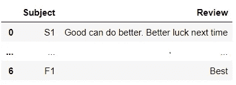**

## **6.分组依据**

**Groupby 函数包括拆分、应用函数和组合结果的组合。主要用于对大量数据进行分组并对其执行功能。**

```
tbl = df.groupby(['Subject','Code']).agg({'Marks1': ['max', np.mean],
                                 'Marks2': ['sum','min','count']})
tbl
```

**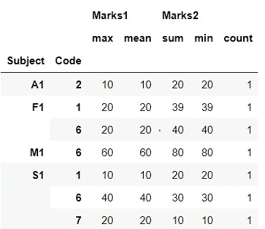**

**如果你不喜欢这种列的排列方式，总有改变的余地。使用重置索引，我们可以更改对齐。**

```
tbl = tbl.reset_index()
tbl.columns = ['Subject', 'Code', 'Mark1_max', 'Marks1_mean', 'Marks2_sum', 'Marks2_min', 'Marks2_count']
tbl
```

**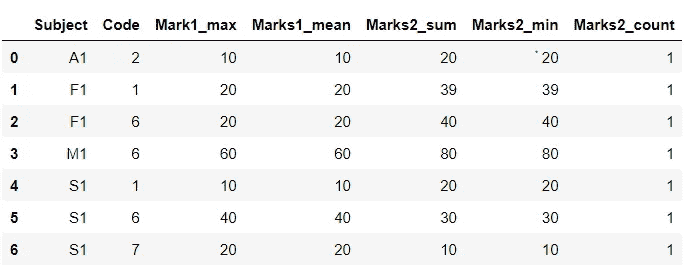**

## **7.列出组中所有唯一的值**

**获取唯一值列表。**

```
dff = pd.DataFrame(dict(A=['A','A','A','A','A','B','B','B','B'],
                       B=[1,1,1,2,2,1,1,1,2],
                       C=['CA','NY','CA','FL','FL',     
                          'WA','FL','NY','WA']))
dff[:3]
```

**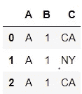**

```
tbl = dff[['A', 'B', 'C']].drop_duplicates()\
                         .groupby(['A','B'])['C']\
                         .apply(list)\
                         .reset_index()
tbl['C'] = tbl.apply(lambda x: (','.join([str(s) for s in x['C']])), axis = 1)
tbl
```

**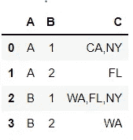**

# **8.其他功能**

## **a)累计金额**

**累计总和给出每组的累计总和。**

```
df['cumulative_sum'] = df['Marks1'].cumsum()
df
```

****

## **b)挤压**

**当您不知道您的对象是系列还是数据框，但您知道它只有一列时，此方法最有用。在这种情况下，您可以安全地调用 squeeze 来确保您有一个系列。**

```
sr = pd.Series([100, 215, 32, 123, 24, 65])
sr_temp = sr[sr % 13 == 0]
ans = sr_temp.squeeze()
print(sr_temp)
print("Seequze: ", ans)
```

**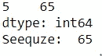**

## **c)样品**

**抽样方法允许您从系列或数据框中随机选择值。当我们想从大量数据中选择一个随机样本时，这是很有用的。**

```
df.sample(n=2)
```

****

# **9.寻找独特的价值**

**nunique 计算列和行的唯一值。当我们有分类特征时，如果唯一值太多而无法手动计数，则通常使用这种方法。**

```
df.nunique()
```

**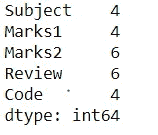**

# **10.熊猫简介**

**你可以在这里找到[笔记本](https://colab.research.google.com/drive/1RhCiogisYdBQ968DyEg7UO3RYdXB2TJm?usp=sharing)，随便玩玩。**

# **你可以在这里联系我**

**[Linkedin](https://www.linkedin.com/in/kashish-rastogi-3a8b4119a)|[Kaggle](https://www.kaggle.com/kashishrastogi)|[博客](https://www.analyticsvidhya.com/blog/author/kashish1/)**

**下面是我以前的一些作品，你可以随意看看！**

**[](https://colab.research.google.com/drive/1RhCiogisYdBQ968DyEg7UO3RYdXB2TJm?usp=sharing) [## 谷歌联合实验室

### 编辑描述

colab.research.google.com](https://colab.research.google.com/drive/1RhCiogisYdBQ968DyEg7UO3RYdXB2TJm?usp=sharing) [](/analytics-vidhya/automation-of-eda-for-superstore-dataset-ee382fa26410) [## 超市数据集的 EDA 自动化

### 探索性数据分析(EDA)是一种数据分析和数据探索的方法，采用了各种…

medium.com](/analytics-vidhya/automation-of-eda-for-superstore-dataset-ee382fa26410) [](/analytics-vidhya/fun-with-python-from-zero-to-one-915ec0c7898a) [## Python 的乐趣:从零到一

### 本文旨在讨论 Python 编程语言基础的所有关键特性。我的目标是保持…

medium.com](/analytics-vidhya/fun-with-python-from-zero-to-one-915ec0c7898a) [](/analytics-vidhya/women-ecommerce-clothing-part-1-86b1acd19ffa) [## 女性电子商务服装(上)

### 在这篇文章中，我将分析女装电子商务数据集，其中包含数字数据，文本…

medium.com](/analytics-vidhya/women-ecommerce-clothing-part-1-86b1acd19ffa) 

## 下面列出了一些有用的资源。

下面列出了一些有用的资源。

[](https://towardsdatascience.com/meet-the-hardest-functions-of-pandas-part-ii-f8029a2b0c9b) [## 认识熊猫最难的功能，第二部分

### 掌握交叉表的时间和方式()

towardsdatascience.com](https://towardsdatascience.com/meet-the-hardest-functions-of-pandas-part-ii-f8029a2b0c9b) 

# 我希望你喜欢我的作品。别忘了鼓掌。**