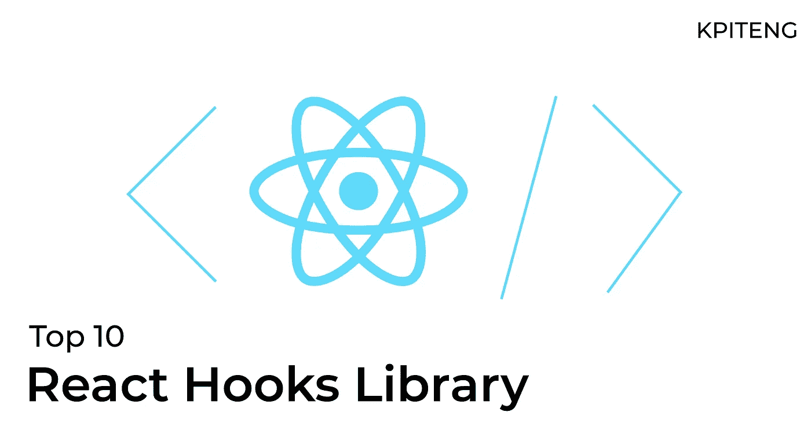

# 十大 React 钩子库

> 原文：<https://medium.com/nerd-for-tech/top-10-react-hooks-library-7a7d20c4d265?source=collection_archive---------0----------------------->

发现 10 大 React 挂钩库-使用-http，Redux 挂钩，使用媒体，React 挂钩形式，Constate，useDebounce，React 路由器挂钩，useHover，usePortal，useLocalStorage

KPITENG

钩子通过帮助编写更少的代码行、干净的代码、更可读、可维护、可重用的代码，使开发人员的生活变得更容易。现在很多流行的图书馆都提供了钩子，今天我们来看看其中的一些。

*   如果你是 Javascript 新手，看看这个[最佳 Javascript 编码实践](https://www.kpiteng.com/blogs/javascript-tips-tricks-best-practices)
*   如果你是 React 本地开发者，看看 [React 钩子](https://www.kpiteng.com/blogs/react-hooks)的构建
*   如果你想用干净的架构开始新的项目，看看[反应干净的架构](https://www.kpiteng.com/blogs/react-clean-architecture)

# 1.使用-http

use-http 是一个流行的包，用来替代 Fetch API。这是一个维护良好的库，很容易集成到几行代码中。用 TypeScript 写的钩子，支持[服务器端渲染(SSR)](https://www.kpiteng.com/blogs/introducing-zero-bundle-size-react-server-components/) 和 [GraphQL](https://www.kpiteng.com/blogs/react-native-apollo-graphql/) 。它返回响应、加载、错误数据，并使用不同的请求方法，Get、Post、Put、Patch 和 Delete。

**功能-**

*   请求/响应拦截器
*   组件卸载时中止/取消挂起的 http 请求
*   重试功能
*   内置缓存
*   类型脚本支持

GitHub readme 中的 CodeSanbox 示例和 Youtube 视频都很好地记录了这一点。

安装— **我使用的 NPM—http**

整合-

# 2.Redux 挂钩

Redux 是一个最流行的状态管理库，大部分都已经在使用 Redux 了。Redux Hooks 用现有的 connect()方法提供了一种替代 HOC(高阶组件)模式的方法。Redux Hooks 提供了一种连接存储、获取数据和分派动作的简单方法。让我们看看。

**流行雷杜钩-**

*   使用选择器
*   使用显示器
*   使用商店

安装—**NPM I react-redux @ types/react-redux**

整合-

# 3.使用媒体

你曾经面临过管理 CSS 媒体查询的问题吗？ [useMedia](https://github.com/streamich/use-media) hook 用一行代码简化了这个问题。这是一个感官挂钩，跟踪 CSS 媒体查询的状态，并帮助你设计&开发响应性应用。

使用用 TypeScript 编写媒体包。软件包有一个结构良好的文档，解释使用和测试方法。

安装— **我使用的 npm 媒体**

整合-

# 4.反应挂钩形式

[React Hook Form](https://react-hook-form.com/) 是 form hooks 库，它类似于 Formik 和 Redux Form，但是更简单，更快，更少的重渲染。useForm 返回 register，handleSubmit，errors，register 帮助注册元素，handleSubmit 管理提交操作，errors 帮助管理验证和显示元素输入错误。

安装— **npm i 反应钩形**

整合-

# 5.康斯泰特

[Constate](https://github.com/diegohaz/constate) hook 提供提升局部状态来反应上下文级别。因此，您可以用几行代码在应用程序的任何地方访问/更新状态变量。当您在多个组件中使用相同的状态时，这很有用。例如，你在多个组件中使用主题、颜色、字体，用户可以在一个地方改变，这应该反映在整个应用程序中。用 TypeScript 写的包，非常紧凑。

安装— **npm i constate**

整合-

# 6.使用反跳

[使用去抖](https://github.com/xnimorz/use-debounce)挂钩——顾名思义——用于去抖。它用于将执行推迟到以后，就像 React Native 中的 setTimeout 一样。

安装— **我使用的 npm 去抖**

整合-

# 7.React 路由器挂钩

[React Router](https://reactrouter.com/web/api/Hooks) 是一个流行的库，用于组件路由、组件历史管理等等。

**流行路由器挂钩-**

*   使用历史
*   使用动作
*   使用参数
*   useRouteMatch

useHistory 帮助开发人员管理组件导航历史。useLocation 返回表示当前 URL 的对象，以管理基于 URL 的用例。useParams 返回在组件之间路由时发送的变量(参数)。useRouteMatch 将 currentURL 与给定的字符串进行匹配，以执行一个用例。

安装— **npm i react-router-dom**

整合-

# 8.使用悬停挂钩

如果被悬停，使用悬停钩子识别反应元素。它非常易于使用和集成。它还提供悬停效果的延迟。useHover 支持 TypeScript。

安装— **npm 我反应—使用—悬停**

整合-

# 9.使用门户网站

[usePortal](https://github.com/alex-cory/react-useportal) 钩子允许在应用程序的 DOM 层次结构之外创建元素。使用广泛的门户网站，有下拉菜单，通知弹出窗口，模态，工具提示。usePortal 与服务器端渲染(SSR)一起工作，因为它是同构的。使用用 TypeScript 编写门户。它允许定制门户样式和更多选项。

usePortal 有一个定义良好的 Github 自述文件，其中包含每个 SSR、模态、下拉菜单和工具提示的代码框示例。

安装— **npm i 反应—使用门户**

整合-

# 10.使用位置存储

[useStorage](https://github.com/rehooks/local-storage) hook 允许开发者在 localStorage 中提取和保存数据。它自动执行 JSON 序列化和同步。useLocalStorage 用 TypeScript 编写，所以它提供类型。

安装—**NPM I @ re books/local-storage**

整合-

感谢阅读博客！

 [## 反应钩

### React 挂钩的逐步集成— useState、useEffect、useRef、useMemo、useCallback

kpiteng.medium.com](https://kpiteng.medium.com/react-hooks-270f949ad4f4) 

阅读更多[技术文章](https://www.kpiteng.com/blogs)

[KPI Teng](https://kpiteng.com)|[hello@kpiteng.com](mailto:hello@kpiteng.com)| |数字化转型

连接我们— [Linkedin](https://www.linkedin.com/company/kpiteng/) | [脸书](https://www.facebook.com/kpiteng) | [Instagram](https://www.instagram.com/kpiteng/)