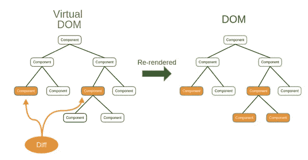

# 关于 React，你应该了解的 10 件事

> 原文：<https://medium.com/nerd-for-tech/top-10-things-you-should-learn-about-react-cbce3a56126d?source=collection_archive---------10----------------------->

如果你想成为一名 react 开发者，你必须知道这 10 件事。

**简介:** React 是一个 Javascript 库，用于构建交互式快速用户界面或 UI 组件。它使得构建动态 web 应用程序变得更加容易。因为它需要更少的代码并提供更多的功能。另一方面，在 javascript 中，编码通常会很快变得复杂。

**01。JSX:** 意思是 Javascript 语法扩展。它用来描述用户界面应该是什么样子。通过使用 JSX，我们可以在包含 javascript 代码的同一个文件中编写 HTML 结构。这使得代码更容易理解和调试。它将 HTML 设置为 javascript 代码。在这个例子中，我将向您展示 JSX 是如何实现 react 的。

示例:

实施 JSX

**02。虚拟 DOM:** DOM 的意思是文档对象模型。DOM 将 XML 或 HTML 文档表示为树结构，其中每个节点是一个对象，代表文档的一部分。虚拟 DOM 是为我们的页面创建的实际元素的轻量级表示。操作真实的文档对象模型比操作虚拟 DOM 慢得多。因为屏幕上什么也没画。当一个对象的状态改变时，虚拟 DOM 只改变真实 DOM 中的对象，而不是更新所有的对象。当对象的状态改变时，虚拟 DOM 得到更新。

示例:

虚拟 DOM 如何工作

03 年。组件:它是 react 应用程序的构建块。无论大小，都是可重用、可组合和有状态的代码。我们定义小组件，然后将它们放在一起形成一个更大的组件。我们可以在多个 UI 中重用单个组件。我们称这个函数为相同的输入，它们给我们相同的输出。我们可以根据需要重用函数，组合从小到大的函数。在 react 中，组件完全一样，输入是一组道具，输出是对 UI 的描述。

示例:

**04。钩子:**react 组件中的钩子是对特殊函数的调用。所有的钩子函数都是以单词“use”开始的。它们中的一些可用于提供具有状态元素的功能组件，如“useState ”,其他的可用于管理副作用，如“useEffect”。它只能在功能组件中使用。我们不能在类组件中使用它们。

示例:

**05。State:** 这是一个内置的 react 对象，用于包含关于组件的数据。组件状态可以再次改变。当状态改变时，组件重新呈现。状态的改变可以作为对用户动作的响应而发生，并且这些改变决定了组件的行为。

示例:

**06。Props:** 它是一个 react 内置对象，存储 tags 属性的值，工作方式类似于 HTML 属性。它提供了一种将数据从一个组件传递到另一个组件的方式，就像在函数中传递参数一样。

示例:

**07。PropsTypes:** React props 提供了一种方法，以同样的方式将数据从一个组件传递到另一个组件。我们可以使用 propsType 来验证从 props 接收的任何数据。PropsTypes 也是对象，其中键是属性名，值是它们的类型。

示例:

**08。JSX 的表达式:**在 JSX，我们可以用一对花括号放入任何有效的 JavaScript 表达式。只有表达式可以包含在这些花括号中。我们不能包含常规的 if-else 语句，但是三元表达式是可以的。

示例:

09 年。Webpack: 它只为生产模式最小化代码。请记住，我们只需要为生产构建这样做。我们不应该在开发中使用 TerserPlugin。因为它会隐藏有用的反应警告，使构建速度变慢。

示例:

**10。constructor():**react 组件中的构造函数在组件挂载之前被调用。在 react 组件中，当我们实现构造函数时，我们需要在任何其他语句之前调用(super(props))方法。如果我们不调用(super(props))方法，那么(this.props)将在构造函数中未定义。

示例: