# 提高编码速度的十大 VS 代码快捷方式

> 原文：<https://medium.com/nerd-for-tech/top-10-vs-code-shortcuts-to-improve-your-coding-speed-e1218e4de4b9?source=collection_archive---------0----------------------->

## VS 代码中一些最常用的快捷键来加速你的编码。

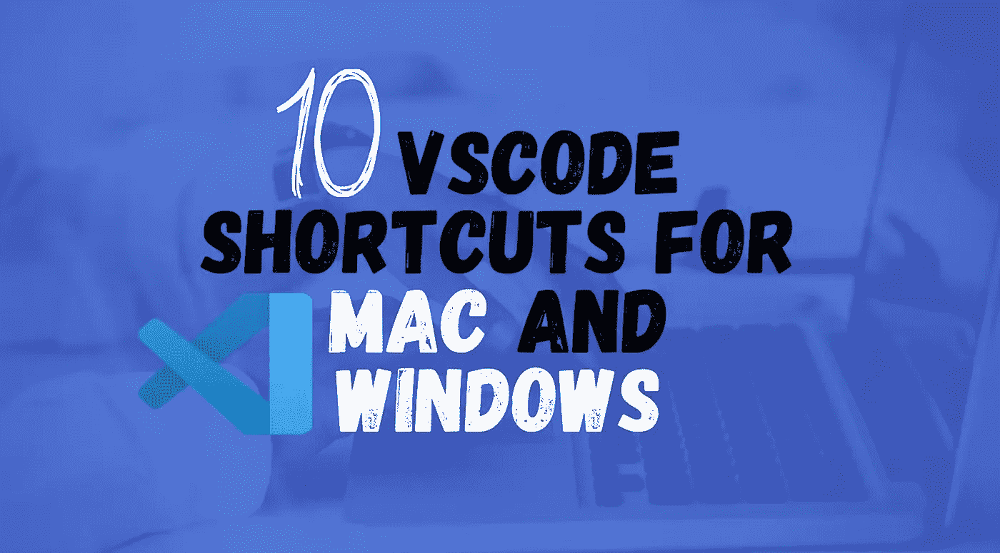

本文将讨论一些在 VS 代码中最常用的快捷方式来加速你的编码。

*   ***一般***
*   ***编辑***
*   ***导航***
*   ***搜索&替换***
*   ***多光标和选择***

在这里，我添加了一些额外的快捷方式，在某些情况下可能会有所帮助。如果你发现了其他快捷方式，请在评论中告诉我。

# 常规快捷方式

## 1.显示命令调板

**Windows:**CTRL+SHIFT+P
Mac:CMD+SHIFT+P

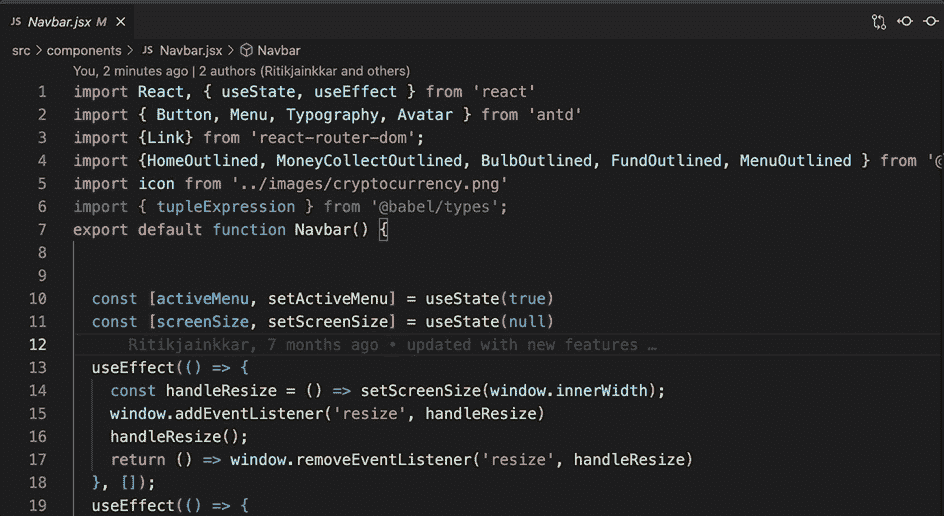

## 2.快速打开，转到文件

**Windows:**CTRL+P
Mac:CMD+P

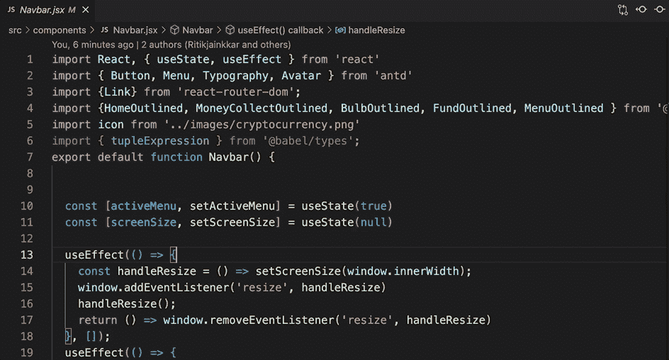

## 3.新窗口/实例

**Windows:**CTRL+SHIFT+N
Mac:CMD+SHIFT+N

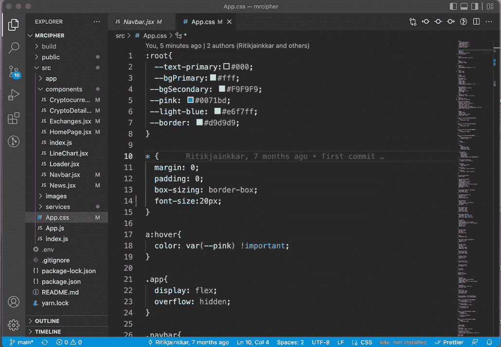

## 4.关闭窗口/实例

**Windows:**CTRL+SHIFT+W
Mac:CMD+SHIFT+W

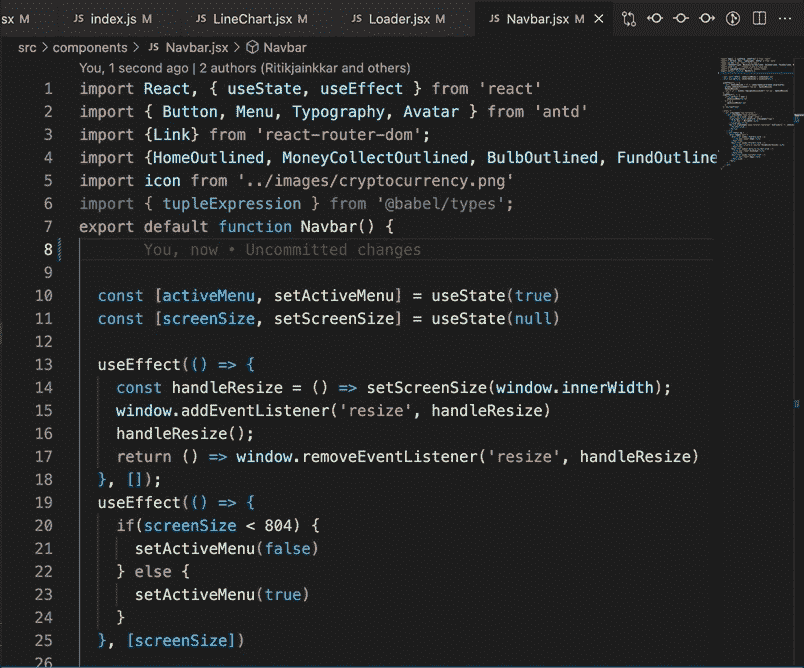

## 5.折叠/展开区域

**Windows:**CTRL+SHIFT+]/[
**Mac:**CMD+OPTION+]/[

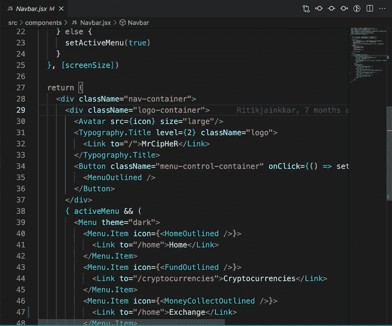

# 编辑快捷方式

## 1.跳到匹配的括号

**Windows:**CTRL+SHIFT+\
**Mac:**CMD+OPTION+\

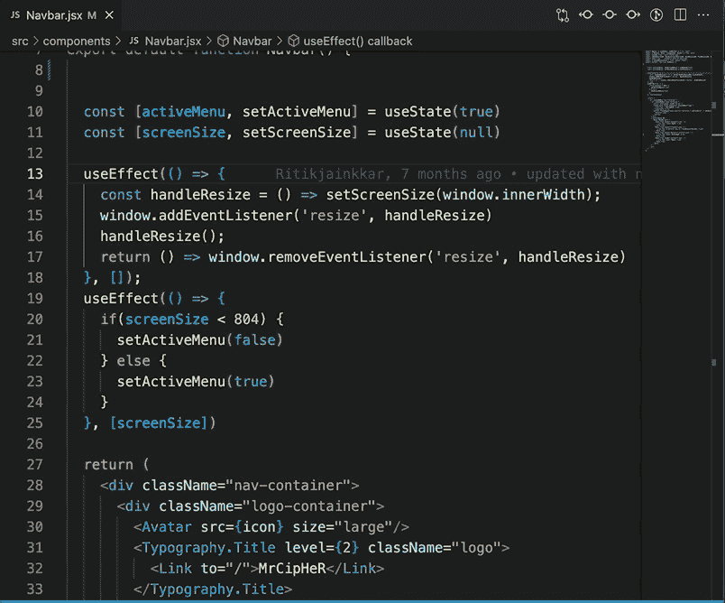

## 2.缩进/突出行

**Windows:**CTRL+]/[
**Mac:**CMD+]/[

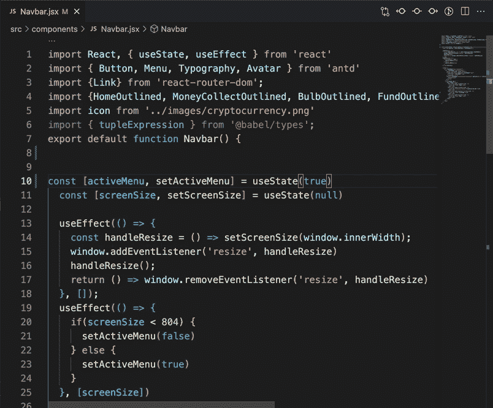

## 3.切换行注释

**Windows:**CTRL+/
**Mac:**CMD+/

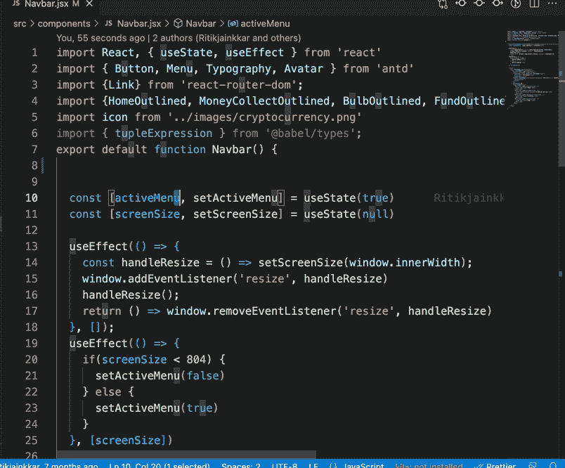

## 4.移动代码

**Windows:**ALT+↑/↓
Mac:OPTION+↑/↓

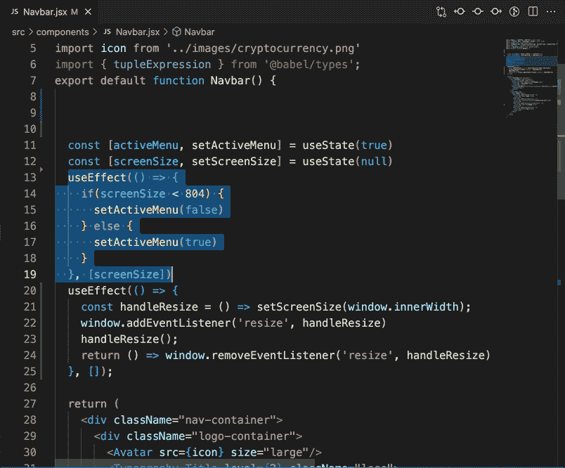

# 搜索和替换

## 1.发现

**Windows:**CTRL+F
**Mac:**CMD+F

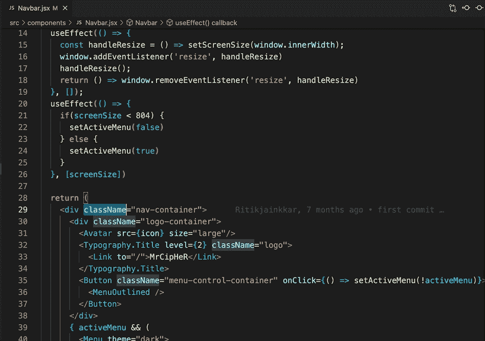

## 2.替换

**Windows:**F2
Mac:F2

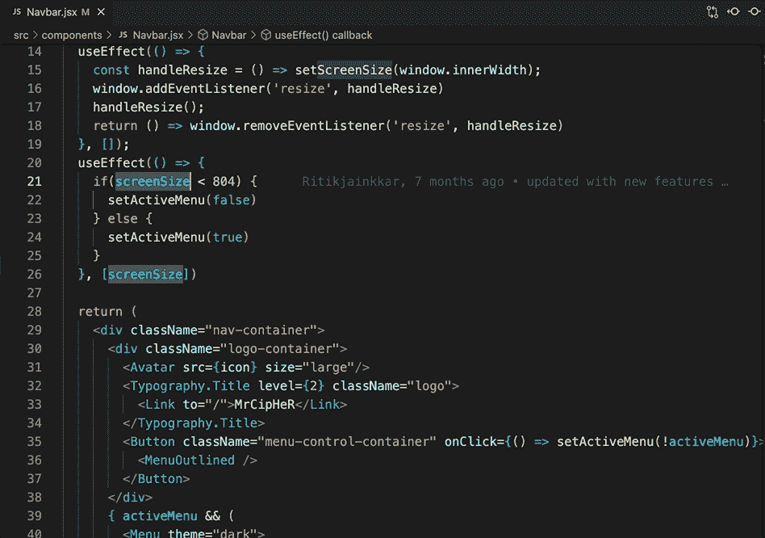

## 3.将所选内容添加到下一个查找匹配项

**Windows:**CTRL+D
Mac:CMD+D

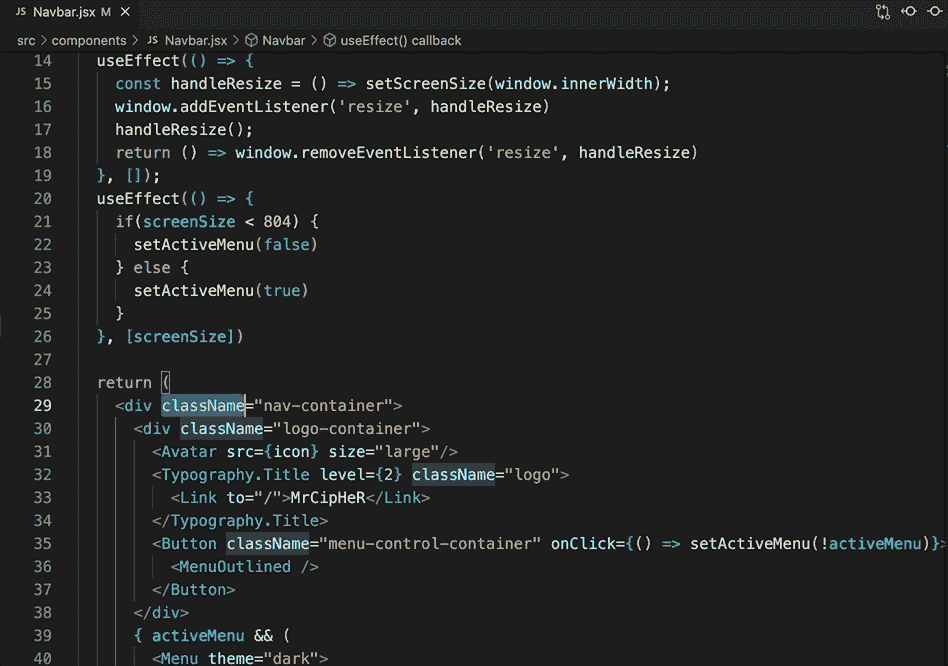

## 4.接下来找到匹配

**Windows:**F3
Mac:FN+F3

# 航行

## 1.向上/向下滚动页面

**Windows:**CTRL+↑/↓
**Mac:**CMD+↑/↓

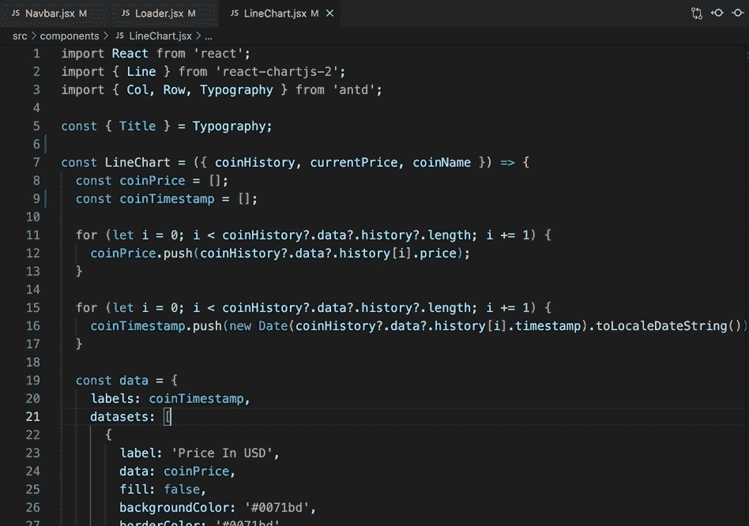

## 2.转到最近使用的文件

**Windows:**CTRL+TAB
Mac:CTRL+TAB

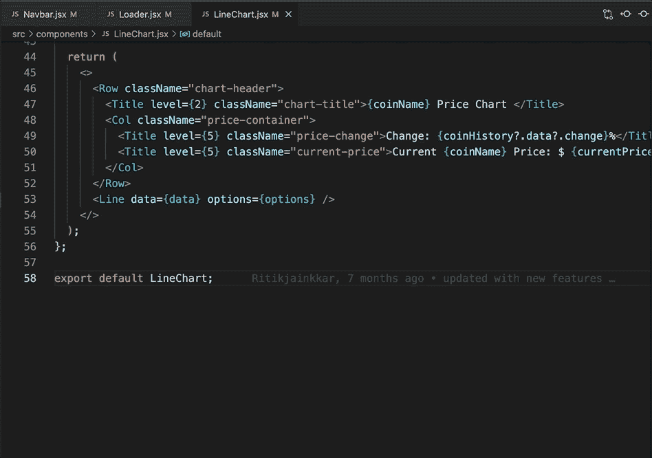

# 多光标和选择

## 1.插入光标

**Windows:**ALT+CLICK
Mac:CMD+CLICK

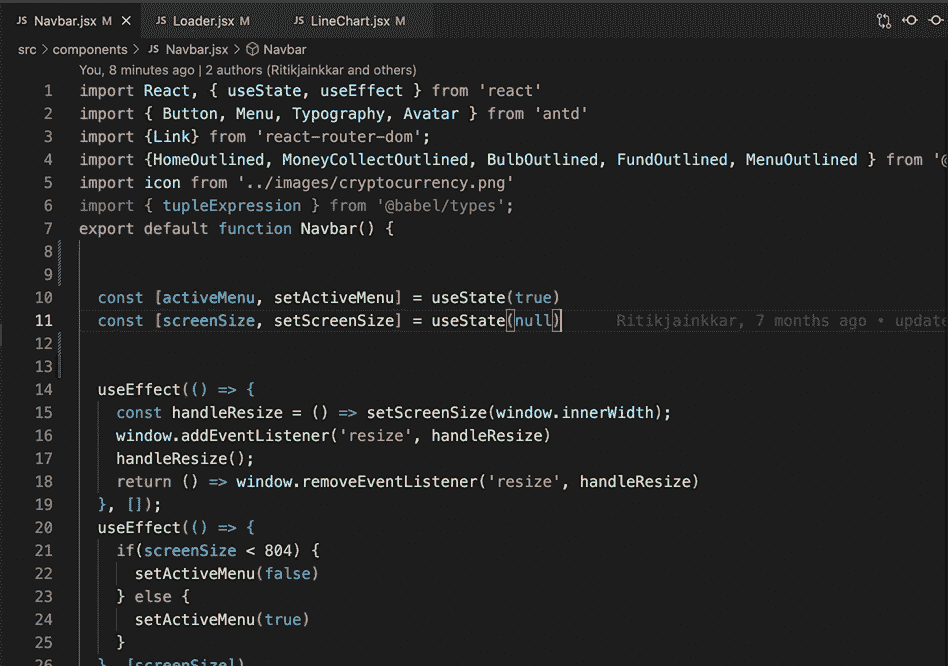

## 2.将光标插入上方/下方

**Windows:**CTRL+ALT+↑/↓
Mac:CMD+OPTION+↑/↓

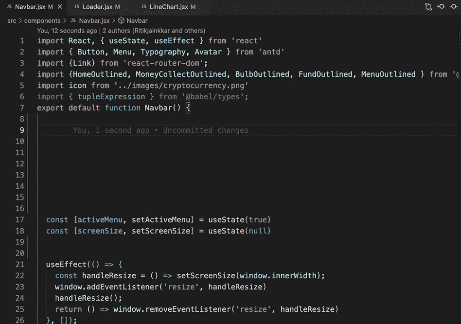

## 3.选择当前单词的所有匹配项

**Windows:**CTRL+SHIFT+L
Mac:CMD+SHIFT+L

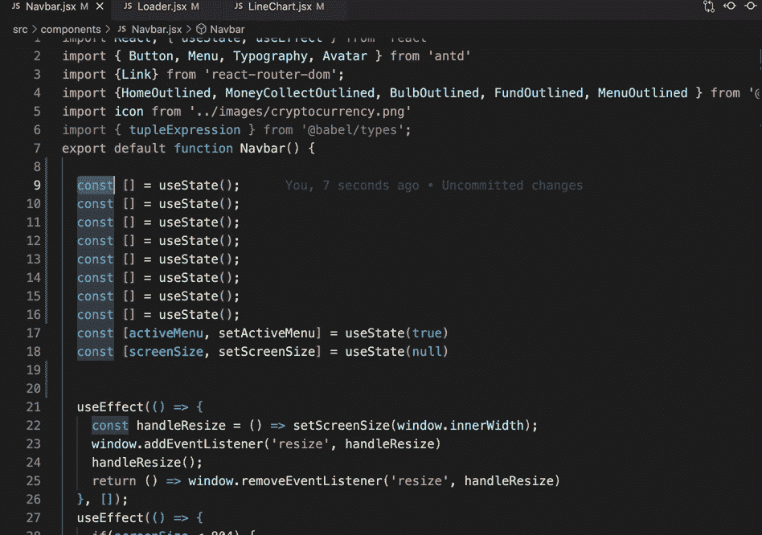

这就把我们带到了终点！非常感谢你一直读到最后——如果这篇文章在任何意义上有所帮助，我会很感激一个跟随来帮助我达到我的目标。:)

请随时访问我的网站，如果您有任何关于 JS/DevOps 的疑问，请随时与我联系。

[https://ritikchopra . netlify . app](https://ritikchopra.netlify.app/)

祝你好运！里提克·乔普拉😘

*更多内容看* [***说白了。报名参加我们的***](https://plainenglish.io/) **[***免费周报***](http://newsletter.plainenglish.io/) *。关注我们关于*[***Twitter***](https://twitter.com/inPlainEngHQ)*和**[***LinkedIn***](https://www.linkedin.com/company/inplainenglish/)*。查看我们的* [***社区不和谐***](https://discord.gg/GtDtUAvyhW) *加入我们的* [***人才集体***](https://inplainenglish.pallet.com/talent/welcome) *。****