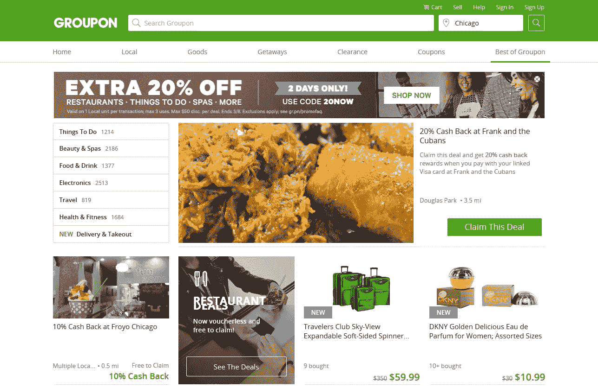
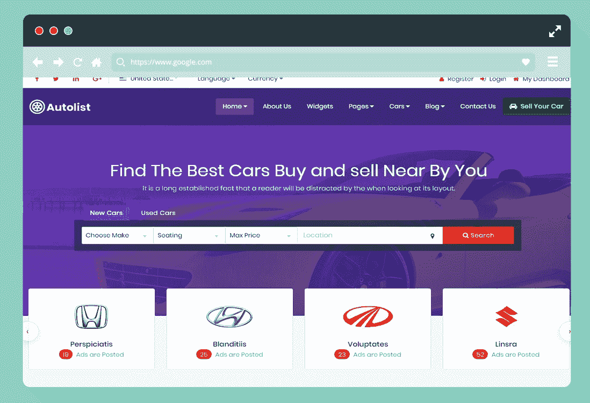
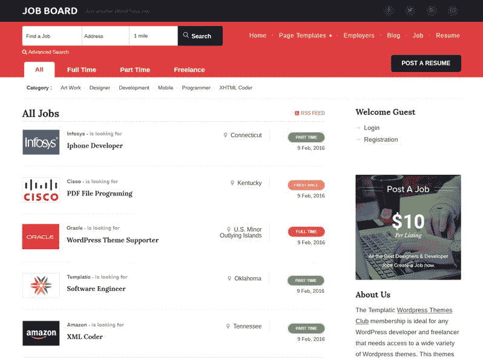
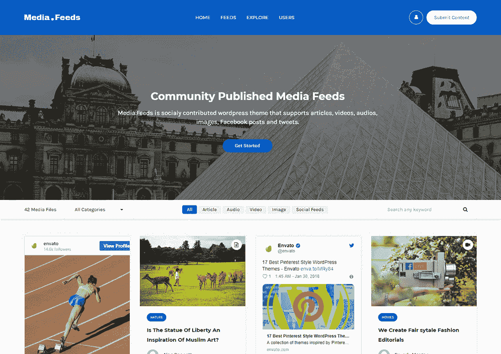

# 2021 年你不应该错过的 15 个 WordPress 网站开发创意

> 原文：<https://medium.com/nerd-for-tech/top-15-wordpress-website-development-ideas-you-shouldnt-miss-out-in-2021-2983362adde1?source=collection_archive---------17----------------------->

[图像来源](https://tortoiseandharesoftware.com/blog/essential-design-considerations-for-a-wordpress-website/)

WordPress 是近十年来最伟大的 CMS 之一，它毋庸置疑的受欢迎程度正在引领这个 CMS 走向大多数网站开发工作。如果你想创建一个网站，WordPress 会是你脑海中的第一个想法。

此外，你的脑海中会浮现出一千个问题，关于你能用 WordPress 或诸如此类的东西完成什么。不是吗？

不要给自己压力；在这篇文章中，我们将描述所有你能找到的 WordPress 网站的想法。

# 2021 年最受欢迎的 WordPress 网站创意

## #1.商业网站

商业网站是最熟悉的 WordPress 网站理念，也是大多数企业(尤其是小企业)最熟悉的。使用 WordPress 建立一个专业的商业简介网站是非常容易的，而且它在成本上也派上了用场。

此外，事实上，每年印度的一家 WordPress 开发公司都会收到一千个商业网站的创建线索。此外，流行和强大的品牌正在使用 WordPress 创建他们的商业网站。

**为什么？**

广泛的主题，有效的可扩展性，并使您获得优质的 SEO 插件流量。

## #2.电子商务

你认为一个电子商务网站不能在 WordPress 上开发吗？大多数人认为在 WordPress 上开发的电子商务网站不能处理大流量，但这不是真的。因为 WordPress 得到了增强，功能强大到足以处理繁重的负载。

此外，它允许您管理一些任务，如在线支付，库存，运输税。

[图像来源](https://templatic.com/wp/best-ecommerce-wordpress-themes/)

**为什么？**

WordPress 是一个简单易用的电子商务解决方案，拥有 WooCommerrce 这样令人惊叹的插件和众多的主题，让购物体验变得天衣无缝。

## #4.网络杂志新闻门户

如果你想通过与人分享有价值的信息来获得收益，新闻门户/在线杂志是最简单的 WordPress 网站理念。使用 WordPress 作为新闻门户可以让你处理一个拥有数千页的大型网站。

此外，WordPress 适合处理巨大的流量和管理页面上的内容。

**为什么？**

很容易创建一个拥有数百万页面的网站，更少需要编码来管理页面上的内容，以及使页面索引和排名更容易的插件。

## #5.播客

播客作为当今商业中的一个主要趋势正在蓬勃发展，通过以音频格式分享有趣的信息来吸引消费者。还有！WordPress 允许你用难以置信的播客创建一个网站。WordPress 插件致力于播客功能，使你能够整合音频。

播客允许您为您的内容获取更多订户，获得电子邮件列表，以及管理下载。

**为什么？**

简单的插件可用于集成播客，语音索引，使您能够利用语音的力量，通过影响人们来提高您的网站流量和销售。

## #6.博客

无论你想的是个人博客、行业博客还是特定领域的时事通讯，博客都是 WordPress 网站的最佳创意，如今有数百万博客网站在 WordPress 上运行。随着时间的推移，WordPress 博客变得更加成熟和无缝。

WordPress 允许你快速管理你的博客，轻松缩放页面。最重要的是，你可以利用搜索引擎优化和营销实践向人们展示你的作品。

**为什么？**

内置的搜索引擎优化插件使你的内容在网上被发现的机会很高，使你能够瞄准网上不同的利基市场，这是一个强大而简单的 CMS 系统。

## #7.利基联盟平台

代销店是一个迅速发展的 WordPress 网站理念，大多数年轻的企业家都采用这一理念，通过将用户推荐到其他平台来赚取额外的财富。WordPress 是制作联盟营销平台的最佳工具，因为有各种各样的工具可以用来创业。

此外，你还可以开发一个亚马逊代销店，让你在 Amazon.com 上销售你的产品。

[图片来源](https://torquemag.io/2017/03/build-your-own-affiliate-website-using-wordpress/)

**为什么？**

WordPress 可以轻松集成其他平台和功能，如支付网关、佣金分配功能等等。

## #8.知识库/维基网站

如果你正努力在你的网站上添加一个知识库文档部分，那么 WordPress 是完美的 CMS。创建基于知识和类似维基的网站是最古老的 WordPress 网站理念之一。'

WordPress 允许你以不同的方式创建类似 Wiki 的网站，比如使用主题或者使用专门的 WordPress wiki 插件或者自定义代码片段。简而言之，你可以用 WordPress 设计一个高度可扩展的、加载速度更快的知识库网站。

**为什么？**

实现页面之间更高的可扩展性，轻松管理页面上的内容，访问广泛的主题。

## #9.拍卖商店

拍卖商店是 2021 年最受欢迎的 WordPress 网站创意之一，因为通过该平台赚钱有了更多选择。有了 WordPress，创建一个功能齐全的拍卖网站变得简单而划算。还有！如果你理解在 WordPress 上工作，并且知道一点 PHP 编码，你可以自己开发它。

现在，用户渴望利用像易贝这样的平台，在网上竞价购买/销售产品。

[图像来源](https://uicookies.com/auction-website-template/)

**为什么？**

WordPress 允许轻松集成支付网关、安全的资金转移系统以及更高的安全性和可扩展性。

## #10.在线论坛和社区

在线论坛和社区是最受欢迎的 [**WordPress 开发服务**](https://www.valuecoders.com/top-wordpress-development-services-company-india?utm_source=medium_wordpress_idea&utm_medium=d7&utm_campaign=medium_wordpress_idea)**之一，因为它使企业能够为人们的互动创建论坛&社区。这些社区可以为不同的目的而开发，例如获得对书籍、电视节目、电影、公司或产品的评论。**

**此外，你可以开发一个社区网站来讨论公众感兴趣的话题。**

****为什么？****

**创建一个有许多插件和扩展的表单，将注册表单与简单的在线事件相结合。**

## **#11.问答平台**

**每秒钟，数以百万计的问题出现在互联网上，其中大多数问题涉及不同的方面。创建一个网站来回答世界各地人们的日常查询越来越受欢迎。**

**如果你正在考虑创建一个类似雅虎问答或 Quora 的平台，那么你必须考虑[**WordPress web development**](https://www.valuecoders.com/top-wordpress-development-services-company-india?utm_source=medium_wordpress_idea&utm_medium=d7&utm_campaign=medium_wordpress_idea)**。它使你能够组合众多的工具、社区、插件和主题。****

****

**[图像来源](https://athemes.com/collections/best-question-answer-wordpress-themes/)**

****为什么？****

**为用户创造无缝的 UI 体验；简单的网页索引与搜索引擎优化插件和网页排名可以处理巨大的日常流量。**

## **#12.企业行名录**

**商业目录在网络上有很大的需求，因此它在我们的顶级 WordPress 网站创意列表中。你可以使用一些非常好的、用户友好的 WordPress 商业目录插件，让你以较低的预算获得无缝的、易于管理的目录。**

**此外，你可以使用各种免费工具，帮助你提高排名，网站推广和用户体验。**

****为什么？****

**WordPress 允许你实现更高的网站可扩展性，网站开发的简易性和对众多插件的访问。**

## **#13.工作板平台**

**Job Boards 是 WordPress 网站 2021 年的一个流行创意，因为一些用户在网上寻找可靠的工作机会来源。WordPress 给了你使用各种插件的机会，这些插件可以在一个页面上登记大量的内容信息，比如工作或商业信息。**

**您可以利用这些插件向人们展示您在提供工作数据方面的卓越表现，并使招聘过程对他们来说天衣无缝。**

****

**[图片来源](https://templatic.com/wordpress-job-themes/job-board)**

****为什么？****

**访问各种扩展来集成公司评论、员工反馈和付费服务的可用性等功能。**

## **#14.作品集网站**

**无论你是作家、摄影师、艺术家还是医生，在网上创建作品集都可以帮助你获得很多机会。这就是为什么创建作品集是 WordPress 网站十年来的最佳创意。**

**插件和主题的巨大范围使得作品集的开发变得很方便，你也可以通过对 WordPress CMS 的一点了解来自己开发。**

****为什么？****

**增加你的外联和寻求流行的类型和简单的组合网站开发几乎没有价格。**

## **#15.图像和照片分享网站**

**如今，摄影和图形是互联网上最受推崇的方面之一。从风景照片到幻想图形，对付费和免费图像的需求很大。因此，一个图片和摄影网站在我们的 WordPress 网站创意列表中。**

**有了 WordPress，你可以很容易地让这样一个网站得到发展，并通过上传各种图形和风景图片来赚取。此外，你还可以鼓励用户在你的网站上上传这样的内容。Pinterest 是这一领域最受欢迎的例子。**

****

**[图像来源](https://colorlib.com/wp/photo-sharing-wordpress-themes/)**

****为什么？****

**开发新的业务，轻松地为人们提供免费和收费的展示内容，并通过无缝 CMS 轻松管理大量数据。**

# **包扎**

**这些是 2021 年最受欢迎的想法，大多数创业爱好者和企业家都认为通过小小的努力就能发财。如果你有任何商业想法，那么 [**现在就雇佣 WordPress 开发者**](https://www.valuecoders.com/hire-developers/hire-wordpress-developers?utm_source=medium_wordpress_idea&utm_medium=d7&utm_campaign=medium_wordpress_idea) 。**

**这个平台以非常小的解决方案开发成本打开了一扇机会之门，并允许您利用一个以分享和关怀为道德标准的大型商业社区。**

**同时，让我知道你最喜欢哪个网站创意？写在评论区，如果你想在列表中添加一个想法，建议总是受欢迎的。**