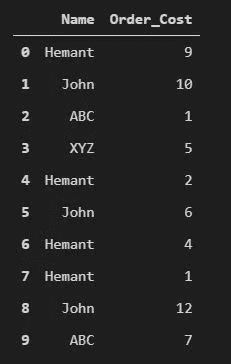
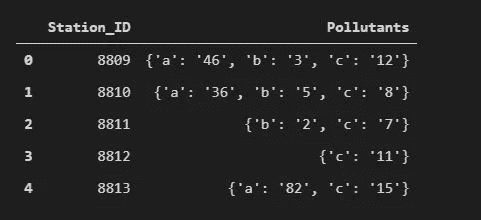
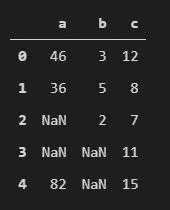
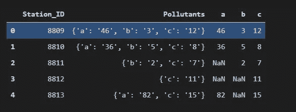
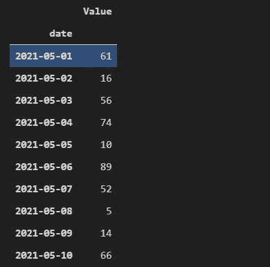
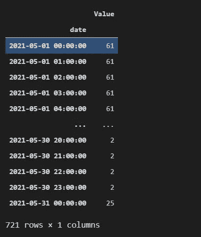
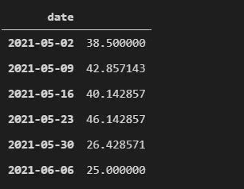

# 我希望我以前就知道的 3 大熊猫把戏

> 原文：<https://medium.com/nerd-for-tech/top-3-pandas-tricks-i-wish-i-knew-before-604cbe4166ea?source=collection_archive---------1----------------------->

## 关于熊猫一些有用功能的重要提示和技巧


Christopher Gower 在 [Unsplash](https://unsplash.com?utm_source=medium&utm_medium=referral) 上的照片

**Pandas** 是一个快速、强大、灵活且易于使用的开源数据分析和操作工具，构建于 [Python](https://www.python.org/) 编程语言之上。

许多数据分析师和科学家一直在使用 Python，并且通常在清理和预处理步骤中使用大量的 Pandas。

因此，我想到写这篇文章，因为我自己也努力寻找这些问题的解决方案，希望我以前知道如何解决它们。

# 1.各组内的百分比

我遇到的最令人沮丧的事情之一是如何找到一个组中每个值的百分比。在翻了一遍关于堆栈溢出的答案，翻了一大堆文章之后，我找到了使用`apply`和`lambda`函数的解决方案。

考虑下面的数据框架:

```
names = ['Hemant', 'John', 'ABC', 'XYZ', 'Hemant', 'John', 'Hemant', 'Hemant', 'John', 'ABC']cost = [9, 10, 1, 5, 2, 6, 4, 1, 12, 7]df = pd.DataFrame({'Name': names, 'Order_Cost': cost})
```



来源:作者图片

现在，给定数据框架，我想找出一组中每一行的百分比，即每一项占总数的百分比。这可以使用下面的`apply()`和`lambda`命令来完成。

```
perc_order_cost = df.groupby('Name')['Order_Cost'].apply(lambda x : x/x.sum()*100)df['perc_order_cost'] = perc_order_cost
```


来源:作者图片

如你所见，我们首先按每个名字分组，即 4 个组，即*赫曼特、约翰、ABC、*和 *XYZ。*然后，我们对*订单成本*列应用 lambda 函数 `x/x.sum()`，而不是汇总数据。例如，对于 ***赫曼特*** 组，订单总成本为 9 + 2 + 4 + 1 = 16。百分比分别计算为 9/16 = 56%、2/16 = 12%、4/16 = 25%和 1/16 = 6%。对于每一行(x ),它将除以该组的总和。

# 2.将一列词典转换成单独的列

很多时候，尤其是在使用 JSON 时，您得到的数据可能在列中存储了字典。例如，*污染物*列有一个字典，其中有 3 个关键字，即 *a、b、*和 *c.*



来源:作者图片

我们可以使用`pd.json_normalize()`和`.apply(pd.Series)`两种方法将这个字典列转换成多个以关键字为头的列。让我们来看看下面的实际情况:

## a)使用 pd.json_normalize()

```
pd.json_normalize(df['Pollutants'])
```



来源:作者图片

如你所见，在`json_normalize()`之后，凡是键不存在的地方，值都将是 NaN，其他地方的值都将被相应地填充。

由于它返回一个数据帧，我们可以将它连接回原始数据帧。

```
pd.concat([df, pd.json_normalize(df['Pollutants'])], axis = 1)
```



来源:作者图片

## b)使用。应用(pd。系列)

```
df['Pollutants'].apply(pd.Series)
```

类似地，如果我们*对包含字典值的列应用*函数`pd.Series`，也可以获得相同的结果。这将给出与上面相同的结果。

将它添加到原始数据帧的另一种方式是以传统方式分配它，即选择与键的数量相等的列的数量。

```
df[['a', 'b', 'c']] = df['Pollutants'].apply(pd.Series)
```

# 3.对时间序列数据进行分组和重采样

在对数据进行重采样后获得分组的意义上，重采样与分组非常相似。但是重采样用于 DateTime 数据类型。

然而，当对数据帧进行分组时，您是按可以是任何数据类型的某个列进行分组的。

它可以是数据帧中的索引或任何列，但`resample()`总是用于日期时间对象。此外，在大多数情况下，当处理时间序列数据时，您会将索引设置为 DateTime 列，因为这有助于简化分析。

重采样的基础是你需要传递一个频率，比如 D 代表天，M 代表月，等等。这些信息也可以在文档中找到。

让我们看一个重采样如何工作的例子。考虑以下数据:

```
dates = pd.date_range(start = '2021-05-01', end = '2021-05-31')values = np.random.randint(100, size = 31)df = pd.DataFrame({'date': dates, 'Value': values})df.set_index('date', inplace=True)
```

这给了我们一个有 31 天的数据帧和一些随机值用于*值*列。下面是数据的快照:



来源:作者图片

## a)对数据进行上采样

上采样是增加 DateTime 对象频率的过程，即您将较高的单位(如*年*)转换为较低的单位(如*天)。*例如，如果您每年都有定期数据，并且您想要月级别的数据，那么您可以传递月的频率，pandas 将在每年的间隔之间插入每个月的值。

假设我们想给所有的日子添加一些每小时的数据，我们可以通过每小时重新采样来做到这一点，只要值不存在，我们就会得到 NaN 值。

```
hourly = df.resample('H').ffill()
```



来源:作者图片

在这里，因为每天从 00:00 开始，所以我们插入每小时的时间间隔，并使用`ffill()`填充数据集中的 nan。通常，当你对数据进行上采样时，你会结束插值或填充 NANs。

## b)对数据进行下采样

下采样与上采样相反，应用某种聚合函数来降低频率，即从几天到几个月，并通过应用某种聚合函数将数据分组在一起。

假设我们希望将每日数据缩减采样为每周数据，并获得每周平均值。

```
weekly = df.resample('W').mean()
```



来源:作者图片

这里，我们每周对指数进行分组，并应用`mean()`作为聚合函数。

这些是一些最常见的提示，我希望我以前就知道。我希望这能帮助你走出困境。

请随时给我同样的反馈。

来打个招呼吧！在[推特上给我](https://twitter.com/hemantrattey)。