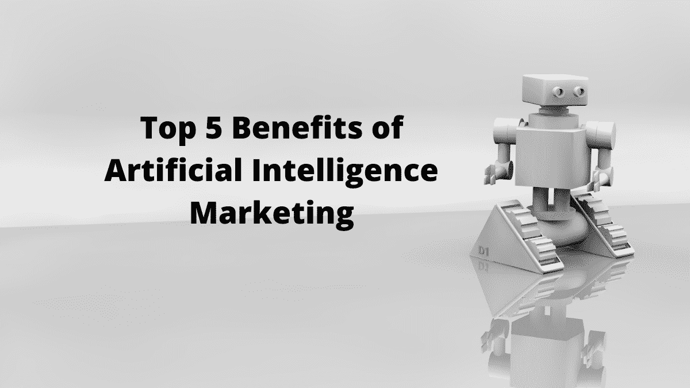

# 2022 年人工智能营销的 5 大好处

> 原文：<https://medium.com/nerd-for-tech/top-5-benefits-of-artificial-intelligence-marketing-in-2021-364b83db4921?source=collection_archive---------0----------------------->

根据 [Fortune Business Insights](https://www.fortunebusinessinsights.com/industry-reports/artificial-intelligence-market-100114) 的数据，2019 年全球人工智能(AI)市场为 272.3 亿美元，预计到 2027 年将达到 2669.2 亿美元，预测期内 CAGR 为 33.2%。

# 什么是人工智能营销？

人工智能营销(AI Marketing)是一种利用客户数据和机器学习等人工智能概念来预测客户的下一步行动并改善客户旅程的方法。

# 人工智能营销的好处:

**1。互动聊天机器人**

聊天机器人可以访问数百万以客户为中心的数据点。人工智能聊天机器人可以通过聚集特定位置的请求来检测模式，发现重复问题，并提供解决方案，从而预测特定客户的问题原因。

从时尚到健康到保险，智能聊天机器人正在提供近乎神奇的客户支持。在某些情况下，他们比人类更擅长创造个性化的内容。

**2。智能电子邮件营销**

人工智能使得向每个客户发送个人策划的电子邮件成为可能。通过分析客户的阅读模式和感兴趣的话题，向客户推荐最相关的具体内容，人工智能辅助电子邮件可能会变得对每个客户都更有吸引力。

**3。更聪明的广告**

人工智能广告可以深入挖掘关键词搜索、社交档案和其他在线数据，以获得人类水平的结果。随着大量数据的出现，在线广告可以变得更加智能和简单。

**4。动态定价**

通过实现动态定价，人工智能可以帮助品牌在定价上更具竞争力。通过评估大量的历史和竞争数据，人工智能平台可以实时建议产品的最佳价格。这一策略在零售业尤其有效。它允许品牌调节价格，以反映产品的需求，促进销售，并在竞争中胜出。

**5。人工智能驱动的内容创作**

人工智能正在为营销转变内容生产，这将有助于提高投资回报率和业务增长。

营销人员可以使用人工智能来识别潜在的客户或买家，并提供与他们最相关的理想内容。

*原载于 2020 年 6 月 4 日*[*【http://digitalthoughtz.com】*](https://digitalthoughtz.com/2020/06/04/top-5-benefits-of-artificial-intelligence-marketing/)*。*