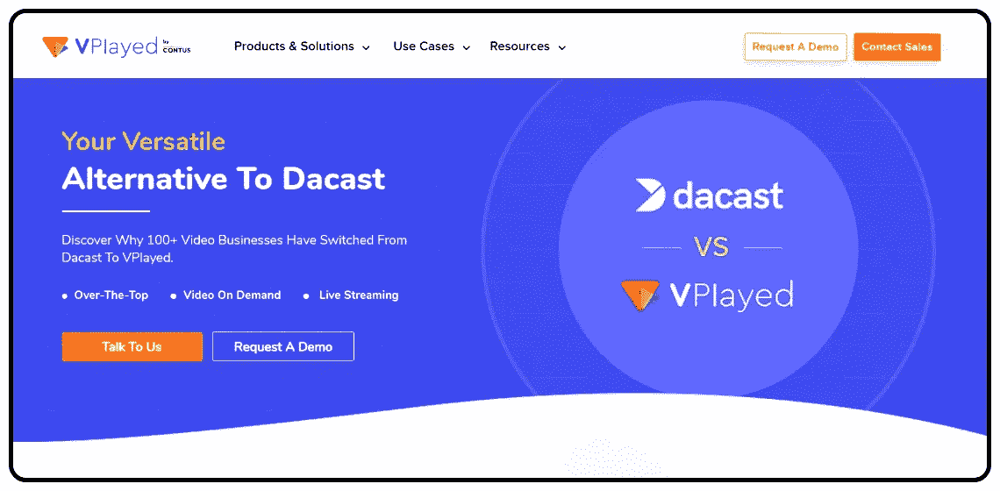
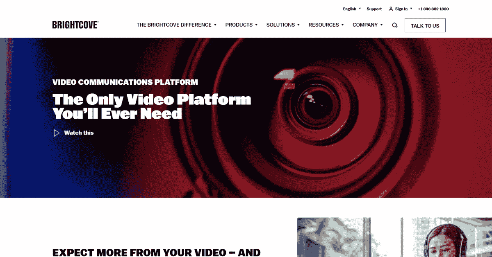
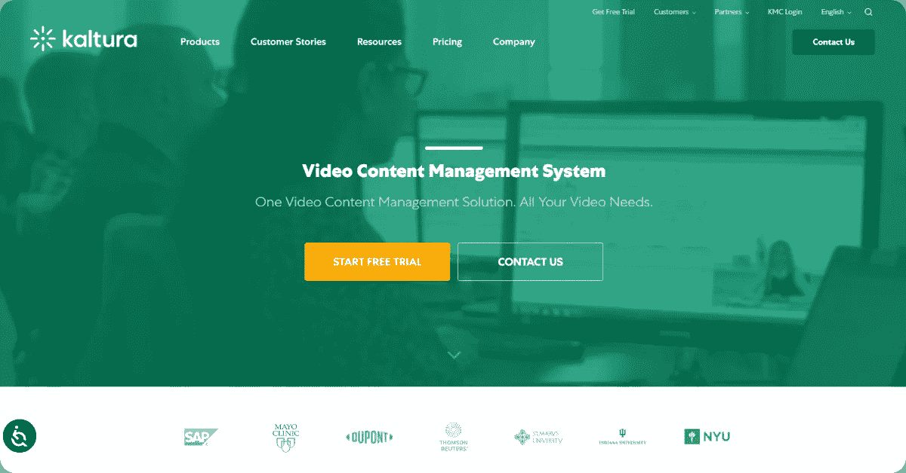
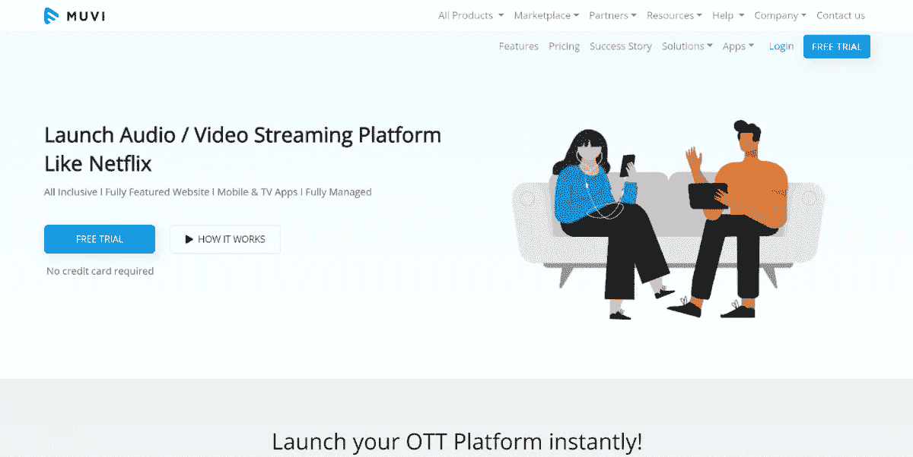
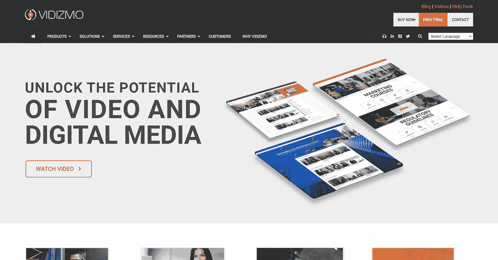

# 2022 年前 5 名最佳 Dacast 竞争对手和替代产品

> 原文：<https://medium.com/nerd-for-tech/top-5-best-dacast-competitors-alternatives-in-2022-ce635bbdb6c0?source=collection_archive---------3----------------------->

Dacast 的最佳替代方案&评论那些想要尝试不同解决方案的人&选择正确的竞争对手平台。

OTT 流媒体比以往任何时候都更受欢迎。企业、学校和其他专业团体正在利用这一增长趋势，以更容易接近和更有效的方式接触他们的受众。

然而，要托管专业级视频内容，广播公司必须利用专业流媒体解决方案的支持，Dacast 是最受欢迎的视频流媒体平台之一，允许您上传、流化、货币化和共享视频。

Dacast 平台通常面向媒体和娱乐行业、宗教组织、体育和健身以及商业用例。这是一个优秀的直播平台，但它缺乏一些关键功能。因此，在做出明智的决定之前，你需要调查其他 Dacast 竞争对手和 [Dacast 替代品](https://www.vplayed.com/dacast-alternative.php)。

事不宜迟，我们开始吧！

# **2022 年前 5 名**预测**竞争对手和备选方案**

市场上有无数的流媒体平台，每个平台都有自己的功能和定价。

在这里，我们将讨论 Dacast 的前 5 个[替代方案。将从直播流、VOD 托管、货币化、安全功能、白标流和定价等方面对每家公司进行比较。](https://blog.contus.com/dacast-alternatives-for-streaming/)

## **1。挫伤显示**

CONTUS VPlayed 是一款端到端 OTT 流媒体解决方案，允许广播公司、分销商和内容所有者推出视频和音频流媒体平台，通过网络、移动设备和智能电视传输视频和音频。

**主要特性:**

*   提供完整的定制
*   支持视频托管
*   云转码
*   支持 CMS
*   6 种以上的收入模式
*   营销和分析

## 2.布莱特科夫

Brightcove 是一种优质的流媒体解决方案，可以托管直播和点播视频。所有计划都是定制价格，但 Brightcove 在市场上被称为高价计划。

**主要特性:**

*   支持实时流媒体
*   支持视频点播托管
*   视频货币化的专门计划
*   提供视频安全性
*   支持白标签流

## 3.卡尔图拉

Kaltura 是 Dacast 的主要竞争对手之一，是一个开源的流媒体平台，其 API 允许完全定制。用户可以集成几乎任何节目，为他们创造最佳的广播体验。

Kaltura 在教育和商业市场最为知名。它的可定制性使它相当复杂，因此它最适合具有现场或支持经验的高级广播员。

**主要特性:**

*   支持实时流媒体
*   支持视频点播托管
*   视频货币化的专门计划
*   提供可靠的安全性
*   白色标签视频播放器

## 4.穆维

Muvi 是 Dacast 的另一种替代方案，为企业提供直播和点播视频托管。Muvi 比 Dacast OTT 贵很多，是为高需求低预算的广播公司设计的。

**主要特性:**

*   支持实时流媒体
*   支持视频点播托管
*   视频货币化的专门计划
*   提供 DRM 安全性
*   支持白标签流

## 5.维迪兹莫

vidizmo(Gartner 认可的企业视频平台)是另一个 Dacast 替代方案，可以为组织中的所有端到端视频用例提供视频流。无论是直播还是点播流媒体，在网站上嵌入营销视频，还是与内部员工分享培训视频，都可以在一个平台上完成。

**主要特点:**

*   支持内部和外部流
*   提供可定制的在线视频播放器
*   符合 GDPR 和 HIPAA 标准的流媒体
*   提供来宾共享
*   支持基于视频的学习

## **底线**

一旦你扫描市场，你可以发现市场上无数的视频流解决方案。功能和定价方案的独特组合范围让广播公司在寻找理想平台时有很多东西要考虑。当您比较平台时，请牢记您公司的流媒体目标和功能需求。然而，我们已经比较了所有伟大的选择，但关键是找到适合你的。