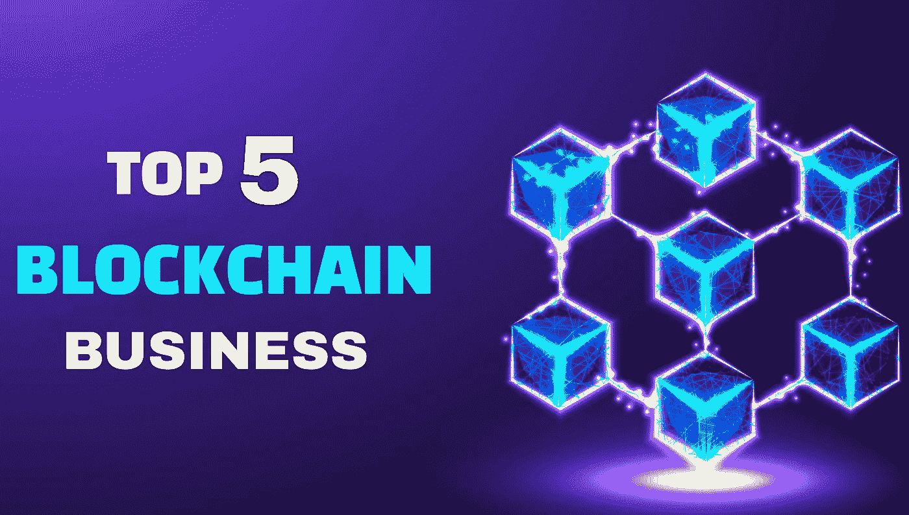

# 2022-2023 年五大区块链业务创意

> 原文：<https://medium.com/nerd-for-tech/top-5-blockchain-businesses-ideas-in-2022-2023-86bf2cb5b7d9?source=collection_archive---------3----------------------->

随着 21 世纪为我们提供了互联网、智能手机和网络 3，这个世界每年都充满了新的发现，这可能为未来的创新奠定基础。 [**Web3**](https://bit.ly/3RYIsTi) 一直主要由区块链技术统治，用来托管应用和资产。因此，谈论区块链提供的商业前景是显而易见的，因为我们世界的未来将运行在这些分散的网络上。在 Web3 领域有许多风险投资机会，随着主流世界采用这种创新，这种机会可能会饱和。让我们看看五个最好的区块链创业公司。

# 2022-2023 年五大区块链业务创意

1.  创建一个 NFT 市场
2.  通过游戏赚取利润
3.  推出 IDO 发射台
4.  做一个元宇宙
5.  创建加密货币交易所

# 创建 NFT 市场

如果一家企业想为新一代精通数字的客户服务，那么创建一个 NFT 市场将是最好的主意。虽然不可替代的代币有无穷的潜力可以挖掘，但它们现在被视为可收集的资产，这种资产正在通过各种创新项目慢慢改变。企业可以 [**创建 NFT 市场**](https://bit.ly/3Lb4RKW) 来聚集忠实的客户群，并使三流创作者能够接触到大众。在通过各种收费赚取财富的同时做所有这些，放大了对这种冒险的需求。NFT 市场平台可以通过横向/纵向交易模式出售由 NFTs 支持的多种数字和实物资产。

# 通过游戏赚取利润

随着基于 NFTs 和 cryptos 的激励型游戏机制风靡全球，从玩到赚的游戏开发最近已成为企业的一种流行风险选择。P2E 机制为企业提供了丰厚的利润，同时允许游戏玩家拥有自己的股份。这种模式得到了风险投资和游戏玩家的支持，因为基于所有游戏类型的游戏开发在区块链已经变得很普遍。动作类、赛车类、运动类、模拟类和 MMORPG 类是风投采用的几种流行的游戏类型。希望吸引新时代游戏社区注意力的 Web3 创业爱好者应该认真考虑 [**打造 P2E NFT 游戏**](https://bit.ly/3dfi8Wm) 。

# 推出 IDO 发射台

我们知道 IDO launchpad 帮助 Web3 初创公司通过代币销售筹集资金。风险企业可以迅速利用 IDO launchpad 开发将自己树立为主要的 Web3 玩家，并赢得声誉和报酬。虽然 IDO launchpad 不喜欢盈利选项，但企业可以获得很多经济利益和比预期更有价值的曝光率。[**I do launch pad development**](https://bit.ly/3QMj2Hw)t 提供了比我们知道的更多的灵活性，因为基于 NFTs、游戏资产、证券和流动性的产品是从该模型的基础发展而来的。作为注定成为 Web3 中流砥柱的热门领域，从长远来看，IDO launchpad 将提供更多优势。

# 做一个元宇宙

长期以来，元诗句一直是吸引大众的主题，小说将它们描述为理想的世界，在那里一切都将完美运行，没有故障。 [**但是，目前，元宇宙开发**](https://bit.ly/3QHNO4p) 更侧重于通过虚拟化身将全球人民聚集在一起，而不需要大量的旅行或支出。元宇宙的发展使得小型社交活动成为可能。随着时间的推移，基于这种虚拟世界的企业将获得财富。此外，风险投资公司已经探索了 metaverses 可以用来提高效率的新应用，如学习和工作空间。初创公司和品牌已经深入研究了 metaverses，以经营自己的现实世界业务，这为元宇宙风险投资公司提供了大量机会。

# 创建加密货币交易所

加密货币交易所的发展已经成为 Web3 时代最受欢迎和最成熟的风险选择之一。随着加密交易所增加更多的金融功能以跟上潮流，试图现在开始的风险企业更深入地研究分散金融(DeFi)的海洋，以使用户能够执行比交换操作更多的操作。加密交换平台可以基于集中式、分散式或混合式模型。从一个企业的角度来看， [**加密货币交易所的发展**](https://bit.ly/3BhWNTZ) 可能是一个完美的选择，如果它想处于 Web3 世界的最前沿并获得收益，不管市场条件如何。

# 不断发展的基于区块链的风险投资选项可能会塑造未来

虽然我们已经详细讨论了区块链的顶级商业选择，但还有更多发展潜力巨大的选择将塑造 Web3 的未来。

*   [**【去中心化金融(DeFi)**](https://bit.ly/3S1e7DB) 平台允许风险企业从用户的金融操作如贷款和投资中获利。
*   [**【移动赚钱】NFT 游戏**](https://bit.ly/3eRuNzn) 是基于通过游戏化来激励用户进行身体运动。

# 最后的想法

在这篇博客中，我们看到了五个最好的区块链商业选择，可以帮助有抱负的企业在 Web3 中做大。虽然这只是一个总体概述，但每个模型都有多个利基市场，每个利基市场都有自己的特点，这对任何企业都有影响。如果你想在区块链世界发财，确保你的商业理念有一个独特的点，可以吸引用户。如果你有这样的感觉，现在是时候与一家经验丰富的区块链应用开发公司合作，实现你的梦想，毫无争议地走向完美。