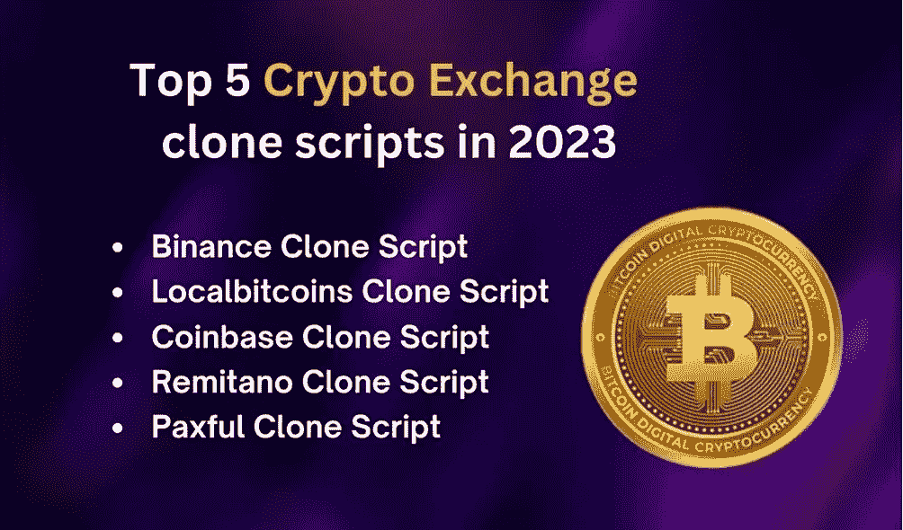

# 2023 年前 5 大密码交换脚本

> 原文：<https://medium.com/nerd-for-tech/top-5-crypto-exchange-scripts-for-cryptopreneurs-2023-9535785ba43c?source=collection_archive---------1----------------------->

开发加密货币交易所的传统从以前的基础方式漂流到加密货币交易所克隆脚本。技术的进步使得其他事情变得更有效率和成本友好。加密产业中的一个进步是加密货币交易所。加密交换克隆脚本不仅效率更高、成本更低，它还简化了根据市场趋势和增强功能对加密交换进行一致更新的过程。

市场上有大量的加密交易所和这些交易所的克隆脚本。每个加密交换克隆脚本都是独一无二的，这取决于它所代表的加密交换。其中，只有少数加密交换克隆脚本对于从事加密交换业务的加密创业者来说是理想的，这也是我们将在这篇博客中探讨的内容。我列出了 5 大加密货币交易所克隆脚本，这些脚本是根据交易所所有者的需求和受益者选择的。

# 五大加密货币交易克隆脚本

*   币安克隆脚本
*   本地比特币克隆脚本
*   比特币基地克隆脚本
*   雷米塔诺克隆脚本
*   Paxful 克隆脚本

# 币安克隆脚本

市场上需求量很大的一种加密货币交换克隆脚本是币安脚本。这得益于币安交易所的巨大人气和成功。支持 600 多种加密货币，也支持加密货币和法定货币之间的交易。币安克隆的脚本使用订单簿交易方法，匹配引擎帮助正确匹配用户订单。它还支持点对点交易。币安克隆软件让任何人都可以轻松建立一个类似于币安的加密货币交易所。以合理的价格，你可以得到一个功能丰富的币安克隆脚本，并可以完全定制。

# 本地比特币克隆脚本

颇具特色的知名加密货币交易平台之一是 LocalBitcoins。超过 150 个国家提供它，有 100 万活跃的交易者。创办加密货币交易所最有效的方式是采用本地比特币克隆脚本。本地比特币的克隆脚本支持广告或点对点交易。它包括 LocalBitcoins 加密货币交易平台上发现的所有有趣的功能。七天之内，你就可以用 LocalBitcoins 克隆脚本推出自己的类似于 LocalBitcoins 的交易所。

# **比特币基地克隆脚本**

比特币基地克隆软件使用用户管理交易技术，支持法定货币和加密货币。由于其先进的安全功能，交易所是一个更安全的地方进行交易。端到端定制的比特币基地克隆脚本，价格合理，可在 10 天内部署。比特币基地交易所在 100 多个国家拥有 8900 万经过验证的用户，支持 100 多种加密货币。通过选择 coinbase 克隆脚本，您可以快速成功。

# **雷米塔诺克隆脚本**

一个这样的点对点加密货币交易平台 Remitano 允许从加密到加密和从菲亚特到加密的交易。它拥有庞大的用户群，在 30 多个国家可以访问。Remitano 克隆软件可以轻松高效地构建一个与 Remitano 完全相同的加密货币交易平台。定制选项使您能够根据需要设计您的 exchange。

# **Paxful 克隆人脚本**

另一个在业内成功运营的点对点加密货币交易平台是 Paxful。它提供法定货币交易，并在其交易所拥有超过 900 万用户的 140 多种加密货币。完全适应业务需求的顶级 Paxful 克隆脚本。它包括 Paxful 加密交换中的所有功能和安全设置。此外，您可以使用定制选项根据您的业务计划添加高级功能。

# **底线**

自从加密货币交易克隆脚本出现以来，加密交易业务的开发部分对于企业主或企业家来说变得很容易。加密货币交易所经过了全面的部署测试，并对软件的进一步定制开放。打包了各个加密交换的所有独特特征和安全属性。

上述密码交易所克隆脚本是密码行业中最顶尖、需求量最大的克隆脚本。有几个加密交换克隆脚本提供者，选择一个适合你的可能会令人困惑。要清除所有这些困惑，请确保您已经了解了提供商的产品组合、他们提供的服务、提供克隆脚本的经验以及他们提供的价格。记住这些因素，你就能筛选出市场上最好的 [**加密货币交易所克隆**](https://www.coinsqueens.com/?utm_source=CryptocurrencyExchangeScriptDevelopment?&utm_medium=mediumblog&utm_campaign=aju) 脚本提供者。之后，您可以轻松地立即启动您的加密交换业务。