# 构建您的电子商务商店的 5 大电子商务软件解决方案

> 原文：<https://medium.com/nerd-for-tech/top-5-ecommerce-software-solutions-to-build-your-ecommerce-store-8cfb54d5cdb3?source=collection_archive---------16----------------------->

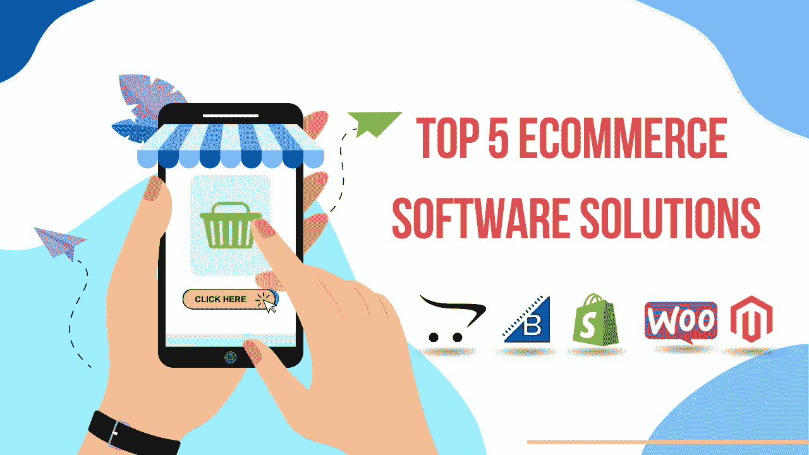

电子商务软件市场充满了大量的机会，导致电子商务公司的创收。尽管如此，到今年年底，电子商务软件应用市场预计将产生 63 亿美元的收入。

电子商务商店的启动和管理带来的收益和便利是电子商务软件累积使用背后的主要催化剂。然而，对于公司和企业主来说，选择最佳电子商务平台仍然是一件痛苦的事情。

因此，让我们深入了解一下 2021 年最好的电子商务软件，用适中的资本创办一家电子商务创业公司。

# **2021 年最佳电子商务软件，提供卓越的购物体验**

# **#1。Magento**

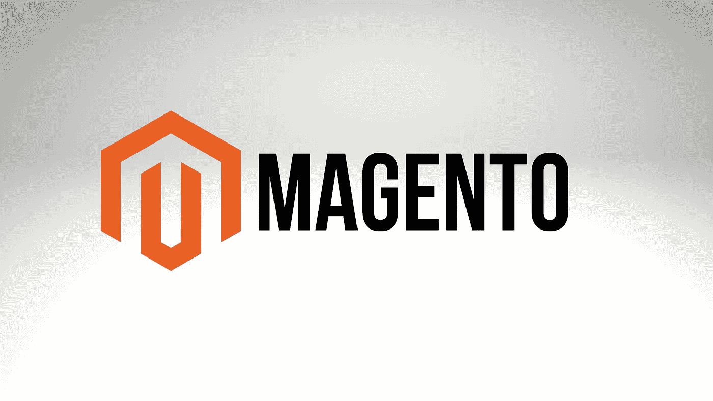

Magento 是一款广受好评的自托管电子商务软件，适用于小型和大型电子商务企业。它为超过 240，000 家在线电子商务商店提供支持，并以其非凡的开发灵活性而闻名。

如果你是 Magento 的 [**开发者**](https://www.valuecoders.com/hire-developers/hire-magento-developers?utm_source=medium-topecomplatform&utm_medium=d7&utm_campaign=medium-topecomplatform) 之一，你可能已经开始喜欢它的功能了。与此同时，拥有一点编码知识的人也可以创建一个专业设计的电子商务商店。此外，您不需要花费数小时来设计和开发您的商店，Magento 有一个机制来加速电子商务商店的开发。

销售功能类别和评分是 Magento 最强大的功能。以下是使用 Magento 的一些有力理由。

*   您可以轻松地将可下载的服务产品作为实物出售。
*   它使您能够接受 WorldPay 的付款。
*   它允许您添加多个产品变型。
*   你可以无缝地产生收入和访客数据。

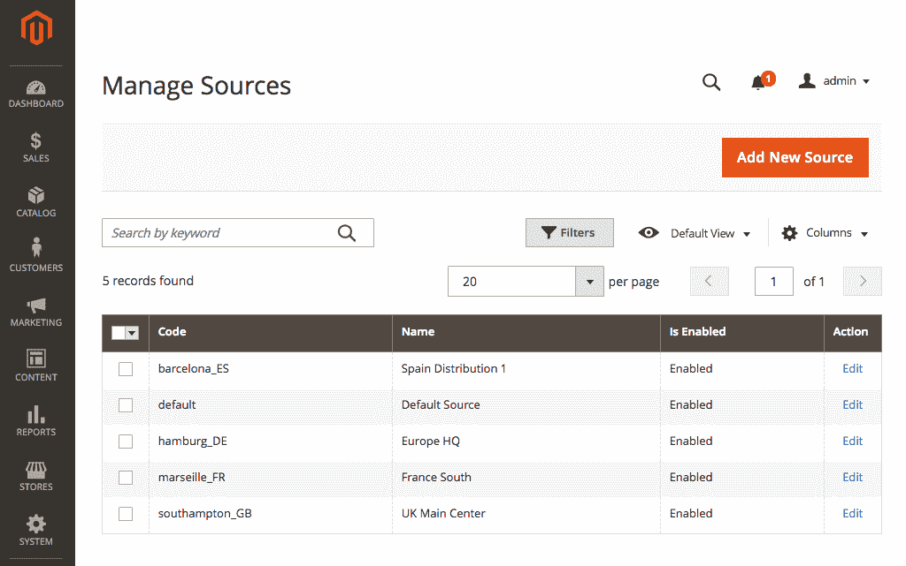

[**图像来源**](https://magento.com/blog/magento-news/magento-2.3-new-tools-fuel-your-growth-2019)

**带来终极优势的卓越特性**

*   可定制的安全功能
*   市场整合
*   智能搜索选项
*   高级搜索引擎优化功能
*   难以置信的移动友好解决方案
*   启用客户说服

***你必须知道什么？***

*它是启动和管理大型电子商务企业的理想选择。*

*它的后端库存功能具有难以置信的选项，例如批量产品导入和产品变体添加。*

# **#2。购物化**

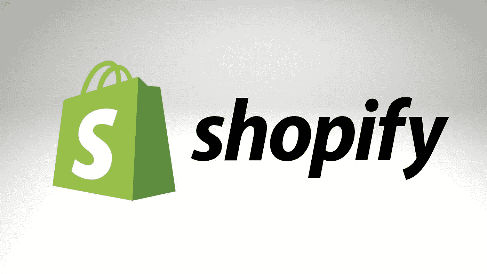

Shopify 的受欢迎程度在电子商务软件领域是无与伦比的。作为最好的电子商务软件，它被誉为小企业和初创公司竞相在线销售各种产品的奇迹。

Shopify 的已知客户包括特斯拉和企鹅书店。该解决方案以其随着业务发展而扩展商店的可扩展性而闻名。作为电子商务软件开发的一站式商店，它支持使用拖放功能，使开发不那么麻烦，不需要编码。

虽然如果你 [**雇佣 Shopify 开发者**](https://www.valuecoders.com/hire-developers/hire-shopify-developers?utm_source=medium-topecomplatform&utm_medium=d7&utm_campaign=medium-topecomplatform) ，你可以利用其完整的功能范围。以下是一些推荐选择 Shopify 的理由。

*   它允许您通过将您的网站与 Instagram、脸书、亚马逊等整合来进行多渠道销售。
*   Shopify 推出了 100 多种支付选项，让您的平台更加人性化。
*   产品销售没有数量限制。想加多少就加多少。
*   它让你可以使用手机应用程序来明确管理你的商店。
*   它为客户提供自动电子邮件通知。

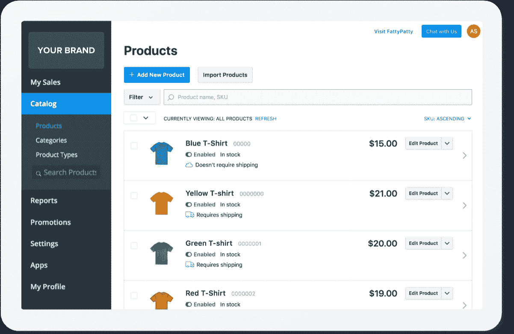

[图片来源](https://venturebeat.com/2020/05/21/shopify-rival-ecwid-raises-42-million-amid-ecommerce-boom/)

**带来终极优势的突出特性**

*   访问 100 多个移动主题
*   1，400 多个应用程序扩展了商店的功能
*   废弃购物车恢复功能
*   分析和洞察报告生成
*   可定制的结帐

***你必须知道什么？***

Shopify 因其出色的销售工具而广受好评。

*您可以以每月 299 美元的价格使用 Shopify 高级服务。*

# **#3。WooCommerce**

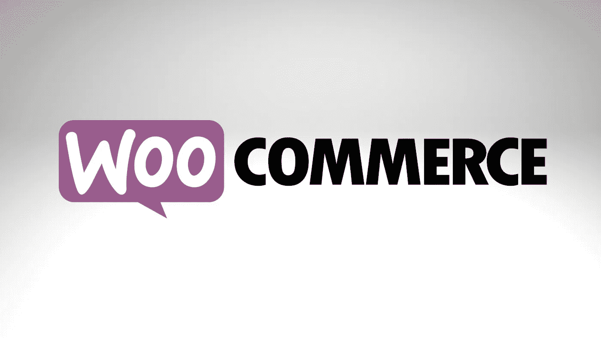

你可能没怎么听说过 WooCommerce。然而，它是一个著名的电子商务应用平台。事实上，大部分是和 WordPress 结合在一起的。因此，大多数人不知道。实际上，WooCommerce 是他们 WordPress 商店雄辩功能的幕后推手。

个性化是 WooCommerce + WordPress 合并的最大好处。你可以定制任何东西，从结账到确认邮件。然而，你需要雇佣一个 woocommerce 开发者来充分利用它的潜力，因为它需要技术技能来完美地工作。

然而，如果你 [**雇佣 woocommerce 开发者**](https://www.valuecoders.com/hire-developers/hire-woocommerce-developers?utm_source=medium-topecomplatform&utm_medium=d7&utm_campaign=medium-topecomplatform) 进行电子商务商店开发，最终会打开无数插件的闸门。它能让你充分利用 BigCommerce 的特性，珍惜 WordPress 的自由。

以下是一些不可否认的选择 WooCommerce 的理由。

*   它可以把你的网站翻译成 24 种语言。
*   它为管理运输和税收提供了一个扩展。
*   站点内容的拖放构建器选项。
*   它针对移动设备进行了全面优化。

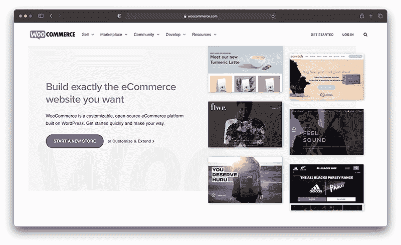

[图片来源](https://ecommerce-platforms.com/ecommerce-reviews/woocommerce-review)

**带来终极优势的特性**

*   库存管理和产品变化
*   通过主机启用 SSL 证书
*   PCI 合规性选项
*   搜索引擎优化
*   包括博客平台
*   多渠道销售

***你必须知道什么？***

WooCommerce 以物超所值和易于安装而闻名。

*它的平均主题成本很低。例如，超过 15 个主题的平均成本为 38 美元。*

# **#4。开放式购物车**

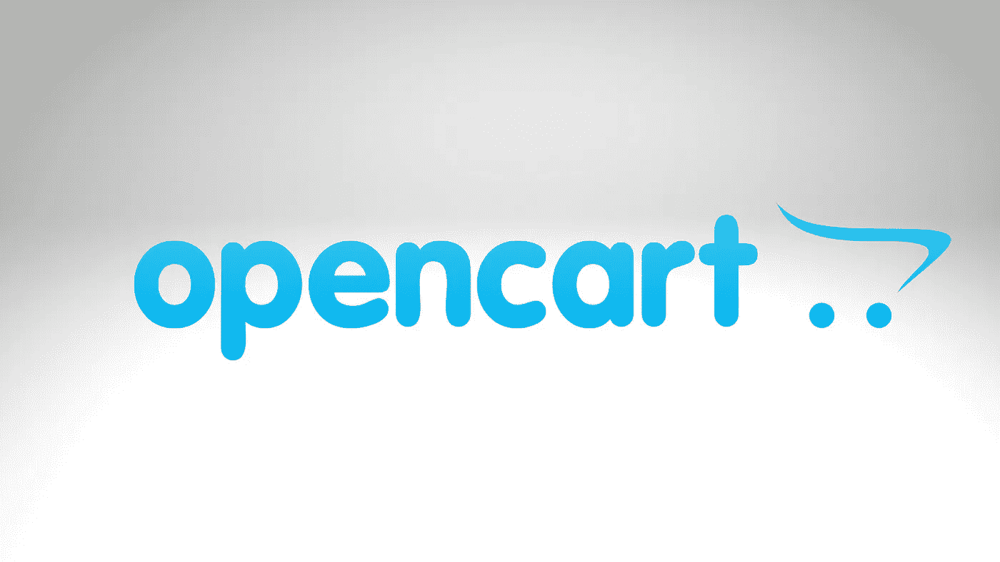

OpenCart 是公认的最简单的自托管电子商务软件，并承诺提供您创建、扩展和开展在线业务所需的一切。尽管你需要技术知识或者雇佣 OpenCart 开发者 来挖掘它的潜力。

正如它所说，这是最容易的。这意味着，你不需要成为一名工程师来添加产品、改变商店的产品和改变应用程序视图。此外，OpenCart 提供的支付支持是 OpenCart 商店销售额增长背后的主要催化剂。

以下是选择 OpenCart 电子商务平台的一些主要原因。

*   它可以让你融入多种语言，以提高你的国际品牌的存在。
*   您可以创建一套完整的报告和指标。
*   它提供对 13，000 多个模块和主题的访问。
*   您可以使用 PayPal、Sage Pay、E-Way、亚马逊支付、WorldPay 等支付选项。

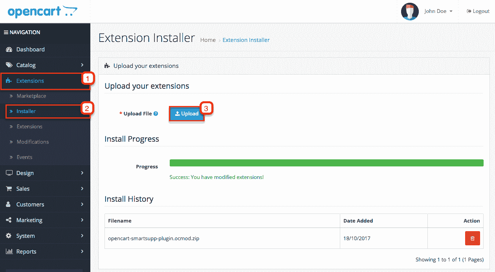

[图像来源](https://www.smartsupp.com/help/opencart/)

**赋予终极利益的特征**

*   无限制的产品类别
*   多种货币支持
*   数字产品销售
*   客户审查和评级

***你必须知道什么？***

下载解决方案是免费的，但安装新功能需要付费。

# **#5。BigCommerce**

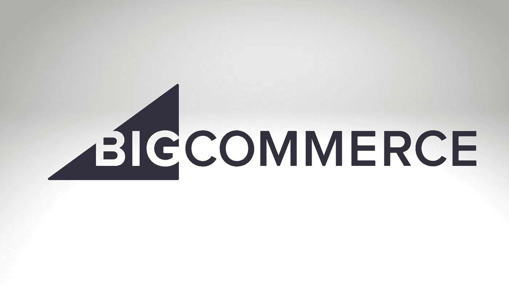

不用说，大商务是一个非常受欢迎的解决方案。这是一个简单易行的解决方案；你所要做的就是注册【BigCommerce.com，进入设置向导，告诉它你想卖什么，然后看看商店，你很快就能工作了。

它迎合了广泛的主题和商店设计可供选择，你也可以珍惜使用自由设计的宽大。每个设计看起来都很壮观，使 BigCommerce 模板成为业界最好的。简而言之，设计美学对你的 BigCommerce 商店来说是用户友好的和有吸引力的。

以下是选择 BigCommerce 作为您的 [**电子商务软件解决方案**](https://www.valuecoders.com/ecommerce-software-solutions?utm_source=medium-topecomplatform&utm_medium=d7&utm_campaign=medium-topecomplatform) **的一些原因。**

*   它允许你通过产品联合和购物订阅获得更多的网站流量。
*   通过 BigCommerce，礼品卡和优惠券代码的分发非常简单。
*   它允许您通过无缝的库存管理功能来管理您的退货。
*   它使您能够获得所有运输提供商的支持。

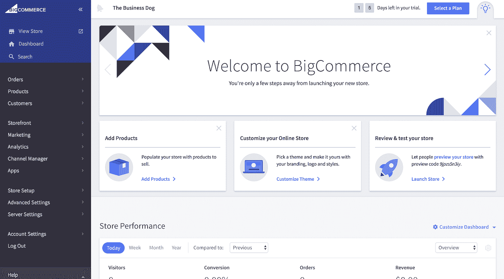

[图像来源](https://www.quizzec.com/bigcommerce-reviews/)

**提升终极收益的特性**

*   一级 PIC 合规性
*   无缝搜索引擎优化选项
*   包括 SSL 证书
*   支持多平台销售
*   销售点设备
*   电子邮件营销模块

***你必须知道什么？***

BigCommerce 提供 24/7 全天候支持，帮助您高效运行业务流程。

# **包装完毕**

电子商务软件可以减轻你创建和经营一个商店的麻烦。此外，许多服务扩展也促进了业务流程的平稳运行。从分析到客户数据跟踪，有了合适的解决方案，您可以轻松完成任何事情。

此外，您可以选择[定制电子商务软件开发](https://www.valuecoders.com/industries/retail-ecommerce-software-development?utm_source=medium-topecomplatform&utm_medium=d7&utm_campaign=medium-topecomplatform)来创建自己的解决方案。确保你雇佣的开发人员能够理解你的愿景，并将卓越的功能集成到应用程序中。