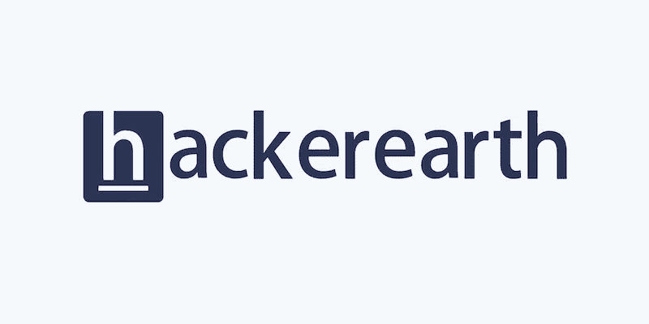

# 使用 AWS 2022 的 5 大有趣创业公司。

> 原文：<https://medium.com/nerd-for-tech/top-5-interesting-startups-using-aws-2022-4864c2ad71ba?source=collection_archive---------2----------------------->

在 [Unsplash](https://unsplash.com?utm_source=medium&utm_medium=referral) 上由[S O C I A L C U T](https://unsplash.com/@socialcut?utm_source=medium&utm_medium=referral)拍摄

## 快速浏览。

正如我在这里所讨论的，介绍了世界上使用 AWS 的初创公司，这些公司扩展了其性能和业务。

# **1。翁博的**

[**一家总部位于多伦多的合成媒体**](https://www.clickaws.com/aws-supported-wombos-wildly-popular-app-ai-powered-lip-sync-app/) **公司推出了其人工智能驱动的对口型应用程序(人工智能艺术生成器)。**

[**翁博的**](https://www.clickaws.com/aws-supported-wombos-wildly-popular-app-ai-powered-lip-sync-app/)

—2021 年 2 月发布。

—来自加拿大的操作。

—10 个月内，超过 180 个国家的 7400 万人下载了这款应用。

—每月活跃用户超过 1000 万。

—使用 AWS 基础设施(ML)在云中进行处理。

—试图提供人们想要的真正的人工智能体验。

— **娱乐为主。**

# **2。HSAT**

[**分析卫星**](https://aws.amazon.com/solutions/case-studies/hsat/?sc_channel=sm&sc_campaign=SUM_ThoughtLeadership&sc_publisher=TWITTER&sc_country=Startups&sc_geo=GLOBAL&sc_outcome=awareness&trk=sum_thoughtleadership_casestudy_TWITTER) **和地理空间数据，为其客户提供关于国家和全球范围内作物和物流以及环境、社会和公司治理(ESG)的宝贵见解和预测。**

[**HSAT**](https://aws.amazon.com/solutions/case-studies/hsat/?sc_channel=sm&sc_campaign=SUM_ThoughtLeadership&sc_publisher=TWITTER&sc_country=Startups&sc_geo=GLOBAL&sc_outcome=awareness&trk=sum_thoughtleadership_casestudy_TWITTER)

—使用 AWS 将卫星数据处理时间缩短了 80%。

—在英国和挪威的运营。

—使用 AWS 进行快速且经济高效的计算机处理和数据分析。

—客户**基于贸易、农业和食品饮料制造商**。

—使用 AWS，计算时间成本降低了 70%。

# **3。CelerisTx**

[**药物发现**](https://aws.amazon.com/blogs/startups/celeristx-drug-discovery-for-incurable-diseases-with-ml-on-aws/?sc_channel=sm&sc_campaign=SUM_Blog&sc_publisher=TWITTER&sc_country=Startups&sc_geo=GLOBAL&sc_outcome=awareness&trk=sum_blog_TWITTER) **对于疑难杂症用 ML 上 AWS。**

[**CelerisTx**](https://aws.amazon.com/blogs/startups/celeristx-drug-discovery-for-incurable-diseases-with-ml-on-aws/?sc_channel=sm&sc_campaign=SUM_Blog&sc_publisher=TWITTER&sc_country=Startups&sc_geo=GLOBAL&sc_outcome=awareness&trk=sum_blog_TWITTER)

—使用亚马逊 SageMaker、SageMakerClarify、DGL、EC2、ECR、EBS、亚马逊 FSx。

—使用 AWS 提高药物发现的生产效率。

— **基于制药和药物发现。**

—美国加利福尼亚州。

# **4。**黑客地球

**(** [**不是一家初创公司，但最近在使用 AWS**](https://aws.amazon.com/blogs/startups/hackerearth-scales-up-continuous-integration-for-future-needs-with-aws-codebuild-and-amazon-s3/?sc_channel=sm&sc_campaign=SUM_Blog&sc_publisher=TWITTER&sc_country=Startups&sc_geo=GLOBAL&sc_outcome=awareness&trk=sum_blog_TWITTER)**)—hackere earth 提供企业软件，帮助组织满足其技术招聘需求。**

[**黑客地球**](https://aws.amazon.com/blogs/startups/hackerearth-scales-up-continuous-integration-for-future-needs-with-aws-codebuild-and-amazon-s3/?sc_channel=sm&sc_campaign=SUM_Blog&sc_publisher=TWITTER&sc_country=Startups&sc_geo=GLOBAL&sc_outcome=awareness&trk=sum_blog_TWITTER)

—2012 年开始。

— AWS 代码构建以及亚马逊 S3 和亚马逊弹性容器注册(亚马逊 ECR)。

—使用 AWS CodeBuild 解决了高维护、未使用资源的成本、扩展、在一组通用实例上运行的多个并发构建、跨多个构建共享一个数据库、更长的等待时间等问题。

—使用 AWS CodeBuild、亚马逊 S3 和亚马逊 ECR 的优势——零维护、成本效益、持续扩展、独立运行时环境、零相互依赖、零停机时间、更快的构建时间。

— **编码和招聘平台**。

—总部位于美国旧金山。

# 5.。流明

**为盲人赋权——如何** [**。lumen**](https://aws.amazon.com/blogs/startups/empowering-the-blind-how-lumen-is-revolutionizing-blind-assistive-technologies-using-aws/?sc_channel=sm&sc_campaign=SUM_Blog&sc_publisher=TWITTER&sc_country=Startups&sc_geo=GLOBAL&sc_outcome=awareness&trk=sum_blog_TWITTER) **正在使用 AWS 革新盲人辅助技术。**

[**。**流明](https://aws.amazon.com/blogs/startups/empowering-the-blind-how-lumen-is-revolutionizing-blind-assistive-technologies-using-aws/?sc_channel=sm&sc_campaign=SUM_Blog&sc_publisher=TWITTER&sc_country=Startups&sc_geo=GLOBAL&sc_outcome=awareness&trk=sum_blog_TWITTER)

世界上有 4000 万盲人，这个数字预计到 2050 年将增加到 1 亿。

— **针对视障人士**。

—罗马尼亚一家初创公司致力于为视力障碍者增加一种可穿戴设备。

—使用 **AWS 激活**。

# 其他博客:

 [## 亚马逊推出 Re: Skill Program 2022 |免费亚马逊 t 恤|免费亚马逊课程

### AWS re:技能——赚取奖励。

medium.com](/nerd-for-tech/amazon-launched-re-skill-program-2021-free-amazon-t-shirts-free-amazon-courses-88c4b95c9752)  [## AWS Lightsail 中 WordPress 的登录凭证？第二部分|密码灯

### 在本文中，我们讨论了如何在 AWS LightSail 中使用 SSH 来查找 WordPress Admin 的登录凭证。这是…

www.clickaws.com](https://www.clickaws.com/find-wordpress-password-in-aws-lightsail/)  [## 特斯拉的非特斯拉增压器试点扩大到法国和挪威|增压器在法国和…

### 非特斯拉汽车现在可以通过特斯拉应用程序在法国和挪威的指定超级充电站充电。

www.clickaws.com](https://www.clickaws.com/teslas-non-tesla-supercharger-pilot-expands-to-france-and-norway/) 

# 在 Linkedin 上联系我:

 [## 印度马哈拉施特拉邦 ankit Gupta-Pune |职业简介| LinkedIn

### 我是一个深度学习爱好者/学习者，正在寻找一个可以贡献和提高我技能的机会…

www.linkedin.com](https://www.linkedin.com/in/ankit-gupta2/) 

给我买杯咖啡:

 [## Ankit Gupta 是一名技术作家，他喜欢写关于 Python、ML 和云计算的文章。

### 嘿👋我刚刚在这里创建了一个页面。你现在可以给我买杯咖啡了！给我买杯咖啡，给我发一个主题，你会…

www.buymeacoffee.com](https://www.buymeacoffee.com/AnkitGupta1) 

**参考文献:**

[https://www . click AWS . com/AWS-supported-wombos-wildly-popular-app-ai-powered-lip-sync-app/](https://www.clickaws.com/aws-supported-wombos-wildly-popular-app-ai-powered-lip-sync-app/)

[https://go.aws/3fYbJfN](https://t.co/Q5Pswfadrs)

[https://go.aws/3IlUmC7](https://t.co/jVEnmp16LR)

[https://go.aws/3ILBIDB](https://t.co/lGASwk0Un1)

感谢您的阅读，如果您喜欢，请点击“鼓掌”按钮。

**关注我们了解更多内容。**

**查看** [书呆子科技](https://medium.com/nerd-for-tech) **更多 AWS 相关内容。**

*更多内容看* [书呆子看理工](https://medium.com/nerd-for-tech) ***。***