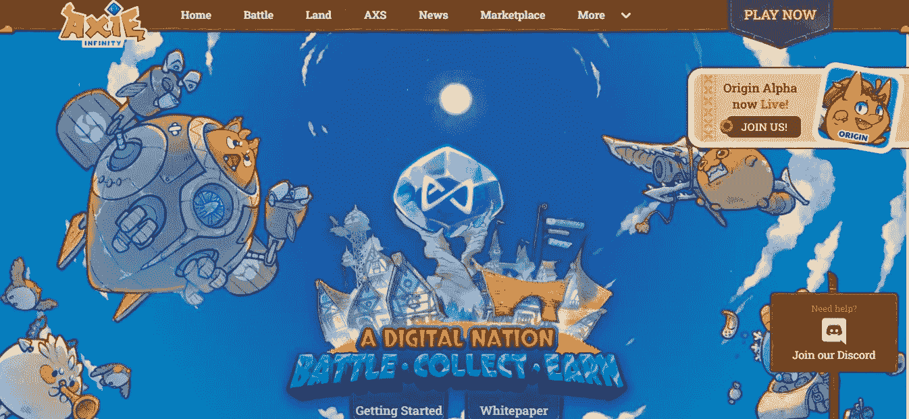
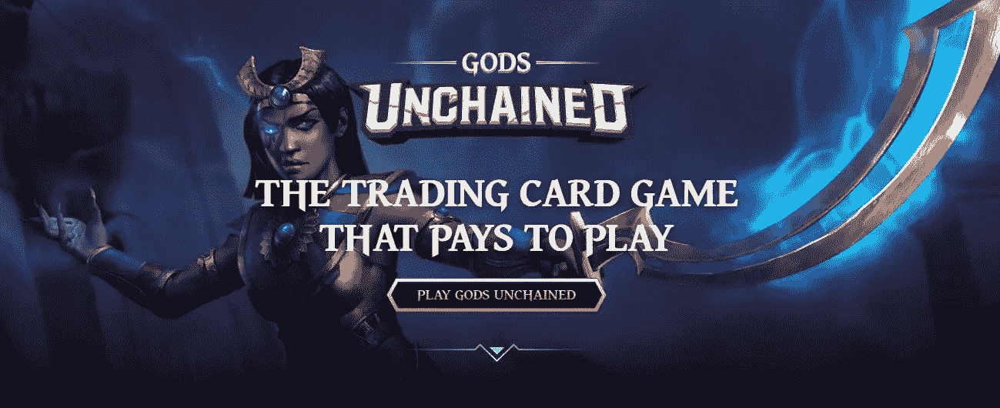
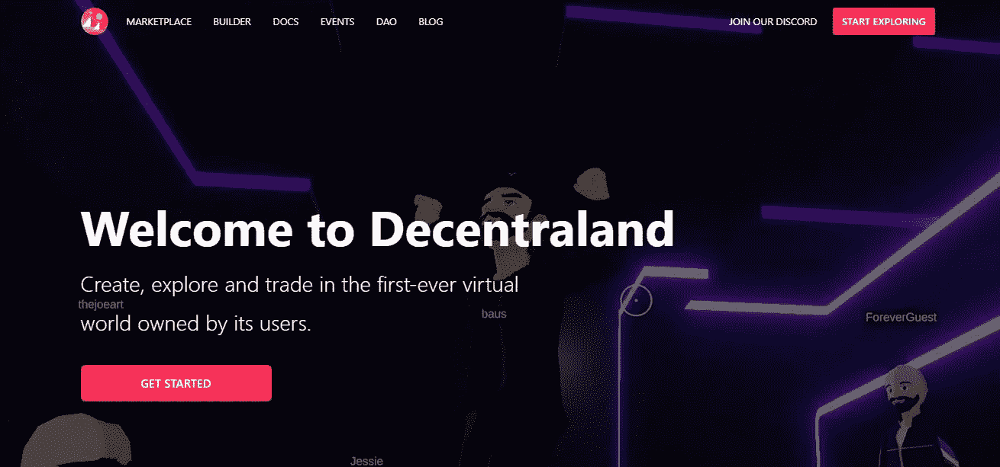
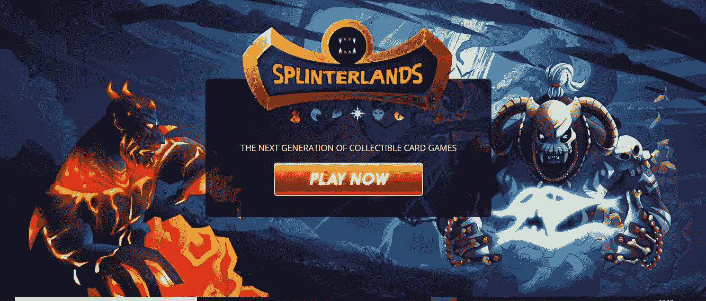
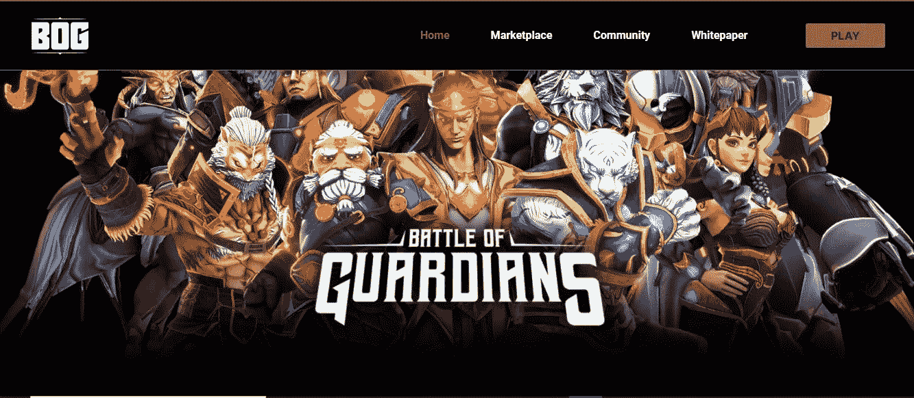

# 赢取 NFT 游戏的前 5 名游戏，不容错过——2022

> 原文：<https://medium.com/nerd-for-tech/top-5-play-to-earn-nft-games-you-cannot-miss-out-cff7e078b6c1?source=collection_archive---------4----------------------->

玩游戏赢得 NFT 游戏

自从 2017 年第一批基于区块链的游戏与传奇的 CryptoKitties 一起上线以来，**玩赚** (P2E) NFT 游戏世界就没有保持原样。 [**NFT 游戏平台**](https://bit.ly/3FEqUHc) 随着时间的推移，2021 年的 NFT 热潮见证了大多数区块链游戏的最高参与率。这些游戏通常使用不可替代的代币(NFT)，包括游戏内资产、货币和奖励，可以通过交换和市场兑换成货币利益。

> 在这篇博客中，我们将看到一个人不应该错过的**5 大玩赚 NFT 游戏**，无论他们是玩家还是有抱负的加密企业家。

无限轴

## [**轴协无穷大**](https://axieinfinity.com/)

Axie Infinity 是基于战斗的 NFT 市场中票房最高的游戏之一。玩家需要有一个名为**“Axies”**的三只怪兽组成的队伍，与环境或其他玩家对抗，以赚取奖励。本地令牌 SLP 和 AXS 可以通过在游戏中玩和交易。这款游戏在全球范围内享有很高的声誉，因为它在全球疫情期间拯救了人们的生计，尤其是在一些最大的发展中地区。这个游戏现在已经成为传奇，因为如果你不担心每天赚很多钱，它提供了一个相对容易的游戏体验。

被解放的神

## [**诸神被解放**](https://godsunchained.com/)

《被解放的神》是一款基于区块链的竞技卡牌游戏，玩家有权使用他们的 NFT 牌。在这个游戏中，玩家可以在竞技场中购买、出售、交易卡片和战斗，以获得可兑现的奖励。Gods Unchained 的一个主要特点是，它使用了一个名为 Immutable X 的分散式交易所(DEX ),使平台上的交易更加容易。奖励可以通过一个叫做**“通量”**的实体和本地的象征神的形式获得。本机令牌还为玩家提供了参与游戏平台治理决策的机会。

分散土地

## [**分权**](https://decentraland.org/)

分散土地是一个总部位于元宇宙的游戏平台，自 2021 年 NFT 繁荣以来一直受到关注。在这里，玩家可以购买和交易虚拟土地(以 NFTs 的形式，用 land 表示)来换取本地令牌 **MANA** ，可以兑换来赚钱。玩家还可以在平台内玩游戏，并参与治理决策，以决定未来的升级。玩家还可以举办社交活动，如音乐会和会议，甚至在世界各地经营虚拟商店。由于《分散之地》处理的是越来越多的元诗句概念，游戏的全部潜力还有待观察。

夹板岛

## [夹板地 ](https://splinterlands.com/)

Splinterlands 是一款 NFT 游戏，基于数字交易卡的概念，在多个区块链(蜂巢和蜡像)上工作。玩家可以在游戏市场上购买、出售和交易卡片，此外还可以通过战斗赢得奖励。获得的一般奖励是以**暗能量晶体**(十二月)，游戏的原生令牌，以及平台的加密货币 SPS 的形式。玩家还可以通过完成日常任务来获得奖励，为此他们可以获得包含卡、DEC、包和更多游戏内资产的箱子。由于其低风险性和易于理解的游戏玩法，该游戏现在是新手加密游戏玩家玩得最多的游戏之一。

守护者之战

## [**守护者之战**](https://battleofguardians.com/)

基于索拉纳的守护者之战是一个基于战斗的游戏，玩家选择一个角色，与其他玩家进行实时战斗，以获得知识和获得奖励。由于游戏是使用虚幻引擎开发的，它提供的体验是其他细分市场无法比拟的。玩家赢得**战斗点数** (FP)作为每场战斗的奖励，这些点数可用于游戏内市场或支付锦标赛入场费。这款游戏的原生标志是 BGS，玩家可以用它来下注、升级自己的角色，以及参与治理决策。

# 结束语

因此，如果你是一个游戏玩家，正在寻找进入 **Web3** 世界的最佳 NFT 游戏，上面的列表有它们全部。但是，如果你正计划拥有一家基于“玩赚 NFT”游戏的企业，并阅读这篇博客寻求灵感，这可能会提供一些见解。除了你拥有的所有智慧，一些公司擅长开发 [**即玩即赚的 NFT 游戏**](https://bit.ly/3McVMB2) ，它们会主动将你所有的建议整合到游戏平台中。你可以放心，该平台将是质量最好的，值得花费时间和金钱来开发它，因为该公司从零开始一直参与到最后的步骤。