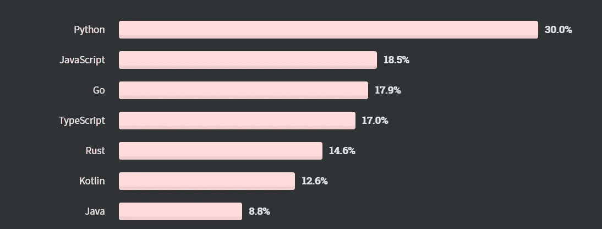
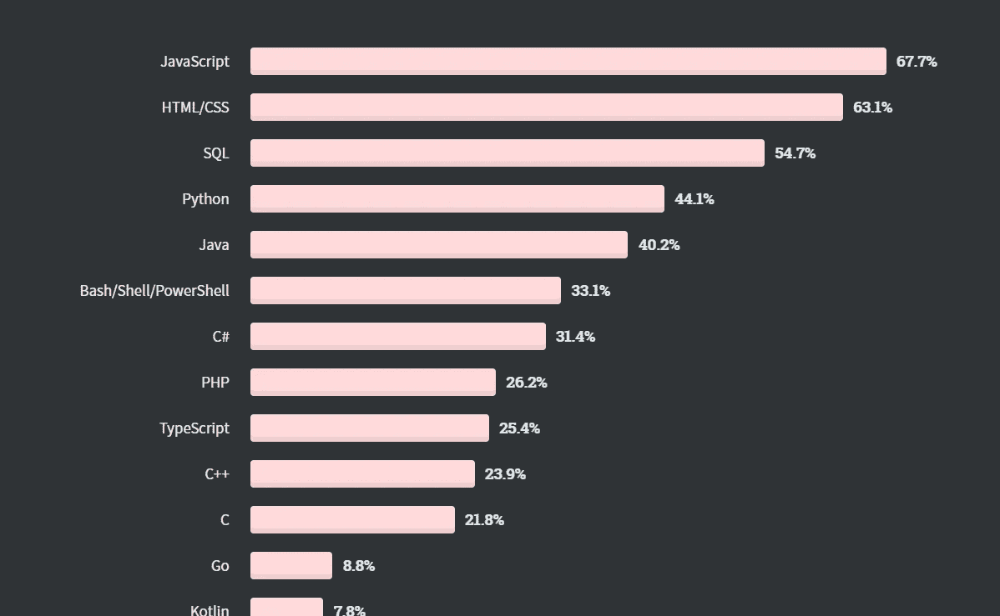

# 2021 年最值得学习的 5 种编程语言

> 原文：<https://medium.com/nerd-for-tech/top-5-programming-languages-to-learn-in-2021-8221676e4f57?source=collection_archive---------13----------------------->

编程语言每天都在发展。基于可用的框架和许多其他因素，IT 行业的流行语言在不断变化。选择正确的语言是成为高效开发人员的关键。

> 我没有把它们列为他们的实用工具，只是想到你可以在这些语言上投入大量的时间来成为一名专业开发人员。

图片取自@ [海拉戈斯特奇](https://unsplash.com/@heylagostechie)(unsplash.com)

# 1.Java:

2021 年选择 **Java** 可能是一个争论的话题。根据 IT 行业的说法，java 仍然是主流，许多应用程序中使用了许多 Java 框架。Java 对于企业级的 web 应用和微服务是必不可少的，这些应用和服务在接下来的一年里会越来越多。2021 年，Java 仍将主导银行业和印度 IT 市场。Java 拥有**面向对象编程 的力量。**

java 的一些框架: [Spring](https://www.educative.io/blog/40-spring-interview-questions) ，Struts，Hibernate。

> 你想知道更多关于 Java 的力量吗？参观 [**本**](https://blogs.oracle.com/javamagazine/the-top-25-greatest-java-apps-ever-written#anchor_1) **。**

# 2.Python:

Python 是每个程序员都应该会使用的语言。Python 的语法不仅直观易学，而且应用于预测 2021 年崛起的领域，即机器学习和人工智能。除了软件，它还可以用于各种行业:**零售银行、金融、医疗保健、生物调查、自动化**

Python 的一些框架: **Django，Flask**

从堆栈溢出

根据栈溢出，Python 是最想要的语言

# **3。JavaScript:**

这是 Web 开发世界中的王者。这是一个超级简单的语言，学习和理解 OOPs 的概念。现在，在 2021 年，网飞、脸书、亚马逊、Airbnb、Spotify 等大型科技公司都在使用 JavaScript。JavaScript 最棒的地方在于它对你的前端和后端都有看法。在这种情况下，您只需要掌握一种编程语言，这将有助于您构建一个完整的堆栈应用程序。

从堆栈溢出

这是 JavaScript 目前的情况，因为它已经成为开发人员中最流行的编程语言。

JavaScript 的一些框架: **ReactJs，NodeJs，AngularJs，NextJs**

# 4.C#:

在一项关于堆栈溢出的调查中，如果你是一名软件开发人员，你有 59.7%的机会使用 C#。它是最通用的编程语言之一，简单易学，有大量的社区支持。C#也可以用于游戏开发，C#多与著名的游戏引擎 [Unity](https://unity.com/) 配合使用。

据 GitHub 称，有超过 56K 个活跃的存储库使用 c#作为主要编程语言。C#使用的语法类似于其他 C 派生的语言，如 C++，所以如果您来自 C 家族的另一种语言，这很容易掌握。C#不仅是微软应用程序开发的首选，也是移动开发人员在 Xamarin 平台上构建跨平台应用程序的语言。

# 5.Swift:

如果你对苹果产品和移动应用程序开发感兴趣，Swift 是一个不错的起点。Swift 已经针对性能进行了优化，并且是为适应现代 iOS 开发的现实而全新构建的。iOS 不仅可以在每部 iPhone 和 iPad 上运行，也是 watchOS(用于苹果手表)和 tvOS(用于苹果电视)等其他操作系统的基础。

# 结论:

嗯，你可以学任何你想学的语言。但是从一开始就要非常清楚你在学什么，你为什么要学这个，这种语言的应用/平台在哪里。首先要清楚任何语言的基础，然后才是 OOPs 和数据结构。这是将帮助你在 2021 年成为一名优秀开发者的关键特征。

> 祝你未来的伟大旅程好运！！！

