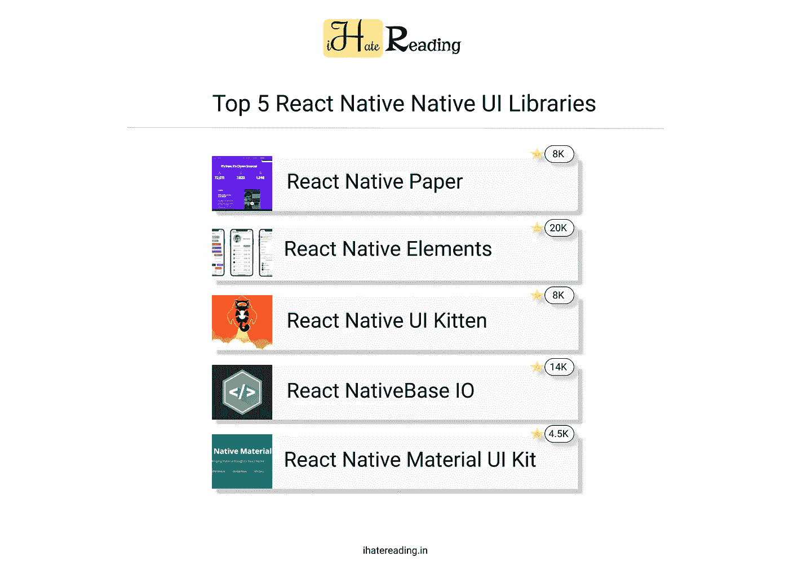

# React Native 的前 5 个用户界面库

> 原文：<https://medium.com/nerd-for-tech/top-5-ui-libraries-for-react-native-2ce8a973bb1c?source=collection_archive---------0----------------------->

列出了前 5 个 React 原生 UI 库

[点击此处阅读更多内容](https://shreyvijayvargiya26.medium.com/)

React Native 是一个跨平台的框架，有助于使用 javascript 和所谓的 JS 框架 React Native 开发移动应用程序。它在功能和底层逻辑上类似于 React，增加了一个称为 JS bridge 的层，帮助这种混合代码与用(特别是用在…