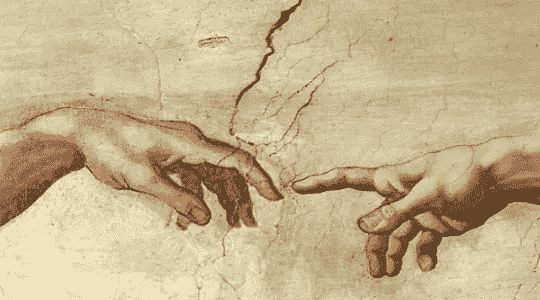
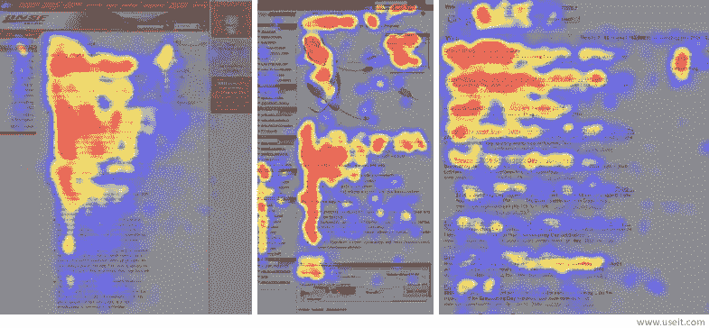
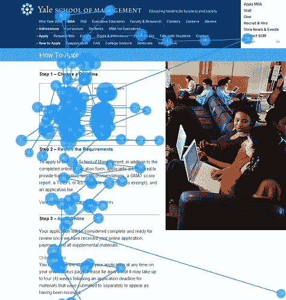
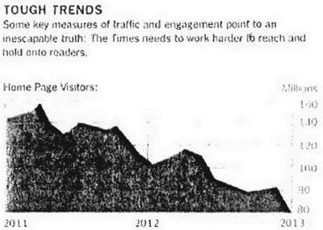
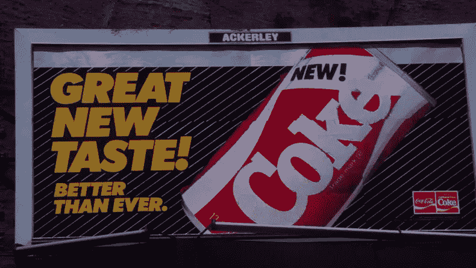
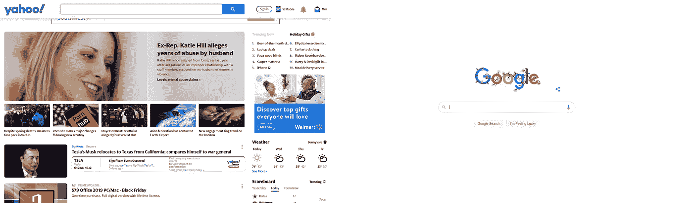

# 大多数设计师的五大 UX 神话

> 原文：<https://medium.com/nerd-for-tech/top-5-ux-myths-for-most-designers-4fe243b71004?source=collection_archive---------24----------------------->

X 设计没有一个官方的、标准的定义，因为各种因素共同决定了 UX 的命运。但是，苦尽甘来， [UX 神话](https://bit.ly/3l5CzVl)总是发生。因此， [Wondershare Mockitt](https://bit.ly/3ewCXuz) 列出了广泛持有但错误的信念或想法，供 UX 的设计师、真理的追寻者们打破一些关于 UX/产品设计的神话。

# UX 神话 1——人们真的会读佩奇

事实上，他们不…

大多数人不阅读，但浏览。2013 年，[分析供应商 Chartbeat 分析了 Slate](https://blog.hubspot.com/marketing/most-people-arent-reading-to-the-end-of-your-posts) 和其他网站，发现大多数访问者只浏览了文章页面的 60%。人们很少逐字阅读网页；相反，他们浏览网页，挑出单个的单词和句子。

根据 [Eyequant](https://www.eyequant.com/) 的眼球追踪研究，当用户登陆你的网站时，他们的视线路径从最受关注的左上角开始，并从那里向右下方移动。右下角的终端区域是您发出行动号召的地方。请注意，这不是什么普遍真理，而是一个很好的起点。终端区域的按钮是一个引人注目的行动号召，因为它位于用户观看模式的末端。当他们的浏览模式结束时，用户不必四处寻找你的行动号召按钮。

有趣的是，人们经常以 F 模式处理页面。如果你有一个垂直菜单，把它放在左边。然而，放置在主页顶部的导航效果最好。

*来源:* [*尼尔森诺曼集团*](https://www.nngroup.com/articles/f-shaped-pattern-reading-web-content/)

# UX 神话 2——照片总能改善用户体验

古老的谚语“一张图片胜过千言万语”是一句非常有力的话，意味着一张静止的图片比一段精心制作的文字更能立即传达给观察者。人类是高度视觉化的生物，能够几乎即时地建立联系和处理视觉信息。

但是，这样的图片与网站的主题无关，不包含有用的信息，很少给网站增加价值，更不用说给移动应用增加价值了。它们通常会损害而不是改善用户的体验。

[VWO 的一个真实案例](https://vwo.com/success-stories/spectrum/):使用合适的图片将 Harrington Movers(新泽西搬运和仓储行业)的转化率提高了 46%。

Brian Mckenzie 是 Harrington Movers 的高级 PPC 经理，他表示，到目前为止，这项测试已经为州际移动每月增加了大约 10，000 美元。

产品和真人的照片被当作重要的内容，被推敲。但是，有些类型的图片完全被忽略了。这是纯粹装饰性的感觉良好的大图像的典型情况。

*用户忽略* [*库存照片*](https://aphotoeditor.com/2010/11/09/generic-photography-ignored-online/) *的仿制人:*

*来源:* [*出处编辑*](https://aphotoeditor.com/2010/11/09/generic-photography-ignored-online/)

# UX 神话 3——最重要的页面:主页

主页对出版商来说是重要的不动产。它是精心构建的链接和图形的组合，旨在向用户传递正确的信息和正确的故事。

可用性专家，包括雅各布·尼尔森，一直认为你的主页是网站最有价值的不动产。因此，许多网页设计师和开发人员仍然把大部分时间花在主页的设计上。

在文章[网页设计:主页的衰落](https://www.cmswire.com/cms/web-engagement/web-design-the-decline-of-the-homepage-007269.php)中，Gerry McGovern 指出，越来越多的客户会直接访问你网站上的特定页面，而不是主页。在 2003 年，一个大型研究网站 39%的页面浏览量是针对主页的。到 2009 年，这一比例降至 19%。在 2008 年的一个月里，在一个技术网站收到的 70，000 次页面浏览中，31.42%的浏览是针对主页的。在 2010 年的同一个月，在网站收到的 120，000 次页面访问中，只有 2.08%的访问是针对主页的。

根据《纽约时报》对其数字战略的内部评估，该报主页的访问量在过去两年中下降了一半。

这里有一个非常明显的图表:

*来源:* [*SCRIBD*](https://www.scribd.com/doc/224332847/NYT-Innovation-Report-2014)

# UX 神话 4——人们确实知道自己想要什么

直到今天，许多组织仍然依赖于询问人们他们希望在他们的网站或服务上看到什么变化。那么，当人们回答调查问卷上的问题时，他们实际上在做什么呢？

标准答案是，当人们在调查问卷中说他们更喜欢 X 而不是 Y 时，他们只是描述了一种预先存在的对 X 比对 Y 更有好感的状态。

脑科学研究人员发现，人类的偏好往往比消费者对品牌热爱的真诚宣言可能让营销人员相信的更暂时、更容易操纵。不切实际的乐观使人们认为坏事发生在自己身上的可能性比发生在别人身上的可能性小，这阻碍了他们的决策。你必须明白的是，人们对他们未来的购买行为做出自信但错误的预测。

现实是，有许多组织习惯于忽视历史研究的失败。新可乐是历史上最大的营销失误之一。尽管进行了数千次啜饮测试，并根据顾客反馈做了无数次微调，新可乐还是一场巨大的灾难。新可口可乐的故事仍然很有影响力，它是一个警示故事，提醒人们不要篡改一个成熟而成功的品牌。

【dailymail.co.uk】来源:

# *UX 神话 5——空白是浪费的空间吗？*

*许多客户认为空白仅仅是对有用页面的浪费:*

*-顶部有很多空的地方。*

*-既然有空间，我们可以添加更多内容吗？*

*-让我们把所有东西都变大来填满空间！*

*尽管我们称之为空白，它并不一定是白色的。它可以是任何颜色、纹理、图案，甚至是背景图像。*

*我们所说的留白(或负空间)应该是指设计元素之间的区域。它也是单个设计元素中的空间，包括字体符号(可读字符)之间的空间，这些空间经常被忽视和忽略。*

*网页设计应该考虑我们解读视觉刺激的方式。人眼[更喜欢](https://www.studio98.com/why-negative-space-is-positive-space/)看到不杂乱或不拥挤的视觉效果，空白可以帮助更清晰的交流和有效的图形设计。空白可以提高可读性，让人们有时间停下来思考刚刚收到的信息。*

*与雅虎相比，你可以看到，谷歌是他们设计中留白的大力提倡者。搜索引擎被广泛认为有一个干净的设计，因为重点是在网页的主要目标，没有大规模的奉献给其他领域。*

**

*如果你还是执迷不悟，去看看[留白消除器](https://www.youtube.com/watch?v=ht-f2QH4KE4)。*

*感谢您花时间阅读这篇文章。[了解更多关于摩奇特的信息](https://bit.ly/3ewCXuz)*

*我们为 UX 初学者创建了一个[终极指南](https://bit.ly/2OLPPlW)，它收集了来自多个 UXers 的知识、经验和建议。*

*订阅我们的[YouTube](https://www.youtube.com/channel/UCESxamaRS8nOGpWYvP1VSqA)脸书 insta gram*

**原载于*[*https://mockitt.wondershare.com*](https://mockitt.wondershare.com/ui-ux-design/ux-myths.html)*。**