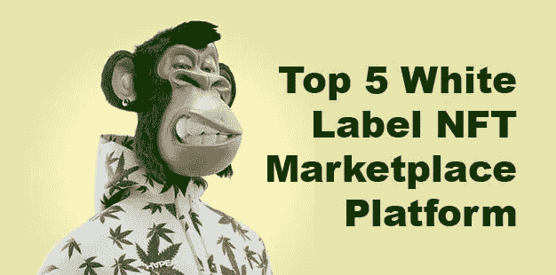

# 前 5 名白色标签非功能性测试市场

> 原文：<https://medium.com/nerd-for-tech/top-5-white-label-nft-marketplace-21b83560a15a?source=collection_archive---------3----------------------->

近年来，非功能性测试吸引了很多关注。这种趋势是在区块链技术出现后出现的。区块链是一项新技术，受到了很多关注。更多的公司和行业认识到这项技术的重要性，并实施它来保护数据和交易。NFT 的成功并不迅速。多年来，它建立了一个庞大的营销帝国。

许多企业家现在都涌向 NFT 的空间来启动他们的新企业。对于所有这些企业家来说，发展 NFT 白色家电市场是创业的最佳途径之一。

**白色标签 NFT 市场**

白标 NFT 市场是一个预先构建的，经过测试的，易于使用的 NFT 交易平台，用于购买，销售和拍卖数字收藏中的 NFT。换句话说，白标 NFT 市场是一个可定制的 NFT 市场网站，采用先进的区块链技术来促进 NFT 交易。以太坊、币安智能链、Solana、Polygon、Avalanche 和 Cardano 等区块链网络是推出 NFT 市场的最受欢迎的区块链网络。

White Label NFT 市场类似于 Opensea 和 Rarible 等 NFT 平台，可以交易来自艺术、照片、音乐、视频、模因、元宇宙和游戏元素等各个领域的 NFT。大多数企业家选择一个白色标签 NFT 为他们的 NFT 贸易业务，而不是从零开始建立一个 NFT 市场平台。

但是，如果你想知道为什么你应该选择 NFT 白标市场来开发你的新 NFT 平台，使用白标解决方案的好处和功能就是原因。与从一开始就开发 NFT 市场相比，部署白标 NFT 市场所需的成本和时间是最少的。白 NFT 交易平台的推出让平台所有者可以在短时间内开始盈利的 NFT 交易。

**突出 NFT 白标市场的特点**

白牌 NFT 市场的一些主要特征如下:

1.  白色标签 NFT 标桩
2.  IPFS NFT 仓库的设施
3.  完美的源代码
4.  多层安全实践
5.  用户控制面板和多功能管理
6.  白标 NFT 铸币厂
7.  懒惰铸币
8.  多中国兼容性
9.  无限整合钱包
10.  浅色主题和深色主题选项

**白标 NFT 市场开发**

白标 NFT 市场开发可以在多个区块链上进行，如以太坊、币安智能链、索拉纳、卡尔达诺、多边形或其他流行的区块链网络。开发人员根据市场需求调整白标 NFT 市场，以吸引来自世界各地的用户使用该平台，并为用户创建最佳的市场就绪的 NFT 市场平台。区块链开发者在开发白标 NFT 市场时遵循以下工作流程:

*   区块链网络的确定
*   用户界面的开发
*   代币的发展
*   智能合同编码
*   IPFS 存储集成
*   前端和后端集成
*   Bug 修复和 Beta 测试
*   客户端服务器中的部署

**白色标签 NFT 市场-前 5 名**

以下是一些顶级的 [**白标 NFT 市场平台**](https://www.clarisco.com/white-label-nft-marketplace-development) ，你可以用它们来参与当前及以后的 NFT 热潮。

**1** 。 **OpenSea 克隆**

你知道 OpenSea 吗？这是第一个也是最大的建立在以太坊上的 NFT 市场。它旨在查找、购买和销售数字商品，如艺术品、交易卡、游戏资产、头像等。OpenSea 的重要属性包括以下特征:

1.  连接到您的个人资料
2.  保存您的收藏夹
3.  发现 NFT
4.  过滤和搜索 NFT
5.  最后，跟踪收藏

虽然以太坊不支持高气费的无缝交易，但 Polygon 技术的集成使得 OpenSea 即使对于初学者也是一个用户友好的界面，其中包括无气费或低气费的快速交易。

OpenSea Clone 是第一个建立在以太坊区块链网络上的 NFT 市场。OpenSea 目前是一个受欢迎的 NFT 平台，拥有非常活跃的用户，也是第一个突破十亿美元大关的 NFT 市场。OpenSea Clone 是企业家和投资者创建和启动 NFT 白标市场的首选。OpenSea NFT 市场平台的成功使得许多加密企业家在加密领域推出了他们自己的 NFT 市场。这个解决方案可以根据不同人的需求定制。

**2。稀有克隆**

Rarible Clone 具有创建个性化订阅源、浏览和收藏、高级过滤器、管理功能以及 Rarible 的其他重要功能。Rarible 非常受欢迎，拥有近 160 万用户和 2.74 亿美元的交易量。当我们看到它的优势时，企业家使用稀有克隆的选择显著增加。

此外， **Rarible clone** 以高度专业化的 NFT 交易平台为特色，拥有多个域名等等。Rarible 成为继 Opensea 之后拥有最多活跃用户的最受欢迎的白色 NFT 代币。以下是 Rarible 克隆白标解决方案的主要特点。

*   分享收藏品
*   分散
*   兼容多种设备
*   钱包的整合
*   各种各样的收藏品

它自己的标志是 RARI。这些代币的所有者将有权在与平台开发相关的决策中投票。这包括管理费，网站规则等。

**3。索拉纳克隆**

solar art 克隆版脚本的功能与 solar art NFT 市场相同，该市场曾以 NFT 而非 Solana 的形式销售数字资产。Solanart 的主要目标是为艺术和创作者分享他们的艺术提供最好的市场。Solanart Marketplace 是建立在 Solana 区块链网络基础上的成熟市场。Solanart 允许创作者和艺术家以 NFT 的形式将他们的作品作为数字资产出售。

**4。** **币安 NFT 市场克隆**

币安最近凭借其建立在币安智能链上的 NFT 市场进入了 NFT 世界。币安自推出以来创造了历史，他们正在采取不同的步骤，通过不同的平台和领域将币安带到下一个层次。币安已经成为数字货币世界中最受欢迎的平台。建立一个**币安 NFT 市场克隆**将帮助你的 NFT 市场业务达到各种标准。

**5。密码朋克/幼虫实验室克隆**

幼虫实验室病毒因 NFT 的加密朋克程序而闻名。它们于 2017 年首次免费提供，但一些加密货币已经卖到数百万美元。幼虫实验室有其他数字艺术项目，如 Autoglyphs 和其他基于以太坊区块链的软件开发程序。幼虫实验室的 NFT 密码朋克已经出售，但可以在各种第三方市场上拍卖和购买。

**crypto 朋克克隆**脚本是预建的算法。有了这个，你可以智能地创建你自己的新 NFT，像 CryptoPunks 一样，与专家一起创建你自己的数字艺术，在任何你想要的 NFT 市场上交易。因为它预先打包了必要的资源，你很快就会非常聪明地将你成功的数字艺术货币化。

**包装**

随着许多企业家进入加密货币行业，数字世界正在见证各种商业模式，目前最吸引投资者关注的业务是具有创新理念的 NFT 市场。这个 NFT 市场激起了许多加密行业企业家的兴趣。随着许多 NFT 市场在数字空间中启动，许多白色标签 NFT 市场正在开发以满足市场需求。

许多企业家选择白色标签 NFT 市场的原因是(1)快速启动时间(2)盈利能力(3)高安全性。如果你是一个想开拓 NFT 市场并进入 NFT 商业的企业家，你可以选择 [**白标 NFT 市场发展**](https://www.clarisco.com/white-label-nft-marketplace-development) 。