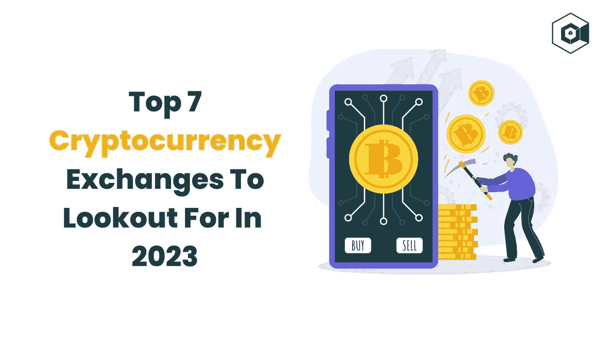

# 2023 年值得关注的 7 大加密货币交易所

> 原文：<https://medium.com/nerd-for-tech/top-7-cryptocurrency-exchanges-to-look-out-for-in-2023-feea3c14f63f?source=collection_archive---------4----------------------->

2009 年比特币的出现震惊了全球，迫使我们重新考虑货币的概念。比特币是一种加密货币，它解决了传统金融系统中的两个最大缺陷:**不信任**和**不确定性**。这种加密货币引发了连锁反应，导致了无数创新加密货币的出现。**加密货币交易所**的建立是为了管理这些加密货币，与传统货币不同，加密货币不能通过银行购买和交易。我们一点也不知道这只是密码时代的开始！

# **为什么要投资加密货币交易所开发？**

尽管核心“区块链”技术是明星吸引力，但商人、专家、风险投资公司和金融家正在将时间、精力和资金投入加密货币和其他加密货币相关平台。加密货币交易所就是这样一个以加密为动力的平台，即使在熊市期间也蓬勃发展。作为一个有利可图的商业想法，许多加密爱好者已经推出了他们自己的加密货币交易所。目前有超过 1000 个密码交易所可供选择。

尽管企业和组织已经建立了众多的**加密货币交易平台**，但只有少数几家能够真正吸引全球加密货币市场的注意力。他们是怎么做到的？关键是**开发加密货币交易所**，通过一个高度安全的生态系统，以最实惠的价格为用户提供独有的特性和功能。让我们来看看这些加密货币交易所中的一些，它们也都被设置为 2023 规则。

# **2023 年值得关注的 7 大加密货币交易所**

有无数的加密交易所可供选择，新手可能很难决定他们理想的加密货币交易所。为了方便您，我们整理了一份将在 2023 年占据主导地位的七大加密货币交易平台的列表。让我们一个一个地检查它们。

**1。Paxful**

Paxful 正在改变金融格局。在短短五年内，它们已经发展成为最受欢迎的点对点加密货币交易所之一，在全球拥有数百万用户。Paxful 从一个简单的目标开始:让被忽视的 40 亿银行服务不足和没有银行服务的人以他们从未有过的方式控制他们的钱。没有银行账户？别担心。Paxful 帕克思富提供 300 多种付款方式，让您轻松随心所欲地处理资金。为了确保安心，Paxful 上的所有交易都受到安全托管服务的保护。如果你想启动一个类似 Paxful 的加密交换，你可以选择使用 Paxful 克隆脚本或者从头开始构建一个类似 Paxful 的加密交换。选择权在你。至关重要的是与一个可靠的**加密交换发展公司**结盟，以确保你的加密交换的成功。

**2。比特币基地**

比特币基地是全球流动性最强的加密现货交易所之一。成立加密交易所的目的是促进全球经济自由。用户可以利用他们的 FIX/REST API 和 WebSocket feeds，通过交易所立即访问订单和实时市场数据。比特币基地成立于 2012 年，具有革命性的愿景，即任何人、任何地方都应该能够轻松高效地发送和接收加密货币。它们现在为进入更大的秘密经济提供了一个可靠而简单的平台。比特币基地帮助世界各地的客户了解并开始使用加密货币。你可以利用一个没有错误的比特币基地克隆脚本在几天内启动一个类似于比特币基地的加密交易所。与领先的**加密交换开发公司**合作，进一步发展。

**3。币安**

就每日加密货币交易量而言，币安加密货币交易所是全球最大的平台。它成立于 2017 年，总部设在开曼群岛。之前设计高频交易软件的程序员赵昌鹏成立了这家公司。它是 2018 年 1 月最大的加密货币交易所，市值为 13 亿美元，这一地位一直保持到 2021 年 4 月，尽管面临比特币基地和其他人的激烈竞争。自成立以来，该公司已经推出了两种自己创造的加密货币:币安硬币(BNB)和美元货币(BUSD)。币安允许其用户通过 BNB 支付费用。BUSD 是一种与美元挂钩的稳定货币。币安提供多种交易选择，包括 P2P 交易、现货交易和保证金交易。今天就推出一个类似于币安的加密交易所，拥有丰富的功能，经过严格测试的**币安克隆脚本**！

**4。WazirX**

WazirX 是印度最受信任的加密货币交易所。该团队孜孜不倦地开发了一个高度安全的平台，使您能够以令人难以置信的便利、信心和信任来购买、出售和交易加密货币。他们一直在投资频繁的安全审计，以保证印度有一个非常安全的交易平台。WazirX 能够毫不费力地处理数百万笔交易。他们的系统基础设施可以在几秒钟内扩展，以满足激增的需求。WazirX 提供跨所有平台的统一和强大的交易体验，包括 Web、Android 和 iOS 移动应用程序、Windows 和 Mac 应用程序。WazirX 为每个人提供了一个解决方案，无论你是首次投资者还是经验丰富的交易者。现在就用功能丰富的 **WazirX 克隆脚本**构建一个功能强大的类似 WazirX 的加密货币交换平台！

**5。火币**

Huobi 是一家位于塞舌尔的加密货币交易所。该公司成立于中国，目前在香港、韩国、日本和美国设有办事处。从根本上来说，该交易所与其他任何交易所一样强大，在运营的九年中没有任何记录在案的安全问题。Huobi 令牌(HT)是 Huobi 加密交换的本地令牌。霍比令牌就好比 BNB 是币安成功的密码交易所的核心和基础。Huobi token 现已跻身全球 60 大加密公司，市值约 10 亿美元。过去 24 小时的交易量为 43.9 亿美元。在 853 家交易所中，火币网在透明度和交易量方面排名第六。想在几天之内推出一个类似 Huobi 的密码交易所吗？今天就带着非凡的**火笔克隆剧本**走吧！

**6。库币**

就现货交易量而言，KuCoin 是领先的交易所之一，在 200 个国家拥有超过 1800 万用户。它已经成为著名的加密货币交易所之一，与币安、比特币基地和其他国家竞争。KuCoin 平台提供超过 600 种货币，无论是新手还是专家投资者都可以发现几乎任何他们想购买或交易的加密货币。KuCoin 广泛的功能集和最低的费用使其成为加密投资者的一个有吸引力的选择。KuCoin 对法定货币和加密货币的交换没有限制，他们的 P2P 市场和信用卡/借记卡渠道支持超过 50 种法定货币。KuCoin 通过提供各种交易和金融解决方案，使用户能够增强他们的实际体验。今天就开始您的加密之旅吧，通过一个完全可定制的 **KuCoin 克隆脚本**启动一个类似 KuCoin 的加密交换。

**7。北海巨妖**

北海巨妖是世界上最大和最有影响力的加密货币交易所之一，由于其卓越的服务、实惠的费用、多样化的融资选择和严格的安全要求，经常被评为在线购买和销售加密货币的最佳地点之一，但这只是故事的一部分。自 2011 年以来，他们一直站在区块链革命的最前沿。他们的目的是加快加密货币的采用，以便您和整个世界能够实现财务独立和包容性。北海巨妖顶级的安全性和各种可访问的密码使其成为新老密码投资者的绝佳选择。北海巨妖是各种规模机构的领先加密货币交易平台，提供从场外交易到定制白手套账户管理的一切服务。今天就利用北海巨妖的克隆脚本，推出一个和北海巨妖一模一样的加密货币交易所。

# **关闭思路**

无论加密货币经历熊市还是牛市，有一点是肯定的。加密货币交易所将继续存在。许多加密交易平台在长达一年的熊市中幸存下来的事实证明，投资加密平台是明智之举。今天，有许多方法可以推出加密货币交易所。但如果你想快速推出加密货币交易所，一个**白标加密交易所解决方案**或一个 [**加密交易所克隆脚本**](https://www.clarisco.com/cryptocurrency-exchange-script) 是一条路要走。你也可以从头开始建立一个加密货币交易所。无论你选择哪种方法，你肯定需要一个著名的 [**密码交换开发公司**](https://www.clarisco.com/cryptocurrency-exchange-development) 的知识和专业技能来确保你的平台长期成功。在开始你的加密事业之前，一定要讨论你的需求。安全总比后悔好！