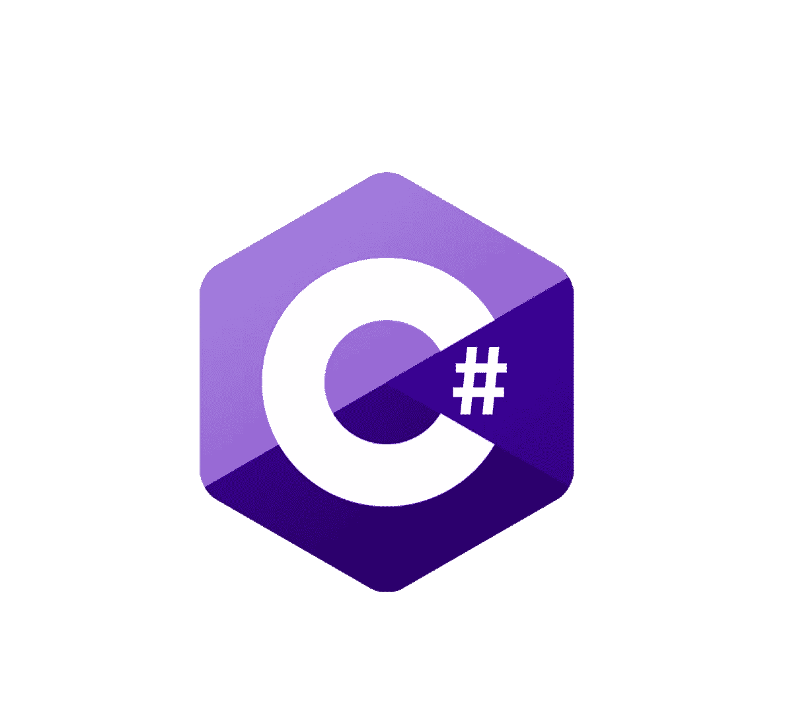
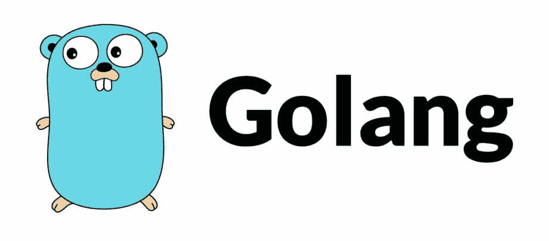
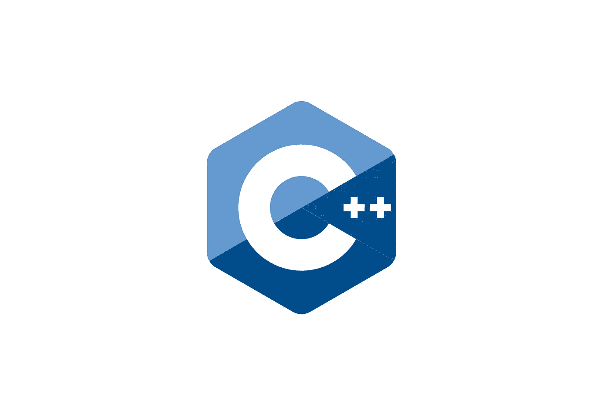
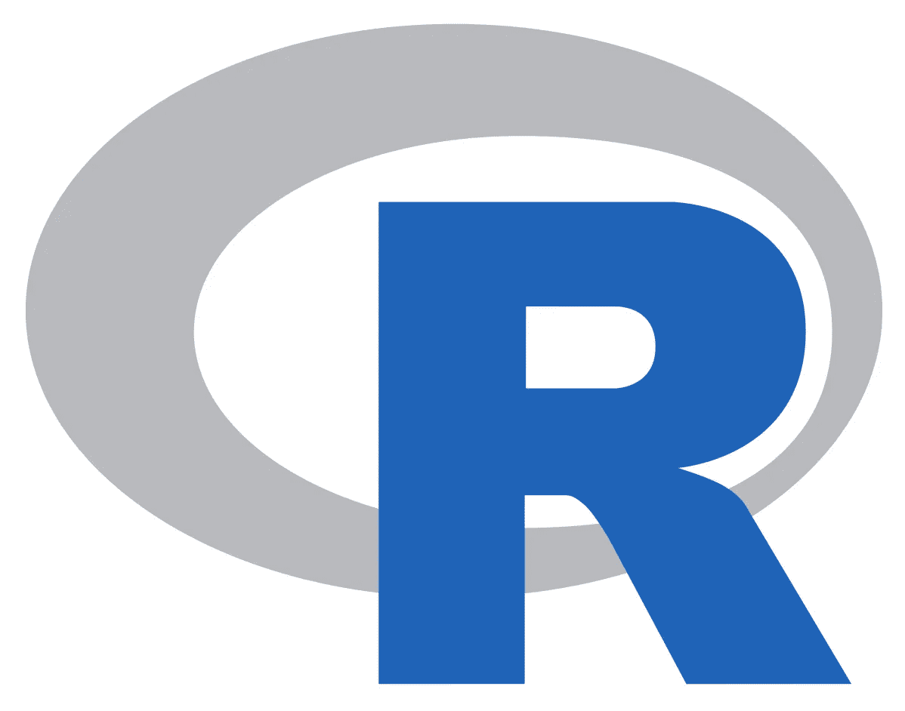
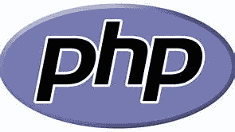
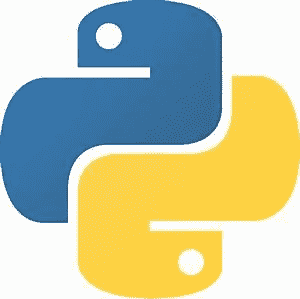

# 2021 年 8 大编程语言。

> 原文：<https://medium.com/nerd-for-tech/top-8-programming-language-for-2021-48dc23475a35?source=collection_archive---------26----------------------->

# 8) C#

C sharp 是面向对象的编程语言，简单易学。它支持大量功能丰富的库，是继 C++之后的下一个最佳选择。C#编程语言因开发 windows 及其应用程序而广为人知，现在它也被用于开发 windows，甚至 VR 游戏。使用 C sharp 作为编程语言的公司有微软、亚马逊、cyber in fractures incorporated 以及其他许多公司，根据工资级别，有几年经验的 c-sharp 开发人员每年可以挣近 102，000 美元，在印度，他们每年可以挣近 100 万卢比。

# 7)走

接下来，我们要走了。在这段视频中讨论的所有编程语言中，Go 可能是最不为人所知的。它是 Google 在 2007 年为 API 和 web 应用程序开发的。由于其简单性，Go 最近成为发展最快的编程语言之一。GO 是众所周知的，因为 golang 是为了满足从事大型项目的程序员的需求而创建的，它在许多大型项目中广受欢迎。由于其简单而现代的结构和熟悉的语法，它在许多大型 It 公司中受到欢迎。使用 go 作为编程语言的公司包括 google、uber、twitch、dropbox 等。根据 glassdoor golang 的说法，有几年经验的开发者每年可以赚将近 75000 美元，而在印度，他们每年可以赚将近 130 万卢比。

Go vs Python 哪个是最好的编码语言？- [点击这里](/nerd-for-tech/python-vs-go-28a636313a1e)

# 6) C++

排名第八的是 c ++。C++是最有效和最灵活的编程语言之一。尽管与列表中的其他语言相比，它是一种相对古老的语言，但由于其高性能和可靠性，它仍然保持了其需求。C++是为了支持面向对象的编程而构建的，拥有丰富的库。C++在科技行业中有各种用途，如桌面应用程序开发、web 和移动解决方案、游戏开发，甚至嵌入式系统。使用 C++作为编程语言的公司有 Adobe、微软、谷歌等等。有几年经验的 C++开发人员每年能挣近 10 万美元，在印度，他们每年能挣 12 万美元左右。根据 glassdoor 的说法。

# 5) Java 脚本

接下来，我们有世界上最流行的编程语言 Java Script。Java Script 是当今最流行的 web 开发语言。javascript 支持高度交互的网站和 web 应用程序。javascript 是前端开发的首选语言，现在仍然如此，但随着 node.js 等框架的引入，它现在也用于服务器端或后端开发。在游戏开发和物联网领域，其范围也在迅速扩大。根据 glassdoor 的说法，使用 Java 脚本作为编程语言的公司有 PayPal、Google、Microsoft 等。Java 脚本开发人员每年可以轻松赚到 117，000 美元，在印度，他们每年可以赚到 100 万卢比。

Java Script 和 Python 哪个最好- [点击这里](https://jeynadar23.medium.com/java-script-vs-python-b8de2aabc425)

# 4) R

接下来，我们有 R 是由罗伯特先生和罗西在 1992 年构思的。R 是一种全面的统计分析语言，它鼓励开发人员实现新的想法。R 在 Linux、gnu 和 Microsoft Windows 上工作得最好，R 在数据科学、统计计算和机器学习领域的应用。虽然 R 很难学，但它被认为是未来的编程语言。使用 R 作为编程语言的公司有凯捷、埃森哲和其他许多公司。只有几年经验的研发人员可以轻松获得每年近 15 万美元的收入，而在印度，他们每年可以获得大约 90 万卢比的收入。

# 3)科特林

Kotlin 是一种通用编程语言。它最初由 JetBrains 开发，可与 Java 互操作，并且支持函数式编程语言。Kotlin 广泛用于 android 开发、web 开发、桌面应用程序开发和服务器端开发。Kotlin 是为了比 java 更好而构建的，使用这种语言的人认为大多数谷歌应用程序都是基于 Kotlin 的。使用 Kotlin 作为编程语言的公司有 Coursera、Pinterest、Postmates 等等。根据 glassdoor Kotlin 的说法，有经验的开发人员每年可以赚近 14 万美元，在印度，他们每年可以赚 80 万卢比。

# 2) PHP

接下来，我们有 PHP。PHP 编程语言最初是为了维护一个个人网站而创建的，但从那时起，它已经接管了全球 24 个网站。PHP 语言通常用于创建静态和动态网站，一些流行的 web 框架如 laravel 都是基于 PHP 开发的。PHP 为网站引入了动态变化，使 web 应用程序更具交互性。使用 PHP 作为编程语言的公司有脸书、雅虎、Mailchimp 和许多其他公司。

# 1)Python

在第一个位置，我们有 python 编程语言。Python 是发展最快的编程语言之一，也是最受欢迎的编程语言之一，具有可靠且构建良好的框架。它是开源的，并且易于学习。python 在行业中的许多领域都有应用。基于 python 的 Django 框架在 web 开发中得到广泛应用。此外，Python 已经成为机器语言和人工智能的首选编程语言。使用 python 进行开发的大公司有 Instagram、Spotify、亚马逊和脸书。

很少有人想了解 python - [点击这里](https://jeynadar23.medium.com/why-python-is-popular-336809dd4aba)

别忘了留下你的回答。✌

大家敬请关注！！为了把我的故事发到你的邮箱里，请**订阅我的时事通讯。**

感谢您的阅读！不要忘记给你的掌声，分享你的回答，并与朋友分享！！