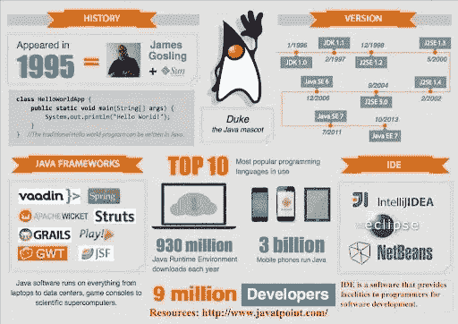
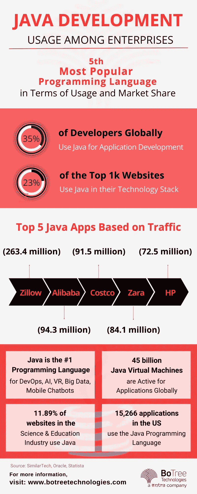

# Java 开发在 2022 年依然重要的八大理由

> 原文：<https://medium.com/nerd-for-tech/top-8-reasons-java-development-remains-relevant-in-2022-763ef78e42d1?source=collection_archive---------0----------------------->

全球 35.35%的开发者使用 Java 进行 web 开发的原因不止这些。

它是全球第五大最受欢迎的编程语言。

Java 被认为是全球最杰出的编程语言之一，并且在过去的 20 年里一直保持稳定。随着时间的推移， [Java 开发服务](https://www.botreetechnologies.com/java-development-company)在企业、web 和移动应用程序的开发方面获得了巨大的反响，因此变得越来越强大。

从上网到构建 Android 移动应用程序，Java 应用程序开发无处不在。如果你不太可能熟悉你的第一门编程语言，那么作为初学者，考虑 Java 是一个安全的选择。

今天，Java 对于数据科学、嵌入式系统、GUI，甚至数据科学应用程序都很有用。Android 应用程序利用 Java 作为他们喜欢的技术，因为它的可用性和提供独特功能的部件。已经超过 26 年了，但编程语言仍在继续向前发展，超过 90%的财富 500 强组织在其技术栈中使用它。

现在是 2022 年。Java 还能像以前那样工作吗？本文就是这个问题的答案。继续阅读以了解更多。

> *阅读更多:* [*为什么 2022 年流行 Java 应用开发？*](https://www.botreetechnologies.com/blog/why-is-java-application-development-popular/)

# Java 开发在 2022 年仍然适用的 8 个原因

Java 软件开发服务被用来制作轻便快速的定制软件，以及复杂的企业应用程序。假设你是一名 Android 工程师或应用程序开发人员，你可能需要经常使用 Java，因为它适用于几乎所有的小工具和平台(macOS、Windows、Linux)。

有了机器学习，AI，云计算等。，在 2022 年投入使用，需要技术来维持它们。 [Java web 开发服务](https://www.botreetechnologies.com/blog/what-does-the-future-of-java-web-development-look-like/)非常适合这样的需求。

以下是 Java 至今仍然适用的一些常见原因

**1。丰富的 API 特性**

*   Java API 是一组方法，可以满足广泛的需求，比如数据集的可用性、组织、解析 XML 处理输入结果，而这只是冰山一角。
*   虽然 Java 包含了大约 50 个流行语，但它的应用程序编程接口(API)是全面而广泛的。它装载了许多可以在您的代码中直接使用的策略。此外，Java 有许多开源库，如 Google Guava、Apache Xerxes、Apache POI、Apache Commons、OpenCV、Gson 等。

**2。更容易学习**

*   这对于不同的开发者来说应该是惊人的，但很明显，这是现实。考虑到 Java，学习和适应的期望更加极端，因为它有助于开发人员在有限的时间内完成大部分任务。
*   鉴于熟悉的英语标点符号，它依赖于少量的魔法字符，这无疑使学习和掌握这两种语言变得更加简单。当开发人员克服了潜在的障碍时，理解起来就变得更简单了。

**3。定期更新**

*   与其他一些编程语言和技术堆栈完全不同，利用 Java 的应用程序开发通常是一种趋势，因为它不断更新以编程软件解决方案。2018 年 Java 改为 6 个月更新发布周期。新的更新和元素会在三月和九月持续推出。
*   Java 10 的每一次交付都变得更快，现在这种编程语言已经超出了任何人之前的预期。保持对时代的了解，Java 对微服务、云计算、移动应用以及更多服务都有帮助。

**4。安全开发**

*   关于编写代码，编程语言的灵活性和安全性对工程师来说非常重要。Java 语言非常灵活，它可以在任何工作框架上正常运行。
*   当它在 1995 年由 Sun Microsystems 创建时，由于它的安全优势，从那时起，Java 进入了许多公司的核心。作为编程行业的业余爱好者，您需要将 Java 添加到您的必做清单中，以确保灵活性和安全性。

**5。神奇的图书馆**

*   最好的 Java web 应用程序开发框架之一——Spring，保证了卓越的等级和便利的应用程序开发。它拥有工程师传达能力所需的一切，而无需从基线编写代码。Spring 是满足所有应用程序开发需求的最佳 Java 系统。
*   除了 Spring，还有 Hibernate、Struts、Wicket、GWT、Dropwizardm，这些都是基于 Java 的软件开发服务的不同框架。Google Guava、Apache Commons、Jackson 和其他一些库提供了强大的功能，可以毫无问题地添加特性。

**6。跨平台开发**

*   软件工程师需要一种语言来提供像处理不同平台这样的元素。在这种情况下，Java 会避开所有可用的语言。Java 是可以通过 Java 虚拟机运行的字节码。
*   虽然不同的语言要求编译器将代码长度缩短到可以塞进机器的程度，但 Java 可以选择使代码具有适应性，可以从一台 PC 开始传输，然后通过字节传输到下一台 PC。因此，Java 目前是平台自治的，可以有效地部署。

7 .**。广大社区**

*   JAVA 是一种编程语言，它支持不同类型的具有想象力和批判性思维能力的开发人员和设计人员。它有助于发展一个拥有最丰富知识网络的广泛的工程师组织。关于 Java 应用程序开发的创建、给予和获得专家的指导是一件令人愉快的事情，而且这一切都是免费的。
*   一系列的论坛，你可以张贴问题，堆栈溢出和其他用户门户网站，通常可以获得帮助和支持的任何一点。这是 Java 在世界范围内进步程度的证据。

**8。初学者友好型**

*   鉴于 Java 是一种用户友好的编程语言，它将在 2022 年继续流行。像内存管理这样的复杂活动可以轻松执行。新开发人员可以毫不费力地编写和运行程序。
*   [Java 开发公司](https://botreetechnologies.medium.com/top-10-java-software-development-companies-to-know-in-2022-d1042a105d6a)有大量的工程师参与构建应用程序。无论如何，他们同样有初级工程师从一开始就开始构建应用程序。这是因为编写 Java 程序从第一天起就是真正用户友好的。

> 阅读更多:[现实世界中十大流行 Java 应用示例](https://www.botreetechnologies.com/blog/java-applications-examples/)

# 结论

Java 是一种编程语言，它在很长一段时间内都很有帮助，而且在无限的未来还会如此。它拥有合适的特性和元素，可以在各种企业和初创公司中创建适应性强的应用程序。

Java 被世界上几个最大的组织所使用，并且得到了普遍的好评。它的系统和库为工程师提供了开发的简单性和组织的生产力。因为这个原因，Java 开发人员的需求量一直很大，这也是他们获得高薪的原因。

从领先的 [Java 软件开发公司](https://www.botreetechnologies.com/java-development-company)获得高质量的 Java 软件服务。请立即联系我们进行免费咨询。

*原载于 2022 年 4 月 5 日*[*【https://www.botreetechnologies.com】*](https://www.botreetechnologies.com/blog/top-reasons-java-development-remains-relevant/)*。*