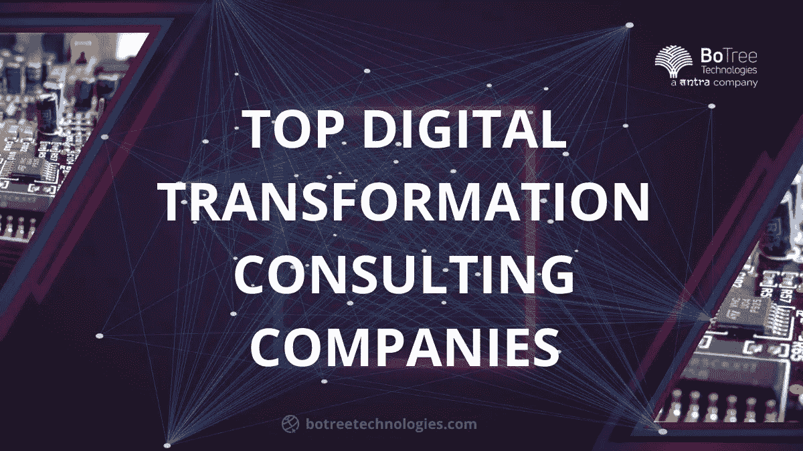

# 2023 年顶级数字化转型咨询公司

> 原文：<https://medium.com/nerd-for-tech/top-digital-transformation-consulting-companies-a0a668269607?source=collection_archive---------3----------------------->

随着世界越来越多地接触到数字化的事物，数字化转型也成为一个时髦的词。创新是前进的方向，越来越多的组织希望将“数字化”融入到他们的工作流程和过程中。

但这一数字化转型过程比看起来更复杂、更具挑战性。许多公司都意识到了这一点，这也是为什么他们成为雇用 [**数字化转型顾问**](https://dev.to/botreetech/digital-transformation-in-fintech-how-is-fintech-transformation-helping-financial-services-3m50) 的坚定信徒，以确保这种转型在正确的战略到位的情况下无缝发生。

# 数字化转型咨询公司是做什么的？

一家企业软件开发公司协助组织执行其 [**数字化转型战略**](https://www.botreetechnologies.com/blog/digital-transformation-4-strategies-to-set-the-right-goals/) 。从这样的组织的角度来看，他们首先试图通过接受他们的工作模式和其他相关实践来理解客户的需求。

一旦这一问题得到解决，这些公司就开始提出能够很好地代替传统工具的平台和技术的建议，帮助他们完成数字采用的不同阶段，如实施、采用和吸收。

对于要成为更好的数字化转型公司之一的数字化转型咨询公司来说，存在一个典型的挑战，至少可以说是非常棘手的挑战。

数字转型已经迅速成为一个自己的领域，这一事实得到了统计数据的支持- [**以 21.1%的 CAGR 计算，到 2027 年，数字转型行业的市场规模将达到 15489 亿美元**](https://www.marketsandmarkets.com/Market-Reports/digital-transformation-market-43010479.html?gclid=Cj0KCQiA1sucBhDgARIsAFoytUsbvK0zrspHgwjO6O9y8SnMVIFg8QES1gfWygtqfkI-a3xUvavOHH0aAtVAEALw_wcB) ，这是一个巨大的数字！

> **阅读更多:**[**IT 咨询公司如何持续助力数字化转型？**](https://www.botreetechnologies.com/blog/it-consulting-firms-to-help-digital-transformation/)

# 2023 年最佳数字化转型咨询公司

如果您正在寻求利用**数字化转型，并从它所蕴含的巨大利益中获得一些东西，那么这些是您确实应该关注的顶级数字化转型咨询公司:**

1.  ****博特里科技:****

*   **BoTree Technologies 成立于 2013 年，旨在为初创公司、跨国公司和各种规模的组织提供最先进的 IT 解决方案，以满足他们的各种需求。如今，它是一家优秀的 [**软件开发公司**](https://www.botreetechnologies.com/) ，竭尽全力提供量身定制的解决方案以获得最大的投资回报。**
*   **BoTree Technologies 是一家 [**技术咨询公司**](https://www.tntra.io/technology-consulting) ，在美国、印度和新加坡设有办事处。**

****2。科学软件:****

*   **自 1989 年成立以来，ScienceSoft 经历了一段美好的时光，发展成为最大的数字化转型公司和软件开发服务公司之一。**
*   **ScienceSoft 带来了推动流程和业务模式的端到端数字化转型的能力，以彻底改变事物的工作方式。它的总部设在美国德克萨斯州。**

****3。李维赫兹:****

*   **LeewayHertz 成立于 2007 年，总部设在加利福尼亚州的三藩市，长期以来一直是 [**数字化转型**](https://www.botreetechnologies.com/blog/why-should-startups-partner-with-it-consulting-firms/) 最佳咨询公司之一。**
*   **他们的数字化转型顾问团队在利用人工智能通过正确的步骤实现流程自动化方面拥有多年的丰富经验。因此，如果像 [**区块链**](https://www.tntra.io/blog/role-of-blockchain-technology-in-new-economy/) 和物联网这样的技术抓住了你的想象力，这个组织是一个不错的选择。**

****4。凯捷:****

*   **凯捷成立于 1967 年，如今已成为顶级数字咨询公司**之一，竭尽全力将精彩的数字转型带到您的家门口。凯捷将设计知识、数据科学和其他领先技术相结合，能够根据您的需求量身定制解决方案。****
*   ****其以客户为中心的方法是一种久经考验的推动创新的方式。****

******5。特里安兹:******

*   ****Trianz 是一位出色的数字化转型顾问，帮助那些在没有进行适当咨询的情况下试图采用数字化转型的公司摆脱各种困境。****
*   ****这家公司位于加利福尼亚州的 Santa Clarita，帮助公司创建数字业务模型，以便更好地理解数字模式，从而更好地进行规划和执行。****

******6。Hakuna Matata:******

*   ****Hakuna Matata 成立于 2005 年，是最好的数字化转型公司之一。这家公司位于印度泰米尔纳德邦的钦奈，利用先进技术提供量身定制的应用，如**[**聊天机器人**](https://www.botreetechnologies.com/chatbot-development)[**物联网**](https://www.tntra.io/blog/internet-of-things-is-the-market-headed-in-a-good-direction/) 等。******
*   ****咨询 Hakuna Matata 来开发定制应用程序，将日常操作转换为数字流程，以提高效率和生产力，这将是一个不错的决定。****

****7。英特尔软件有限责任公司:****

*   ****如果面向未来的 [**数字化转型流程**](https://www.botreetechnologies.com/blog/how-digital-transformation-can-be-driven-by-crm/) 是优先考虑的，那么 Intellectsoft 可能是一个很好的选择。这家公司的工作流程对初学者来说是一个很好的流程，他们评估 IT 基础设施和工作流，以确保长期增长和一致的绩效。****
*   ****Intellectsoft 也是一家伟大的 [**企业软件开发公司**](https://www.botreetechnologies.com/enterprise-software-development-company) 并带来了多种途径来为全世界的品牌创建一个占主导地位的数字身份。它位于加利福尼亚州的帕洛阿尔托。****

> ******阅读更多:** [**IT 商业咨询:挑战、回报和何时雇佣**](https://www.botreetechnologies.com/blog/it-consulting-for-business-challenges-rewards-when-to-hire/)****

# ****为什么首先要聘请数字化转型顾问？****

****从排名前 10 的数字化转型咨询公司中招聘员工，可以凸显数字化转型的诸多优势，其中包括:****

*   ****可以快速收集和处理有意义的数据，揭示推动业务顺利发展的洞察力。****
*   ****数字化转型通过简化员工生产力和业务流程提供了卓越的客户体验。****
*   ****更好的数字文化促进了公司团队之间更好的协作。****
*   ****数字应用成为增加收入和利润的可靠途径。****
*   ****由于不断的改进和增强，业务运营变得更加敏捷，数字化转型成为驱动力。****

## ****最后的话****

****随着世界每天变得越来越互联，组织必须参与数字化转型之旅，才能在竞争中生存。毕竟，确保简化业务流程以提高日常运营的效率并没有坏处。****

****该博客是我们对顶级数字化转型咨询 [**公司**](/geekculture/top-10-it-consulting-services-companies-in-the-world-c8184b24fc07) 的介绍，您可以考虑以最佳方式开始您的数字化转型之旅。如果你接受我们的建议，如果你正在起步，我们会推荐 BoTree Technologies，因为他们在过去的八年里一直有真正的创新在推动他们。****

****[**联系我们**](https://www.botreetechnologies.com/contact) **今天免费咨询。******