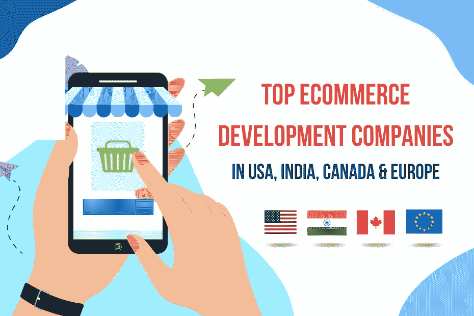
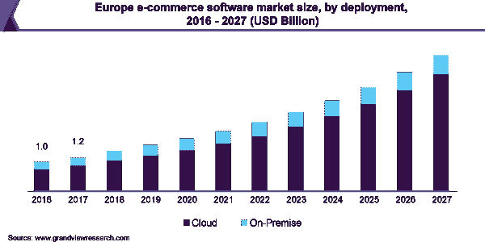
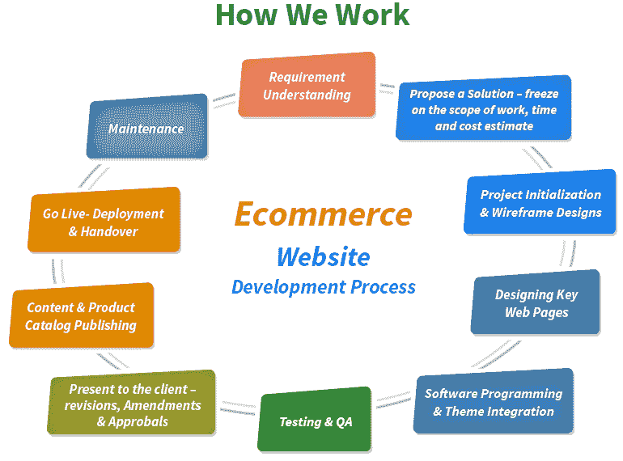
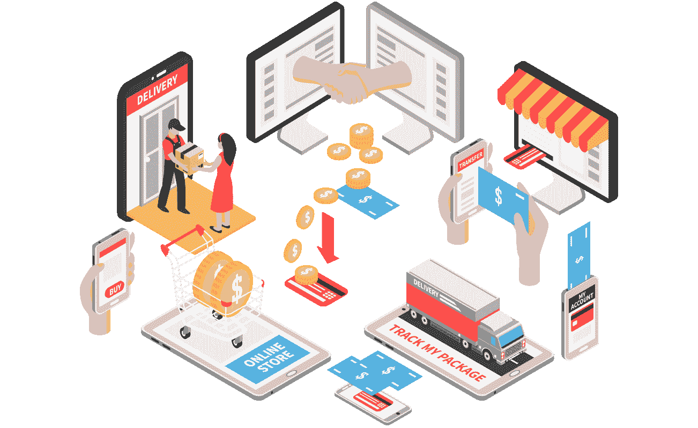

# 美国、印度、加拿大和欧洲的顶级电子商务开发公司

> 原文：<https://medium.com/nerd-for-tech/top-ecommerce-development-companies-in-usa-india-canada-europe-1f626dfd613a?source=collection_archive---------10----------------------->

电子商务是一个蓬勃发展的行业，年复一年快速增长。如果你正在考虑进入这个市场，找到合适的开发公司是很重要的。有这么多的顶级电子商务公司，很难确定哪一个最符合你的需求。

然而，企业家和企业主面临的另一个困境是决定应该选择哪个国家来雇佣电子商务应用程序开发人员。这是因为根据国家的经济状况，不同国家的开发者成本是不同的。

雇用电子商务开发人员的地点的微小变化可以帮你节省一大笔钱。在这篇文章中，我们将浏览主要国家中提供高质量服务的顶级电子商务开发公司。

所以，让我们不要浪费一分一秒的时间，看一眼他们。

**美国最佳电子商务发展公司**

电子商务开发价格在美国是一个受欢迎的选择，小企业，但它可以是昂贵的。如果你想了解市场，由于预算限制，雇佣一个有经验的开发人员可能并不理想。最好的消息是，对于希望开始网上业务的公司来说，有很多选择。

电子商务开发人员的平均时薪是 20-100 美元，取决于你想开发的电子商务解决方案。美国是最具科技创新的国家之一，拥有众多的电子商务和软件开发公司。

让我们看一看美国顶尖的电子商务开发公司。

## **#1。莫比卡萨**

这是一家电子商务网站设计公司，设计和创建创新的网络应用解决方案，以增加流量，从而增加收入。该公司旨在通过全方位服务开发或根据客户需求提供个性化服务，为客户提供可扩展的网站和应用程序，从而增加流量。顶尖的开发人员设计吸引目标受众的应用程序，从而提高盈利能力。

从网站和应用程序的全面服务开发，我们引导我们的客户推出最具可扩展性的平台，对从他们的数字足迹中带来利润产生重大影响。mobiKASA 的顶尖工程师开发移动友好的界面，吸引您期望的客户群，从而实现更高的投资回报。

## **#2。万磁王**

万磁王是一个数字机构和团队的灵巧的电子商务开发人员，创造设计精美的端到端 B2C 和 B2B 电子商务解决方案。他们还与公司合作，整合他们的 CRM 系统、ERP 软件和数字营销活动，以获得最佳的客户体验。凭借敏捷的方法，他们创建了行业领先的用户界面-从令人惊叹的网上商店到创新的移动应用程序！

该公司通过改善和简化其客户获取和保留实践，帮助其客户提高其内部团队的效率。利用其 90+的资源优势，该公司通过为在线商店提供开创性的数字解决方案来扩展电子商务业务。

## **#3。终点**

End Point 成立于纽约，是一家提供全方位服务的软件咨询和电子商务网站开发公司。我们擅长建设大规模、动态的基础设施，并将新想法推向市场。在过去的二十年里，我们已经为世界各地的客户实现了业务流程的自动化。

End Point 是一家拥有多年经验的成熟技术咨询公司。我们才华横溢的团队参与了一些不可思议的项目，这些项目在全球大大小小的企业中都获得了成功。

## **#4。绝对网络**

Absolute Web-一家总部位于佛罗里达州的电子商务开发公司，专门为希望在互联网上留下持久印象的公司提供电子商务解决方案，同时通过提高网站流量的转化率来增加在线收入机会，这是因为页面设计更好，整体美学更具吸引力。

此外，该公司在开发的所有阶段都与客户密切合作，这是许多商店未能在自己与消费者之间建立紧密合作伙伴关系的关键方面，这些消费者经常使用这些网站，或者只从这些网站购买一次商品，而不是在以后需要其他产品时再次返回。

## **#5。商业专家**

Commerce Pundit 是一个创新的电子商务网站开发团队，为 B2B 和 B2C 客户提供定制的电子商务解决方案。该公司拥有十年的经验，团队中有超过 250 名经验丰富的 IT 专业人员。该公司旨在提供收入增加的平台，帮助客户企业增加市场份额，无论他们属于哪个行业。

凭借超过 200 万小时的编写代码，其团队包括 50 名 Magento 认证的开发人员，他们已经完美地交付了 150 多个项目。为了确保每个项目顺利完成，团队遵循一套经过反复试验的程序。

# **印度顶级电子商务解决方案公司**

对于需要可伸缩性或高流量支持的公司来说，在印度开发电子商务应用程序是一个受欢迎的选择。在过去的十年中，这种技术已经成为了一种行业标准，并且随着开发人员对该平台知识的扩展，这种技术还在继续发展。与此同时，并不是每个人都明白如何构建完美的网站和移动应用程序。

它提供了广泛的好处，使他们成为企业寻求扩大其在线客户的理想选择！从改进的搜索引擎优化结果到更快的加载速度，这个平台已经改变了世界各地人们的购物方式。 [**电子商务开发服务**](https://www.valuecoders.com/ecommerce-development-services-company) 的平均成本为 5000 美元至 10000 美元。

所以，让我们来看看印度顶尖的电子商务软件公司。

## **#1。** [**估价师**](https://www.valuecoders.com/)

自 2004 年以来，ValueCoders 一直为企业提供高质量的 IT 解决方案。他们将业务领域知识、成熟的方法和技术专业知识与 450 多名熟练的软件专业人员相结合，以便为所有行业的客户的不同需求创造价值，包括从初创公司到跨国公司(MNC)。

这是一家顶级电子商务解决方案公司为企业提供各种零售和直运解决方案。其解决方案范围迎合所有电子商务 b2b 和 b2c 的需求，这就是为什么它的电子商务援助受到赞赏。

## **#2。Iflexion**

软件开发公司 Iflexion 旨在为各种行业或规模的公司提供定制的商业解决方案，并以一流的电子商务网站设计印度而闻名。他们是一个由来自全球的 850 多名 IT 专业人员组成的协调良好的团队，在五个国家设有办事处，包括印度、阿联酋和美国。

作为一家创新驱动的公司，它已被公认为提供一流的电子商务网站开发服务和满足预期的解决方案。

## **#3。弗卢珀有限公司**

Fluper 是印度一家著名的 IT 公司，旨在为财富 500 强企业提供专业的咨询和指导。Fluper 通过设计 web 应用程序和按需移动应用程序，为个人、初创公司、小型企业和企业提供最实惠的 IT 解决方案。

此外，其定制电子商务开发服务因创新、以用户为中心的方法以及通过 AR/VR、AI/ML 等技术提供的独特用户体验而获得认可。

## **#4。** [**像素蜡笔**](https://www.pixelcrayons.com/)

作为一家老牌 IT 公司，PixelCrayons 已与来自 38 个以上国家的 4800 多家客户合作。它以敏捷/DevOps 开发流程和准时项目交付而闻名 SLA 驱动方法的证明。

该公司自 2004 年开业以来，为全球 4800 家客户提供服务，其中包括印度以外的客户。IT 服务包括软件外包解决方案以及 SEO 和 PPC 管理等数字营销活动，这有助于我们提供端到端的 IT 解决方案。

## **#5。FATbit**

FATbit Technologies 是一家著名的移动应用和电子商务软件开发公司，为企业提供最佳解决方案，以获得行业领先优势。成立于 2004 年，他们已经为全球 5000 多家客户提供了市场领先的软件解决方案和产品。

他们的热情在于根据每个客户的需求创造独特的电子商务技术，从而提供无缝的商业体验。FATbit 的团队由以结果为导向的专业人士组成，他们致力于带来深厚的职能经验以及来自不同行业的专业知识。

# **欧洲顶级电子商务开发公司**

电子商务在欧洲的发展不仅受欢迎，而且在欧洲不同国家都具有成本效益。英国和德国是欧洲公认的软件应用开发最好的国家。

该地区电子商务开发的平均成本可能在 2500 英镑至 8000 英镑之间。现在让我们看一看欧洲电子商务应用程序开发排名靠前的国家。

## **#1。智能系统**

Intellias 是一家知名的数字咨询和软件工程合作伙伴，帮助财富 500 强企业提高其 IT/R&D 能力。其合作伙伴包括 HERE Technologies、LG、PTV 集团、起亚、瑞士信贷银行等等！它还被 IAOP 评为 2021 年全球外包 100 强，并因我们的发展和成功而获得 Inc 5000 大奖。

这是一家全球数字咨询公司，拥有 20 多年的经验，帮助领先的技术创新者构建面向未来的产品，同时提高他们的 R&D 能力。它与 Intellitas 等顶级品牌合作，包括(地图服务的领导者)、LG 电子(韩国跨国电子公司)、PTV 集团有限公司、现代汽车公司。

## **#2。团结组**

Unity Group 是 IT 服务和技术解决方案行业的市场领导者。它已经建立了 500 个客户成功案例，包括大众、现代或宜家等国际领先企业。该公司的增长率保持在 30%，拥有 250 多名专家，根据其 20 年的经验提供独特的专业知识。

作为一家公认的电子商务开发公司，它通过集成 AR/VR、AI/ML 和更先进的技术概念，提供了各种电子商务解决方案。

## **#3。甲骨文**

Oracle 相信有一种更好的开发方式。通过他们的专业知识，他们解决了不同部门和国家的复杂问题。

它创建定制的电子商务软件解决方案，具有自适应的设计流程，可降低开发产品或服务的成本，同时还能满足您成功所需的所有需求。

## **#4。螺旋桨**

其团队由才华横溢、充满激情的数字专家组成，致力于为我们的客户提供出色的工作。制作团队确保公司能够提供引人入胜的交互式网络体验，利用最新技术，同时提供在线设计的所有方面，包括 UX 和创意设计；WordPress 开发；Shopify/Shopify Plus 商店设置；等等。

## **#5。Codal**

Codal 通过软件开发帮助企业转变为简化的、支持性的和前瞻性的运营。它的数据驱动的、经过市场检验的敏捷流程证明了 Codal 的一个核心信念:如果解决方案根本不是解决方案，就不能解决用户的确切需求。

该公司将与其合作的每个品牌发挥到了极致，因为其团队由经验丰富的业务和技术专家组成，他们致力于通过在每个项目从开始到完成的整个过程中提供清晰的指导来帮助他们取得成功。

## **加拿大顶级电子商务公司**

所以你决定扩大你的业务，把它放到网上。如果这是条件，那么有机会，你可能是一个小或大的公司老板在寻找加拿大的电子商务网站开发成本。

对于一个基本功能很少的网站，预计价格在 999 美元到 5000 美元以上。这将包括在开发一个易于使用的网页设计界面的基础上创建登录页面以及投资组合。对于更高级的网站，如涉及电子商务购物车的网站(用户可以在那里购买产品)，根据它们在加拿大各省(如安大略省和魁北克省等)的地理位置，计划最多只支付 1 万多美元。

让我们看看加拿大顶尖的电子商务开发公司。

## **#1。Pb+j**

它是高端电子商务软件开发的首选电子商务代理公司**，**高接触品牌正处于增长和重塑的关键点。我们致力于发现盲点&机会，创造令人垂涎的数字实施，加速我们客户的成功(我们有超过 450 个证据)。

## **#2。一丝不苟**

Meticulosity 是一家精品网站设计公司，专门帮助企业、在线零售商和博客作者开发网站。它可以为我们的客户提供从设计过程到营销的整体解决方案，包括 Magento 定制电子商务开发、电子商务网站的转换优化和电子商务集客营销。

## **#3。日班数字**

Day Shift Digital 是一家可靠的网页设计和电子商务应用程序开发机构，为加拿大各种规模的企业提供定制设计、开发和电子商务服务。该公司在多伦多运营，有 5-10 名员工，他们在一个或多个大洲远程办公。

# **最终文本**

电子商务的发展要求你瞄准用户的兴趣，提供创新的客户体验。为此，你需要[电子商务开发人员](https://www.valuecoders.com/hire-developers/hire-ecommerce-developers)精通现代技术，并了解垂直业务。

上述公司是不同国家的顶级电子商务软件公司。你可以联系他们中的任何一个，把你的电子商务解决方案想法变成现实。