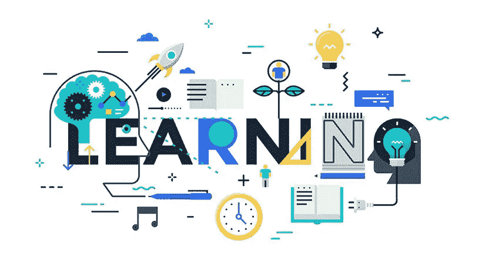
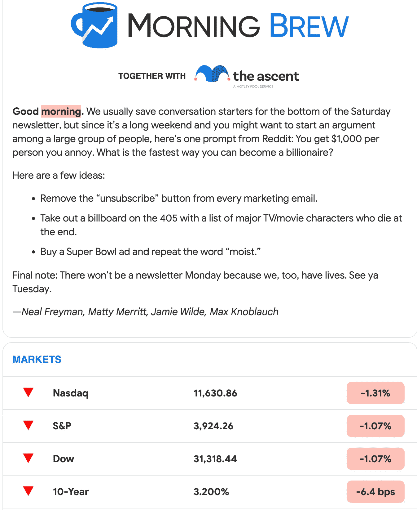
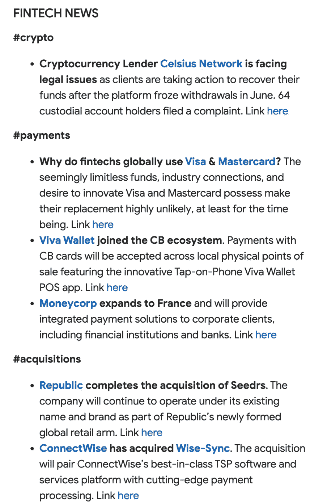
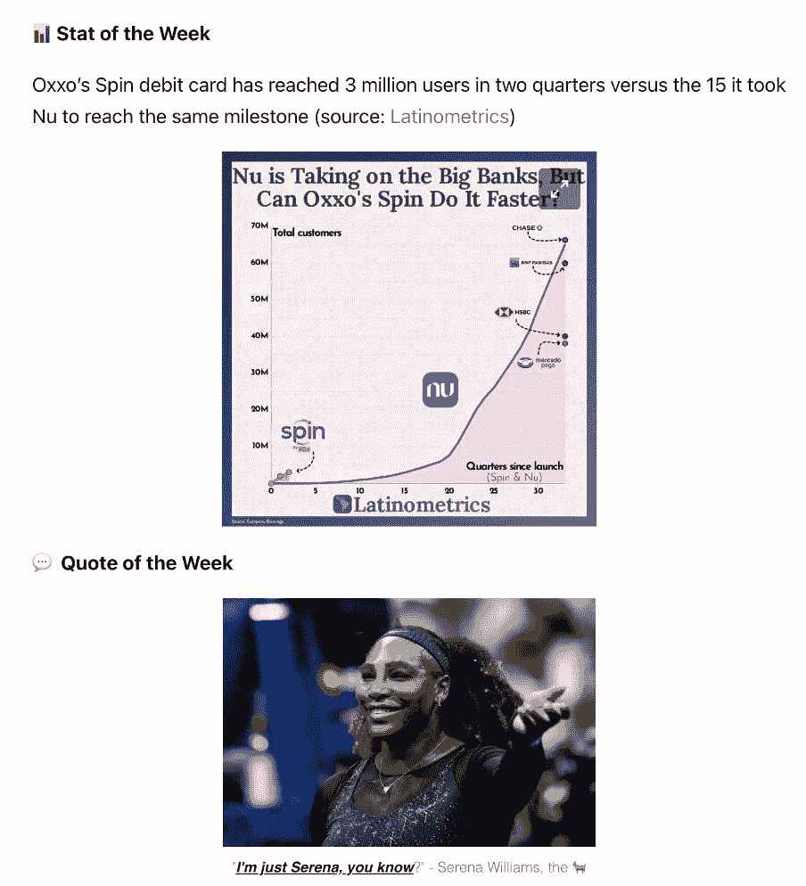
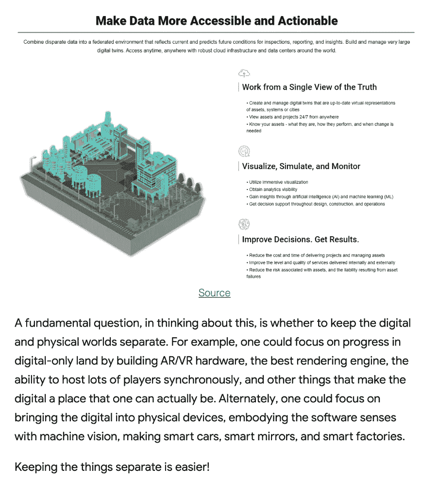
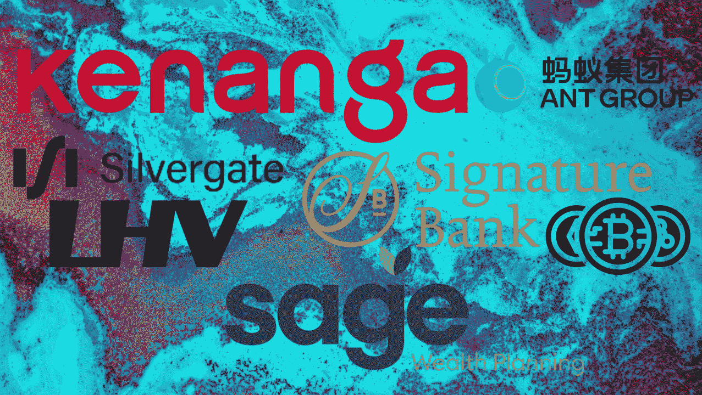
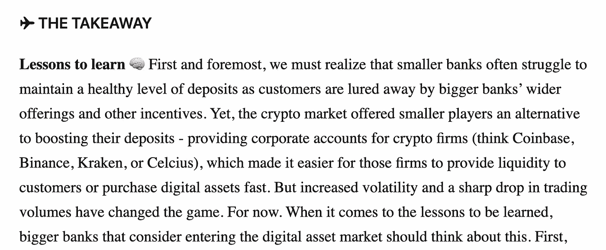

# 五大金融科技资源——增强你的行业知识

> 原文：<https://medium.com/nerd-for-tech/top-fintech-sources-enhance-your-industry-knowledge-98a856a979ad?source=collection_archive---------0----------------------->

继我之前的博客 之后，如果你想了解更多关于金融科技行业的信息，我想分享一些我最喜欢的来源。

这些来源的概念是将与金融科技行业**相关的最新、最具影响力的故事全部整合到一封**电子邮件中。

> 就我个人而言，它既方便又足智多谋，总是我一天开始时打开的首选电子邮件

# **1。晨酿**

[**晨酿**](https://www.morningbrew.com/) 是我日常阅读的第一个来源。它基本上涵盖了技术/商业行业的所有方面:美联储政策、特斯拉的宏伟目标、首次公开募股、主导流行文化的迷因等等。

带给你洞察力的早安

晨酿也有最新的播客频道 [**商务休闲**](https://www.businesscasual.fm/?utm_medium=website&utm_source=welcome&utm_campaign=mb) ，我跟着看了一些。

# 2.马塞尔新闻

[**Marcel News**](https://marcelvanoost.substack.com/) 是我最喜欢阅读的关于金融科技的信息来源，我一直关注着 [Marcel](https://www.linkedin.com/in/marcelvanoost/) ，因为他在 3-4 年前创办了这份时事通讯，当时我在荷兰。该频道一开始提供了许多与欧盟金融科技相关的有用信息，很快，就开放了世界金融科技的最新动态

来自 [**烫发**](https://www.linkedin.com/in/marcelvanoost/) 的最新消息

时事通讯关注的是**#支付、#加密、#挑战者银行**以及更多。

# 3.本周在金融科技

我喜欢本周 Fintech 中 [**的文章。这是充分的幽默感，但也非常直接的一点。总结读起来非常酷，是一封关于一天开始的有见地的信！**](https://thisweekinfintech.substack.com/)

本周来自 Fintech 的 [**最新消息**](https://thisweekinfintech.substack.com/)

时事通讯关注**融资、M & A、Fintech 产品发布**等等。这个频道的精彩之处在于

*   它链接了一些与该主题相关的交易的深度分析。有很多信息，如果你正在研究拉美市场
*   如果你想在去办公室的路上听，这个频道还包括很多有趣的播客。开始一天的最佳方式！

# 4.金融科技蓝图

[**金融科技蓝图**](https://lex.substack.com/) 由 [**莱克斯·索科林**](https://www.linkedin.com/in/alexeysokolin/) 策划。莱克斯曾担任多个高级行业职位，包括金融科技领域顶级公司的首席执行官、首席运营官和 CMO。我特别发现频道信息非常有用。就我而言，我对金融科技和 Web3 行业感兴趣。另外，这篇文章写得很好，让我们对这个问题进行了更深入的思考

# 5.莉娜的时事通讯

很久以前，我关注过 Lina 的时事通讯。他开启了质量讨论，并更新了金融科技的最新消息。

> 最重要的是，该频道始终提供 3 个**影响故事:易读、简洁。**

在这里阅读更多

**一些最新的帖子**

*   **[**小型银行率先采用加密技术**](https://www.linkedin.com/pulse/small-banks-leading-crypto-adoption-lessons-big-first-linas-beli%25C5%25ABnas/?trackingId=1gAtCJy%2FQVC%2FxzQH3XXE%2Bw%3D%3D)**
*   **[**Stripe 获得 64%的可笑估值下调**](https://linas.substack.com/p/fintechpulse281)**

**如果你感兴趣的话，我可以再写一份关于欺诈、支付或产品管理的阅读和播客清单**

**让我知道你的想法！欢迎任何其他有趣的来源阅读。**