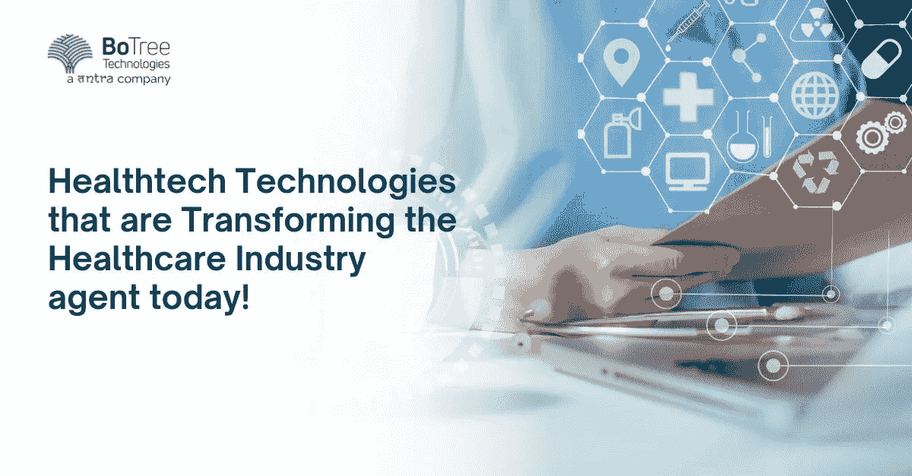

# 改变医疗保健行业的顶级医疗技术

> 原文：<https://medium.com/nerd-for-tech/top-healthtech-technologies-that-are-transforming-the-healthcare-industry-798710979f01?source=collection_archive---------10----------------------->

技术创新的大规模内爆是医疗保健行业过去十年的特征。因此，行业内出现了各种基于软件的[医疗保健应用](https://www.botreetechnologies.com/blog/most-popular-healthcare-applications-examples/)。

技术解决方案正在临床诊断、治疗和疾病管理中找到自己的位置。最近的新冠肺炎疫情表明对[医疗保健应用开发解决方案](https://www.botreetechnologies.com/blog/healthcare-app-development-the-problems-your-app-must-solve/) **的需求更高。**行业的这一进步实现了电子会诊、远程医疗、实时诊断、数字治疗等服务。

一家[企业软件开发公司](https://www.botreetechnologies.com/blog/types-of-enterprise-software-for-companies/) 可以帮助医疗机构更新其遗留系统或获得新的医疗应用程序。服务的重点应该是性能、生产率、效率、安全性、可靠性和患者的便利性。

全球[医疗保健应用开发](https://www.botreetechnologies.com/blog/computer-vision-is-useful-in-healthcare-app-development/)市场经历了巨大的增长。2020 年，仅印度医疗技术市场的价值就高达 19 亿美元。预计到 2023 年，它将以 39%的 CAGR 增长，达到 50 亿美元。

许多[健康技术解决方案](https://www.botreetechnologies.com/case-studies/healthcare)已经改变了传统的医疗保健系统。从医疗保健 web 应用程序到众多设备，医疗保健行业已经展示了系统的绝对效用。

在这篇博客中，我们将介绍全球医疗保健应用开发公司提供的一些顶级医疗保健技术系统。

阅读更多:[2022 年十大移动医疗应用发展趋势](https://www.botreetechnologies.com/blog/top-mobile-healthcare-app-development-trends/)

# 将在 2023 年推动医疗保健行业的 7 大医疗技术创新

1.  **远程医疗**

*   远程医疗是一种技术，它允许病人和医生通过视频、电话或其他数字通信方式进行远程会诊。
*   由于最近的疫情，技术已经成为一种趋势。还有，互联网技术的进步导致了这种技术的传播。远程患者护理支持与医生不在同一位置的患者进行互动。
*   [移动医疗应用程序开发解决方案](https://www.botreetechnologies.com/blog/how-mhealth-apps-are-revolutionizing-healthcare/)，如[远程医疗](https://www.botreetechnologies.com/blog/telemedicine-app-development/)，改善了远离好诊所和医院的患者的获取途径。

**2。大数据分析**

*   数字化转型带来了更好的数据收集、存储、分析、规划、工作流管理、患者监控和咨询。随着医疗保健数据量的增加，[医疗保健应用开发服务](https://theomnibuzz.com/app-development-in-healthcare-the-ultimate-guide/) 正准备提供有助于大数据分析的解决方案。
*   数据分析帮助医护人员改善患者护理。例如，数据分析工具有助于及时发现疾病，产生更好的见解，研究特定患者的疾病趋势，等等。

**3。虚拟现实**

*   虚拟现实已经在医疗保健行业找到了很多应用。BoTree Technologies 等全周期[软件开发公司](https://www.botreetechnologies.com/)可以帮助为医疗保健中心的不同应用程序设置 VR 工具。
*   虚拟现实有助于医疗保健专业的学生在实际实践开始前培养与患者的沟通技巧。这有助于他们更好地了解自己的状况。VR 确保了更安全的训练和更短的学习曲线。
*   虚拟现实在医疗保健营销中发挥着作用。在虚拟现实的帮助下，数字体验可以用来推广公司的产品和服务。
*   一段时间以来，虚拟现实在治疗心理健康问题方面也有许多应用。它可以用来管理压力、焦虑、痴呆和自闭症等问题。
*   除了在治疗精神健康问题方面的效用之外，它还可以用来改变患者对疼痛的感知。

**4。人工智能**

*   由[医疗保健应用程序开发公司](https://www.botreetechnologies.com/healthcare-app-development)提供的人工智能解决方案可以在实时解决方案的帮助下，帮助减少人工劳动和其他耗时的活动，从而有助于快速准确的诊断、治疗和疾病预防。
*   一家[医疗应用开发](https://www.botreetechnologies.com/blog/programming-languages-used-for-medical-app-development/)公司开发软件平台和 API，将数字化的好处扩展到医疗机构。人工智能可用于临床工作流程管理、高级手术辅助和医疗诊断。
*   人工智能在诊断和治疗肺癌和乳腺癌方面取得了巨大成功。基于人工智能的乳房 x 光检查速度比 T4 快 30 倍，准确率达 99%。它减少了不必要的活检。
*   人工智能还可以用于心脏病的早期检测。它允许医疗保健提供者在更早和更可治疗的阶段检测到威胁生命的并发症。

**5。神经技术**

*   它指的是与神经系统一起工作以监测或调节神经活动的任何方法或技术干预。它不仅用于医疗领域，而且在工作场所管理、体育、国家安全等方面也有许多应用。
*   大脑的各种功能属于神经技术领域。神经技术的不同组成部分包括计算机、电极和其他能够拦截流经身体的电脉冲的设备。
*   一家[医疗保健软件开发公司](https://botreetechnologies.medium.com/top-15-healthcare-software-development-companies-you-should-know-4a37a483bf2f)可以开发软件应用程序，这些应用程序可以帮助大脑成像，记录大脑电活动产生的磁场，大脑和神经系统刺激，通过神经链接监控或调节大脑功能，等等。

**6。医疗物联网(IoMT)**

*   IoMT 是指连接到互联网的医疗设备、硬件基础设施和软件应用程序的网络。它在使用和设计方面不同于普通的物联网。
*   IoMT 有助于产品开发，减少人为干预，从而提高医疗质量。连接的设备和基础设施可以支持多种应用，如自动消毒、智能诊断、远程患者管理等。

**7。区块链**

*   区块链正在多个行业获得大量牵引力。一些顶级的[医疗保健应用开发公司](https://www.botreetechnologies.com/blog/healthcare-app-development-cost-features-and-benefits/)构建了基于区块链的平台，用于维护电子病历、远程患者监控、药品供应链和健康保险索赔。
*   该技术在管理 EHR 和共享临床数据的 for 链中也发挥着重要作用。[区块链技术](https://www.tntra.io/blog/fintech-and-the-world-where-are-we-headed/)也在智能合约中发挥着不可或缺的作用。此外，它还可用于处理药品伪造、存储、共享和检索远程收集的生物医学数据。

> 阅读更多:[人工智能在医疗保健中的 5 个流行用例](https://www.botreetechnologies.com/blog/popular-use-cases-of-ai-in-healthcare/)

# 结论

该博客涵盖了一些顶级医疗保健技术，这些技术为医疗专业人员如何为患者提供领先的护理服务带来了一场革命。专业[医疗保健应用程序开发](https://www.botreetechnologies.com/blog/custom-healthcare-app-when-should-your-facility-decide-to-get-one/)的角色变得尤为重要，因为他们现在正致力于直接影响大众福祉的解决方案。

[医疗保健技术](https://www.botreetechnologies.com/blog/how-healthtech-helps-to-build-cutting-edge-solutions-for-patients/)如远程医疗和 IoMT 正在推动医疗保健的未来走向更加数字化的系统，专业人员可以提供准确及时的医疗干预。

*原载于 2022 年 11 月 14 日 https://techniexpert.com***。**