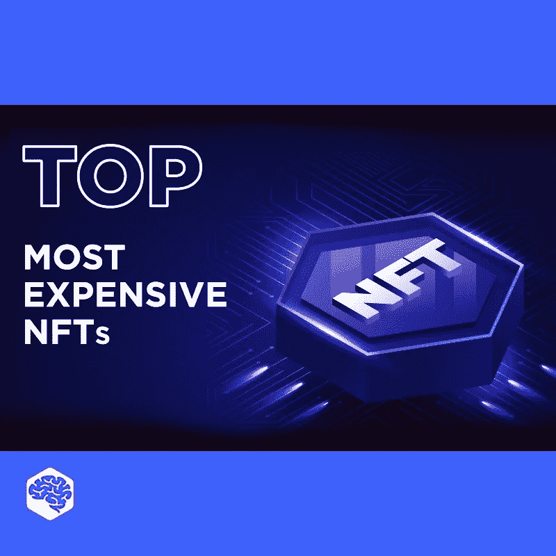

# 最贵的 NFT

> 原文：<https://medium.com/nerd-for-tech/top-most-expensive-nfts-cda776954bf4?source=collection_archive---------5----------------------->

## 你知道最贵的 NFT 卖了 6900 万美元吗？

## 你准备在 NFTs 上花多少钱？发现视频中售出的最贵的 NFT。敬请期待！

NFT 是不可替代的象征。它通常是使用与加密货币相同的编程类型构建的，如比特币或以太坊，但相似之处仅此而已。实物货币和加密货币是“可替代的”，价值相等。它们可以出售或互相交换。相比之下，所有的 NFT 都是不同的。它们都是数字签名的，使得交换或平等(因此是可替代的)成为不可能。

NFT 市场正在蓬勃发展，价格有时会被压低。发现视频中售出的最贵的 NFT。