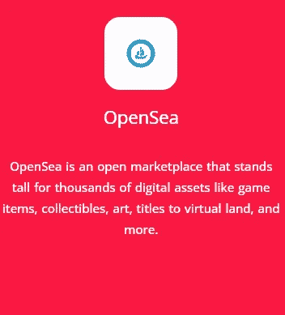
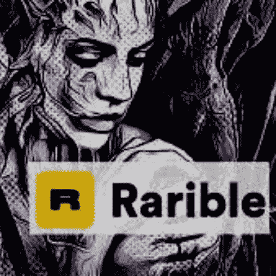
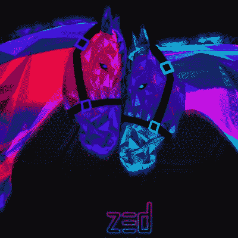
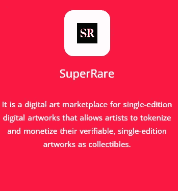
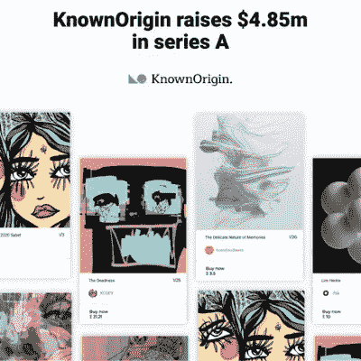
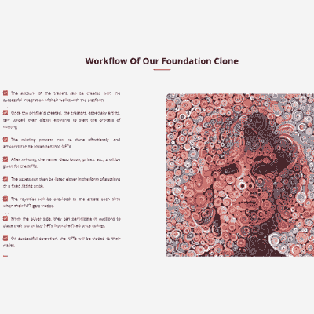

# 2022 年 NFT 顶级市场

> 原文：<https://medium.com/nerd-for-tech/top-nft-marketplace-clones-in-2022-627da8aa271e?source=collection_archive---------5----------------------->

**2022 年 NFT 顶级市场**

NFT 和交易所在公众中变得非常受欢迎。因为它们具有存储任何类型媒体如图像、音频、视频等的特性。NFT 是使用区块链技术铸造的，因此是一种无法删除或修改的永久存储形式。

目前在数字世界中有许多 NFT 市场，如 Opensea、Rarible 等。由于其独特的属性，这些 NFT 市场在各个领域的艺术家中变得相当受欢迎。NFT 无处不在！

[**现在是您创建一流的 NFT 市场**](https://www.cryptocurrencyexchangescript.com/nft-marketplace-development?utm_source=publication&utm_medium=nerd-for-tech-17-04-22&utm_campaign=vigneshraju) 的时候了，您将在数字空间中脱颖而出，获得丰厚的利润和回报。

在了解最好的 NFT 市场克隆之前，让我们先简单介绍一下 NFT 和 NFT 市场。

# 什么是 NFT，为什么他们变得流行？

**NFT 爱好者**

不可替换的令牌资产代表现实世界的元素，如艺术、音乐、游戏中的项目和视频。它们通常使用加密货币在线购买和交易，并且与大多数加密货币一样，它们是通过区块链生成的。

NFT 于 2014 年推出，自上市以来，它们比加密货币更受欢迎。NFT 是独特的资产，使其适合在其他企业或行业中实施。这些因素是它们大规模增长的主要原因。

# NFT 市场及其特点

NFT 市场是一个在线平台，所有 NFT 用户和投资者都可以在这个平台上向全球用户购买、出售和交易代币。NFT 市场在平台上列出了所有的代币以及所有权等详细信息。

***特性***

*购买、出售和投资非金融资产。*

*薄荷新 NFTs。*

*查看市场状况。*

根据他们的兴趣找到那些非技术人员。

# 为什么找到最好的 NFT 市场复制品很重要？

在为任何实时业务开发软件时，考虑这一点至关重要。NFT 市场的发展也是如此。因此，如果您想以一个成功的点对点区块链业务架构开始您的项目，选择正确的开发脚本是至关重要的。

这有助于您在[***NFT 市场***](https://www.cryptocurrencyexchangescript.com/nft-marketing-services?utm_source=medium&utm_medium=guestblog&utm_campaign=vigneshraju) 快速发展业务，提供多项重要业务优势，如快速开发、低投资、应用定制、专业协助等。

# ‣开放海洋克隆

**OPENSEA 克隆**

[**Opensea 克隆**](https://www.cryptocurrencyexchangescript.com/opensea-like-platform-development?utm_source=publication&utm_medium=nerd-for-tech-17-04-22&utm_campaign=vigneshraju) 是一个分散的脚本建立在分布式区块链网络上，可用于建立一个 P2P NFT 市场，其中包括收藏品、艺术品和域名互换。

# ‣稀有克隆

**稀有克隆**

[**Rarible Clone**](https://www.cryptocurrencyexchangescript.com/rarible-clone-script?utm_source=publication&utm_medium=nerd-for-tech-17-04-22&utm_campaign=vigneshraju) 是一个 NFT 市场克隆脚本，旨在模拟 *Rarible 的功能和特性*。

# ‣·泽德伦克隆人

佐德龙克隆人

Zedrun 克隆版****是一个基于 Zedrun 的完整源代码，任何人都可以创建自己的 NFT 集市，类似于原来的集市。****

# ****‣超级稀有克隆****

********

******超级稀有克隆******

****[**超级稀有克隆**](https://www.cryptocurrencyexchangescript.com/superrare-clone-script?utm_source=publication&utm_medium=nerd-for-tech-17-04-22&utm_campaign=vigneshraju) 是一个现成的 NFT 市场脚本，包括所有原始平台功能和服务。用市面上的高级*超级稀有的 NFT 市场克隆脚本*开始你自己的 NFT 市场。****

# ****‣已知起源克隆****

********

******已知起源克隆******

****[**已知原产地克隆**](https://www.cryptocurrencyexchangescript.com/knownorigin-clone?utm_source=publication&utm_medium=nerd-for-tech-17-04-22&utm_campaign=vigneshraju) 是另一个克隆脚本，它包括启动类似于 Known Origin 的 NFT 市场的所有必要组件。可以调整市场的特性和功能，以满足您的业务需求。****

# ****‣克隆基金会****

********

******基金会克隆******

****[**基金会克隆**](https://www.cryptocurrencyexchangescript.com/foundation-clone-script?utm_source=publication&utm_medium=nerd-for-tech-17-04-22&utm_campaign=vigneshraju) 是创建自己的基金会风格的 NFT 拍卖平台的源代码。该市场通过允许艺术家、创作者和其他人与收藏家互动来表彰他们的作品。他们可以使用一种叫做铸造的程序将他们的作品转换成非功能性测试。NFT 克隆版提供了与原始平台相同的功能。****

****随着许多用户和市场上新出现的 NFT，NFT 的世界正在扩大。NFT 已经开始改变其他各种业务。这种突然的增长增加了对更多市场的需求。*[***打造 NFT 市集发展***](https://www.cryptocurrencyexchangescript.com/nft-marketplace-development?utm_source=medium&utm_medium=guestblog&utm_campaign=vigneshraju)*将帮助创作者获得巨大的投资回报。对 NFT 市场有基本了解的创造者和投资者可以在 NFT 世界开始他们的市场，以获得额外的收入。******