# 2022 年 NFT 顶级市场

> 原文：<https://medium.com/nerd-for-tech/top-nft-marketplaces-in-2022-bb4cf19cc8fa?source=collection_archive---------3----------------------->

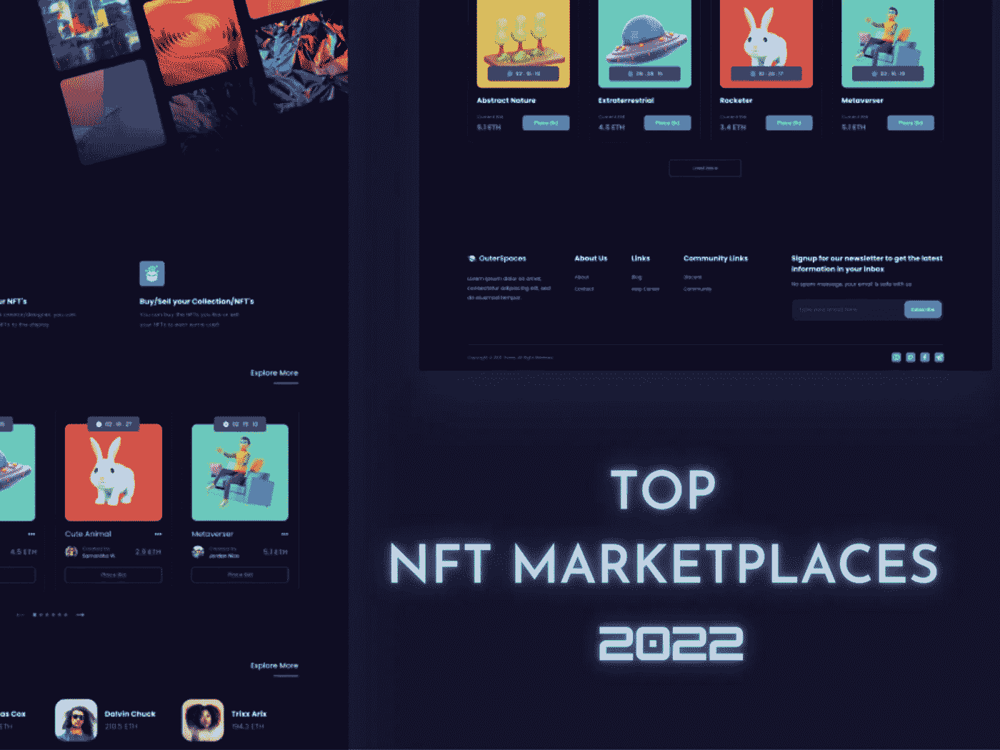

NFT 是近年来获得巨大成功排名的一种资产。根据行业报告，从数字猿到视频剪辑，NFT 的销售额在 2021 年飙升至 249 亿美元，而去年为 9490 万美元。

上述数字清楚地表明， [**NFT 的发展**](https://www.infiniteblocktech.com/nft-development-solutions) 在较短的时间内是巨大的。而且，它已经导致了多个 NFT 市场在加密领域的建立，NFT 的爱好者们最大限度地利用了这些市场。

现在是你在 NFTs 上全力以赴的时候了，因为它正面临高峰期。那么， [**为什么不推出自己的 NFT 市场**？](https://www.infiniteblocktech.com/nft-marketplace-development?utm_source=publication&utm_medium=nerd-for-tech-27-4-22&utm_campaign=kumar)为了帮助你超越极限，这里有一份对 NFT 顶级市场和当前流行的非功能性交易的详细分析。让我们今天就开始吧！

下面的列表包括十大 NFT 市场的汇编和最近占据 NFT 世界主导地位的市场的附加信息。(交易和克隆)继续阅读了解更多！

> “这不是观念的问题。这是关于让想法发生”

## [OpenSea](https://www.infiniteblocktech.com/opensea-clone-script?utm_source=publication&utm_medium=nerd-for-tech-27-4-22&utm_campaign=kumar)

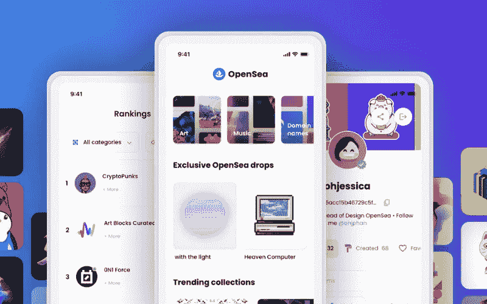

从艺术到音乐、体育和摄影收藏品， [**OpenSea**](https://opensea.io/) 囊括了每一种 NFT。该平台易于使用，支持 150 多种加密货币支付令牌。用户可以免费建立一个账户，并在几分钟内开始浏览、铸造和销售。

## [稀有](https://www.infiniteblocktech.com/rarible-clone-script?utm_source=publication&utm_medium=nerd-for-tech-27-4-22&utm_campaign=kumar)

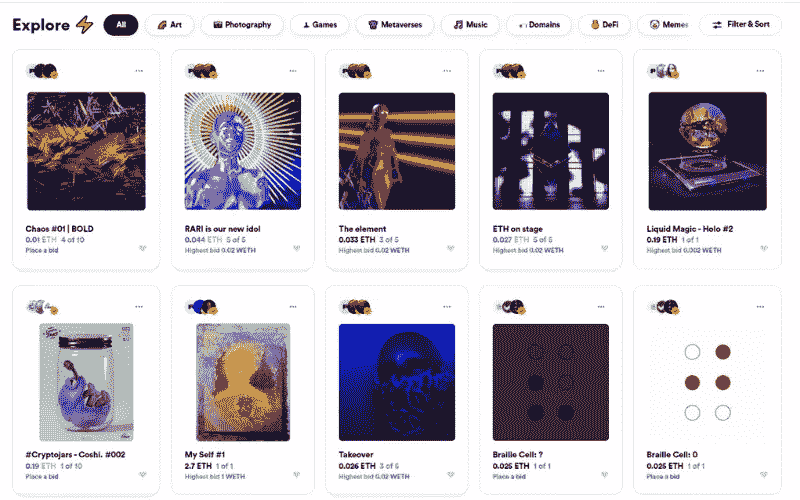

它旨在销售单件艺术作品和吸引游戏、体育、媒体品牌和艺术家发布作品集合的集合。Rarible 提倡去中心化，并使用自己的标志，RARI。 [**Rarible**](https://rarible.com/) 通过与一些大品牌合作，包括 Adobe，获得了艺术家的作品并创造了独特的 NFT。

## 漂亮的网关

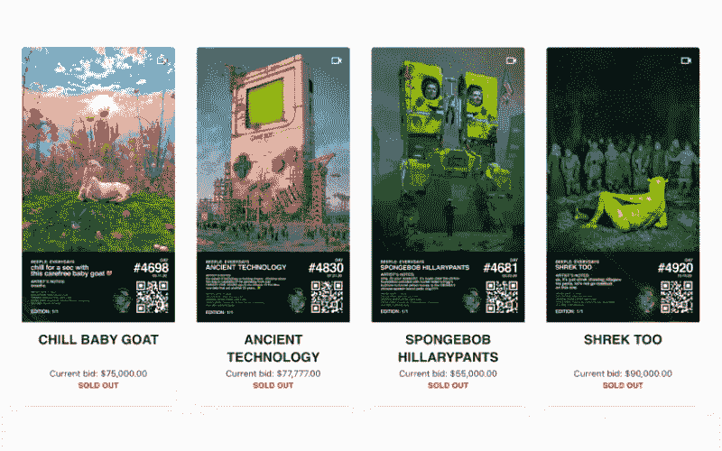

[**Nifty Gateway**](https://niftygateway.com/) 是 NFT 的一个市场，在这里出售两种最昂贵的 NFT，如 Beeple 's CROSSROAD 和 Pak's The Merge。

该平台吸引了名人 NFT，并在 Twitter 上获得了很多喜爱。用户可以在有限的时间内使用无限数量的版本，其中 NFT 以基本价格出售。超时后，将不再发布 NFT。它造成了稀缺和二次销售的强劲市场。此外，Nifty 使收藏者能够使用法定货币购买 NFT，使其对新买家更加友好。

## [阿协商场](https://www.infiniteblocktech.com/axie-infinity-clone-script?utm_source=publication&utm_medium=nerd-for-tech-27-4-22&utm_campaign=kumar)

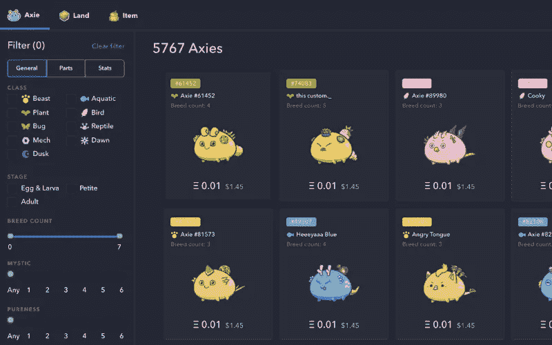

它是为电子游戏 [**Axie Infinity**](https://marketplace.axieinfinity.com/) 而建在以太坊区块链上的网店。斧头是神话中的生物，可以被购买和训练来对抗其他玩家的斧头以获得奖励。玩家可以在 Axie Marketplace 上购买新的 Axie、整个土地和其他物品作为 NFT，以便在游戏中使用。

## 幼虫实验室

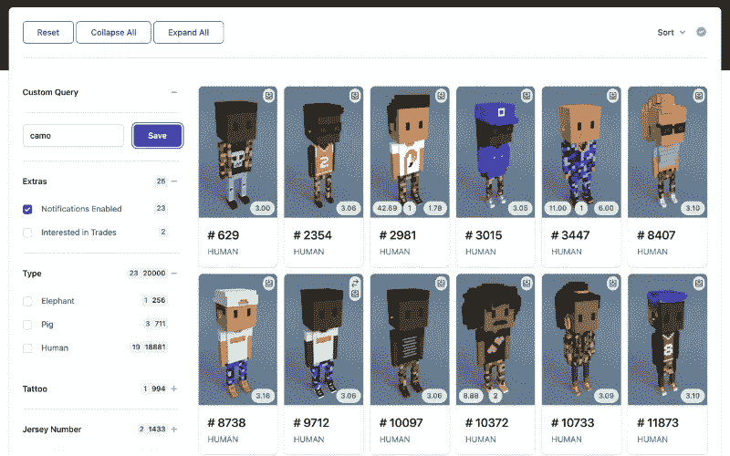

[**幼虫实验室**](https://www.larvalabs.com/) 以病毒性的 NFT 项目 CryptoPunks 而闻名，它有数字艺术项目，如 Autoglyphs 和其他基于以太坊区块链的应用程序开发项目。虽然 CryptoPunks NFTs 已经售罄，但也可以从各种第三方市场购买和竞标。

 [## 如何建立一个像 CryptoPunks 一样的 NFT？

### 目前，密码朋克的迅速崛起创新的朋克生成方式是主要的…

www.infiniteblocktech.com](https://www.infiniteblocktech.com/cryptopunk-clone?utm_source=publication&utm_medium=nerd-for-tech-27-4-22&utm_campaign=kumar) 

## [NBA 顶级投篮](https://www.infiniteblocktech.com/nba-top-shot?utm_source=publication&utm_medium=nerd-for-tech-27-4-22&utm_campaign=kumar)

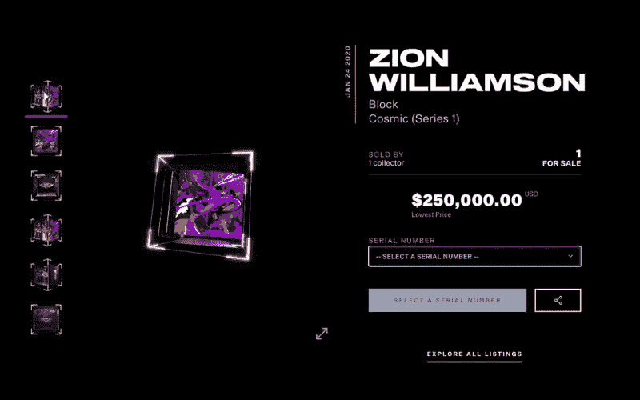

国家篮球协会&女子国家篮球协会在 NFT 世界的冒险是 [**NBA 顶级投篮**](https://nbatopshot.com/) 。可以从世界顶级篮球联盟购买视频剪辑、比赛集锦和艺术等可收藏的瞬间。这是一个封闭的市场，在这里你只能使用 Dapper Labs 建立的 Flow 区块链在 NBA Top Shot 上进行买卖。

## 超级罕见

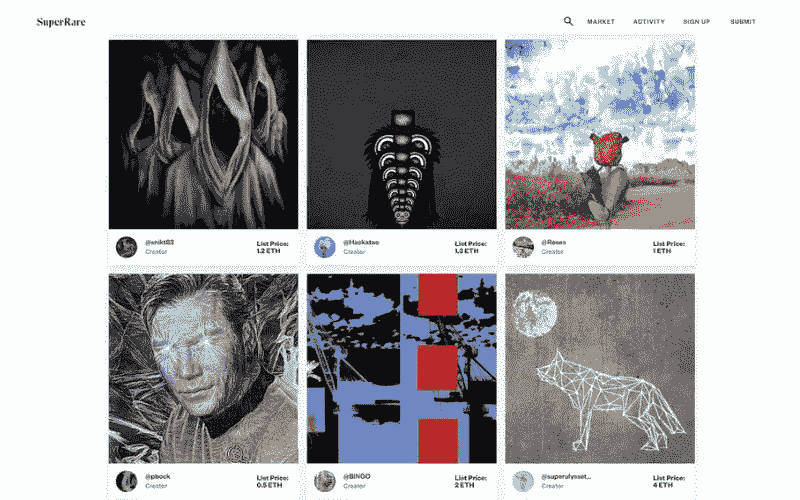

与 Rarible 类似，该网站包括艺术、3D 图像和视频，但收藏家只能使用以太坊购买艺术品。 [**SuperRare**](https://superrare.com/) 近日公布了自己的令牌，在区块链以太坊上开发。为了发现和鼓励市场上的新人才，将使用代币，代币也可以在 OpenSea 上买卖。

## 基金会. app

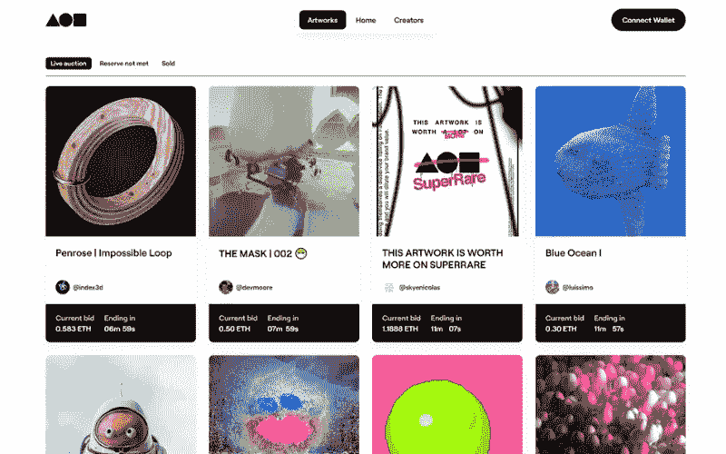

设计了一种简单直接的方式来竞标数字艺术。因为销售是通过以太坊完成的。自推出以来，它已售出超过 1 亿美元的非功能性食物。拥有由以太坊资助的加密钱包的买家可以进行购买。艺术家由 [**基金会社区**](https://foundation.app/) 邀请上台。

## 可铸造的

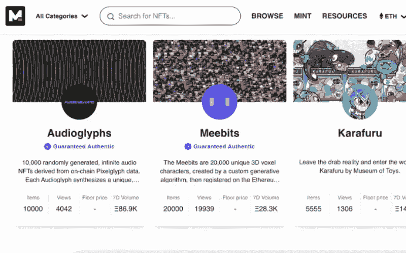

旨在类似于 OpenSea，你需要以太坊在 [**Mintable**](https://mintable.app/) 上买卖 NFT。从摄影师到音乐人，该平台支持为那些希望将其作品作为数字资产出售的创作者制作 NFT。为了便于在市场上购买和出价，一个有抱负的 NFT 收藏家或创造者需要从一个加密交易所购买以太坊，然后连接到可铸造的钱包。

## 希腊字母的第八字

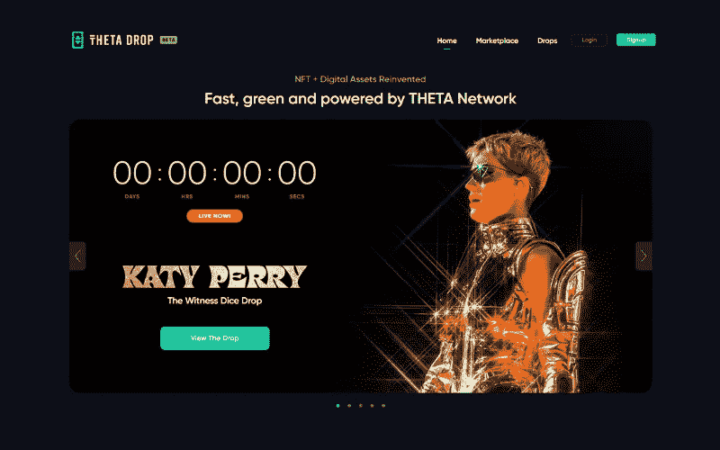

一个区块链平台，用于在互联网上分散分发电视和视频。Theta Drop 于 2021 年首次亮相世界扑克巡回赛的数字收藏品。世界扑克巡回赛使用该平台来传输内容。Theta 使用自己的区块链技术，要加入 Theta Drop NFT 市场，你需要购买 Theta，由币安这样的密码交易所支持。

## 很少有其他 NFT 市场在最近变得受欢迎

## [币安](https://www.infiniteblocktech.com/binance-nft-marketplace?utm_source=publication&utm_medium=nerd-for-tech-27-4-22&utm_campaign=kumar)

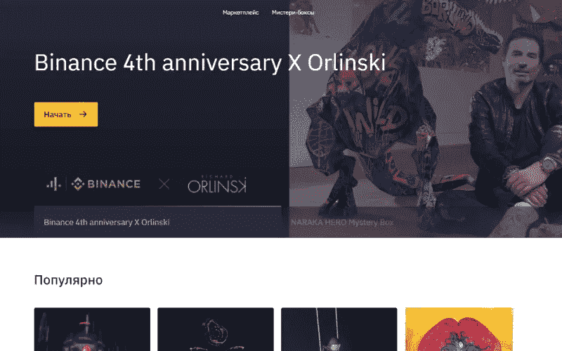

[**币安**](https://www.binance.com/en/nft/marketplace) NFT，在其区块链的支持下，是 NFT 最大的市场之一，因为它拥有最多的加密交易所。币安 NFT 被认为是最经得起未来考验的 NFT 市场之一，因为它的规模和范围可以提供其他人可能羡慕的独家合作伙伴关系和活动。如果你有币安代币，进入市场就更容易了。如果你想卖，你也可以存 ETH 或 BSC NFTs。

## [超越生命](https://www.beyondlife.club/)

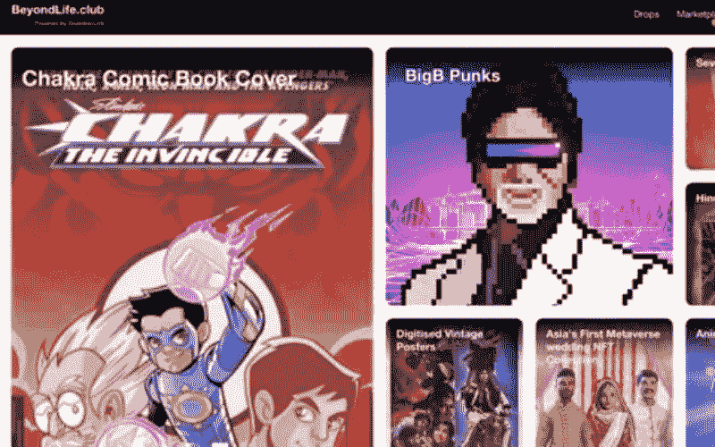

正是这样一个平台引入了二级市场，用于重新利用和转售在其主要网站上推出和销售的非功能性产品。因此，它为 NFT 爱好者提供了一个黄金机会，投资者和收藏家可以得到 BigB NFTs 和 Chakraverse NFTs。

## [异步艺术](https://async.art/)

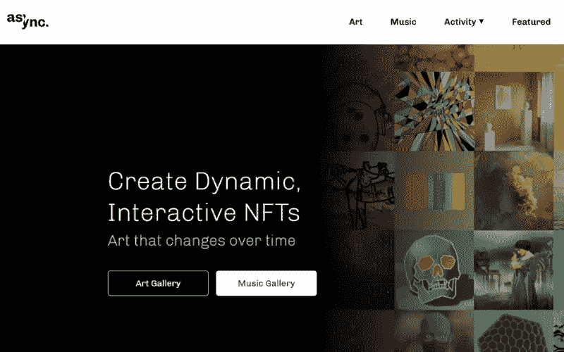

一个 NFT 市场，以可编程艺术而闻名。每样东西都被标记化，因为不同的艺术家可以拥有不同的层，并有助于改变艺术品。可编程艺术是数字艺术的一种创新方式。它使多个创作者能够随着时间的推移改变一件艺术品。

## [KnownOrigin](https://knownorigin.io/)

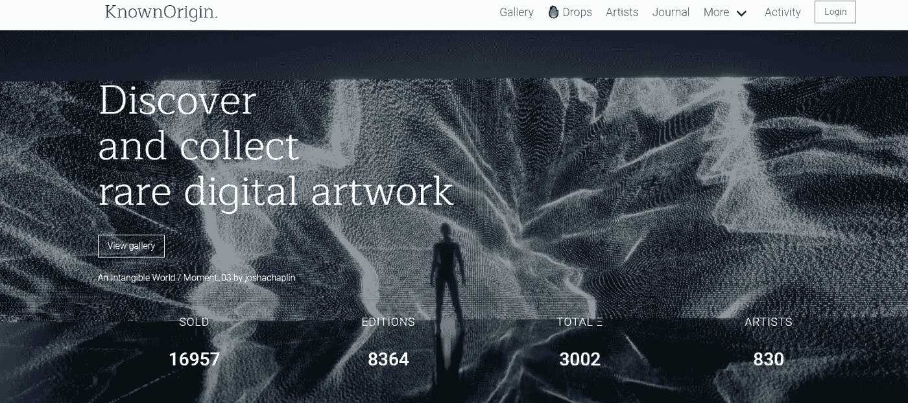

作为最古老的 NFT 市场之一，该平台专注于在定时发布的活动中提供稀有和具有收藏价值的艺术品，称为 drops。该平台使艺术家能够控制发行的拷贝数量，因为它可以创造稀缺和提高价格。