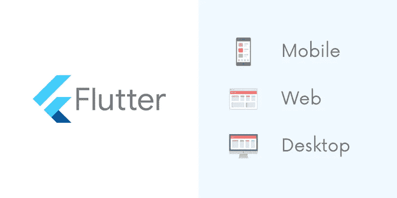
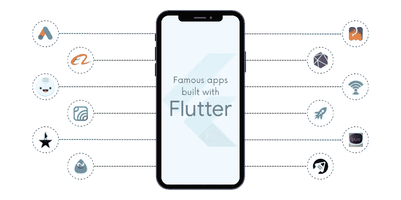

# 为什么 Flutter 是构建完美应用的理想框架的主要原因

> 原文：<https://medium.com/nerd-for-tech/top-reasons-why-flutter-is-ideal-to-build-app-e648b5f97881?source=collection_archive---------2----------------------->

技术的快速发展，除此之外，疫情时期导致了许多实体企业向数字企业的转变。当然，如果没有移动应用，所有渠道的数字存在都是不可能的。这最终导致了移动 app 开发服务的高需求。

移动应用是一种经济工具，为用户和所有者提供了大量的功能和用途。利用应用程序的优势，许多企业家在数字平台上做得很好。那么，你一定也在考虑通过一个多产的移动应用程序来标记你在数字市场上的存在。请注意，有许多初创公司为他们的移动应用程序选择了错误的平台，并面临着巨大的失败。如果你不想经历任何失败，那么你应该雇佣一个 Flutter 应用程序开发人员来创建一个优秀的赚钱的应用程序。

现在，作为移动应用的新手，你需要思考以下两个问题:

1.  如何用低预算构建 Android 和 iOS 移动应用程序？
2.  你怎样才能接触到更广泛的客户群并击败竞争对手？

> 这两个问题的简单答案是颤振！扑！&只扑！

毫无疑问，使用谷歌的 Flutter 开发的移动应用前景广阔。Flutter SDK 是谷歌推出的开源 UI 工具包，它使用单一代码库来开发可以在任何平台上完美运行的高性能应用程序。

在接触一家名为 [**的 Flutter 应用开发公司**](https://www.xongolab.com/flutter-app-development/) 之前，你必须先了解 Flutter，一些关于它的有趣事实以及它提供的好处。

> ***什么是旋舞？***

谷歌在 5 月 17 日推出了一个名为 Flutter 的免费开源 UI SDK。使用 Flutter，可以使用单一代码库创建原生移动应用程序，这意味着完全消除了为不同平台的应用程序创建不同代码库的需要。因此，正因为如此，当一个应用程序必须以低预算快速地为多平台开发时，Google Flutter 是开发人员最喜欢的 SDK。

将 Flutter 称为框架是错误的，而 SDK 是正确的说法，因为它附带了许多构建跨平台应用程序所需的额外功能，如渲染引擎、方便的小部件、简单的测试和 API 的集成。

**现在让我们来看看一些关于移动应用开发中的 Flutter 的有趣事实。**

*   与其他框架和语言相比，Flutter 是最强大的。一个 Flutter 开发人员发现这个框架非常有趣、富有成效而且简单。
*   Flutter 于 5 月 17 日发布，但在 12 月 18 日上线，到 4 月 20 日，用户数量已超过 200 万。
*   *自 4 月 20 日以来，使用 Flutter 构建的 Play store 应用数量显著增加了 40，000 个，即从 50，000 个增加到 90，000 个。几乎可以看到 80%尖峰。*
*   *Flutter 的测试版于 2018 年 3 月 13 日发布，2018 年 12 月 14 日上线。在很短的时间内，Flutter 在移动应用程序开发服务提供商中占据了突出的位置。*
*   *上*[***GitHub***](https://github.com/flutter/flutter)*，旋舞成功获取 137k 星，21k 叉。*
*   *2019-2020 年，39%的应用开发者选择 Google Flutter 作为开发移动应用的框架。*
*   *继 React Native 之后，Flutter 是开发可定制跨平台应用最流行的编程语言。*

***根据最近的研究，谷歌瓜分了 Flutter 开发者的份额:***

*   对于创业公司来说——35%
*   对于企业开发人员— 26%
*   个体经营者——19%
*   作为设计代理的公司——7%

> ***选择 Flutter 增强手机 App 开发的理由***

当然，Flutter 已经获得了关注，并且比 Angular JS、Xamarin、React Native 等其他主要的跨平台框架更受欢迎。这个陈述不足以说服你选择 Flutter。因此，这里有一些选择 Flutter SDK 开发移动应用程序的好理由。

## 颤振编程语言

Flutter 的基础是 Dart SDK，它有助于创建强大的设计和架构。除此之外，Dart 促进了标准化、一致性、集成和简单管理，因此它比其他跨平台语言和框架优越得多。

在投资任何应用程序开发框架之前，企业通常会寻找该框架的潜力和未来。鉴于 Flutter 已经由谷歌推出，它有一个充满希望的未来。考虑到基础知识，Dart SDK 的设计使其成为移动应用程序开发服务提供商的最佳选择。

## 成本效益

关于 Flutter 最有趣的事实是，通过一个单一的代码库，Flutter 应用程序开发人员可以构建可以在嵌入式设备、手机、桌面和网络上运行的应用程序。只需对本机代码库进行最少的更改，开发人员就可以在各种平台上使用它。这最终减少了为多个平台构建移动应用的周转时间，并大幅削减了开发、测试、QA 和维护的成本。

## 用户友好界面

使用 Flutter 时，定制所有可见对象(如阴影、形状和颜色)以及应用程序图标和图像的剪切或转换非常容易。在没有任何额外工作负载的情况下，使用 Flutter 可以简化整个应用程序开发过程。

## 每个平台都有不同的主题

尽管有相同的代码库，一个应用程序可以有不同的主题，这只有在使用 Flutter 时才有可能。Flutter 附带了一系列移动应用主题，用于为各种平台创建不同外观的应用。

## 缩短应用程序开发时间

Flutter 的设计方式提供了大量易于访问和随时可用的应用程序小部件，因此可以快速定制应用程序。此外，开发人员不必从头开始为每个小部件编写代码，这有助于节省时间。

## 简易语言

Google Flutter 使用的语言是 Dart，它源自 Google 的内部语言。Dart SDK 是一种通用的单源语言；因此，与其他语言相比，每个开发人员都会发现这种语言非常简单，也很容易使用。除了开发移动应用程序，Dart 还可以用于开发桌面、web 和移动应用程序。

## 单一代码库

Flutter 的“编写一次代码”的特性使它有别于其他框架。Flutter 改变了传统的编写代码的方法。现在，开发人员不必为每个平台编写不同的代码。

对于 iOS 和 Android 应用程序开发，可以使用单个代码，这使得开发过程对开发人员来说简单而快速。这也使得开发者能够快速提高速度、应用质量和设计。

## 简单的应用测试和维护

由于单个代码库可以用于为多个平台开发应用程序，开发人员不必为每个平台测试应用程序。此外，只需测试一个代码，这节省了大量时间。通过简单的测试，开发人员可以深入检查移动应用，并加快应用部署时间。

当我们谈论维护时，同样的事情也适用。在使用不同的代码库为多个平台开发应用程序的情况下，开发人员必须仔细检查每个代码，这非常耗时。但是，在 Flutter 支持的应用程序中，单一代码库需要维护。一旦发现任何问题或错误，开发人员可以快速纠正它们，所有平台的问题都会得到解决。

## 热重装

Flutter 在 [**Flutter 应用开发者**](https://www.xongolab.com/hire-flutter-developers/) 中引起了轰动，这仅仅是因为它的“热重装”功能，或者你也可以说是“热重启”功能。几秒钟之内，开发人员就可以查看代码中的修改，同时看到应用程序的开发进度。此外，他们可以更快地修复错误。修改和修复完成得如此之快，以至于缩短了仿真器、模拟器以及 Android 和 iOS 平台硬件的重新加载时间。

简而言之，Flutter 的上述功能和特性肯定会鼓励您进一步探索，以发现更多关于其核心系统的信息。毫无疑问，结果会给你留下深刻印象，你会选择 Flutter 应用程序。

到目前为止，当你对 Flutter 的优势有了深入的了解后，你现在应该看看那些拥有 Flutter 应用的公司:

*   谷歌广告
*   阿里巴巴
*   反射地
*   胡克
*   汉密尔顿音乐剧
*   嗜水狂
*   产后
*   密码
*   应用树
*   双投资组合
*   SG Bustracker
*   SpaceX Go！

> ***可以使用 Flutter*** 构建的应用

Flutter 最大的优势是不局限于只开发手机 app。在 Flutter 的帮助下，可以轻松、方便、快速地构建各种其他 app。

## 网络应用

“蜂鸟”是由 Flutter 社区发起的一个项目，旨在构建图形丰富且高度互动的网络应用。2018 年 12 月，在推出 Flutter 1.0 时，谷歌 Flutter 团队正式披露了 Flutter 即将到来的目标和计划，包括使用 Flutter 开发 web 应用程序。

## 桌面应用

在利用 Flutter SDK 特性的同时，应用程序开发人员正在构建桌面应用程序。Flutter 的编程目标是使用单一代码库为几乎所有设备(包括 Android、iOS、macOS、Linux 和 Windows)开发应用程序。

## 物联网应用

Flutter SDK 与物联网组件的集成可以轻松实现现代应用的开发。尽管是一个新的框架，但在 Flutter 1.7(2019 年 5 月)推出后，Flutter 获得了巨大的人气。

> ***包装完毕***

将 Flutter 视为应用程序开发领域的游戏规则改变者或极端分子不会错。它为致力于为多个平台开发各种类型应用的 Flutter 应用开发公司提供了广泛的机会。除此之外，它还有助于节省资源、时间和金钱。对于那些预算有限的初创公司和企业家来说，Flutter 就像是一种祝福，因为它将帮助他们在预算内构建一个应用程序，同时满足他们所有的应用程序需求。不要再浪费时间，雇佣最好的 Flutter 应用程序开发服务公司，开始使用 Flutter 驱动的应用程序。

*该帖子最初发表于*[*【xongolab.com】*](https://www.xongolab.com/blog/why-flutter-is-ideal-to-build-app/)