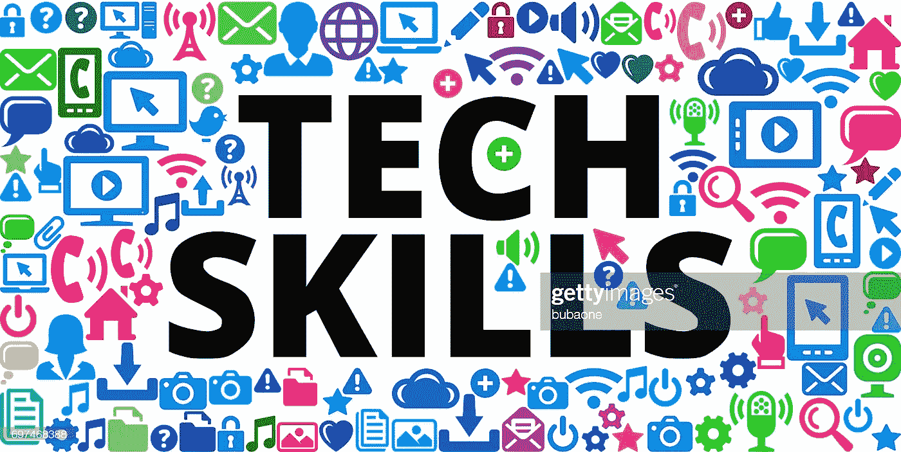
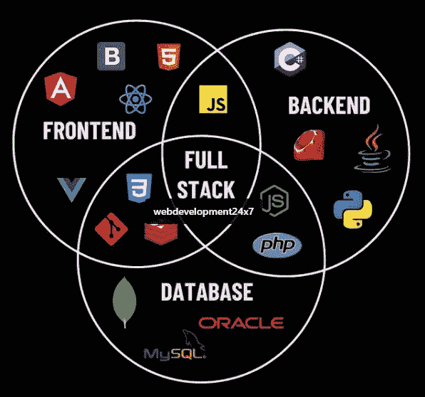

# 未来工作的顶级技术技能

> 原文：<https://medium.com/nerd-for-tech/top-tech-skills-for-the-future-of-work-abcec23a1a3d?source=collection_archive---------7----------------------->

## 未来最需要的技能列表。

技术变革的速度正在加快，许多新技术和技能正在到来。很难预测哪种技能将来会被需要，哪种技能会消失。有些技能现在非常抢手，但这些技能在十年前甚至还不存在。随着人工智能、机器学习的兴起，区块链和机器人技术发生了很大的变化。对于一些新的学习者来说，决定学习哪种技能以及哪种技能有好的未来(至少 5-10 年)是一个问题。我在网上搜索并准备了一篇文章来写未来最受欢迎的技术技能。以下是八项(不限于 8 项)技能，它们现在需求量很大，而且至少在未来 5-10 年内需求量都很大。

> 这篇文章是基于我个人的研究，从我自己的经验和网上可用的数据。这是我对未来最苛刻的技术技能的看法。

## 1.人工智能和机器学习

人工智能和机器学习正在快速发展，并改变了工作的格局。许多公司都在研究人工智能/人工智能，并寻找在人工智能和人工智能方面有专长的高技能软件工程师。人工智能/人工智能从业者的招聘增长在 2020 年和 2021 年有所增加。这是目前最热门的工作之一。机器学习是走向未来的最令人兴奋的领域之一。这是你能学到的最有利可图的技能之一。从 Siri 和 Alexa 到聊天机器人，从预测分析到无人驾驶汽车，这种未来技能有很多用途。机器学习也用于预测患者中的 Covid19 感染。人工智能和 ML 是现在最热门的技能，在不久的将来不会去任何地方。学习 AI 和 ML 的关键技能是 Python、Amazon Web Services (AWS)和 C++。

## 2.数据科学和分析

每天都会产生大量数据，这种海量数据也称为大数据。每天都有数百万兆字节的数据从社交网络和其他网站产生。处理这些大数据并从这些海量数据中获取有用的信息对组织来说是非常有益的。从数据中获得有用见解的科学被称为数据科学。许多行业都在大数据上投入了大量预算，以从数据中获得有用的见解。贡献巨大的一些行业包括银行、制造业、专业服务、联邦政府和医疗保健。LinkedIn 和其他工作门户网站显示，这是最需要的技能之一，而且它的增长也在增加。掌握数据科学和分析的关键技能是 Python、R、数据可视化工具、SQL 和 AWS。

## 3.区块链

随着比特币的兴起，很多人都听说过区块链技术，在比特币和加密货币炒作之后，区块链技术正在不断发展。有一些平台正在处理区块链服务，以太坊在这些平台中处于领先地位。越来越多的公司正在寻找理解区块链、智能合约并能够构建分散式应用程序的开发人员。区块链开发中的一些关键技能是加密计算、数据库设计、编程语言，如 Java、Python、Javascript、Go 和 C++。

## 4.云计算/开发运维

云计算正在兴起，因为许多公司正在从传统服务器转向云解决方案。根据 Forrester Research 报告，到 2021 年，全球云解决方案市场将增长 35%，达到 1200 亿美元。许多公司也在构建他们的解决方案和应用程序来直接云化，而不是以后再切换。这向我们表明，从 2021 年起，云计算和 DevOps 技能将会大受欢迎。Amazon Web Services 是这些云解决方案中的一个，具有内容交付、数据库存储、网络等功能。AWS 由亚马逊公司支持，是最大的云服务平台。其他主要平台是微软的 Azure 和谷歌的 GCP。

## 5.数字营销

在这个互联网和社交媒体的时代，任何企业的在线存在都变得越来越重要。传统的方法越来越陈旧，不够有效。在过去的两年中，许多企业都在网上提供服务。企业总是在寻找数字营销专业人士上网，使他们的网上存在。如今，数字营销比广告牌广告更重要，因为脸书和谷歌控制了更多的眼球，这些公司比任何其他媒体公司产生更多的收入。数字营销技巧包括社交媒体营销、谷歌广告、脸书和 Instagram 广告、联盟营销等等。

## 6.全栈开发

一个网站是前端和后端开发的结合。前端是用户界面或网站的一部分，是网站访问者可见的。对于 web UI 和 Java，使用 HTML/CSS 和 Javascript 设计开发前端，对于移动 UI，使用 React Native 和 Nativescript。构建前端应用程序有不同的框架，一些最流行的框架是 Angular、React 和 VueJS。后端是网站的一部分，对访问者不可见，负责处理逻辑和与数据库的交互。不同的编程语言和数据库用于后端 API 的开发。其中有 Python，C#，NodeJS，PHP，C++，Java，Ruby on Rails。

全栈开发人员既可以在前端工作，也可以在后端工作。从最近的趋势和 2019 年 stackoverflow 开发者调查来看，对全栈开发者存在需求，未来对能够开发全栈应用的开发者的需求将非常高。

## 7.网络安全:

网络安全是一套技术、流程和实践，旨在保护网络、设备、程序和数据免受恶意攻击、破坏或未经授权的访问。它也被称为信息技术安全。网络安全术语在从商业到移动计算的各种环境中使用，它可以分为几个常见类别，如网络安全、应用安全、信息安全、运营安全、灾难恢复和业务连续性、最终用户教育。随着电子设备、网站和数据数量的增加，将会出现对能够保护数据和信息免受不同攻击的网络安全专家的巨大需求。