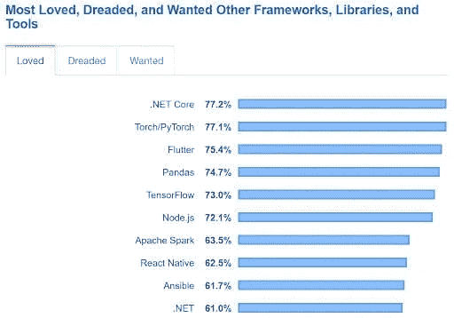
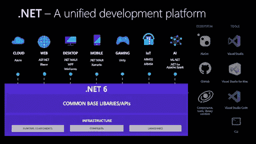

# 最需要知道的事情。网络 6

> 原文：<https://medium.com/nerd-for-tech/top-things-to-know-about-net-6-82b54df12bd?source=collection_archive---------1----------------------->

。NET 是微软创建的一个流行的 web 开发框架。它拥有丰富的特性、库和工具生态系统，使开发人员能够构建高质量的解决方案。ASP.NET 框架的继承者 ASP.NET 核心是 2021 年开发者使用最多的 web 框架的[第六名，市场份额为 18.1%。因此，ASP.NET 开发服务公司是需要网络应用的公司的首选之一。](https://www.statista.com/statistics/1124699/worldwide-developer-survey-most-used-frameworks-web/)

作为一个企业级框架。NET framework 应用程序开发简化了开发人员的开发过程。它提供了一个具有跨平台兼容性的独特生态系统，使跨不同系统构建企业应用和解决方案变得更加容易。。根据 Stack Overflow 的一项调查显示，NET Core 也是最受欢迎的 T4 框架。该框架一直是开发应用程序的最佳框架之一，统计数据不断证明了它的价值。

。NET 开发人员构建多样化的应用程序和解决方案——从物流管理系统到金融科技应用。这些功能可以为应用程序添加电子商务功能，集成交易支付网关，在智能手机上发送推送通知，更好地管理生产计划和库存，等等。今天，公司[雇佣点网络开发者](https://www.botreetechnologies.com/dot-net-development-company)将他们的整个运作整合到一个集中的系统中。

> ***阅读更多:*** [***的利弊。NET 应用开发***](https://www.botreetechnologies.com/blog/pros-and-cons-of-net-application-development/)

# 。2021 年应用程序开发的. NET 框架

。NET 会不断地进行更新和更改，以保持。NET 开发人员的技能得到了完善，并符合最新的趋势。该框架的最新版本。NET 6.0，最近 2021 年 11 月出来的。有了它，就有了大量可以简化应用程序开发过程的东西。

在了解新的变化之前，我们先来看看企业为什么还要考虑。NET 成为他们信任的软件解决方案框架。

*   **飞速发展** [。NET 对于企业应用开发](https://www.botreetechnologies.com/blog/why-companies-use-net-for-enterprise-development/)来说是完美的，因为开发者可以在应用中重用组件。在功能和性能应该相同的情况下，从头开始编写代码可以节省大量时间。
*   **跨平台** 同时。NET 应用程序开发服务在 Windows 生态系统中盛行，开发人员可以构建跨 Linux、macOS 和 Unix 的应用程序。它还简化了在不同系统上测试应用程序的过程，从而减少了问题。
*   **高性能** 。NET 需要较少的计算能力，并使用少量的内存来执行常规操作。JSON 序列化、数据库访问和服务器端模板呈现— [dotnet 开发服务](https://www.botreetechnologies.com/dot-net-development-company)比其他几个框架更快地帮助完成这些任务。

除此之外，来自社区的持续更新和来自微软的支持也建立了信任。NET 开发人员和企业。这给我们带来了这个框架的最新成员--。NET 6.0。

> ***结账*** [***使用微软的 7 大理由。NET 框架进行 App 开发***](https://www.botreetechnologies.com/blog/7-reasons-to-use-microsoft-net-framework-for-app-development/)

# 了解什么。NET 6.0 版本

微软在叫[。NET 6 最快。网尚未](https://devblogs.microsoft.com/dotnet/announcing-net-6/)。自从该框架发布以来，开发人员一直在对其进行测试，结果令人鼓舞。许多专家倾向于这样的理解。NET 6 实际上可能会缩小不同。NET 框架。

让我们看看是什么制造的。NET 6 下一个最好的补充。2021 年网族。

# 1)统一平台

使用的最大好处。NET 6 的优势在于，现在有了一个跨所有设备的统一开发平台。浏览器、云、桌面、物联网和移动应用的集成简化了开发流程。Dotnet 开发人员可以轻松地重用组件，并集成到所有设备中，以便在所有方面(无论是 web 还是云)获得相似的性能和行为。

# 2)新项目模板

附带了更简单、更整洁的项目模板。NET 6。这些模板向用户建议新的特性，但并不强迫他们。开发人员可以轻松地使用模板和建议来创建简洁的文件，而无需添加更多的代码行。

# 3) C# 10 和 F# 6

两个流行的编程语言版本 C# 10 和 F# 6 支持。NET 6 框架。C# 10 有助于使代码更加精确，并导致快速的应用程序开发。F# 6 提高了应用程序的性能，简化了开发过程。它还提供了一个动态的、配置文件导向的优化系统，可以提供快速的代码优化。

# 4)简化开发

新的 C# 10 特性，如全局和隐式 usings、新的命名空间语法、lambda 表达式的自然类型，以及热重载和最小 Web APIs，是最重要的方面之一。NET 6 性能。它简化了开发过程，因为[开发人员](https://www.botreetechnologies.com/blog/how-to-hire-fintech-developers/)不需要在一连串的编码中感到困惑。

# 5)更好的性能

中有一些重大的性能改进。NET 6。从文件 I/O、接口转换到 JSON 序列化，一切都提供了最好的。NET 开发人员。该框架消耗更少的计算能力和内存，使企业能够扩展其应用程序，而不会出现任何性能问题或现有解决方案的滞后。

# 6) SDK 工作负载

附带的另一个功能。NET 6 称为 SDK 工作负载。Dotnet 开发者可以只安装必要的 SDK 进行操作，而将其余的放在一边。因此，如果需要 Xamarin，只需安装 SDK，这使得开发更容易。小而集中的 SDK 使开发人员能够创建应用程序，而不会与其他方面有任何纠缠。

# 7)与 F#的互操作性

F# 6 现在使得框架与 C#和其他语言的互操作性更强。网络语言。它简化了异步任务，并使[开发](https://www.botreetechnologies.com/blog/top-software-development-tools/)更加高效。F#活动模式有未装箱的表示。除此之外，它还提供了更简单的调试，并将列表和数组表达式的编译速度提高了 4 倍，从而带来了比以前版本的. NET 更大的性能提升。

## 包扎

的。NET 生态系统是一个大型的框架汇编。有。网，。网络核心、ASP.NET 和 ASP.NET 核心。最新加入的。NET 6 带来了强大的性能，这是对所有框架的补充。该框架提供了令人惊叹的功能，这使得它成为所有开发形式的首选——无论是机器学习解决方案还是 web 应用程序。

雇佣[最好的定制软件开发公司](https://www.botreetechnologies.com/software-development-company)，比如[的 BoTree Technologies](https://www.botreetechnologies.com/) ，对于公司来说是恢复数字需求和获得高质量产品的好方法。

[今天就联系我们的专家](https://www.botreetechnologies.com/contact)。NET 开发服务。

*最初发表于 2021 年 12 月 21 日 https://www.botreetechnologies.com**的* [*。*](https://www.botreetechnologies.com/blog/top-things-know-about-net-6/)